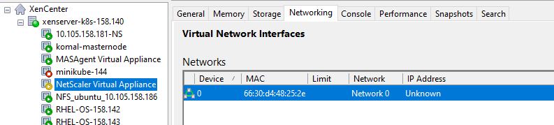

# Install Citrix ADC VPX instances on XenServer by using XenCenter
After you have installed and configured XenServer and XenCenter, you can use XenCenter to install virtual appliances on XenServer.
You can follow below guide for installing Citrix ADC VPX in your XenCenter.

1. Download Citrix ADC VPX image for XenServer

Goto "https://www.citrix.com/en-in/downloads/citrix-adc/virtual-appliances/vpx-release-130.html" and click on Download File button under Citrix ADC VPX for XenServer 13.0 Build 47.24 


2. Import Citrix ADC VPX image on XenServer
a. Select your XenServer from XenCenter
b. Click on Import option from selected XenServer
c. Browse the Citrix ADC VPX downloaded image from local machine and click on Next


3. Follow the steps and add Home Server, Storage, Networking details and click on Finish
You will see that Citrix ADC VPX is now installing. (It might take 2-5 minutes based on your network speed.)



4. Goto newly created NetScaler Virtual Appliance console
Follow the instructions on the screen and provide below details
a. Citrix ADC IPv4 address
b. Netmask
c. Gateway IPv4 address
d. save and quit


(It will take 2-4 mins for Citrix ADC VPX to boot up.)

5. Enter the Citrix ADC login credentials and login to appliance


6. Yeah!!! Your Citrix ADC VPX is ready for deployment

7. Lets add [SNIP](https://docs.citrix.com/en-us/citrix-adc/13/networking/ip-addressing/configuring-citrix-adc-owned-ip-addresses/configuring-subnet-ip-addresses-snips.html) details to enable Citrix ADC VPX and back-end server communication 
```
add ns ip <IPAddress> <netmask> -type SNIP
show ip
```


Now take this VPX and use it as Tier 1 ADC for your [Citrix Cloud Native Networking deployments](https://github.com/citrix/cloud-native-getting-started).