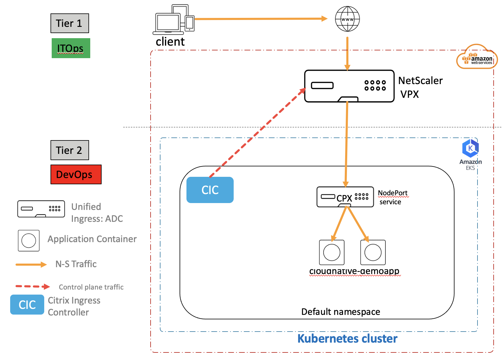
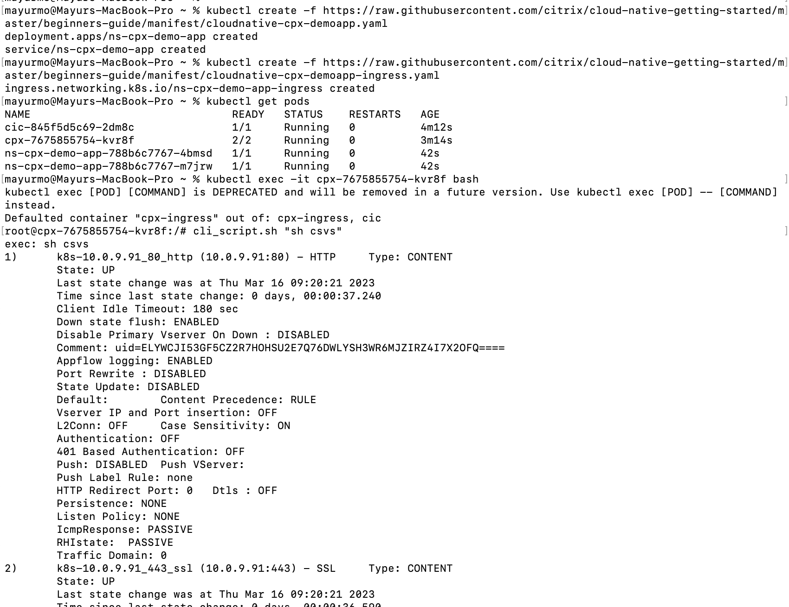
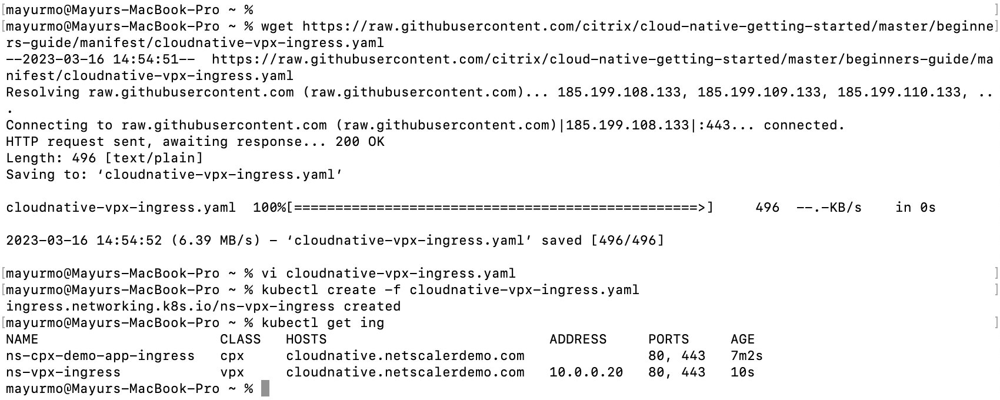

# Load balance microserviced based applications using NetScaler (Tier 1 ADC as NetScaler VPX, Tier 2 ADC as NetScaler CPX inside EKS)

In this guide you will learn:

* How to deploy a microservice application exposed as Ingress type service.
* How to deploy a microservice based proxy - NetScaler CPX 
* How to configure NetScaler VPX (Tier 1 ADC) using Citrix Ingress Controller to frontend CPX.

NetScaler supports Dual tier architecture to load balance an enterprise grade applications deployed as microservices in AWS kubernetes service - EKS. NetScaler VPX acts as high scale, secure North-South proxy infront of EKS cluster and NetScaler CPX acts as layer 2 proxy inside EKS. Lets understand the Dual tier topology using below diagram.




##### Deployment steps:

1. Pre-requisite

	* Ensure that you have VPX and EKS running on AWS.
	* To bring EKS follow [EKS guide](https://github.com/citrix/cloud-native-getting-started/blob/master/aws/eks/README.md)
	* To bring VPX follow [VPX guide](https://github.com/citrix/cloud-native-getting-started/blob/master/aws/aws-vpx/README.md)
	* Install [kubectl](https://kubernetes.io/docs/tasks/tools/#kubectl) and [AWS CLI](https://docs.aws.amazon.com/cli/latest/userguide/getting-started-install.html) on your machine to access EKS locally.
	* Create Security policies (inbound rules) for VPX and EKS to enable the traffic flow (Add EKS security group details in VPX inbound security rules and vice versa)

	Access EKS cluster from AWS CLI
	```
	aws eks --region ap-south-1 update-kubeconfig --name cloud-native-eks
	```
	


2. Deploy Citrix Ingress controller using HELM

	* Lets add the citrix helm repo
	```
	helm repo add citrix https://citrix.github.io/citrix-helm-charts/
	```
	*Note:* In case you do not have HELM installed on your machine, please install HELM from https://helm.sh/docs/intro/install/ 

	
	* Create VPX login secret
	```
	kubectl create secret generic nsvpxlogin --from-literal=username='nsroot' --from-literal=password='mypassword'
	```
	*Note:* Update username and password which is used while instantiating the VPX.

	* Install CIC

	Copy below snipped into values.yaml file
	```
	cic:
     enabled: True
     nsIP: x.x.x.x
     adcCredentialSecret: nsvpxlogin
     license:
       accept: yes
     ingressClass: ["vpx"]
     ignoreNodeExternalIP: True
	```
	nsIP = Use primary private IP associated to VPX NIC (Goto to EC2 -> Instances -> Cloud-Native-vpx instance ID -> Check for Private IPv4 addresses in instance summary)

	```
	helm install cic citrix/citrix-cloud-native -f values.yaml
	```

	* Install SSL certificates on VPX using K8s secret.
	```
	kubectl create -f cloudnative-secret.yaml
	```
	*Note:* Due to security reasons secret file is not present on GitHub repo, you can create your own secret or contact NetScaler cloud native team for dummy secret file.

	

3. Deploy NetScaler CPX exposed as NodePort service to VPX

	Copy below snipped and create cpx-values.yaml file on your machine	
	```
	cpx:
      enabled: True
      serviceType:
        nodePort:
          enabled: True
    cic:
      license:
        accept: Yes
      ingressClass: ["cpx"]
    ```

    Deploy CPX using HELM chart
    
    ```
    helm install cpx citrix/citrix-cloud-native -f cpx-values.yaml
    ```
	

4. Deploy sample application exposed as Ingress type service

	```
	kubectl create -f https://raw.githubusercontent.com/citrix/cloud-native-getting-started/master/beginners-guide/manifest/cloudnative-cpx-demoapp.yaml
	```
	
	Expose sample application to CPX using Ingress kind

	```
	kubectl create -f https://raw.githubusercontent.com/citrix/cloud-native-getting-started/master/beginners-guide/manifest/cloudnative-cpx-demoapp-ingress.yaml
	```

	Verify the CPX configuration:
	```
	kubectl exec -it <cpx pod name> bash
	cli_script.sh "sh csvs"
	cli_script.sh "sh lbvs"
	```

	

5. Expose CPX services to VPX as backend application

	Download Ingress manifest file
	```
	wget https://raw.githubusercontent.com/citrix/cloud-native-getting-started/master/beginners-guide/manifest/cloudnative-vpx-ingress.yaml
	```

	* Update ingress.citrix.com/frontend-ip: "x.x.x.x" with private IP associated with VIP EIP.

	```
	kubectl create -f cloudnative-vpx-ingress.yaml
	kubectl get ing
	```

	

6. Verify the VPX configuration

	Citrix Ingress controller would have configured your VPX for cloudnative apps. You can verify the VPX configuration. Login to VPX and check the status
	```
	sh csvs <k8s-...>
	sh lbvs <k8s...>
	sh servicegroup <k8s...>
	```

	You should see the service memeber status UP. In case you find servicegroup member status DOWN or not able to find config on VPX, check for CIC logs.

7. Access your application

	Note the VIP Elastic IP named as `cloud-native-vip` and try accessing the app

	```
	curl -H"Host:cloudnative.netscalerdemo.com" https://<vip-eip> -kv
	```