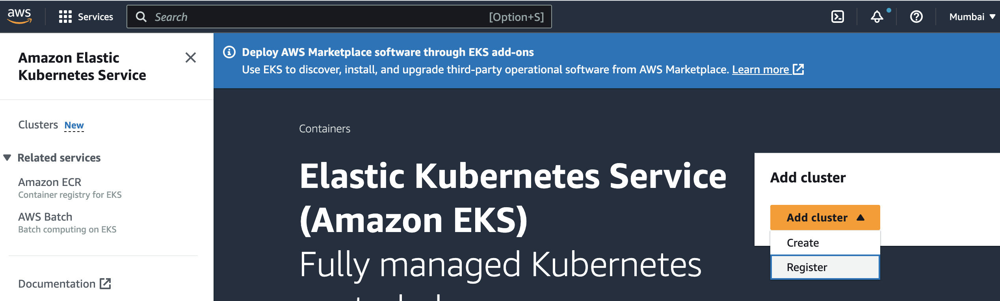
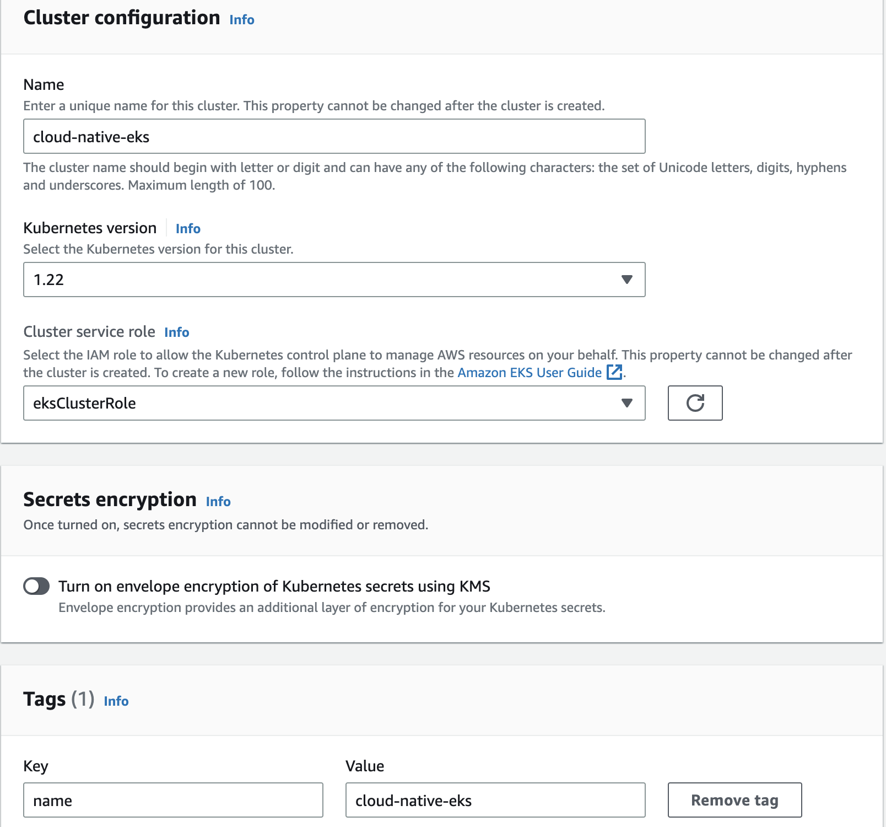
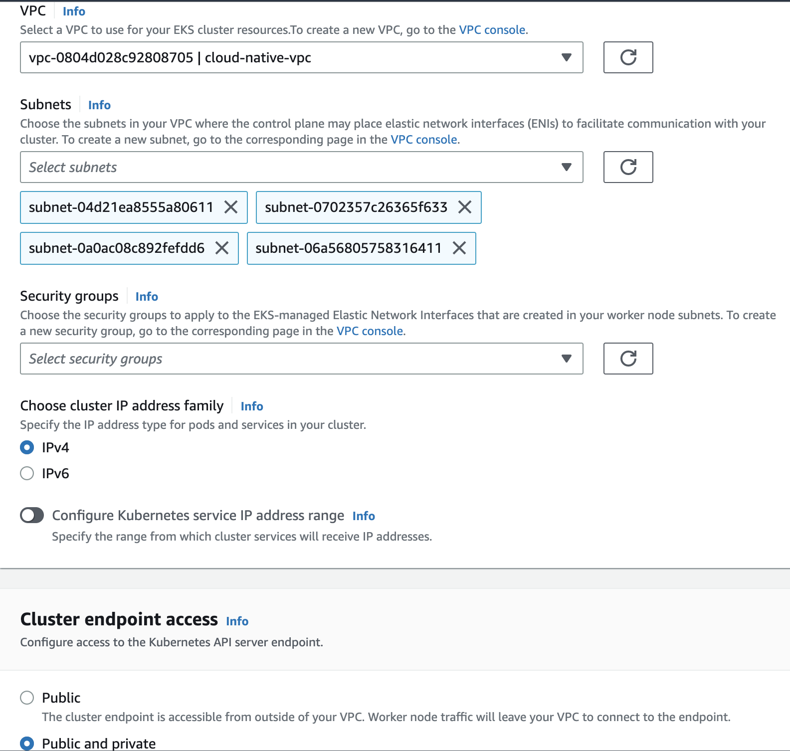
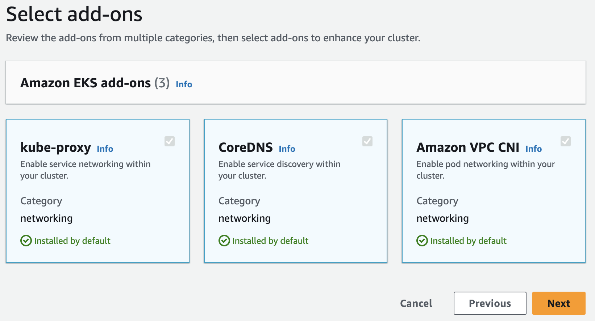
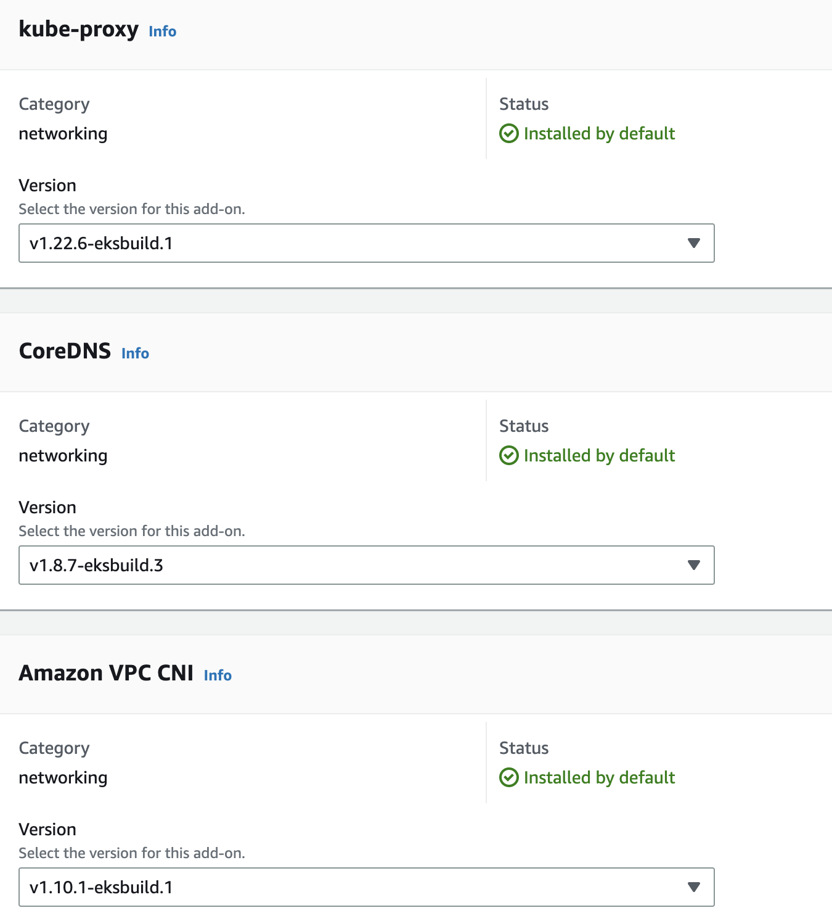
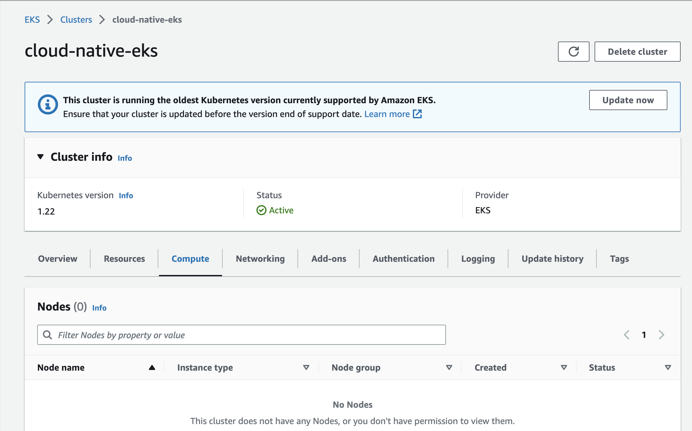

# Create AWS Kubernetes Service - EKS

You can create EKS cluster either using AWS portal GUI or AWS Cloud Shell or using AWS CLI. This demo will focus on creating EKS cluster using two options listed below:

| Section | Description |
| ------- | ----------- |
| [Option A]() | Create EKS cluster using AWS GUI|

#### Option A (Create EKS cluster using AWS GUI)

1. Login to AWS cloud console - https://aws.amazon.com/console/

	We will deploy EKS in Asia Pacific (Mumbai) region.
	Select Mumbai from Regions drop down present on right top corner. Link - https://ap-south-1.console.aws.amazon.com/console/home?region=ap-south-1

2. Create VPC and subnets on AWS for EKS cluster

	You can reuse any existing VPX and subnet for creating EKS cluster, however demo purpose create new VPC and subnet.

	Type VPC in Seach windown and click on VPC under services section -> Click on Create VPC.

	Update VPC name to cloud-native and add tags under additionals tag e.g. key: name and value: cloud-native-vpc and click on Create VPC

	

	Note: While creating VPC, we have selected VPC and more option under resources to create which will create subnets. For this demo, we have selected 2 public subnets and 2 private subnets which will create total 4 subnets. You can verify the status of subnets in VPC dashboard -> Subnets -> Filter with name:cloud-native-vpc

	Auto assign IP settings for public subnets:

	Select one public subnet and Goto Actions -> Edit Subnet settings -> Enable auto-assign public IPv4 address. Repeat the same process for another public subnet.

	


3. Create EKS K8s cluster

	Go to Amazon Elastic Kubernetes Service (EKS) and click on Add cluster -> Create
	

	Create EKS K8s cluster by following Step 1 to 6 from dashboard

	Step 1: Configure Cluster

	Name: cloud-native-eks
	Kubernetes version : 1.22 (you can use any version of k8s)
	Cluster service role: eksClusterRole (use appropriate IAM role which has permission to create EKS)
	Add Tag name: cloud-native-eks

	


	Step 2: Specify networking
	Under Networking, add vpc: cloud-native-vpc from drop down created in Create VPC section.
	Subnets details will be auto populated after selecting VPC.
	Cluster end point access: update to Public and Private

	

	Step 3: Configure logging

	Select the control plane logging you would like to enable for your EKS cluster. This step is skipped (no logging enabled)

	
	Step 4: Select add-ons

	By default kube-proxy, CoreDNS, Amazon VPC CNI is installed while creating EKS cluster, proceed with default setting.

	


	Step 5: Configure selected add-ons settings

	Default settings for selected add-ons for this demo.

	

	Step 6: Review and create

	After reviewing all the configuration for EKS, click on create and wait for few minutes to deploy EKS cluster. 

	Once EKS cluster is ready, you will see the cluster status as Active

	

	This EKS cluster does not have any compute/nodes present as show in above diagram.

4.	Add Compute to EKS cluster

	Lets add NodeGroup to EKS cluster.
	Goto to EKS -> cloud-native-eks -> compute ->Node groups -> click on Add node group
	Configure Node Group:
	Name: cloud-native-nodes
	Node IAM role: IAM role which has permission to create EKS cluster
	Rest configuration is default 

    
	Note: Creating Nodes group configuration will take few minutes. You should see Nodes in ready state

5.	Access EKS cluster using AWS CLI
	
	```
	aws eks --region ap-south-1 update-kubeconfig --name cloud-native-eks
	```


