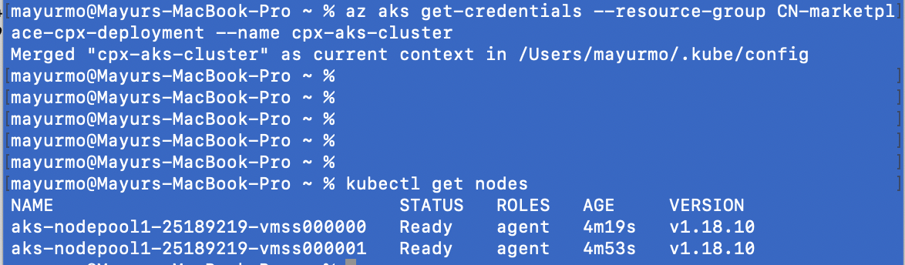
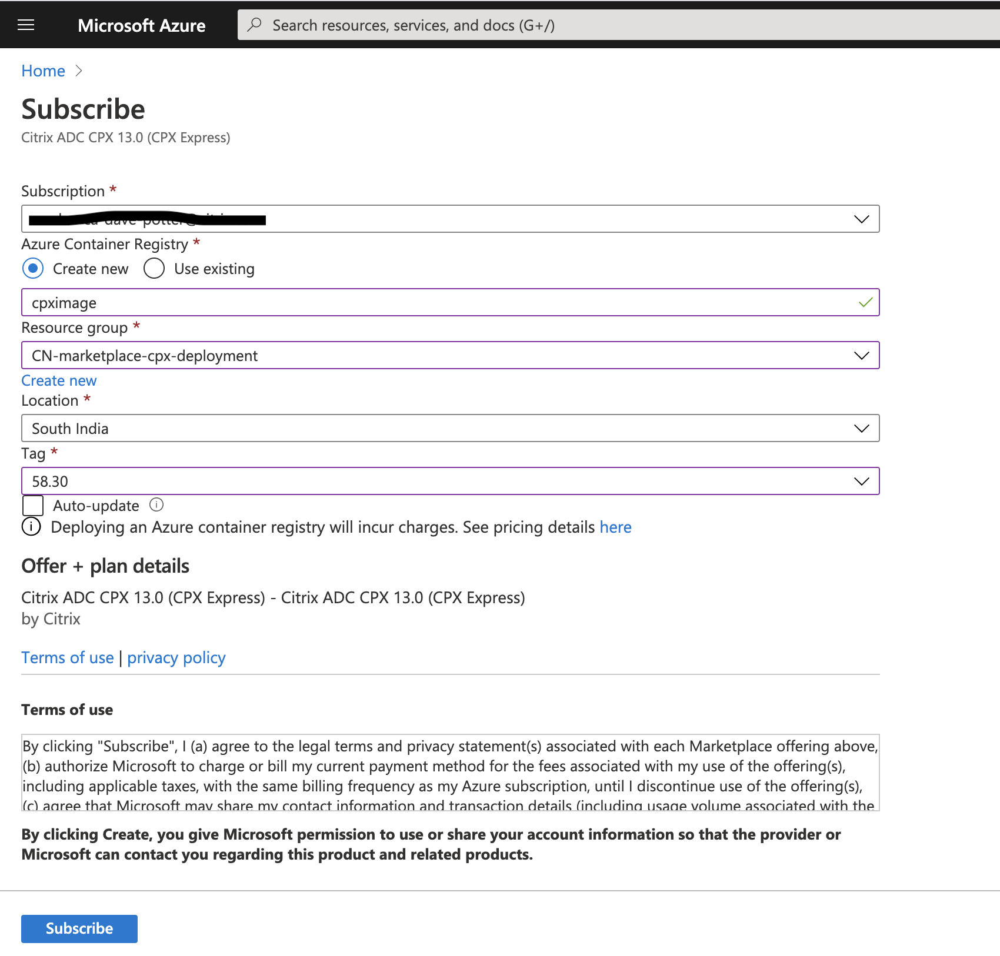

# Learn how to deploy CPX, CIC in Azure K8s (AKS) from Azure marketplace

In this guide you will learn:
* How to deploy Azure K8s cluster (AKS)
* How to create container deployable image for CPX, CIC from Azure marketplace
* How to deploy a CPX in AKS cluster exposed as LoadBalancer type services
* Load balance hotdrink beverage microservice app using AKS


| Section | Description |
| ------- | ----------- |
| [Section A](#section-a-create-k8s-cluster-in-aks) | Create K8s cluster in AKS |
| [Section B](#section-b-create-cpx-cic-azure-repository-container-images-from-marketplace) | Create CPX, CIC Azure repository container images from marketplace |
| [Section C](#section-c-load-balance-apps-using-cpx) | Load balance apps using CPX |
| [Section D](#section-d-clean-up) | Clean Up |

## Section A (Create K8s cluster in AKS)
Azure has two options for deploying Kubernetes cluster in AKS, using Kubenet CNI and Azure CNI. In this demo, we will use Azure CNI for creating AKS k8s cluster.

You can create cluster either using Azure portal GUI or Azure CLI. Choose one option from below to create AKS cluster.

| Section | Description |
| ------- | ----------- |
| [Option A](#option-a-create-aks-cluster-using-azure-cloud-portal-gui) | Create AKS cluster using Azure cloud portal GUI |
| [Option B](#option-b-create-aks-cluster-using-azure-cli) | Create AKS cluster using Azure CLI|

#### Option A (Create AKS cluster using Azure cloud portal GUI)

1. Login to Azure cloud portal - https://portal.azure.com/#home
	You will below home page after successful login.
	

2. Create new Azure resource group

	Select Resource group from Azure services -> Click on Add and provide Resource group name and region information -> Click on Review + Create -> Click on Create. 
	

3. Create 2 worker node AKS K8s cluster using Azure CNI

	Select newly created Resource group and Click on Add -> Select Kubernetes Service from list.
	

	Create K8s cluster by filling ARM template, provide information like K8s cluster name, Region, Node count, Network configuration-. Azure CNI in Networking. After Review click on Create and wait for some time (2-3 mins) for Cluster to be UP.

	

	Check the status of K8s cluster from Resource group -> Overview -> Select Kubernetes service created -> Status: Succeeded.

	


4. Login to Azure Cloud shell and validate cluster status
	Click on Connect -> Follow instructions on right and you will be connected to AKS cluster.
	

	Check the AKS cluster status before beginning your demo
	```
	kubectl get nodes
	kubectl get pods
	```
	

#### Option B (Create AKS cluster using Azure CLI)

1. Install Azure CLI and Kubectl in local machine
	Install Azure CLI from [here](https://docs.microsoft.com/en-us/cli/azure/install-azure-cli)
	Install Kubectl from [here](https://kubernetes.io/docs/tasks/tools/#kubectl)

	Check the status for successful installation,
	```
	az version
	kubectl version
	```
	

2. Login to Azure accout
	```
	az login
	```
	

	Select your Azure subscription from the az login output list and set it in below command at '<name of the subscription>'
	```
	az account set --subscription "<name of the subscription>"
	```

3. Create new Azure resource group
	```
	az group create --name CN-marketplace-cpx-deployment --location southindia
	```
	

4. Create 2 worker node AKS K8s cluster using Azure CNI
	```
	az aks create --resource-group CN-marketplace-cpx-deployment --name cpx-aks-cluster --node-count 2 --enable-addons monitoring --generate-ssh-keys --network-plugin azure
	```
	

6. Validate AKS cluster status
	```
	az aks get-credentials --resource-group CN-marketplace-cpx-deployment --name cpx-aks-cluster
	kubectl get nodes
	```
	

## Section B (Create CPX, CIC Azure repository container images from marketplace)

#### Generate CIC container image (Azure repository image) URL from Azure marketplace
1. Login to [Azure marketplace](https://azuremarketplace.microsoft.com/en-us/marketplace/apps/citrix.citrixingresscontroller?tab=Overview) account to create CIC repository image.

2. Subscribe to Citrix Ingress Controller from Marketplace
	* Step 1 will take you to CIC offering from Marketplace, if not found search for Citrix Ingress controller in Marketplace
	* Click on GET IT NOW from CIC offering and provide details in Subscription page. We will use 'CN-marketplace-cpx-deployment' resource group created in Section A for this subscription. Click on Subscribe after filling the form as shown below.

	

3. CIC container repository image URL is available now
	* Go to the Resouce Groups page and select the resource group created in Section A, in my case its 'CN-marketplace-cpx-deployment'
	* Click on registry -> Repositories under Services from left panel -> Click on 'citrix/citrix-k8s-ingress-controller' -> click on 'latest' tag -> Copy docker pull command

	

	* Copy docker pull command, will use it in yaml for deployment.
	

	e.g. In my setup CIC docker pull command is 'docker pull cicimage.azurecr.io/citrix/citrix-k8s-ingress-controller:latest' that I will use in section C for CPX deployment.

	In case you find challenege in generating CIC repository image, refer to [Citrix Ingress Controller from Azure marketplace](https://github.com/citrix/citrix-k8s-ingress-controller/blob/master/docs/deploy/azure-cic-url.md) for more details.

#### Generate CPX container image (Azure repository image)URL from Azure marketplace
1. Login to [Azure marketplace](https://azuremarketplace.microsoft.com/en-in/marketplace/apps/citrix.citrixadccpx-13-0?tab=Overview) account to create CPX repository image.

2. Subscribe to Citrix ADC CPX 13.0 (CPX Express) from Marketplace
	* Step 1 will take you to CPX offering from Marketplace, in not found search for CPX in Marketplace
	* Click on GET IT NOW from CIC offering and provide details in Subscription page. We will use 'CN-marketplace-cpx-deployment' resource group created in Section A for this subscription. Click on Subscribe after filling the form as shown below.

	

3. CPX container repository image URL is available now
	* Go to the Resouce Groups page and select the resource group created in Section A, in my case its 'CN-marketplace-cpx-deployment'
	* Click on registry -> Repositories under Services from left panel -> Click on 'citrix/citrix-k8s-cpx-ingress-13-0' -> click on '58.30' tag -> Copy docker pull command

	

	* Copy docker pull command, will use it in yaml for deployment.
	

	e.g. In my setup CPX docker pull command is 'docker pull cpximage.azurecr.io/citrix/citrix-k8s-cpx-ingress-13-0:58.30' that I will use in section C for CPX deployment.

	In case you find challenege in generating CPC repository image, refer to [Citrix ADC CPX from Azure marketplace](https://github.com/citrix/citrix-k8s-ingress-controller/blob/master/docs/deploy/azure-cpx-url.md) for more details.

## Section C (Load balance apps using CPX)
**Note** Below deployment is done using Azure CLI, you can use Azure shell GUI for same. Instructions for enabling Azure CLI or cloud shell in given in Section A.


1. Deploy the `colddrink` microservice application in the AKS cluster
	```
	kubectl create -f https://raw.githubusercontent.com/citrix/cloud-native-getting-started/master/beginners-guide/manifest/colddrink-app.yaml
	kubectl get pods
	```
	

2. Deploy Citrix ADC CPX in AKS exposed on NodePort
	Download CPX yaml file to update it with Azure registory image URLS of CPX and CIC.
	```
	wget https://raw.githubusercontent.com/citrix/cloud-native-getting-started/master/azure/marketplace-cpx/manifest/cpx.yaml
	```
	Update '<<Azure CPX registory image URL>>' in CPX yaml file with 'CPX URL' generated in Section B &
	Update '<<Azure CIC registory image URL>>' in CPX yaml file with 'CIC URL' generated in Section B.

	```
	kubectl create -f cpx.yaml
	```
	

	**Note** In case you find error in CPX deployment, e.g. CPX pod status is 'ImagePullBackOff' or 'ErrImagePull' then please ensure that you have right Azure Container Registry roles and permissions. 

	You can try add Azure container registry (ACR) to your k8s cluster using command 'az aks update -n cluster-name -g Cresource-group-name --attach-acr CPX/CIC ACR name' 

3. Deploy an Ingress rule for colddrink app to access http://www.colddrink.com
	```
	kubectl create -f https://raw.githubusercontent.com/citrix/cloud-native-getting-started/master/beginners-guide/manifest/colddrink-ingress.yaml
	```

4. Verify CPX configuration in AKS
	Check the status for CPX and colddrink application pods,
	```
	kubectl get pods
	```

	Login into CPX pods to check colddrink microservice application configuration status
	```
	kubectl exec -it <CPX pod name> bash
	```
	Now, you will find CPX has all configurations required for colddrink app. 
	e.g.
	```
	cli_script.sh "sh cs vserver"
	```

	


## Section D (Clean Up)
	```
	kubectl delete -f cpx.yaml
	kubectl delete -f https://raw.githubusercontent.com/citrix/cloud-native-getting-started/master/beginners-guide/manifest/colddrink-app.yaml
	kubectl delete -f https://raw.githubusercontent.com/citrix/cloud-native-getting-started/master/beginners-guide/manifest/colddrink-ingress.yaml
	```

