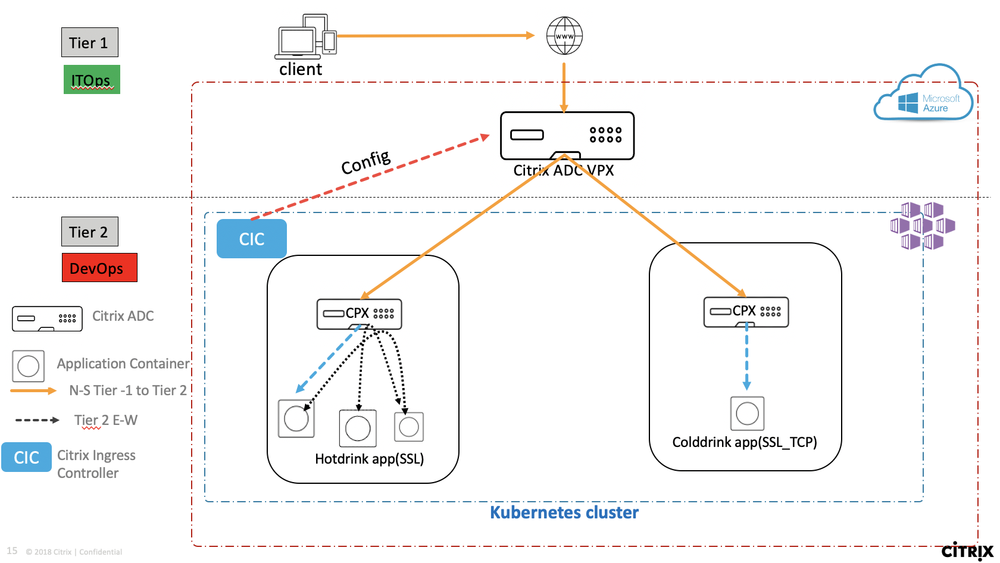

# Deploy Citrix Cloud native Service Mesh Lite topology in Azure cloud (Tier 1 ADC as Citrix ADC VPX, Tier 2 ADC as Citrix ADC CPX to load balance microservice applications deployed in AKS)

In this guide you will learn:

* What is Service Mesh lite topology?
* How to deploy Tier 1 ADC - VPX from Azure marketplace
* How to deploy Tier 2 ADC - CPX from Azure marketplace
* How to deploy Azure K8s cluster (AKS)
* How to deploy a beverages microservice application in Azure AKS k8s cluster
* How does VPX & CPX load balance AKS based beverage microservice apps using Citrix Ingress Controller

Citrix ADC supports Two tier & Service mesh lite architecture to load balance an enterprise grade applications deployed as microservices in Azure managed K8s cluster (AKS). Lets understand the Two tier & Service Mesh lite topology using below diagram. In this example Citrix ADC is VPX deployed in Azure cloud and beverage microservice application deployed in AKS cluster along with Citrix ADC CPX as Tier 2 ADC to optimze performance and business need. Citrix Ingress Controller deployed in AKS listens to AKS events and configures VPX automatically.

| Section | Description |
| ------- | ----------- |
| [Section A]() | Deploy Citrix ADC VPX in Azure cloud|
| [Section B]() | Deploy Azure K8s cluster (AKS) |
| [Section C]() | Deploy Citrix ADC CPX and beverage microservice apps in AKS cluster|
| [Section D]() | Clean Up |

### Section A (Deploy Citrix ADC VPX in Azure cloud)

Refer to [AKS unified ingress guide to deploy VPX](https://github.com/citrix/cloud-native-getting-started/tree/master/azure/unified-ingress#section-a-deploy-citrix-adc-vpx-in-azure-cloud)

### Section B (Deploy Azure K8s cluster (AKS))

Refer to [AKS unified ingress guide to deploy AKS cluster](https://github.com/citrix/cloud-native-getting-started/tree/master/azure/unified-ingress#section-b-deploy-azure-k8s-cluster-aks)

### Section C (Deploy Citrix ADC CPX and beverage microservice apps in AKS cluster)

Notes: CPX and beverage microservice apps deployment yamls are same for any platform, hence we will reuse onprem service mesh lite guide here to demonstarte how to deploy CPX and beverage apps in AKS cluster.

Before you start deployment from below guide, do not forget to update yamls with following changes;
* Update frontend-ip in ingress_vpx.yaml with VPX VIP (internal IPallocated by AKS) deployed in Section A
* Update NS_IP in cic_vpx.yaml with VPX NSIP (internal IP allocated by AKS) deployed in Section A
* Update VPX login credentials in cic_vpx.yaml file, login details for VPX are same added in Section A

Refer to [How to deploy CPX and beverage apps in AKS guide](https://github.com/citrix/cloud-native-getting-started/tree/master/on-prem/ServiceMeshLite#section-b-expose-cpx-as-ingress-type-service)

### Section D (Clean Up)

