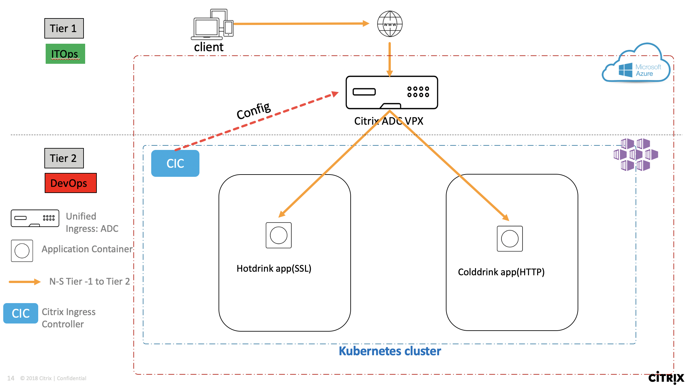
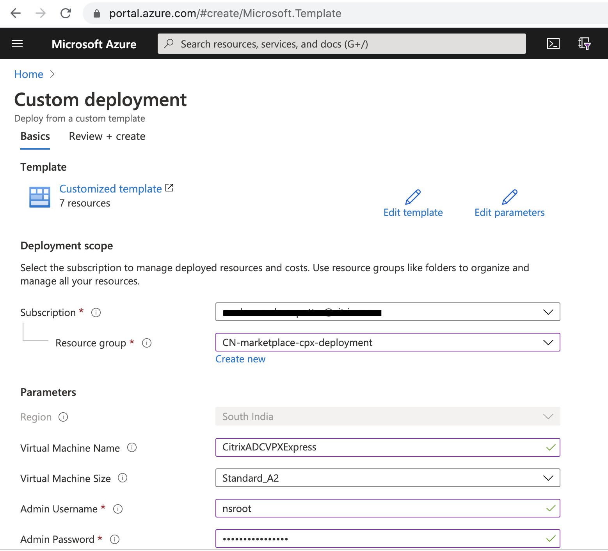
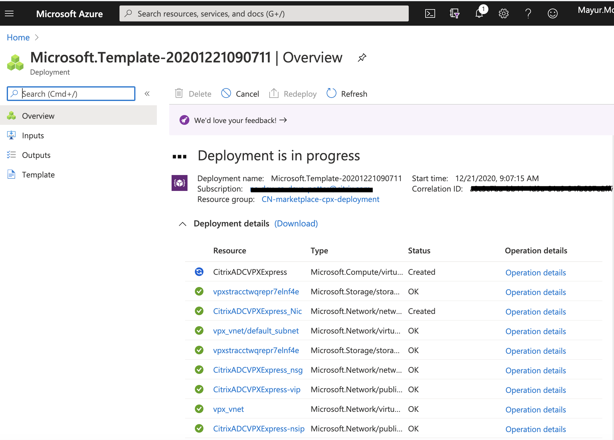
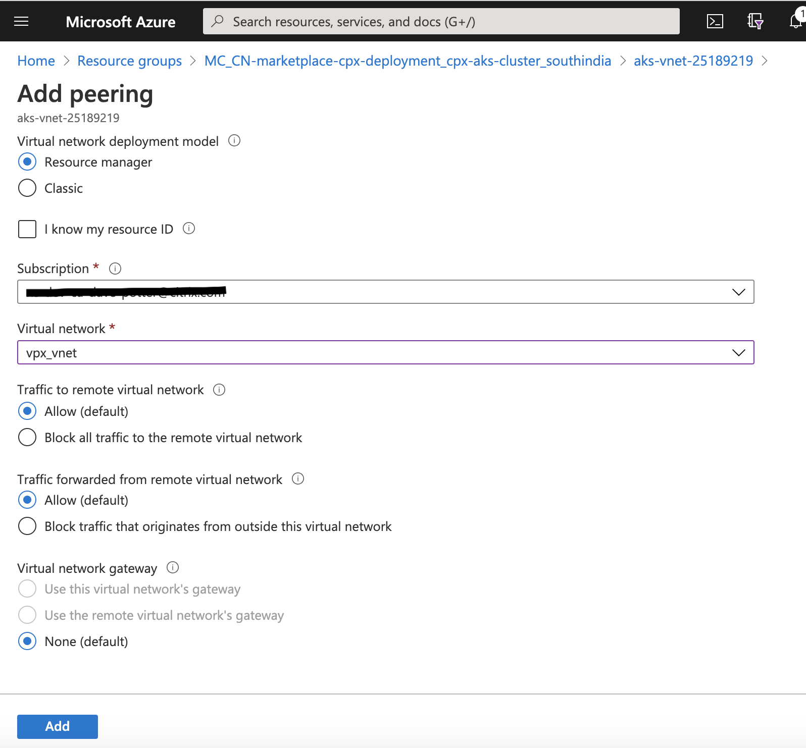

# # Deploy Citrix Cloud native Unified Ingress topology in Azure cloud (Tier 1 ADC as Citrix ADC VPX, Tier 2 as microservice applications on AKS)

In this guide you will learn:
* What is Unified Ingress topology?
* How to deploy Tier 1 ADC - VPX from Azure marketplace
* How to deploy Azure K8s cluster (AKS)
* How to deploy a beverages microservice application in Azure AKS k8s cluster
* How does VPX load balance AKS based beverage microservice apps using Citrix Ingress Controller

Citrix ADC supports Unified Ingress architecture to load balance an enterprise grade applications deployed as microservices in Azure managed K8s cluster (AKS). Lets understand the Unified Ingress topology using below diagram. In this example Citrix ADC is VPX deployed in Azure cloud and beverage microservice application deployed in AKS cluster. Citrix Ingress Controller deployed in AKS listens to AKS events and configures VPX automatically.



| Section | Description |
| ------- | ----------- |
| [Section A]() | Deploy Citrix ADC VPX in Azure cloud|
| [Section B]() | Deploy Azure K8s cluster (AKS) |
| [Section C]() | Load balance beverage microservice apps using VPX|
| [Section D]() | Clean Up |

### Section A (Deploy Citrix ADC VPX in Azure cloud)

Lets deploy Citrix ADC VPX Express on Azure cloud using ARM template. For more details on supported Azure templates visit [Citrix ADC ARM templates](https://github.com/citrix/citrix-adc-azure-templates) documentation.

1.	Select 1nic_express template from [Citrix ADC VPX standalone ARM template](https://github.com/citrix/citrix-adc-azure-templates/tree/master/templates/standalone) and click on Deploy to Azure

	

2. Deploy VPX Express on Azure in one click using ARM template

	Fill out ARM template as shown in below screenshots. 
	
	

	* Resource group: You can create new resource group of your choice. I have created new resource group 'CN-marketplace-cpx-deployment 'before hand that used here.
	* Provide Admin username and Admin password used for VPX login.
	* Create a new vnet with details of Subnet. Please ensure that VPX and AKS subnet is not overlapping otherwise vnet peering will not work. Hence VPX is getting deployed in 172.11.0.0/24 subnet.

3. Click on Review+Create for validating ARM template parameters

4. Once validation is passed, click on Create.

	It will take 2-3 mins for completing VPX Express deployment on Azure. 
	

	Once deployment is complete, you can click on resource group. You will be redirected to 'CN-marketplace-cpx-deployment' resource group. In case not, then goto Resource group and select 'CN-marketplace-cpx-deployment' resource group to locate 'CitrixADCVPXExpress' VirtualMachine type.

5. Login to VPX Express

	Click on 'CitrixADCVPXExpress' VirtualMachine type instance to note Public IP assigned to it.
	

	You can login to VPX either through Browser or CLI. Below screenshot shows output of VPX login through CLI.
	

**Note** In case you are not able to use CLI for VPX login, ensure that Azure CLI is installed on your local machine. Refer to [Create AKS cluster using Azure CLI](https://github.com/citrix/cloud-native-getting-started/tree/master/azure/marketplace-cpx#section-a-create-k8s-cluster-in-aks) section.


### Section B (Deploy Azure K8s cluster (AKS))

You can create AKS cluster using Azure CLI or cloud shell, refer to [marketplace cpx getting started guide](https://github.com/citrix/cloud-native-getting-started/tree/master/azure/marketplace-cpx#section-a-create-k8s-cluster-in-aks) for creating AKS cluster.

We will use Azure CNI for creating AKS in this demo, because Azure CNI support more feature than basic CNI (kubenet) and we need inbound, outbound traffic to reach microservice apps from Citrix ADC VPX deployed outside AKS. More details on [kubenet vs Azure CNI capabilities are listed here.](https://docs.microsoft.com/en-us/azure/aks/concepts-network#compare-network-models)

In this demo I will use Azure CLI for deploying Azure CNI based AKS cluster.
1. Create AKS cluster 

	```
	az aks create --resource-group CN-marketplace-cpx-deployment --name cpx-aks-cluster --node-count 2 --enable-addons monitoring --generate-ssh-keys --network-plugin azure
	```

	Ensure that you are able to connect AKS cluster using CLI or Cloud shell before proceeding to Section C.

2. Create virtual network peering between VPX and AKS cluster vnet
	vnet peering between VPX and AKS cluster network is required to provide inbound and outbound reachability for pods deployed inside AKS cluster.
	Since we have VPX being deployed before AKS deployment, VPX will have different subnet than AKS cluster. hence vnet peering is a solution to access hotdrink apps from Citrix ADC VPX.
	otherwise you can have other deployment where Citrix ADC VPX can be deployed in the same resource group of AKS (starting with MC_) where vnet peering is not required.
	**Note** When you deploy AKS cluster in one resource group then Azure creates another resource group strting with 'MC_' in which AKS workload is deployed. e.g. 'cpx-aks-cluster AKS cluster is created in CN-marketplace-cpx-deployment will create another resource group called MC_CN-marketplace-cpx-deployment_cpx-aks-cluster_southindia where actual k8s deployment takes place'

	* Goto Resource group - MC_CN-marketplace-cpx-deployment_cpx-aks-cluster_southindia -> aks-vnet-25189219 9virtual network) -> Click on Peering from left panel -> Click on Add 

	

	* Click on ADD to add new vnet peering
	

	Provide Peering link name of your choice, Select virtual network of VPX created in Section A and Click on Add. You can also see that same vnet peering is available in VPX vnet -> Peering section

	

### Section C (Load balance beverage microservice apps using VPX)
1. Deploy hotdrink beverage microservice app in AKS

	```
	kubectl create -f https://raw.githubusercontent.com/citrix/cloud-native-getting-started/master/azure/unified-ingress/manifest/hotdrink.yaml
	```

2. Deploy Kubernetes secret to secure hotdrink apps from internet

	```
	kubectl create -f https://raw.githubusercontent.com/citrix/cloud-native-getting-started/master/azure/unified-ingress/manifest/hotdrink-secret.yaml
	```

3. Deploy Citrix Ingress Controller to configure Citrix ADC VPX

	Create K8s secret for VPX login credentials used in CIC yaml file.
	```
	kubectl create secret generic nslogin --from-literal=username='nsroot' --from-literal=password='root'
	```
	**Note** Change the username and password with VPX credentials used in ARM template in Section A while deploying VPX.

	Download vpx-cic yaml file to update Citrix ADC VPX IP.
	```
	wget https://raw.githubusercontent.com/citrix/cloud-native-getting-started/master/azure/unified-ingress/manifest/vpx-cic.yaml
	```
	Update 'NS_IP' from 'vpx-cic.yaml' file with Internal NetScaler IP(NSIP) of VPX shown in Section A step 5. In this deployment, 'NS_IP : 172.11.0.4' is used.
	```
	kubectl create -f https://raw.githubusercontent.com/citrix/cloud-native-getting-started/master/azure/unified-ingress/manifest/rbac.yaml
	kubectl create -f vpx-cic.yaml
	```

4. Deploy ingress route for VPX to make hotdrink app reachable over internet.

	```
	wget https://raw.githubusercontent.com/citrix/cloud-native-getting-started/master/azure/unified-ingress/manifest/vpx-ingress.yaml
	```
	Update 'ingress.citrix.com/frontend-ip: "x.x.x.x"' with VIP IP address shown in Section A step 5. In this deployment, 'VIP: 172.11.0.5' is used.
	```
	kubectl create -f vpx-ingress.yaml
	```

5. Verify configuration in Citrix ADC VPX for hotdrink beverage microservice app.

	You will find that Citrix Ingress Controller has configured Citrix ADC VPX automatically listensing to K8s event for hotdrink app.
	Login to Citrix ADC VPX and verify below config status.
	```
	sh cs vserver
	sh lb vserver
	```
	

6. Yeah!!! Hotdrink beverage application is available to access securedly overfrom Internet using Citrix ADC VPX load balancer.

	Path for host file:[Windows] ``C:\Windows\System32\drivers\etc\hosts`` [Macbook] ``/etc/hosts``
	Add below entries in hosts file and save the file

	```
	<Public IP from CitrixADCVPXExpress-vip > hotdrink.beverages.com
	```
	**Note** CitrixADCVPXExpress-vip can be found in Resource group as Public IP address type created by VPX ARM template in Section A.

	Lets access hotdrink beverage microservice app from local machine browser e.g. ``https://hotdrink.beverages.com``


### Section D (Clean Up)
```
kubectl delete -f vpx-ingress.yaml
kubectl delete -f vpx-cic.yaml
kubectl delete -f https://raw.githubusercontent.com/citrix/cloud-native-getting-started/master/azure/unified-ingress/manifest/hotdrink-secret.yaml
kubectl delete -f https://raw.githubusercontent.com/citrix/cloud-native-getting-started/master/azure/unified-ingress/manifest/hotdrink.yaml
kubectl delete -f https://raw.githubusercontent.com/citrix/cloud-native-getting-started/master/azure/unified-ingress/manifest/rbac.yaml
```
