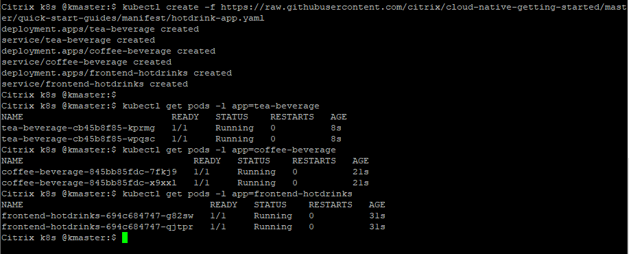
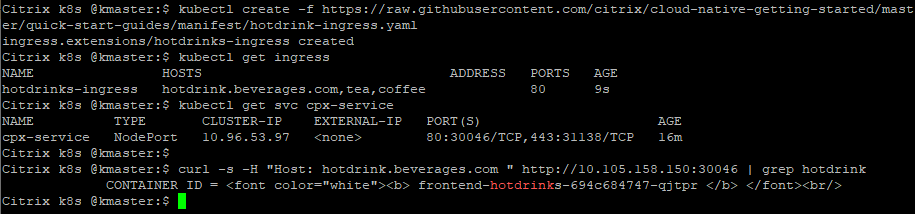
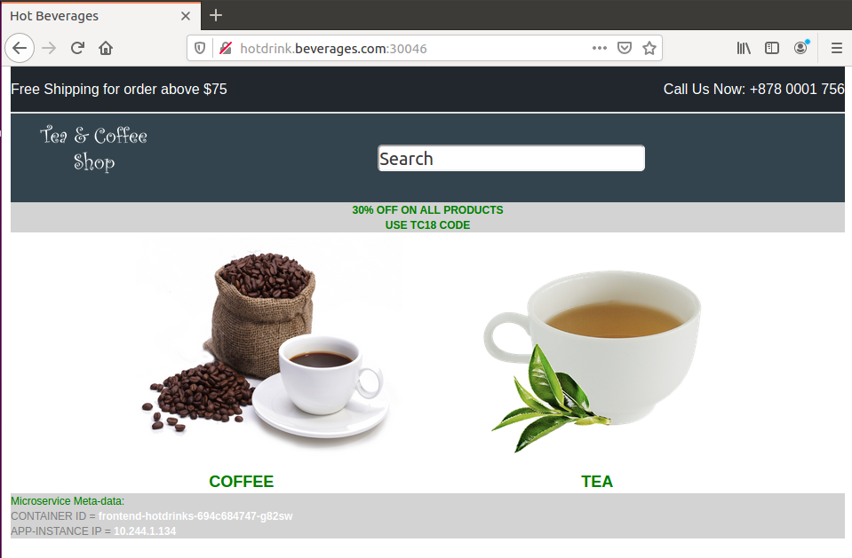
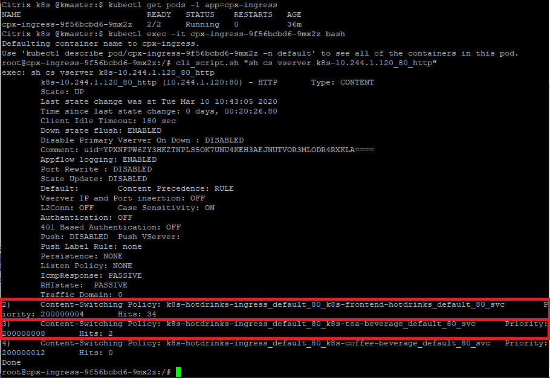

# Load balance East-West microservice traffic using Citrix CPX proxy
In this example, the Citrix ADC CPX (a containerized form-factor) is used to route the East West traffic between tea and coffee hotdrink microservice applications.
This type of deployment is called as [Service Mesh lite topology](https://developer-docs.citrix.com/projects/citrix-k8s-ingress-controller/en/latest/deploy/service-mesh-lite/), where Citrix ADC CPX will load balance the E-W microservice traffic. In this example Citrix ADC CPX is deployed as a independent pod and not as a sidecar container proxy.

**Prerequisite**: Kubernetes cluster (Below example is tested in on-prem v1.17.0 K8s cluster).

1. Lets deploy Citrix ADC CPX to load balance East-West traffic in K8s cluster
```
kubectl create -f https://raw.githubusercontent.com/citrix/cloud-native-getting-started/master/beginners-guide/manifest/cpx.yaml
kubectl get pods -l app=cpx-ingress
```


2. Lets deploy hotdrink application (front-end hotdrink, tea and coffee microservices) in K8s cluster
```
kubectl create -f https://raw.githubusercontent.com/citrix/cloud-native-getting-started/master/beginners-guide/manifest/hotdrink-app.yaml
kubectl get pods -l app=tea-beverage
kubectl get pods -l app=coffee-beverage
kubectl get pods -l app=frontend-hotdrinks
```


3. Lets deploy an Ingress rule that sends traffic to 'http://hotdrink.beverages.com' front-end hotdrink microservice (Based on user request for tea or coffee app, front-end hotdrink app will do E-W call to tea/coffee app)
```
kubectl create -f https://raw.githubusercontent.com/citrix/cloud-native-getting-started/master/beginners-guide/manifest/hotdrink-ingress.yaml
kubectl get ingress
kubectl get svc cpx-service
```

4. Lets send the traffic to front-end hotdrink microservice
```
curl -s -H "Host: hotdrink.beverages.com " http://<MasterNode IP:<NodePort> | grep hotdrink
```



5. Lets validate the E-W traffic communication flow

Add the DNS entries in your local machine host files for accessing microservices though Internet.

Path for host file: ``C:\Windows\System32\drivers\etc\hosts``

Add below entries in hosts file and save the file,
```
<K8s cluster MasterNode IP> hotdrink.beverages.com
```
In local machine browser access below URL,
```
http://hotdrink.beverages.com:<NodePort>
```


**Note**: If you are not able to see the front-end hotdrink microservice app (due to FW issue), access the URL from K8s cluster host machine browser.

Click on **TEA image** and you will redirected to tea microservice GUI (Internally front-end hotdrink microservice has called tea microservice).

Lets check the hit count for front-end hotdrink and tea microservices,

```
kubectl get pods -l app=cpx-ingress
kubectl exec -it cpx-ingress-9f56bcbd6-9mx2z bash
cli_script.sh "sh cs vserver"
cli_script.sh "sh cs vserver k8s-10.244.1.120_80_http"
```


To know more about Citrix ingress controller,[refer here](https://github.com/citrix/citrix-k8s-ingress-controller)

For next tutorial, visit [beginners-guides](https://github.com/citrix/cloud-native-getting-started/tree/master/beginners-guide)
