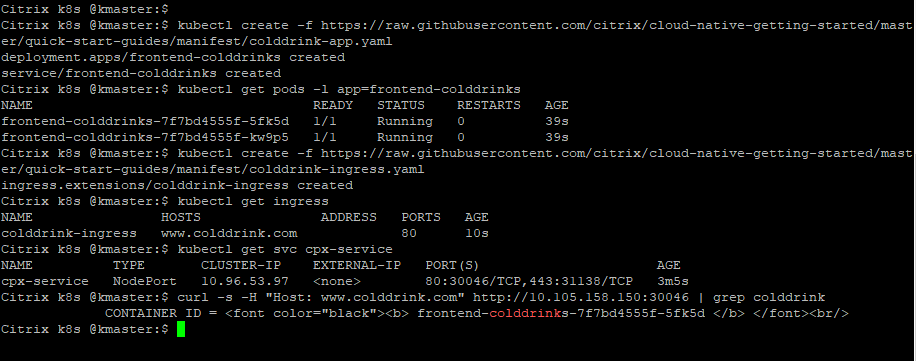

# Load balance North-South Ingress traffic using Citrix ADC CPX proxy

In this example, the Citrix ADC CPX (a containerized form-factor) is used to route the Ingress traffic to a `colddrink` microservice application.
Kubernetes Ingress is a way to send Internet traffic to a microservice application deployed in a K8s cluster. An Ingress resource is deployed in the MiniKube cluster to define the rules for sending external traffic to the application.

**Prerequisite**: Ensure that you have installed and set up a Kubernetes cluster (The following example is tested in on-prem Kubernetes cluster version 1.17.0).

Perform the following:

1. Deploy Citrix ADC CPX as an Ingress proxy in the Kubernetes cluster and verify the installation using the following commands.

       kubectl create -f https://raw.githubusercontent.com/citrix/cloud-native-getting-started/master/beginners-guide/manifest/cpx.yaml
        
       kubectl get pods -l app=cpx-ingress

   

2. Deploy the `colddrink` microservice application in the Kubernetes cluster and verify the installation.

        
        kubectl create -f https://raw.githubusercontent.com/citrix/cloud-native-getting-started/master/beginners-guide/manifest/colddrink-app.yaml
        
        kubectl get pods -l app=frontend-colddrinks
       

3. Deploy an Ingress rule that sends traffic to http://www.colddrink.com.

    
        kubectl create -f https://raw.githubusercontent.com/citrix/cloud-native-getting-started/master/beginners-guide/manifest/colddrink-ingress.yaml

        kubectl get ingress

        kubectl get svc cpx-service

4. Send some traffic to the `colddrink` microservice application.

        curl -s -H "Host: www.colddrink.com" http://<MasterNode IP:<NodePort> | grep colddrink

     

5. (Optional) Clean up the deployments using the following commands.

        kubectl delete -f https://raw.githubusercontent.com/citrix/cloud-native-getting-started/master/beginners-guide/manifest/cpx.yaml

        kubectl delete -f https://raw.githubusercontent.com/citrix/cloud-native-getting-started/master/beginners-guide/manifest/colddrink-app.yaml
       
        kubectl delete -f https://raw.githubusercontent.com/citrix/cloud-native-getting-started/master/beginners-guide/manifest/colddrink-ingress.yaml

For more information on the Citrix ingress controller, see the [Citrix ingress controller](https://github.com/citrix/citrix-k8s-ingress-controller) documentation. For more tutorials, see [beginners-guides](https://github.com/citrix/cloud-native-getting-started/tree/master/beginners-guide).
