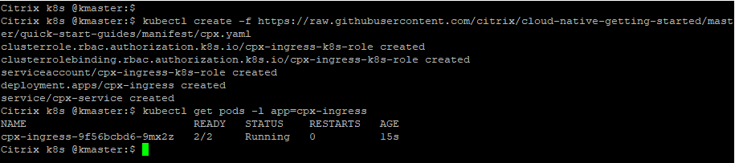
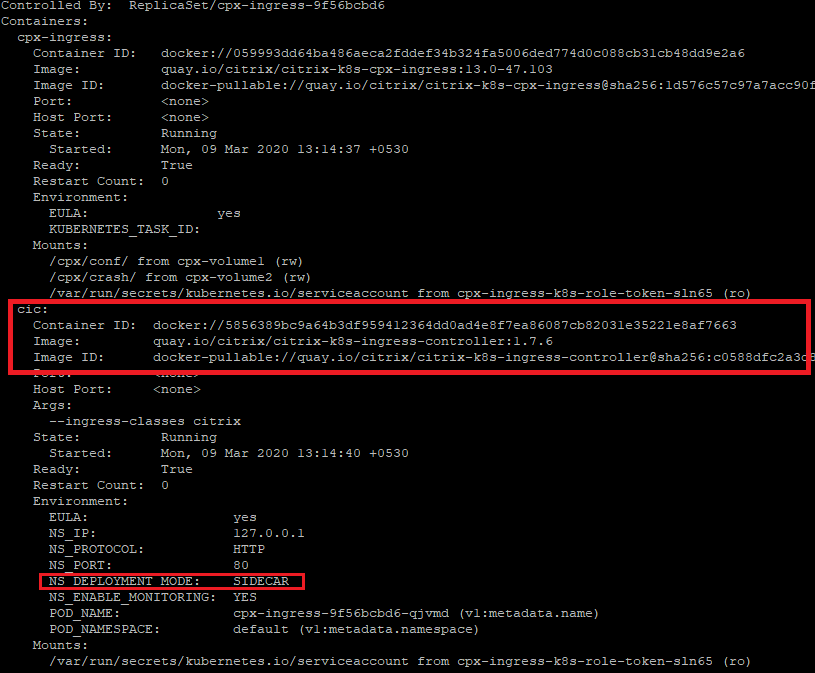
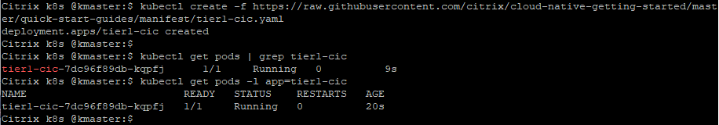

# Deploy a Citrix Ingress Controller (CIC) in K8s cluster
An Ingress Controller is a controller monitors the Kubernetes API server for updates to the Ingress resource and configures the Ingress load balancer accordingly.

Citrix ingress controller <u>(**CIC**)</u> can configure any form factor of Citrix ADC (MPX/SDX/VPX/BLX/CPX).
CIC can be deployed in two modes, 
  1. A sidecar container for configuring Tier 2 proxy (Citrix ADC CPX proxy).
  2. Independent k8s deployment kind for configuring Tier 1 Ingress proxy (MPX/SDX/BLX/VPX).

###### Note: This tutorial is for learning different CIC deployment modes and not to be considered as end user example. Real world examples will use either one/both CIC modes with other use cases. 
**Prerequisite**: Kubernetes cluster (Below example is tested in on-prem v1.22.1 K8s cluster).

1. Lets deploy CIC as a sidecar with Citrix ADC CPX proxy
```
kubectl create -f https://raw.githubusercontent.com/citrix/cloud-native-getting-started/master/beginners-guide/manifest/cpx.yaml
kubectl get pods -l app=cpx-ingress
```



There are 2 contains running in same pod highlighted by 2/2 under READY column. One container is for Citrix ADC CPX proxy and another container is for CIC.
Lets see the details of both containers,
```
kubectl describe pod $(kubectl get pods -l app=cpx-ingress | awk ‘{print $1}’ | grep cpx-ingress)
```


2. Lets deploy CIC for configuring Tier 1 Citrix ADC

Download CIC to local machine,
```
wget https://raw.githubusercontent.com/citrix/cloud-native-getting-started/master/beginners-guide/manifest/tier1-cic.yaml
```
Change NS_IP environment variable in tier1-cic yaml with Citrix ADC management IP.

Now deploy CIC in K8s cluster,
```
kubectl create -f https://raw.githubusercontent.com/citrix/cloud-native-getting-started/master/beginners-guide/manifest/tier1-cic.yaml
kubectl get pods -l app=cic-k8s-ingress-controller
```


Lets see the summary of CIC pod,
```
kubectl describe pod <pod name>
```
e.g.
```
kubectl describe pod tier1-cic-7dc96f89db-shj7c
```

How do I check the CIC logs
```
kubectl logs -f <pod name>
```
e.g.
```
kubectl logs -f tier1-cic-7dc96f89db-shj7c
```

3 Clean up K8s cluster
```
kubectl delete -f https://raw.githubusercontent.com/citrix/cloud-native-getting-started/master/beginners-guide/manifest/cpx.yaml
kubectl delete -f https://raw.githubusercontent.com/citrix/cloud-native-getting-started/master/beginners-guide/manifest/tier1-cic.yaml

```

You can learn more about usage of all supported options for Citrix Ingress controller from [Modern App deployment yaml manifest details ](https://github.com/citrix/cloud-native-getting-started/tree/master/beginners-guide/CN stack manifest details.md).

For more information on the Citrix ingress controller, see the [Citrix ingress controller](https://github.com/citrix/citrix-k8s-ingress-controller) documentation. 

For more tutorials, see [beginners-guides](https://github.com/citrix/cloud-native-getting-started/tree/master/beginners-guide).