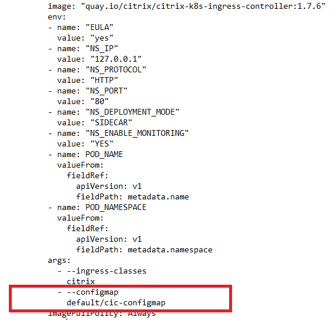
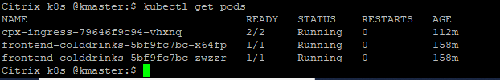
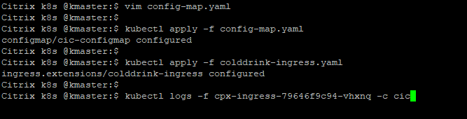

# Change Citrix Ingress Controller loglevel using ConfigMap support
ConfigMap allows you to separate your configurations from your pods and make your workloads portable.

###### Why ConfigMap
The Citrix ingress controller supports configuration command line arguments, and environment variables mentioned in [deploying the Citrix ingress controller](https://github.com/citrix/citrix-k8s-ingress-controller/blob/master/deployment/baremetal/README.md). But,
 you cannot update these configurations at runtime without rebooting the Citrix ingress controller pod. With ConfigMap support,
 you can update the configuration automatically while keeping the Citrix ingress controller pod running. You do not need to restart the pod after the update.

CIC support various loglevel (debug, info, critical, warning, etc). You can specify the log levels to control the logs generated by Citrix ingress controller.

Lets do demo of ConfigMap support for changing CIC loglevel.

**Prerequisite**: Kubernetes cluster (Below examples are tested in on-prem v1.17.0 K8s cluster).

1. Deploy ConfigMap in k8s cluster
```
kubectl create -f https://raw.githubusercontent.com/citrix/cloud-native-getting-started/master/beginners-guide/manifest/configmap.yaml
kubectl get configmap cic-configmap
```
2. Deploy Citrix ADC CPX proxy in k8s cluster
Download the cpx yaml file in your machine,
```
wget https://raw.githubusercontent.com/citrix/cloud-native-getting-started/master/beginners-guide/manifest/cpx.yaml
```
Edit cpx.yaml file and add ConfigMap argument in CIC container args section as mentioned below,
```
            - --configmap
              default/cic-configmap
```
See the below screen-shot for identifying right placeholder of configmap arg in CPX yaml file,



Deploy edited cpx yaml file in k8s cluster,
```
kubectl create -f cpx.yaml
```

3. Deploy colddrink microservice app

```
kubectl create -f https://raw.githubusercontent.com/citrix/cloud-native-getting-started/master/beginners-guide/manifest/colddrink-app.yaml
kubectl get pods -l app=frontend-colddrinks
```


4. Lets check the current CIC loglevel
```
kubectl logs -f <pod name> -c cic
```

```
e.g.kubectl logs -f cpx-ingress-79646f9c94-vhxnq -c cic
```

5. Change the loglevel and redeploy ConfigMap in k8s cluster
Edit the configmap yaml,
```
vim configmap.yaml
```
Change the loglevel to "debug" and redeploy ConfigMap,
```
kubectl apply -f configmap.yaml
```
Now loglevel has been changed to debug, to validate it check CIC logs again,
```
kubectl create -f https://raw.githubusercontent.com/citrix/cloud-native-getting-started/master/beginners-guide/manifest/colddrink-ingress.yaml
kubectl logs -f <pod name> -c cic
```
**Note**: Colddrink ingress is applied to see more logs in CIC.



6. Clean Up
```
kubectl delete -f https://raw.githubusercontent.com/citrix/cloud-native-getting-started/master/beginners-guide/manifest/configmap.yaml
kubectl delete -f cpx.yaml
kubectl delete -f https://raw.githubusercontent.com/citrix/cloud-native-getting-started/master/beginners-guide/manifest/colddrink-app.yaml
kubectl delete -f https://raw.githubusercontent.com/citrix/cloud-native-getting-started/master/beginners-guide/manifest/colddrink-ingress.yaml
```


For more information on ConfigMap, see [ConfigMap support for the Citrix ingress controller](https://developer-docs.citrix.com/projects/citrix-k8s-ingress-controller/en/latest/configure/config-map/) documentation.

For more information on the Citrix ingress controller, see the [Citrix ingress controller](https://github.com/citrix/citrix-k8s-ingress-controller) documentation. For more tutorials, see [beginners-guides](https://github.com/citrix/cloud-native-getting-started/tree/master/beginners-guide).


