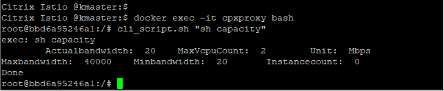

# Deploy a Citrix ADC CPX proxy in docker

Citrix ADC CPX is a container based proxy and can be deployed as a process in docker. 
* **Note**: This tutorial is for learning Citrix ADC CPX deployment in docker container and not to be considered as end user example. Real world examples will use Citrix ADC CPX in different deployment modes showcased in other beginners guides.

**Prerequisite**: Docker engine (Below example is tested in docker engine v18.06).

1. Install a Citrix ADC CPX on the docker container

```
docker run -dt --name cpxproxy --privileged=true -e EULA=yes quay.io/citrix/citrix-k8s-cpx-ingress:13.0-47.103
```
Note: CPX container image is pulled from quay container repository and deployed in docker engine. In end user deployment CPX will need Citrix Ingress Controller as a sidecar to configure CPX. However this guide is limited to show only CPX container overview.

2. Yeah! Citrix ADC CPX proxy is UP and running. Lets verify it
```
ps aux | grep cpxproxy
docker exec -it cpxproxy bash
```
3. Lets login to Citrix ADC CPX and check license details
```
cli_script.sh "sh capacity"
```


You can play with CPX now but do not use this CPX as is for POC/production deployment.
e.g.
```
cli_script.sh "sh ip"
cli_script.sh "sh feature"
cli_script.sh "sh lb vserver"
```

4 Clean up
```
docker ps | grep cpxproxy
docker stop <containerID>
docker rm <containerID>
```
e.g.
```
docker stop bbd6a95246a1
docker rm bbd6a95246a1
```

To know more about Citrix ADC CPX instance in docker,[ refer here](https://docs.citrix.com/en-us/citrix-adc-cpx/12/deploy-using-docker-image-file.html)

For next tutorial, visit [beginners-guides](https://github.com/citrix/cloud-native-getting-started/tree/master/beginners-guide)

