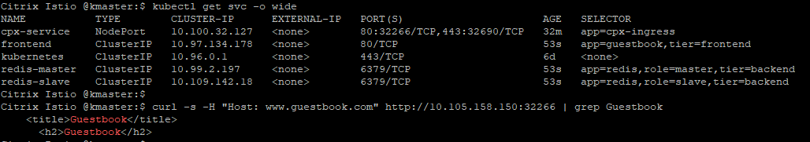

# Load balance Ingress traffic with Citrix ADC CPX in Minikube

In this example, the Citrix ADC CPX (a containerized form-factor) is used to route the Ingress traffic to a `Guestbook` microservice application deployed in a [Minikube](https://kubernetes.io/docs/setup/learning-environment/minikube/) cluster.
 An Ingress resource is deployed in the MiniKube cluster to define the rules for sending external traffic to the application.

**Prerequisite**:

  Ensure that you have installed and set up a [Minikube cluster](https://kubernetes.io/docs/tasks/tools/install-minikube/) (This example is tested on Minikube v0.33.1).

Perform the following: 

1. Deploy Citrix ADC CPX as an Ingress proxy in the Minikube cluster and verify the installation using the following commands.

       kubectl create -f https://raw.githubusercontent.com/citrix/cloud-native-getting-started/master/beginners-guide/manifest/cpx.yaml
        
       kubectl get pods -l app=cpx-ingress

2. Deploy the `Guestbook` application in Minikube and verify the installation.

        kubectl create -f https://raw.githubusercontent.com/citrix/cloud-native-getting-started/master/beginners-guide/manifest/guestbook-app.yaml

        kubectl get pods -l 'app in (guestbook, redis)'

3. Deploy an Ingress rule that sends traffic to http://www.guestbook.com.

        kubectl create -f https://raw.githubusercontent.com/citrix/cloud-native-getting-started/master/beginners-guide/manifest/guestbook-ingress.yaml

        kubectl get ingress

        kubectl get svc cpx-service

4. Send traffic to the `Guestbook` microservice application.

        curl -s -H "Host: www.guestbook.com" http://<MiniKube IP:<NodePort> | grep Guestbook

    

5. (Optional) Clean up the deployments using the following commands.

        kubectl delete -f https://raw.githubusercontent.com/citrix/cloud-native-getting-started/master/beginners-guide/manifest/cpx.yaml

        kubectl delete -f https://raw.githubusercontent.com/citrix/cloud-native-getting-started/master/beginners-guide/manifest/guestbook-app.yaml

        kubectl delete -f https://raw.githubusercontent.com/citrix/cloud-native-getting-started/master/beginners-guide/manifest/guestbook-ingress.yaml

For more information on the Citrix ingress controller, see the [Citrix ingress controller](https://github.com/citrix/citrix-k8s-ingress-controller) documentation. For more tutorials, see [beginners-guides](https://github.com/citrix/cloud-native-getting-started/tree/master/beginners-guide).