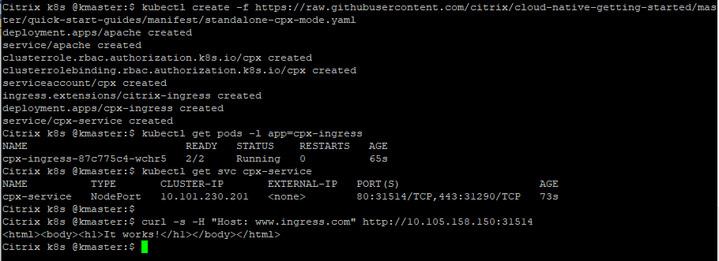
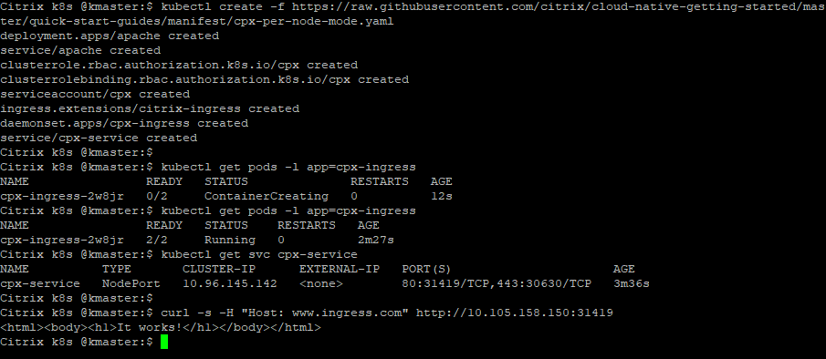

# Deep dive on Kubernetes features with Citrix ADC CPX

In this example, the Citrix ADC CPX (a containerized form-factor) is used to route the Ingress traffic to an Apache microservice application.

Citrix ADC CPX supports the following deployment modes:

- [Deploy a standalone Citrix ADC CPX per Kubernetes cluster](#Deploy-a-standalone-Citrix-ADC-CPX-Citrix-ADC-CPX-per-Kubernetes-cluster)
  
- [Deploy Citrix ADC CPX per node](#Deploy-Citrix-ADC-CPX-per-node-of-a-Kubernetes-cluster)

- [Deploy Citrix ADC CPX per namespace](#Deploy-Citrix-ADC-CPX-per-namespace-deployment)

- [Deploy Citrix ADC CPX with high availability (horizontal scaling)](#High-availability-Citrix-ADC-CPX-deployment)

**Prerequisite**:
Kubernetes cluster (These examples are tested on on-prem v1.17.0 Kubernetes cluster).

## Deploy a standalone Citrix ADC CPX (Citrix ADC CPX per Kubernetes cluster)

1. Deploy a stand-alone Citrix ADC CPX as an ingress device and verify the installation using the following commands.

        kubectl create -f https://raw.githubusercontent.com/citrix/cloud-native-getting-started/master/beginners-guide/manifest/standalone-cpx-mode.yaml

        kubectl get pods -l app=cpx-ingress

        kubectl get svc cpx-service

2. Send traffic to the Apache microservice.

        curl -s -H "Host: www.ingress.com" http://<Master IP:<NodePort>

        
    

3. Clean up the installation using the following command.

        kubectl delete -f https://raw.githubusercontent.com/citrix/cloud-native-getting-started/master/beginners-guide/manifest/standalone-cpx-mode.yaml

## Deploy Citrix ADC CPX per node of a Kubernetes cluster

1. Get the list of nodes in a cluster, deploy Citrix ADC CPX per node, and verify the installation using the following commands,

       kubectl get nodes

       kubectl create -f https://raw.githubusercontent.com/citrix/cloud-native-getting-started/master/beginners-guide/manifest/cpx-per-node-mode.yaml
    
       kubectl get pods -l app=cpx-ingress
    
       kubectl get svc cpx-service

2. Deploy traffic to the Apache microservice.

        curl -s -H "Host: www.ingress.com" http://<Master IP:<NodePort>

    (The number of `CPX-ingress` pods are equal to the number of nodes in the Kubernetes cluster deploying pods)
   

2. Clean Up the installation using the following command.

        kubectl delete -f https://raw.githubusercontent.com/citrix/cloud-native-getting-started/master/beginners-guide/manifest/cpx-per-node-mode.yaml

## Deploy Citrix ADC CPX per namespace deployment

This example shows how to deploy Citrix ADC CPX in multiple namespaces.

1. Create three namespaces in the Kubernetes cluster using the `kubectl create namespace` command

        kubectl create namespace team-A 
        kubectl create namespace team-B 
        kubectl create namespace team-C

2. Deploy Citrix ADC CPX in each namespace.

        kubectl create -f https://raw.githubusercontent.com/citrix/cloud-native-getting-started/master/beginners-guide/manifest/standalone-cpx-mode.yaml -n team-A
        kubectl create -f https://raw.githubusercontent.com/citrix/cloud-native-getting-started/master/beginners-guide/manifest/standalone-cpx-mode.yaml -n team-B
        kubectl create -f https://raw.githubusercontent.com/citrix/cloud-native-getting-started/master/beginners-guide/manifest/standalone-cpx-mode.yaml -n team-C

3. Deploy `colddrink` microservice apps in all namespaces.

        kubectl create -f https://raw.githubusercontent.com/citrix/cloud-native-getting-started/master/beginners-guide/manifest/colddrink-app.yaml -n team-A
        

        kubectl create -f https://raw.githubusercontent.com/citrix/cloud-native-getting-started/master/beginners-guide/manifest/colddrink-app.yaml -n team-B
        

        kubectl create -f https://raw.githubusercontent.com/citrix/cloud-native-getting-started/master/beginners-guide/manifest/colddrink-app.yaml -n team-C
        
1. Verify the deployment using the following commands>

        kubectl get pods -l app=frontend-colddrinks -n team-A
        kubectl get pods -l app=frontend-colddrinks -n team-B
        kubectl get pods -l app=frontend-colddrinks -n team-C
`
1. Deploy Ingress rules that send traffic to http://www.colddrink.com.

        kubectl create -f https://raw.githubusercontent.com/citrix/cloud-native-getting-started/master/beginners-guide/manifest/colddrink-ingress.yaml -n team-A

        kubectl create -f https://raw.githubusercontent.com/citrix/cloud-native-getting-started/master/beginners-guide/manifest/colddrink-ingress.yaml -n team-B
     

        kubectl create -f https://raw.githubusercontent.com/citrix/cloud-native-getting-started/master/beginners-guide/manifest/colddrink-ingress.yaml -n team-C

1. Verify the Ingress using the following commands.

        kubectl get ingress -n team-A
        kubectl get svc cpx-service -n team-A

        kubectl get ingress -n team-B
        kubectl get svc cpx-service -n team-B

        kubectl get ingress -n team-C
        kubectl get svc cpx-service -n team-C

2. Deploy the traffic for each Citrix ADC CPX deployed in different namespaces.

        kubectl get pods -l app=cpx-ingress -n team-A
        kubectl get pods -l app=cpx-ingress -n team-B
        kubectl get pods -l app=cpx-ingress -n team-C

        kubectl get svc -n team-A
        kubectl get svc -n team-B
        kubectl get svc -n team-C

3. Check for NodePort for all CPXs and create cURL requests accordingly.

        curl -s -H "Host: www.ingress.com" http://<Master IP:<NodePort>

6. Clean Up the installation using the following commands.

        kubectl delete namespace team-A team-B team-C
        kubectl delete -f https://raw.githubusercontent.com/citrix/cloud-native-getting-started/master/beginners-guide/manifest/standalone-cpx-mode.yaml -n team-A
        kubectl delete -f https://raw.githubusercontent.com/citrix/cloud-native-getting-started/master/beginners-guide/manifest/standalone-cpx-mode.yaml -n team-B
        kubectl delete -f https://raw.githubusercontent.com/citrix/cloud-native-getting-started/master/beginners-guide/manifest/standalone-cpx-mode.yaml -n team-C
        kubectl delete -f https://raw.githubusercontent.com/citrix/cloud-native-getting-started/master/beginners-guide/manifest/colddrink-app.yaml -n team-A
        kubectl delete -f https://raw.githubusercontent.com/citrix/cloud-native-getting-started/master/beginners-guide/manifest/colddrink-app.yaml -n team-B
        kubectl delete -f https://raw.githubusercontent.com/citrix/cloud-native-getting-started/master/beginners-guide/manifest/colddrink-app.yaml -n team-C
        kubectl delete -f https://raw.githubusercontent.com/citrix/cloud-native-getting-started/master/beginners-guide/manifest/colddrink-ingress.yaml -n team-A
        kubectl delete -f https://raw.githubusercontent.com/citrix/cloud-native-getting-started/master/beginners-guide/manifest/colddrink-ingress.yaml -n team-B
        kubectl delete -f https://raw.githubusercontent.com/citrix/cloud-native-getting-started/master/beginners-guide/manifest/colddrink-ingress.yaml -n team-C

## High availability Citrix ADC CPX deployment

This example shows how to deploy Citrix ADC CPX in high availability mode.

1. Deploy Citrix ADC CPX in high availability mode.

        kubectl create -f https://raw.githubusercontent.com/citrix/cloud-native-getting-started/master/beginners-guide/manifest/standalone-cpx-mode.yaml
        kubectl get pods -l app=cpx-ingress

2. Scale-up the Citrix ADC CPX pods to two instances.

        kubectl scale deployment cpx-ingress --replicas=2 
        kubectl get pods -l app=cpx-ingress

   Now both Citrix ADC CPXs are capable to take distributed Ingress traffic.

3. Scale-down Citrix ADC CPX pods to a single instance.

        kubectl scale deployment cpx-ingress --replicas=1
        kubectl get pods app=cpx-ingress

4. Test the Kubernetes self-healing mechanism. Kubernetes has an inbuilt self-healing property so that if a running a pod goes down then Kubernetes spins up a new pod.

        kubectl get pods -l app=cpx-ingress

        kubectl delete pod <cpx-ingress pod name>

        kubectl get pods -l app=cpx-ingress

   You can see that a new Citrix ADC CPX pod has come up immediately once a running pod goes down.

1. Clean Up the installation using the following steps. 

        kubectl delete -f https://raw.githubusercontent.com/citrix/cloud-native-getting-started/master/beginners-guide/manifest/standalone-cpx-mode.yaml

For more information on the Citrix ingress controller, see the [Citrix ingress controller](https://github.com/citrix/citrix-k8s-ingress-controller) documentation. For more tutorials, see [beginners-guides](https://github.com/citrix/cloud-native-getting-started/tree/master/beginners-guide).

