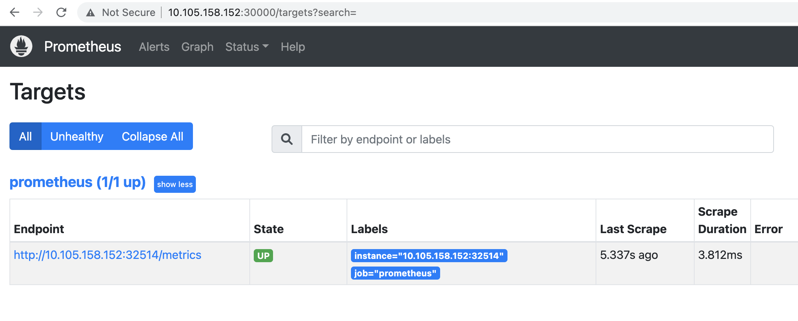
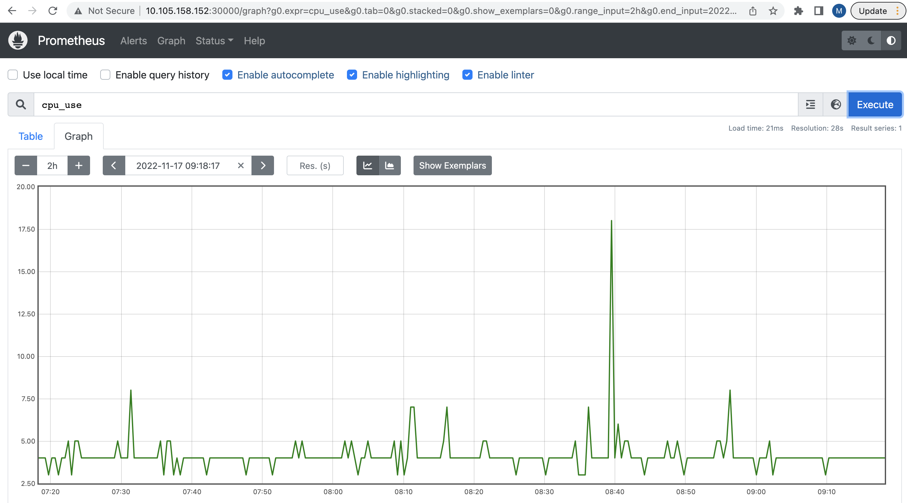

# Monitor Application and NetScalers (VPX/MPX/SDX) health on Prometheus using Citrix Observability exporter (COE) deployed K8s cluster

Citrix ADC Observability Exporter is a container that collects metrics and transactions from Citrix ADCs and transforms them to different formats (such as JSON, AVRO) for end points such as Prometheus, ElasticSearch, Zipking, Kafka and Splunk. By analyzing the data exported to the endpoint, you can get valuable insights for applications proxied by NetScaler (Citrix ADC). Refer [Citrix Observability exporter](https://github.com/citrix/citrix-observability-exporter) document for detailed integration.

In this deployment you will learn,
* How to deploy Citrix Observability exporter (COE) in Kubernetes cluster
* How to deploy Prometheus in Kubernetes cluster
* How to Configure TIer 1 NetScaler (VPX/MPX/SDX) to send metrics to Prometheus through COE.

## Deployment steps:

**Prerequisite**: Ensure that you have installed and set up a Kubernetes cluster (The following example is tested in on-prem Kubernetes cluster version 1.24.2).

1. Deploy COE in Kubernetes cluster

COE is exposed as NodePort service so that Tier 1 NetScaler in front of kubernetes cluster is able to send metrics to COE.

Note: COE will be exposed on defined NodePort 32514, in case you want to change the nodeport value please update coe-prometheus.yaml file.
```
kubectl create -f https://raw.githubusercontent.com/citrix/cloud-native-getting-started/master/beginners-guide/manifest/coe-prometheus.yaml
```

Verify the status of COE service
```
kubectl get svc 
```

2. Deploy Prometheus in Kubernetes cluster

There is choice of deploying Prometheus either in K8s cluster or somewhere else, for this demo we have Prometheus instance running in same cluster where COE is running.

We will deploy Prometheus in monitoring namespace.
Note: Prometheus will be exposed on defined NodePort 30000, in case you want to change the nodeport value please update prometheus.yaml file.
```
kubectl create -f https://raw.githubusercontent.com/citrix/cloud-native-getting-started/master/beginners-guide/manifest/prometheus.yaml
```

Verify the status of Prometheus service
```
kubectl get svc -n monitoring
```

3. Configure NetScaler to send metrics from ADC to Prometheus through COE

Note: We assume that you have tier 1 NetScaler VPX/SDX/MPX already in place with proper configuration. In this demo we will use VPX as Tier 1 ADC. COE related configuration are being done manually for simplicity sake. Another option is to use Citrix Ingress Controller to automate this configuration. 

Create service in NetScaler to create communication with COE from NetScaler. Execute below commands on VPX using CLI

```
add service coe_metric_collector_svc_192.168.1.102 COE_instance HTTP 5563
set analytics profile ns_analytics_time_series_profile -collector coe_metric_collector_svc_192.168.1.102 -Metrics ENABLED -OutputMode Prometheus -serveMode push
```

4. Monitor applications and NetScaker health on Prometheus

Login to Prometheus from browser using URL "http://<K8s HostNode IP>:30000/" 
Go to Status tab -> Targets, you will see that COE endpoint is UP which will send metrics information for VPX.



Go to Homepage and Click on bubble symbol next to execute button to show list of counteres exported from NetScaler.
Search for your intested counter to plot the graph. E.g. seach ``cpu_use`` and click execute. You can either see Table or Graph view to troubleshoot NetScaler.




5. Clean UP

Remove below command from VPX
```
rm service coe_metric_collector_svc_192.168.1.102 COE_instance
```

Remove below config from Kubernetes
```
kubectl delete -f https://raw.githubusercontent.com/citrix/cloud-native-getting-started/master/beginners-guide/manifest/coe-prometheus.yaml
kubectl delete -f https://raw.githubusercontent.com/citrix/cloud-native-getting-started/master/beginners-guide/manifest/prometheus.yaml
```

You can learn more about usage of all supported options for Citrix Ingress controller from [Modern App deployment yaml manifest details](https://github.com/citrix/cloud-native-getting-started/blob/master/beginners-guide/CIC-manifest-structure.md).

For more information on the Citrix ingress controller, see the [Citrix ingress controller](https://github.com/citrix/citrix-k8s-ingress-controller) documentation. 
