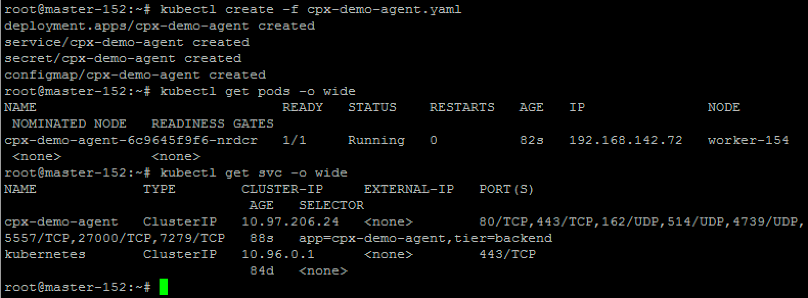
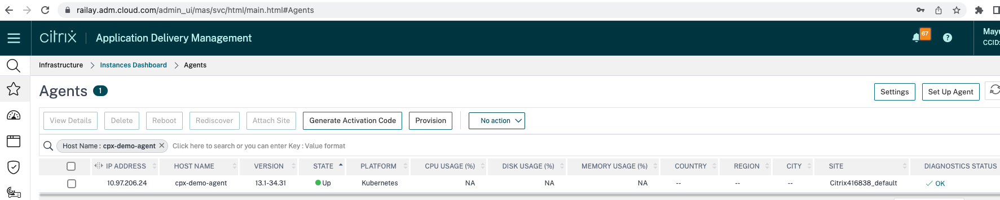
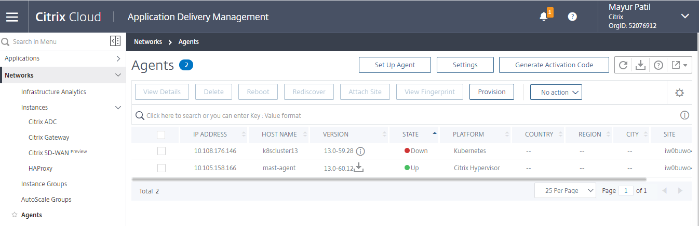
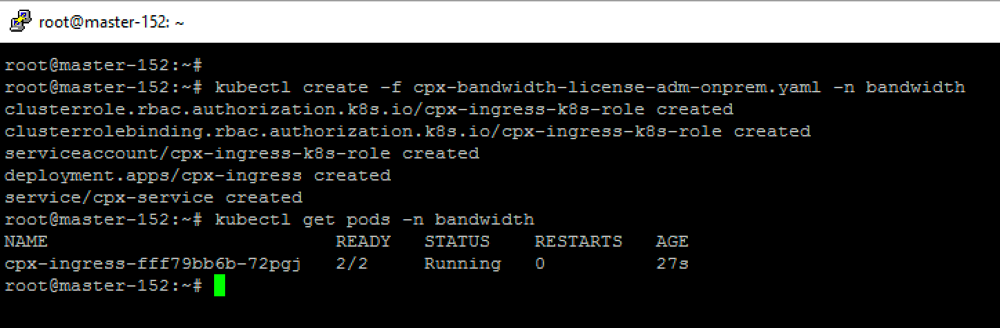
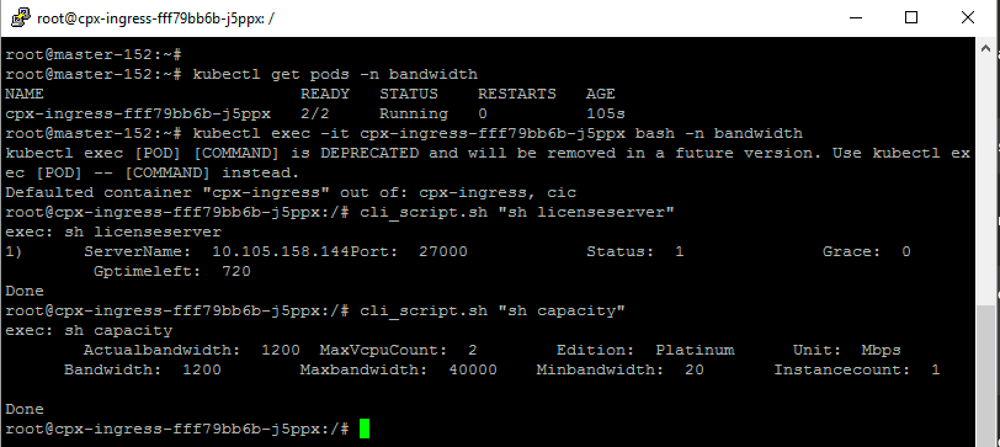
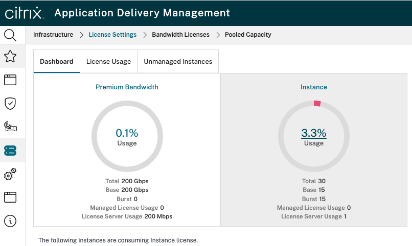
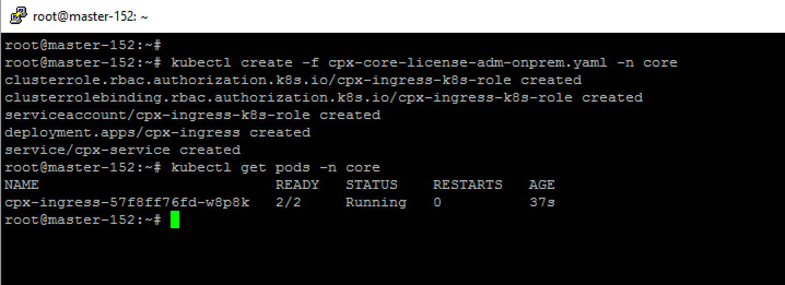
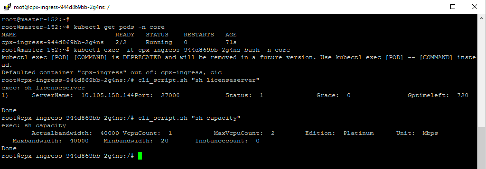
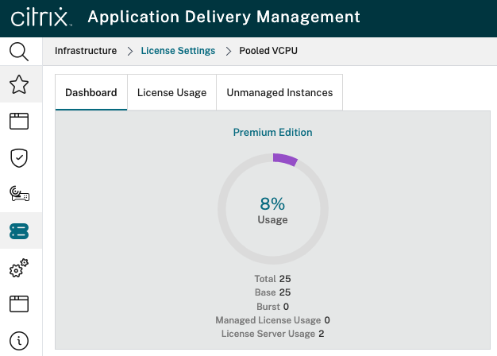

# How do I provision license to Citrix ADC CPX from ADM

In this guide you will learn:
* What are licensing modes available for Citrix ADC CPX
* Who does provisioning of license to Citrix ADC CPX
* How to apply license to Citrix ADC CPX from ADM service as well as ADM on prem

Citrix ADC CPX is container-based ADC deployed in Kubernetes cluster to load balance microservices. By default, CPX runs with 20 Mbps bandwidth called as CPX express however for better performance and production deployment customer needs licensed CPX instances.  Customer has to use Citrix ADM (ADM on-prem or ADM service) for checking out the license. There are three types of licensing available for CPX today, 
*	Bandwidth+ instance based pool license (one SKU shared across all Citrix ADC form factors)
*	vCPU based pool license (one SKU shared across all Citrix ADC form factors)
*   CP1000 (deprecated) CPX only license

Know more about Citrix ADC pooled licensing - [licensing docs](https://docs.citrix.com/en-us/citrix-application-delivery-management-software/current-release/license-server/adc-pooled-capacity.html)

### CPX licensing options,

| Section | Description |
| ------- | ----------- |
| [Section A](https://github.com/citrix/cloud-native-getting-started/tree/master/cpx-licensing#section-a-provision-bandwidth-based-licensing-to-citrix-adc-cpx-from-adm-service) | Provision Bandwidth based licensing to Citrix ADC CPX from ADM service |
| [Section B](https://github.com/citrix/cloud-native-getting-started/tree/master/cpx-licensing#section-b-provision-vcpu-based-licensing-to-citrix-adc-cpx-from-adm-service) | Provision vCPU based licensing to Citrix ADC CPX from ADM service |
| [Section C](https://github.com/citrix/cloud-native-getting-started/tree/master/cpx-licensing#section-c-provision-bandwidth-based-licensing-to-citrix-adc-cpx-from-adm-on-premise) | Provision Bandwidth based licensing to Citrix ADC CPX from ADM on-premise |
| [Section D](https://github.com/citrix/cloud-native-getting-started/tree/master/cpx-licensing#section-d-provision-vcpu-based-licensing-to-citrix-adc-cpx-from-adm-on-premise) | Provision vCPU based licensing to Citrix ADC CPX from ADM on-premise |


##### Section A: Provision Bandwidth based licensing to Citrix ADC CPX from ADM service
1. Setting up Citrix Application Delivery Management (Citrix ADM) for the first time

    Please make sure that ADM service setup is ready with ADM agent configuration. We need ADM service account and ADM agent both to CPX licensing to be functional.
    If you are first time user of ADM service, please refer  [ADM service documnetation](https://docs.citrix.com/en-us/citrix-application-delivery-management-service/getting-started.html) guide for setting up ADM service and ADM agent in your lab.

    **Note**: For this demo, I have used microservice based ADM agent. Please refer [ADM agent documentation](https://docs.citrix.com/en-us/citrix-application-delivery-management-service/getting-started/install-agent-as-microservice.html) to deploy ADM agent in kubernetes cluster.

    Goto *Infrastructure -> Instances Dashboard ->Agents* and click on *Set Up Agent* and follow the steps to deploy ADM container agent. Once container agent yaml/HELM manifest file is ready, download it and deploy it in K8s cluster

    

    After successful deployment of ADM container agent, ADM service portal will start showing container agent details.

    


2. Add Citrix ADC instance license pool to ADM service
    
    I assume that you have pool of bandwidth license available in you ADM service. If you want to know how to upload licensing file to ADM, refer to [ADM service pool licensing](https://docs.citrix.com/en-us/citrix-application-delivery-management-service/manage-licenses/pooled-capacity.html)

3. Deploy CPX in Kubernetes cluster

    We will deploy CPX in ``bandwidth`` namespace however CPX licensing works in any namespace.

    Download CPX yaml file to update CPX licensing variables
    ```
    kubectl create namespace bandwidth
    wget https://raw.githubusercontent.com/citrix/cloud-native-getting-started/master/cpx-licensing/manifest/cpx-bandwidth-license-adm-service.yaml
    ```

    Variables used in CPX manifest file to license it
    ```
          - name: "LS_IP"
            value: "10.105.158.166" //ADM container agent IP as mentioned in step 1
          - name: "LS_PORT"
            value: "27000"          // port on which ADM license server listen
          - name: "BANDWIDTH"
            value: "2000"           //capacity in Mbps wants to allocate to CPX
          - name: "EDITION"
            value: "STANDARD"       //CPX started supporting STD, ADV license editions, default value is PLATINUM
   
    ```
    
    Make the changes to ``cpx-bandwidth-license-adm-service.yaml`` file and deploy in K8s cluster
    ```
    kubectl create -f cpx-bandwidth-license-adm-service.yaml -n bandwidth
    ```
    **Note:** In this example, CPX will check out Premium edition bandwidth pool, hence EDITION environment variable is not present in given CPX manifest file because its default value.

    Login to CPX for checking instancing information.
    ```
    kubectl exec -it <cpx-pod-ip-name> bash -n bandwidth
    ```
    Execute below command to see the licensing information for given CPX instance
    ```
    sh licenseserver
    sh capacity
    ```

    You can also track the allocated bandwidth capacity from ADM service portal.

##### Section B: Provision vCPU based licensing to Citrix ADC CPX from ADM service
1. Setting up Citrix Application Delivery Management (Citrix ADM) for the first time

    Please make sure that ADM service setup is ready with ADM agent configuration. We need ADM service account and ADM agent both to CPX licensing to be functional.
    If you are first time user of ADM service, please visit - https://docs.citrix.com/en-us/citrix-application-delivery-management-service/getting-started.html guide for setting up ADM service and ADM agent in your lab.

    **Note**: For this demo, I have used Hypervisor based ADM agent setup. From below screenshot you can see that "10.105.158.166" is my on-prem agent used for licensing CPX.

    

2. Add Citrix ADC instance license pool to ADM service
    
    I assume that you have vCPU pool license available in you ADM service. If you want to know how to upload licensing file to ADM, refer to https://docs.citrix.com/en-us/citrix-application-delivery-management-service/manage-licenses/pooled-licenses/configuring-pooled-capacity.html


3. Deploy CPX in Kubernetes cluster

    Make sure that below environment variables are added to CPX yaml file to license CPX instance.
    
    ```
          - name: "LS_IP"
            value: "10.102.216.173" //ADM agent IP as mentioned in step 1
          - name: "LS_PORT"
            value: "27000"          // port on which ADM license server listen
          - name: "PLATFORM"
            value: "CORES"         // used for specifying type of pool licensing
          - name: "CPX_CORES"
            value: "4"              // number of core you want to allocate
    ```

    Edit CPX yaml file and update above EVN variable
    ```
    kubectl create namespace core
    wget https://raw.githubusercontent.com/citrix/cloud-native-getting-started/master/cpx-licensing/manifest/cpx-core-license-adm-service.yaml
    ```
    Make the changes to ``cpx-core-license-adm-service.yaml`` file and deploy in K8s cluster
    ```
    kubectl create -f cpx-core-license-adm-service.yaml -n core
    ```
    Login to CPX for checking instancing information.
    ```
    kubectl exec -it <cpx-pod-ip-name> bash -n core
    ```
    Execute below command to see the licensing information for given CPX instance
    ```
    sh licenseserver
    sh capacity
    ```
    You can also track the allocated vCPU capacity from ADM service portal.


##### Section C: Provision Bandwidth based licensing to Citrix ADC CPX from ADM on-premise
1. Setting up Citrix Application Delivery Management (Citrix ADM) for the first time

    Please make sure that ADM onprem setup is ready. We can have ADM onprem with and without ADM agent deployment for CPX licensing to be functional.
    If you are first time user of ADM onprem, please refer [ADM documentation](https://docs.citrix.com/en-us/citrix-application-delivery-management-software/13/get-started.html) guide for setting up ADM onprem and ADM agent (optional) in your lab.

    **Note**: For this demo, I have used inbuilt ADM agent with ADM onprem.

2. Add Citrix ADC instance license pool to ADM onprem
    
    I assume that you have pool of bandwidth license available in you ADM onprem. If you want to know how to upload licensing file to ADM, refer to [ADC pool licensing](https://docs.citrix.com/en-us/citrix-application-delivery-management-software/current-release/license-server/adc-pooled-capacity.html)


3. Deploy CPX in Kubernetes cluster

    We will deploy CPX in ``bandwidth`` namespace however CPX licensing works in any namespace.

    Download CPX yaml file to update CPX licensing variables
    ```
    kubectl create namespace bandwidth
    wget https://raw.githubusercontent.com/citrix/cloud-native-getting-started/master/cpx-licensing/manifest/cpx-bandwidth-license-adm-onprem.yaml
    ```    

    Variables used in CPX manifest file to license it
    
    ```
          - name: "LS_IP"
            value: "10.105.158.144" // ADM onprem instance IP, If you have ADM agent deployment then this will be your agent IP as described in step 1
          - name: "LS_PORT"
            value: "27000"          // port on which ADM license server listen
          - name: "BANDWIDTH"
            value: "3000"           //capacity in Mbps wants to allocate to CPX
          - name: "EDITION"
            value: "STANDARD"       //CPX started supporting STD, ADV license editions, default value is PLATINUM
    ```
    
    Make the above changes to ``cpx-bandwidth-license-adm-onprem.yaml`` file and deploy in K8s cluster

    ```
    kubectl create -f cpx-bandwidth-license-adm-onprem.yaml -n bandwidth
    ```

    

    **Note:** In this example, CPX will check out Premium edition bandwidth pool, hence EDITION environment variable is not present in given CPX manifest file because its default value.

    Login to CPX for checking instancing information.
    ```
    kubectl exec -it <cpx-pod-ip-name> bash -n bandwidth
    ```
    Execute below command to see the licensing information for given CPX instance
    ```
    sh licenseserver
    sh capacity
    ```
    

    You can also track the allocated bandwidth capacity from ADM onprem portal under *Infrastructure -> License Settings -> Bandwidth Licenses -> Pooled Capacity*

    

##### Section D: Provision vCPU based licensing to Citrix ADC CPX from ADM on-premise
1. Setting up Citrix Application Delivery Management (Citrix ADM) for the first time

    Please make sure that ADM onprem setup is ready. We can have ADM onprem with and without ADM agent deployment for CPX licensing to be functional.
    If you are first time user of ADM onprem, please refer [ADM documentation](https://docs.citrix.com/en-us/citrix-application-delivery-management-software/13/get-started.html) guide for setting up ADM onprem and ADM agent (optional) in your lab.

    **Note**: For this demo, I have used inbuilt ADM agent with ADM onprem.

2. Add Citrix ADC instance license pool to ADM onprem
    
    I assume that you have pool of bandwidth license available in you ADM onprem. If you want to know how to upload licensing file to ADM, refer to [ADC pool licensing](https://docs.citrix.com/en-us/citrix-application-delivery-management-software/current-release/license-server/adc-pooled-capacity.html)


3. Deploy CPX in Kubernetes cluster

    We will deploy CPX in ``core`` namespace however CPX licensing works in any namespace.

    Download CPX yaml file to update CPX licensing variables
    ```
    kubectl create namespace core
    wget https://raw.githubusercontent.com/citrix/cloud-native-getting-started/master/cpx-licensing/manifest/cpx-core-license-adm-onprem.yaml
    ```

    Variables used in CPX manifest file to license it
    ```
          - name: "LS_IP"
            value: "10.105.158.144" // ADM onprem instance IP, If you have ADM agent deployment then this will be your agent IP as described in step 1
          - name: "LS_PORT"
            value: "27000"          // port on which ADM license server listen
          - name: "CPX_CORES"
            value: "2"              // number of core you want to allocate
          - name: "EDITION"
            value: "STANDARD"       //CPX started supporting STD, ADV license editions, default value is PLATINUM            
    ```

    Make the changes to ``cpx-core-license-adm-onprem.yaml`` file and deploy in K8s cluster
    ```
    kubectl create -f cpx-core-license-adm-onprem.yaml -n core
    ```
    

    **Note 1:** In this example, CPX will check out Premium edition bandwidth pool, hence EDITION environment variable is not present in given CPX manifest file because its default value.

    **Note 2:** If you want to check out 1 vCPU for CPX then either you specify CPX_CORES value to ``1`` or skip the CPX_CORES variable, it will default consider one core.

    Login to CPX for checking instancing information.
    ```
    kubectl exec -it <cpx-pod-ip-name> bash -n core
    ```
    Execute below command to see the licensing information for given CPX instance
    ```
    sh licenseserver
    sh capacity
    ```
    

    You can also track the allocated vCPU capacity from ADM onprem portal under *Infrastructure ->License Settings -> Pooled VCPU*

    

## Clean up the deployment

```
kubectl delete -f cpx-bandwidth-license-adm-service.yaml -n bandwidth
kubectl delete -f cpx-core-license-adm-service.yaml -n core
kubectl delete -f cpx-bandwidth-license-adm-onprem.yaml -n bandwidth
kubectl delete -f cpx-core-license-adm-onprem.yaml -n core
kubectl delete namespace bandwidth
kubectl delete namespace core
```

