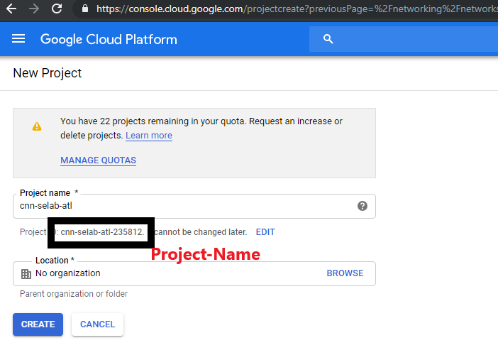
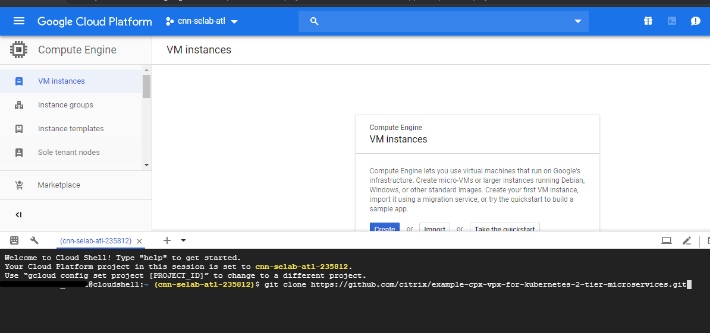
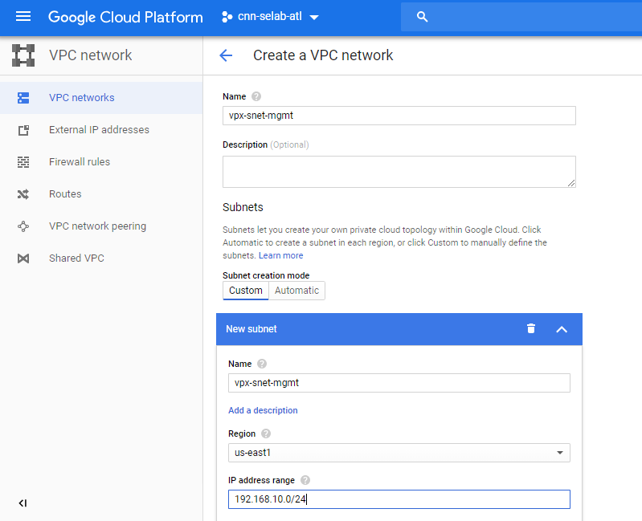
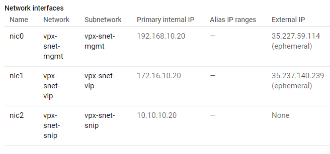
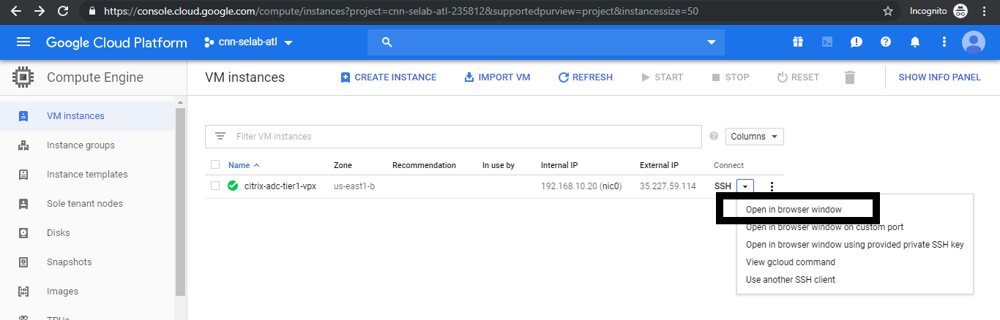
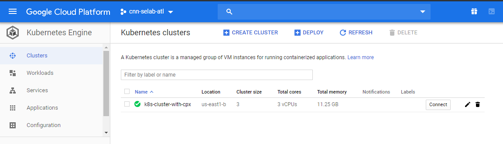
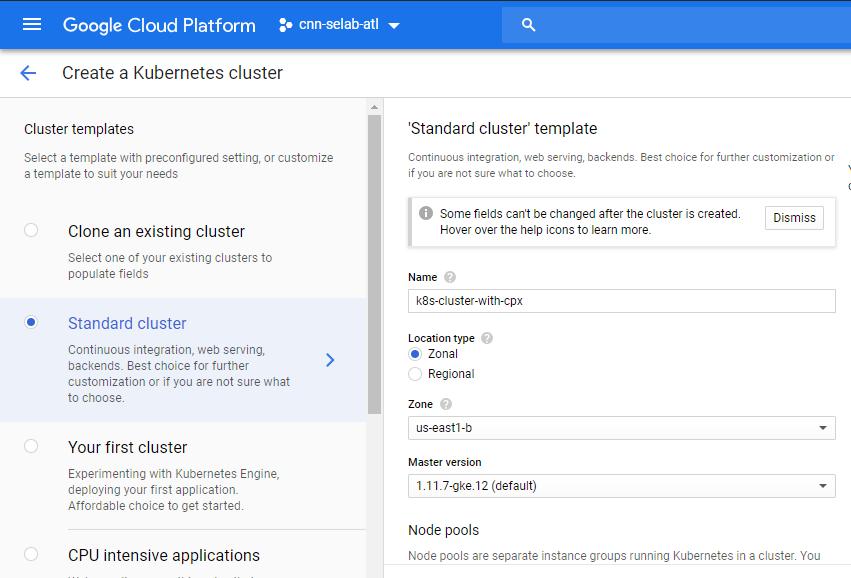
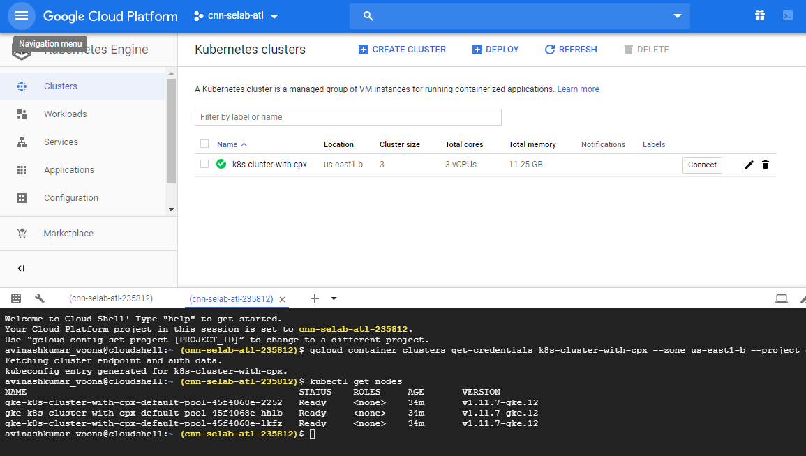

# Two-Tier deployment with Citrix ADC VPX, Citrix Ingress Controller and Citrix ADC CPX on Google Cloud

## Citrix product overview for GCP K8's architecture and components

## The four major Citrix components of GCP

1. **Citrix ADC VPX as tier 1 ADC for ingress-based internet client traffic.**

    A VPX instance in GCP enables you to take advantage of GCP computing capabilities and use Citrix load balancing and traffic management features for your business needs. You can deploy VPX in GCP as a standalone instance. Both single and multiple network interface card (NIC) configurations are supported.

1. **The Kubernetes cluster using Google Kubernetes Engine (GKE) to form the container platform.**

    Kubernetes Engine is a managed, production-ready environment for deploying containerized applications. It enables rapid deployment and management of your applications and services.

1. **Deploy a sample Citrix web application using the YAML file library.**

    Citrix has provided a sample microservice web application to test the two-tier application topology on GCP. We have also included the following components in the sample files for proof of concept:

    - Sample Hotdrink Web Service in Kubernetes YAML file
    - Sample Colddrink Web Service in Kubernetes YAML file
    - Sample Guestbook Web Service in Kubernetes YAML file
    - Sample Grafana Charting Service in Kubernetes YAML file
    - Sample Prometheus Logging Service in Kubernetes YAML file

    

1. **Deploy the Citrix ingress controller for tier 1 Citrix ADC automation into the GKE cluster.**

    The Citrix ingress controller built around Kubernetes automatically configures one or more Citrix ADC based on the ingress resource configuration. An ingress controller is a controller that watches the Kubernetes API server for updates to the ingress resource and reconfigures the ingress load balancer accordingly. The Citrix ingress controller can be deployed either directly using YAML files or by Helm Charts.

    

    Citrix has provided sample YAML files for the Citrix ingress controller automation of the tier 1 VPX instance. The files automate several configurations on the tier 1 VPX including:

    - Rewrite Polices and Actions
    - Responder Polices and Actions
    - Contents Switching URL rules
    - Adding/Removing CPX Load Balancing Services

    The Citrix ingress controller YAML file for GCP is located here:
    <https://github.com/citrix/example-cpx-vpx-for-kubernetes-2-tier-microservices/tree/master/gcp>

## Two-tier ingress deployment on GCP

In a dual-tiered ingress deployment, deploy Citrix ADC VPX/MPX outside the Kubernetes cluster (Tier 1) and Citrix ADC CPXs inside the Kubernetes cluster (Tier 2).

The tier 1 VPX/MPX would load balance the tier 2 CPX inside the Kubernetes cluster. This is a generic deployment model followed widely irrespective of the platform, whether it's Google Cloud, Amazon Web Services, Azure, or an on-premises deployment.

## Automation of the tier 1 VPX/MPX

The tier 1 VPX/MPX automatically load balances the tier 2 CPXs. Citrix ingress controller completes the automation configurations by running as a pod inside the Kubernetes cluster. It configures a separate ingress class for the tier 1 VPX/MPX so that the configuration does not overlap with other ingress resources.


---

## Citrix deployment overview

## Install and configure the tier 1 Citrix ADC on GCP

Prerequisites (mandatory):

1. Create a GCP account <http://console.cloud.google.com>

1. Download the NSVPX-GCP image from the Citrix download site.

1. Upload the file(for example, NSVPX-GCP-12.1-50.9_nc_64.tar.gz) to a storage bucket on Google by following the steps given at <https://cloud.google.com/storage/docs/uploading-objects>

1. Create **"cnn-selab-atl"** as project name on GCP console but **"Project ID"** which is unique for every GCP account will be your project name

     

1. Search for **Compute Engine** on GCP and select above created project on left to search and click on **Activate Cloud Shell** icon on right of search, than you will see cloud shell opened at the bottom of page

    

1. Clone the config files repoistory required for deployment on cloud shell and validate the same by giving **ls** to check the folder

      ```cloudshell
     git clone https://github.com/citrix/example-cpx-vpx-for-kubernetes-2-tier-microservices.git
      ```

    
1. Open the config files directory

    ```cloudshell
    cd example-cpx-vpx-for-kubernetes-2-tier-microservices/gcp/config-files/
    ```

1. Change the STORAGE_BUCKET_NAME and FILE_NAME as per your GCP account in below command and run to create a VPX image in your GCP account

    ```cloudshell
    gcloud compute images create netscaler12-1 --source-uri=gs://<STORAGE_BUCKET_NAME>/<FILE_NAME>.tar.gz --guest-os-features=MULTI_IP_SUBNET
    ```

    It might take a moment around 10 minutes for the image to be created. After the image is created, it appears under **Compute > Compute Engine > Images** in the GCP console. We will proceed to next steps by clicking on **Add Cloud Shell Sesssion** beside cloud shell session

## Deploy a Citrix VPX (tier-1-adc) on GCP

1. **GCP VPC Instances:**
     To address the separation of the External, Internal, and DMZ networks for security purposes. We must create three NICs as shown in the following table:

     |Network|Comments|
     |:---|:---|
     |192.168.10.0/24|Management Network (vpx-snet-mgmt)|
     |172.16.10.0/24|Client Network (vpx-snet-vip)|
     |10.10.10.0/24|Server Network (vpx-snet-snip)|

     > Note:
     >
     > Build the three-arm network VPCs before you deploy any VM instances.

     A VPC can be created by cloud shell or Google Cloud Platform Console
  
     **VPC by Cloud Shell**

     Create a VPC for Management or NSIP Traffic

     ```cloudshell
     gcloud compute networks create vpx-snet-mgmt --subnet-mode=custom
     gcloud compute networks subnets create vpx-snet-mgmt --network=vpx-snet-mgmt --region=us-east1 --range=192.168.10.0/24
     ```

     Create a VPC for Client or VIP Traffic

     ```gcloudsdk
     gcloud compute networks create vpx-snet-vip --subnet-mode=custom
     gcloud compute networks subnets create vpx-snet-vip --network=vpx-snet-vip --region=us-east1 --range=172.16.10.0/24
     ```

     Create a VPC for Server or SNIP Traffic where you host your kubernetes Cluster

     ```gcloudsdk
     gcloud compute networks create vpx-snet-snip --subnet-mode=custom
     gcloud compute networks subnets create vpx-snet-snip --network=vpx-snet-snip --region=us-east1 --range=10.10.10.0/24
     ```

     **VPC by GCP GUI Console**

     From the Google console, select **Networking > VPC network > Create VPC network** and enter the required fields, as shown below. Then click **Create**.

     

     Similarly, create VPC networks for client and server-side NICs to create three subnets.

     > Note:
     >
     > All three VPC networks should be in the same region, which is us-east1 in this scenario.

     

1. After you create three  **VPC Networks**, deploy the Citrix ADC VPX instance using the GDM template.
    >Note: Ensure you are in config-files directory and change the variable **"image_project_name:"** in **configuration.yml** to your project name by using **vi** or **nano editor** and execute below command  

     ```gcloudsdk
     gcloud deployment-manager deployments create tier1-vpx --config configuration.yml
     ```

1. After a successful deployment, go to **Compute Engine > VM instances** to check the **citrix-adc-tier1-vpx**  and validate the internal IPs.

    

1. The Citrix ingress controller can automate the static route configuration in the tier 1 VPX. Configure the subnet IP (SNIP) address that should be of the same subnet/virtual private cloud of the Kubernetes cluster.

    > Note:
    >
    > The tier 1 VPX/MPX deployed is going to load balance the CPXs inside the Kubernetes cluster. Configure the SNIP in the tier 1 VPX.

   

    As shown in above image click on SSH "**open in browser window**" for **citrix-adc-tier1-vpx** VM instance and run below commands to add SNIP and enable management access to SNIP

    ```cloudshell
    add ns ip 10.10.10.20 255.255.255.0 -type snip -mgmt enabled
    enable ns mode mbf
    ```

---

## Deploy a Kubernetes cluster using GKE

You can deploy Kubernetes cluster either by **Cloud shell or Google Cloud Platform GUI console**.

### Google Cloud Shell

>Note:  **"project-name"** in below command is present at three places change it to your project name and execute below command

```cloudshell
gcloud beta container --project "<project-name>" clusters create "k8s-cluster-with-cpx" --zone "us-east1-b" --username "admin" --cluster-version "1.11.7-gke.12" --machine-type "n1-standard-1" --image-type "COS" --disk-type "pd-standard" --disk-size "100" --scopes "https://www.googleapis.com/auth/devstorage.read_only","https://www.googleapis.com/auth/logging.write","https://www.googleapis.com/auth/monitoring","https://www.googleapis.com/auth/servicecontrol","https://www.googleapis.com/auth/service.management.readonly","https://www.googleapis.com/auth/trace.append" --num-nodes "3" --enable-cloud-logging --enable-cloud-monitoring --no-enable-ip-alias --network "projects/<project-name>/global/networks/vpx-snet-snip" --subnetwork "projects/<project-name>/regions/us-east1/subnetworks/vpx-snet-snip" --addons HorizontalPodAutoscaling,HttpLoadBalancing --enable-autoupgrade --enable-autorepair
```

### Google Cloud Platform GUI console steps

1. Search for a Kubernetes Engine on GCP console and click **Create Cluster**.

    

1. Create a cluster in the same subnet where your VPX SNIP is (vpx-snet-snip). This cluster automates the configuration push into the tier 1 ADC from Citrix ingress controller in the K8s cluster.

    

    

1. Click **Advanced options** to change the subnet to `vpx-snet-snip` and select the following fields.

    

1. To access this cluster from the cloud shell, search for **Kubernetes Engine > Clusters** and click **Connect to the cluster** button on right side of cluster and copy paste it on cloud shell

     

1. Validate the GKE Cluster deployment by running the following command and open the config-files directory as given in prerequisites

    ```gcloudsdkkubectl
    kubectl get nodes
    ```

    

---

## Deploy a sample application using the sample YAML file library

Citrix ADC offers the two-tier architecture deployment solution to load balance the enterprise grade applications deployed in microservices and accessed through the Internet. Tier 1 has heavy load balancers such as VPX/SDX/MPX to load balance North-South traffic. Tier 2 has CPX deployment for managing microservices and load balances East-West traffic.

1. If you are running your cluster in GKE, then ensure that you have used cluster role binding to configure a cluster-admin. You can do that using the following command.

     ```gcloudsdkkubectl
     kubectl create clusterrolebinding citrix-cluster-admin --clusterrole=cluster-admin --user=<email-id of your google account>.
     ```

1. Access the current directory where you have the deployment YAML files. Run the following command to get the node status.

     ```gcloudsdkkubectl
     kubectl get nodes
     ```

     

1. Create the namespaces:

     ```gcloudsdkkubectl
     kubectl create -f namespace.yaml
     ```

     Verify the namespace command:

     ```gcloudsdkkubectl
     kubectl get namespaces
     ```

    

1. Deploy the rbac.yaml in the default namespace.

     ```gcloudsdkkubectl
     kubectl create -f rbac.yaml
     ```

1. Deploy the CPX for hotdrink, colddrink, and guestbook microservices using the following commands.

     ```gcloudsdkkubectl
     kubectl create -f cpx.yaml -n tier-2-adc
     kubectl create -f hotdrink-secret.yaml -n tier-2-adc
     ```

1. Deploy the three-hotdrink beverage microservices--the SSL type microservice with the hair-pin architecture.

     ```gcloudsdkkubectl
     kubectl create -f team_hotdrink.yaml -n team-hotdrink
     kubectl create -f hotdrink-secret.yaml -n team-hotdrink
     ```

1. Deploy the colddrink beverage microservice--the SSL_TCP type microservice.

     ```gcloudsdkkubectl
     kubectl create -f team_colddrink.yaml -n team-colddrink
     kubectl create -f colddrink-secret.yaml -n team-colddrink
     ```

1. Deploy the guestbook--a NoSQL type microservice.

     ```gcloudsdkkubectl
     kubectl create -f team_guestbook.yaml -n team-guestbook
     ```

1. Validate the CPX deployed for above three applications. First, obtain the CPX pods deployed as tier-2-adc and then get the CLI access to CPX.
   * To get CPX pods in tier-2-adc namespace  

     ```cloudshellkubectl
     kubectl get pods -n tier-2-adc
     ```

   * To get CLI access (bash) to the CPX pod (hotdrinks-cpx pod)

     ```cloudshellkubectl
     kubectl exec -it "copy and paste hotdrink CPX pod name from the above step" bash -n tier-2-adc
     ```

   * To check whether the CS vserver is running in the hotdrink-cpx, enter the following command after the root access to CPX and give **"exit"** after validation.

        ```cloudshellkubectl
        cli-script"sh csvs"
        ```

1. Deploy the VPX ingress and ingress controller to the tier 2 namespace, which configures VPX automatically. Citrix Ingress Controller (CIC) automates the tier-1-adc (VPX).

     ```gcloudsdkkubectl
     kubectl create -f ingress_vpx.yaml -n tier-2-adc
     kubectl create -f cic_vpx.yaml -n tier-2-adc
     ```

1. Add the DNS entries in your local machine's host files for accessing microservices through the Internet.

     For Windows Clients, go to: **C:\Windows\System32\drivers\etc\hosts**

     For macOS Clients, in the Terminal, enter: **sudo nano /etc/hosts**

     Add the following entries in the host's file and save the file.

     ```gcloudsdkkubectl
     xxx.xxx.xxx.xxx (external-traffic-ip-tier1-vpx) hotdrink.beverages.com
     xxx.xxx.xxx.xxx (external-traffic-ip-tier1-vpx) colddrink.beverages.com  
     xxx.xxx.xxx.xxx (external-traffic-ip-tier1-vpx) guestbook.beverages.com  
     xxx.xxx.xxx.xxx (external-traffic-ip-tier1-vpx) grafana.beverages.com
     xxx.xxx.xxx.xxx (external-traffic-ip-tier1-vpx) prometheus.beverages.com 
     ```

1. Now you can access each application over the Internet. For example, `https://hotdrink.beverages.com`.

     

---

## Enable the Rewrite and Responder policies for the sample application

Now it's time to push the Rewrite and Responder policies on VPX through the custom resource definition (CRD).

1. Deploy the CRD to push the Rewrite and Responder policies in to tier-1-adc in default namespace.

   ```gcloudsdkkubectl
   kubectl create -f crd_rewrite_responder.yaml
   ```

1. **Blacklist URLs** Configure the Responder policy on `hotdrink.beverages.com` to block access to the coffee page.

   ```gcloudsdkkubectl
   kubectl create -f responderpolicy_hotdrink.yaml -n tier-2-adc
   ```

   After you deploy the Responder policy, access the coffee page on `hotdrink.beverages.com`. Then you receive the following message.

   

1. **Header insertion** Configure the Rewrite policy on `colddrink.beverages.com` to insert the session ID in the header.

   ```gcloudsdkkubectl
   kubectl create -f rewritepolicy_colddrink.yaml -n tier-2-adc
   ```

   After you deploy the Rewrite policy, access `colddrink.beverages.com` with developer mode enabled on the browser. In Chrome, press F12 and preserve the log in network category to see the session ID, which is inserted by the Rewrite policy on tier-1-adc (VPX).

   

---

## Open source tool sets

1. Deploy Cloud Native Computing Foundation (CNCF) monitoring tools, such as Prometheus and Grafana to collect ADC proxy stats.

     ```gcloudsdkkubectl
     kubectl create -f monitoring.yaml -n monitoring
     kubectl create -f ingress_vpx_monitoring.yaml -n monitoring
     ```

### Prometheus log aggregator

1. Log in to `http://grafana.beverages.com` and complete the following one-time setup.

     1. Log in to the portal using administrator credentials.
     1. Click **Add data source** and select the **Prometheus** data source.
     1. Configure the following settings and click the **Save and test** button.

        

### Grafana visual dashboard

1. From the left panel, select the **Import** option and upload the `grafana_config.json` file provided in the `yamlFiles` folder. Now you can see the Grafana dashboard with basic ADC stats listed.

    

---

## Delete a deployment

1. To delete the Citrix VPX (tier-1-adc) deployment, go to the Google SDK CLI console to delete the instance:

    ```gcloudsdk
    gcloud deployment-manager deployments delete tier1-vpx
    ```

1. To delete the GKE Kubernetes cluster, go to the GCP console, select kubernetes cluster, and click **Delete** to erase the cluster.

    

---