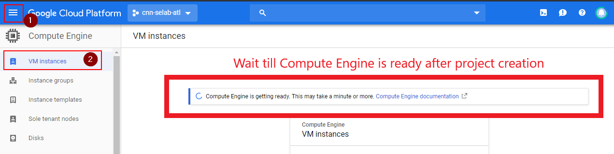
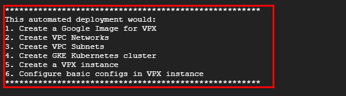
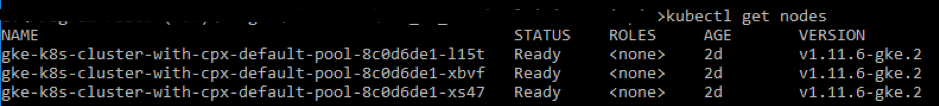
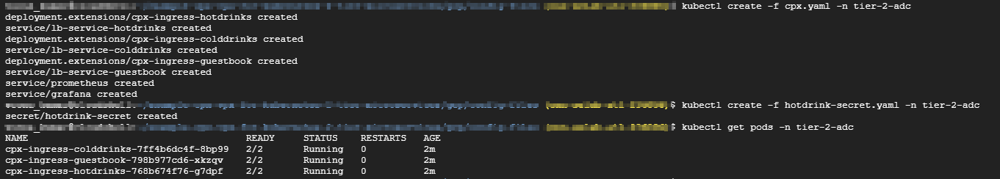
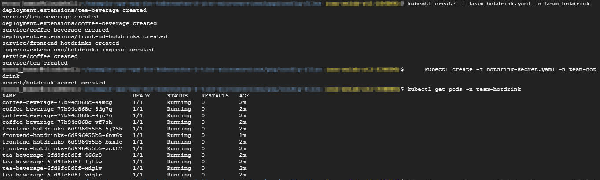
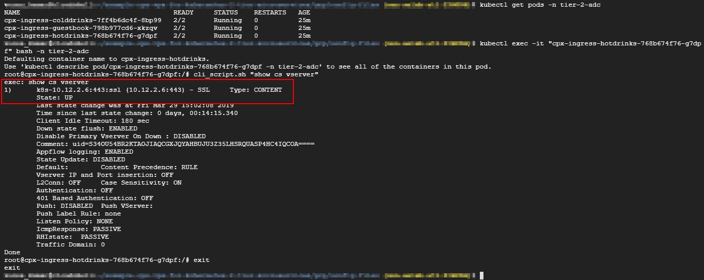
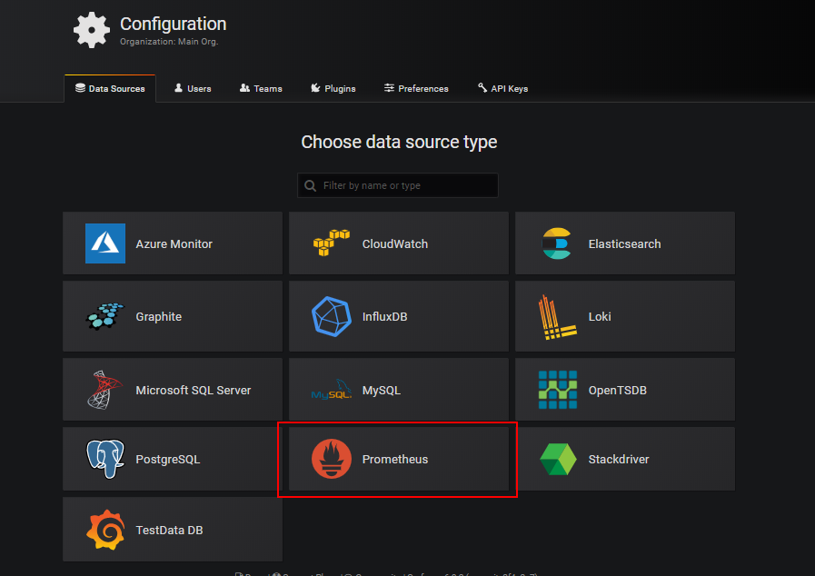

# Two-Tier deployment with Citrix ADC VPX, Citrix Ingress Controller and Citrix ADC CPX on Google Cloud

## Section A - Citrix product overview for GCP K8's architecture and components

### The four major Citrix components of GCP

1. **Citrix ADC VPX as tier 1 ADC for ingress-based internet client traffic.**

    A VPX instance in GCP enables you to take advantage of GCP computing capabilities and use Citrix load balancing and traffic management features for your business needs. You can deploy VPX in GCP as a standalone instance. Both single and multiple network interface card (NIC) configurations are supported.

1. **The Kubernetes cluster using Google Kubernetes Engine (GKE) to form the container platform.**

    Kubernetes Engine is a managed, production-ready environment for deploying containerized applications. It enables rapid deployment and management of your applications and services.

1. **Deploy a sample Citrix web application using the YAML file library.**

    Citrix has provided a sample microservice web application to test the two-tier application topology on GCP. We have also included the following components in the sample files for proof of concept:

    - Sample Hotdrink Web Service in Kubernetes YAML file
    - Sample Colddrink Web Service in Kubernetes YAML file
    - Sample Guestbook Web Service in Kubernetes YAML file
    - Sample Grafana Charting Service in Kubernetes YAML file
    - Sample Prometheus Logging Service in Kubernetes YAML file

    

1. **Deploy the Citrix ingress controller for tier 1 Citrix ADC automation into the GKE cluster.**

    The Citrix ingress controller built around Kubernetes automatically configures one or more Citrix ADC based on the ingress resource configuration. An ingress controller is a controller that watches the Kubernetes API server for updates to the ingress resource and reconfigures the ingress load balancer accordingly. The Citrix ingress controller can be deployed either directly using YAML files or by Helm Charts.

    

    Citrix has provided sample YAML files for the Citrix ingress controller automation of the tier 1 VPX instance. The files automate several configurations on the tier 1 VPX including:

    - Rewrite Polices and Actions
    - Responder Polices and Actions
    - Contents Switching URL rules
    - Adding/Removing CPX Load Balancing Services

    The Citrix ingress controller YAML file for GCP is located here:
    <https://github.com/citrix/example-cpx-vpx-for-kubernetes-2-tier-microservices/tree/master/gcp>

### Two-tier ingress deployment on GCP

In a dual-tiered ingress deployment, deploy Citrix ADC VPX/MPX outside the Kubernetes cluster (Tier 1) and Citrix ADC CPXs inside the Kubernetes cluster (Tier 2).

The tier 1 VPX/MPX would load balance the tier 2 CPX inside the Kubernetes cluster. This is a generic deployment model followed widely irrespective of the platform, whether it's Google Cloud, Amazon Web Services, Azure, or an on-premises deployment.

### Automation of the tier 1 VPX/MPX

The tier 1 VPX/MPX automatically load balances the tier 2 CPXs. Citrix ingress controller completes the automation configurations by running as a pod inside the Kubernetes cluster. It configures a separate ingress class for the tier 1 VPX/MPX so that the configuration does not overlap with other ingress resources.


---

## Section B - Citrix deployment overview

### Below prerequisites are mandatory for this GCP lab hands-on

Prerequisites (mandatory):

1. Create a GCP account by following steps on url <https://cloud.google.com/free/docs/gcp-free-tier> , please use your credit card to validate and activate to paid account. Google will charge only if free-tier resources are exhausted.

    

    

1. Now Click **My First Project** on GCP console

     

    Create **"cnn-selab-atl"** as project name

     

    Now go to **Compute Engine > VM Instances** and wait till Compute Engine is ready 

     

     

1. Select **"cnn-selab-atl"** project and click on **Activate Cloud Shell** icon on right of search, than you will see cloud shell opened at the bottom of page for this project

    

1. Now we will run automated template script to bring GCP Infrastructure components required for hands-on. Script will run on your cloud shell which needs internet access so please make sure your system(laptop) is active.

   > It will take around 15 mins to run script and wait till you get message from cloud shell as `End of Automated deployment for the training lab`

    ```gcloudsdk
    curl https://raw.githubusercontent.com/citrix/example-cpx-vpx-for-kubernetes-2-tier-microservices/master/gcp/scripts/automated_deployment.pl | perl
    ```

    Automated perl script creates below GCP Infrastructure components required for hands-on

    

    After Successful deployment you will get a message on `Cloud Shell` as shown

    

    > If automation script fails don't create project with same name . Instead Go to **"Delete deployment Steps"** at page end and retry the script after successful deletion and re-login to your GCP account or delete the project using URL <https://cloud.google.com/go/getting-started/delete-tutorial-resources> and re-login to your GCP account.

1. Once GCP Infrastructure is up with automated script. We have to access kubernetes cluster from the cloud shell.

    Go to **Kubernetes Engine > Clusters** and click **Connect** icon

     

    Copy paste Kubernetes CLI access on your cloud shell

     

---

## Section C - Deploy a sample application using the sample YAML file library

Citrix ADC offers the two-tier architecture deployment solution to load balance the enterprise grade applications deployed in microservices and accessed through the Internet. Tier 1 has heavy load balancers such as VPX/SDX/MPX to load balance North-South traffic. Tier 2 has CPX deployment for managing microservices and load balances East-West traffic.

>`We will run all following commands till page end on Cloud Shell only`

1. To check the kubernetes nodes are in ready status or not

     ```gcloudsdkkubectl
     kubectl get nodes
     ```

     

2. Create Cluster role binding to configure a cluster-admin.

    >Change the **email-id of your GCP account** to your hands-on GCP account  

     ```gcloudsdkkubectl
     kubectl create clusterrolebinding citrix-cluster-admin --clusterrole=cluster-admin --user=<email-id of your GCP account>
     ```

3. Access the config files directory which are downloaded as part of automation script to run applications required for two-tier deployment

     ```gcloudsdkkubectl
    cd example-cpx-vpx-for-kubernetes-2-tier-microservices/gcp/config-files/
     ```

4. Create namespaces for tier-2-adc, team-hotdrink, team-colddrink, team-guestbook and monitoring where we will deploy micro services or applications

     ```gcloudsdkkubectl
     kubectl create -f namespace.yaml
     ```

    

5. Deploy the rbac.yaml in the default namespace to grant Role-based access control

     ```gcloudsdkkubectl
     kubectl create -f rbac.yaml
     ```

     

6. Deploy a unqiue CPX for each application hotdrink, colddrink, and guestbook microservices

     ```gcloudsdkkubectl
     kubectl create -f cpx.yaml -n tier-2-adc
     kubectl create -f hotdrink-secret.yaml -n tier-2-adc
     ```

    To check CPX pods status, if they are in `running status` go to next step, otherwise delete pods by `replacing create with delete in above commands` and redeploy them

     ```gcloudsdkkubectl
     kubectl get pods -n tier-2-adc
     ```

    

7. Deploy hotdrink beverage application microservices-- SSL type microservice with hair-pin architecture

     ```gcloudsdkkubectl
     kubectl create -f team_hotdrink.yaml -n team-hotdrink
     kubectl create -f hotdrink-secret.yaml -n team-hotdrink
     ```

     To check hotdrink application pods status, if they are in `running status` go to next step, otherwise delete pods by `replacing create with delete in above commands` and redploy them

     ```gcloudsdkkubectl
     kubectl get pods -n team-hotdrink
     ```

    

8. Deploy colddrink beverage application microservice-- SSL_TCP type microservice

     ```gcloudsdkkubectl
     kubectl create -f team_colddrink.yaml -n team-colddrink
     kubectl create -f colddrink-secret.yaml -n team-colddrink
     ```

    To check colddrink application pods status, if they are in `running status` go to next step, otherwise delete pods by `replacing create with delete in above commands` and redploy them

     ```gcloudsdkkubectl
     kubectl get pods -n team-colddrink
     ```

    

9. Deploy guestbook beverage application microservices-- NoSQL type microservice

     ```gcloudsdkkubectl
     kubectl create -f team_guestbook.yaml -n team-guestbook
     ```

    

     To check guestbook application pods status, if they are in `running status` go to next step, otherwise delete pods by `replacing create with delete in above commands` and redploy them

     ```gcloudsdkkubectl
     kubectl get pods -n team-guestbook
     ```

    

10. Validate the CPX deployed for above three applications. First, obtain the CPX pods deployed in tier-2-adc and than get the CLI access to CPX.
  
    To get CPX pods in tier-2-adc namespace  

     ```cloudshellkubectl
     kubectl get pods -n tier-2-adc
     ```

    To get CLI access (bash) to the CPX pod (hotdrinks-cpx pod)
    >Change the CPX pod name in double quotes "" for below command and than execute

     ```cloudshellkubectl
     kubectl exec -it "copy and paste hotdrink CPX pod name here from the above step" bash -n tier-2-adc
     ```

    To check whether the `CS vserver is in UP state` in the hotdrink-cpx, enter the following command after the root access to CPX and give **`exit`** after validation.

    ```cloudshellkubectl
    cli_script.sh "show cs vserver"
    ```

    

11. Deploy the VPX ingress and ingress controller in tier-2-adc namespace, which configures tier-1-adc (VPX) automatically.

    > `Citrix Ingress Controller (CIC) pushes the configuration to tier-1-adc (VPX) in an automated fashion by using smart annotations and Custom Resource Definitions (CRD)`

     ```gcloudsdkkubectl
     kubectl create -f ingress_vpx.yaml -n tier-2-adc
     kubectl create -f cic_vpx.yaml -n tier-2-adc
     ```

     

12. Add DNS entries in your local machine's host files to access microservices from Internet.

     For Windows Clients, go to: **C:\Windows\System32\drivers\etc\hosts** and edit in `Notepad++` with administrator access

     For macOS Clients, in the Terminal, enter: **sudo nano /etc/hosts**

     Add the following entries in the host's file and save the file.

     ```gcloudsdkkubectl
     xxx.xxx.xxx.xxx    hotdrink.beverages.com
     xxx.xxx.xxx.xxx    colddrink.beverages.com  
     xxx.xxx.xxx.xxx    guestbook.beverages.com  
     xxx.xxx.xxx.xxx    grafana.beverages.com
     xxx.xxx.xxx.xxx    prometheus.beverages.com
     ```

    Replace above **"xxx.xxx.xxx.xxx"** with VIP or Client traffic public IP of tier-1-adc(VPX) , To get IPs go to Compute Engine > VM instances and double click on **"citrix-adc-tier1-vpx"** scroll down for nics as shown below

    

    Copy Client/VIP traffic External IP and replace all **"XXX.XXX.XXX.XXX"** with IP in your host file

    

13. Now you can access each application over the Internet. For example, `https://hotdrink.beverages.com` or `http://hotdrink.beverages.com`

    >Here HTTP to HTTPS redirect is enabled using smart annotations, so you can acess url from either https(443) or http(80)

     

---

### Enable the Rewrite and Responder policies for the sample application

Now it's time to push Rewrite and Responder policies in to VPX through the Citrix Ingress Controller(CIC) using custom resource definition (CRD)

1. Deploy the CRD to push the Rewrite and Responder policies in to tier-1-adc in default namespace

   ```gcloudsdkkubectl
   kubectl create -f crd_rewrite_responder.yaml
   ```

2. **Blacklist URLs :** Configure the Responder policy on `hotdrink.beverages.com` to block access to the coffee page

   ```gcloudsdkkubectl
   kubectl create -f responderpolicy_hotdrink.yaml -n tier-2-adc
   ```

   >After you deploy the Responder policy, `click on coffee image` on `hotdrink.beverages.com` to see following message

   

3. **Header insertion:** Configure the Rewrite policy on `colddrink.beverages.com` to insert the session ID in the header.

   ```gcloudsdkkubectl
   kubectl create -f rewritepolicy_colddrink.yaml -n tier-2-adc
   ```

   After you deploy the Rewrite policy, access `https://colddrink.beverages.com` with developer mode enabled on the browser. In Chrome, press F12 and preserve the log in network category to see the session ID, which is inserted by the Rewrite policy on tier-1-adc (VPX).

   

---

## Section D - Integration with Open source tools for Monitoring (Prometheus/Grafana)

1. Deploy Cloud Native Computing Foundation (CNCF) monitoring tools, such as Prometheus and Grafana to collect ADC proxy stats.

     ```gcloudsdkkubectl
     kubectl create -f monitoring.yaml -n monitoring
     kubectl create -f ingress_vpx_monitoring.yaml -n monitoring
     ```

    

1. **`Prometheus log aggregator :`** Log in to `http://grafana.beverages.com:8080` and complete the following one-time setup.

     * Log in to the portal using `admin/admin` credentials and click  **`skip`** on next page
     * Click **`Add data source`** and select the **`Prometheus`** data source
 
    

    

     * Configure the following settings and click on **`Save and test`** button and you will get a prompt that `Data Source is working`
     >Make sure all **`prometheus`** shoud be in small letters

    

1. **`Grafana visual dashboard :`** To monitor traffic stats of Citrix ADC
  
   * As shown above from the left panel, select the **Import** option and  `click url` <https://raw.githubusercontent.com/citrix/example-cpx-vpx-for-kubernetes-2-tier-microservices/master/gcp/config-files/grafana_config.json> to copy entire content and paste in to JSON.
   * Click on 'Load' and than 'Import' in next page

    

    

---

## Section E - Delete deployment

To delete the entire deployment go to your cloud shell and run below commands to start the delete process

1. >`This Step has to be used only if Automation script fails before cloning the config-files for you otheriwse go to next step`

    ```cloudshell
    git clone https://github.com/citrix/example-cpx-vpx-for-kubernetes-2-tier-microservices.git
    ```

2. Now Go to scripts directory to start delete process using automated scripts

    ```cloudshell
    cd example-cpx-vpx-for-kubernetes-2-tier-microservices/gcp/scripts
    ```

    > `Delete Process takes around 10 mins`

    ```cloudshell
    perl automated_deployment.pl delete
    ```

---
