# Two-Tier deployment with Citrix ADC VPX, Citrix Ingress Controller, Citrix ADC CPX and Application Delivery Management(ADM) on Google Cloud

## Contents

| Section | Description |
| ------- | ----------- |
| [Section A](#section-a) | Citrix product overview for GCP K8's architecture and components |
| [Section B](#section-b) | GCP Infrastructure Setup |
| [Section C](#section-c) | Deploy a sample application using the sample YAML file library |
| [Section D](#section-d) | Integration with CNCF tools for Monitoring (Prometheus/Grafana) |
| [Section E](#section-e) | ADM as Microservices on GCP for Monitoring and Service Graph |
| [Section F](#section-f) |  Delete deployment |

## Section A

## Citrix product overview for GCP K8's architecture and components

### The five major Citrix components of GCP

1. **Citrix ADC VPX as tier 1 ADC for ingress-based internet client traffic.**

    A VPX instance in GCP enables you to take advantage of GCP computing capabilities and use Citrix load balancing and traffic management features for your business needs. You can deploy VPX in GCP as a standalone instance. Both single and multiple network interface card (NIC) configurations are supported.

2. **The Kubernetes cluster using Google Kubernetes Engine (GKE) to form the container platform.**

    Kubernetes Engine is a managed, production-ready environment for deploying containerized applications. It enables rapid deployment and management of your applications and services.

3. **Deploy a sample Citrix web application using the YAML file library.**

    Citrix has provided a sample microservice web application to test the two-tier application topology on GCP. We have also included the following components in the sample files for proof of concept:

    - Sample Hotdrink Web Service in Kubernetes YAML file
    - Sample Colddrink Web Service in Kubernetes YAML file
    - Sample Guestbook Web Service in Kubernetes YAML file
    - Sample Grafana Charting Service in Kubernetes YAML file
    - Sample Prometheus Logging Service in Kubernetes YAML file

    

4. **Deploy the Citrix ingress controller for tier 1 Citrix ADC automation into the GKE cluster.**

    The Citrix ingress controller built around Kubernetes automatically configures one or more Citrix ADC based on the ingress resource configuration. An ingress controller is a controller that watches the Kubernetes API server for updates to the ingress resource and reconfigures the ingress load balancer accordingly. The Citrix ingress controller can be deployed either directly using YAML files or by Helm Charts.

    

    Citrix has provided sample YAML files for the Citrix ingress controller automation of the tier 1 VPX instance. The files automate several configurations on the tier 1 VPX including:

    - Rewrite Polices and Actions
    - Responder Polices and Actions
    - Contents Switching URL rules
    - Adding/Removing CPX Load Balancing Services

    The Citrix ingress controller YAML file for GCP is located here:
    <https://github.com/citrix/example-cpx-vpx-for-kubernetes-2-tier-microservices/tree/master/gcp>

5. **Deploy the Citrix Application Delivery Management (ADM) container into the GKE cluster.**

   

### Two-tier ingress deployment on GCP

In a dual-tiered ingress deployment, deploy Citrix ADC VPX/MPX outside the Kubernetes cluster (Tier 1) and Citrix ADC CPXs inside the Kubernetes cluster (Tier 2).

The tier 1 VPX/MPX would load balance the tier 2 CPX inside the Kubernetes cluster. This is a generic deployment model followed widely irrespective of the platform, whether it's Google Cloud, Amazon Web Services, Azure, or an on-premises deployment.

### Automation of the tier 1 VPX/MPX

The tier 1 VPX/MPX automatically load balances the tier 2 CPXs. Citrix ingress controller completes the automation configurations by running as a pod inside the Kubernetes cluster. It configures a separate ingress class for the tier 1 VPX/MPX so that the configuration does not overlap with other ingress resources.


---

## Section B

## GCP Infrastructure Setup

### Below prerequisites are mandatory for this GCP lab hands-on

Prerequisites (mandatory):

1. Create a GCP account by following steps on url <https://cloud.google.com/free/docs/gcp-free-tier> , please use your credit card to validate and activate to paid account. Google will charge only if free-tier resources are exhausted.

    

    

1. Now Click **My First Project** on GCP console

     

    Create **"cnn-selab-atl"** as project name

     

     

    Now go to **Compute Engine > VM Instances** and wait till Compute Engine is ready

     

1. Increase `VPC/Networks, In-use IP addresses` quota to `8`

   - VPC/Networks
  
     - Go to IAM & admin > Quotas on GCP console

     - Select the settings as shown and click on Edit Quotas and give your details on next page
        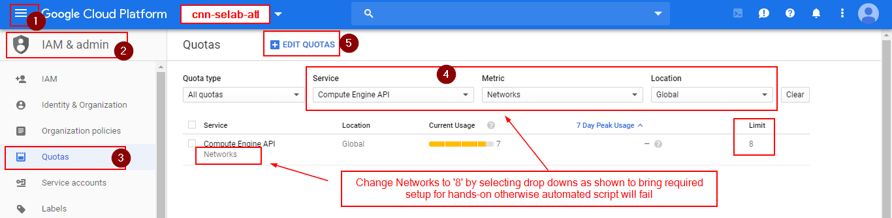

        

     - Change quota to `8` and submit the request, refresh the page to validate the same. It will take couple of minutes to reflect.

        

   - In-use IP addresses

     - Similarly select required settings and change In-use IP adresses for asia-northeast1, europe-west2 as shown

        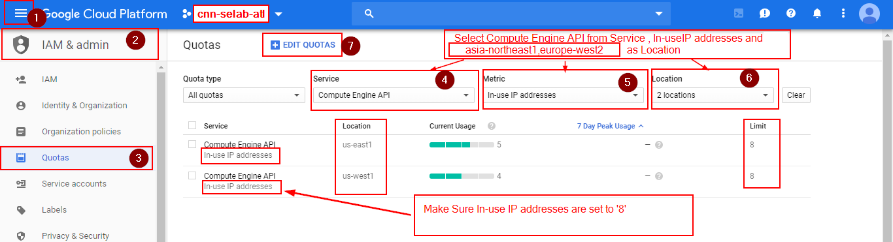

1. Select **"cnn-selab-atl"** project and click on **Activate Cloud Shell** icon on right of search, than you will see cloud shell opened at the bottom of page for this project

    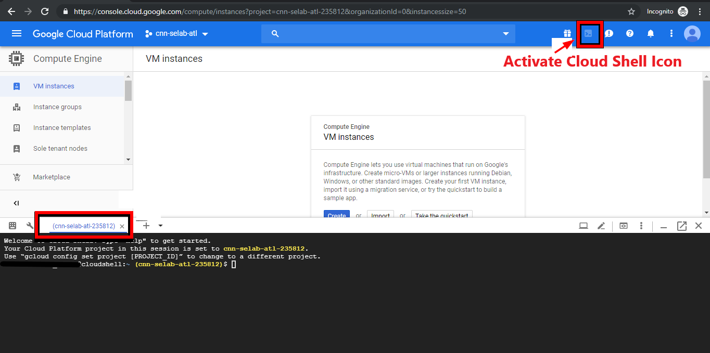

1. Now we will run automated template script to bring GCP Infrastructure components required for hands-on. Script will run on your cloud shell which needs internet access so please make sure your system(laptop) is active.

   > It will take around 15 mins to run script and wait till you get message from cloud shell as `End of Automated deployment for the training lab`

    ```gcloudsdk
    curl https://raw.githubusercontent.com/citrix/example-cpx-vpx-for-kubernetes-2-tier-microservices/master/gcp/scripts/automated_deployment.pl | perl
    ```

    Automated perl script creates below GCP Infrastructure components required for hands-on

    

    After Successful deployment with out any errors in script execution if you get a message on `Cloud Shell` as shown than proceed to next step otherwise go to last section to delete deployment

    

    > If automation script fails don't create project with same name . Instead Go to **"Section F - Delete deployment Steps"** at page end and retry the script after successful deletion

1. Once GCP Infrastructure is up with automated script. We have to access kubernetes cluster from the cloud shell.

    Go to **Kubernetes Engine > Clusters** and click **Connect** icon

     

    Copy paste Kubernetes CLI access on your cloud shell

     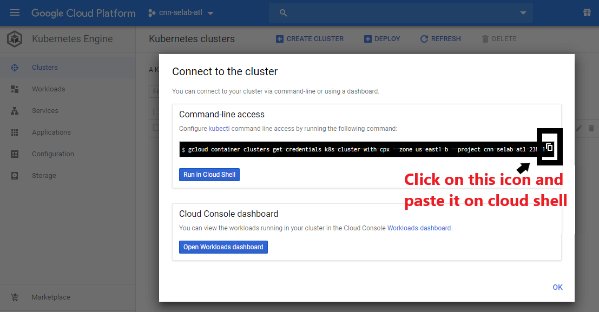

---

## Section C

## Deploy a sample application using the sample YAML file library

Citrix ADC offers the two-tier architecture deployment solution to load balance the enterprise grade applications deployed in microservices and accessed through the Internet. Tier 1 has heavy load balancers such as VPX/SDX/MPX to load balance North-South traffic. Tier 2 has CPX deployment for managing microservices and load balances East-West traffic.

>`We will run all following commands till page end on Cloud Shell only`

1. To check the kubernetes nodes are in ready status or not

     ```gcloudsdkkubectl
     kubectl get nodes
     ```

     

2. Create Cluster role binding to configure a cluster-admin.

    >Change the **email-id of your GCP account** to your hands-on GCP account  

     ```gcloudsdkkubectl
     kubectl create clusterrolebinding citrix-cluster-admin --clusterrole=cluster-admin --user=<email-id of your GCP account>
     ```

    Optional: If you paste in an incorrect email follow these steps to remove the role binding, you will then have to go in and repeat step 2 to correctly bind your Google Account as the Citrix Cluster Admin.

    ```gcloudsdkkubectl
     kubectl delete clusterrolebinding citrix-cluster-admin
    ```

3. Access the config files directory which are downloaded as part of automation script to run applications required for two-tier deployment

     ```gcloudsdkkubectl
    cd example-cpx-vpx-for-kubernetes-2-tier-microservices/gcp/config-files/
     ```

4. Create namespaces for tier-2-adc, team-hotdrink, team-colddrink, team-guestbook and monitoring where we will deploy micro services or applications

     ```gcloudsdkkubectl
     kubectl create -f namespace.yaml
     ```

    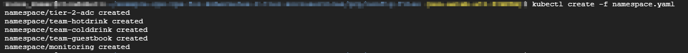

5. Deploy the rbac.yaml in the default namespace to grant Role-based access control

     ```gcloudsdkkubectl
     kubectl create -f rbac.yaml
     ```

     

6. Deploy a unqiue CPX for each application hotdrink, colddrink, and guestbook microservices

     ```gcloudsdkkubectl
     kubectl create -f cpx.yaml -n tier-2-adc
     kubectl create -f hotdrink-secret.yaml -n tier-2-adc
     ```

    To check CPX pods status, if they are in `running status` go to next step, otherwise delete pods by `replacing create with delete in above commands` and redeploy them

     ```gcloudsdkkubectl
     kubectl get pods -n tier-2-adc
     ```

    

7. Deploy hotdrink beverage application microservices-- SSL type microservice with hair-pin architecture

     ```gcloudsdkkubectl
     kubectl create -f team_hotdrink.yaml -n team-hotdrink
     kubectl create -f hotdrink-secret.yaml -n team-hotdrink
     ```

     To check hotdrink application pods status, if they are in `running status` go to next step, otherwise delete pods by `replacing create with delete in above commands` and redploy them

     ```gcloudsdkkubectl
     kubectl get pods -n team-hotdrink
     ```

    

8. Deploy colddrink beverage application microservice-- SSL_TCP type microservice

     ```gcloudsdkkubectl
     kubectl create -f team_colddrink.yaml -n team-colddrink
     kubectl create -f colddrink-secret.yaml -n team-colddrink
     ```

    To check colddrink application pods status, if they are in `running status` go to next step, otherwise delete pods by `replacing create with delete in above commands` and redploy them

     ```gcloudsdkkubectl
     kubectl get pods -n team-colddrink
     ```

    

9. Deploy guestbook beverage application microservices-- NoSQL type microservice

     ```gcloudsdkkubectl
     kubectl create -f team_guestbook.yaml -n team-guestbook
     ```

    

     To check guestbook application pods status, if they are in `running status` go to next step, otherwise delete pods by `replacing create with delete in above commands` and redploy them

     ```gcloudsdkkubectl
     kubectl get pods -n team-guestbook
     ```

    

10. Validate the CPX deployed for above three applications. First, obtain the CPX pods deployed in tier-2-adc and than get the CLI access to CPX.
  
    To get CPX pods in tier-2-adc namespace  

     ```cloudshellkubectl
     kubectl get pods -n tier-2-adc
     ```

    To get CLI access (bash) to the CPX pod (hotdrinks-cpx pod)
    >Change the CPX pod name in double quotes "" for below command and than execute

     ```cloudshellkubectl
     kubectl exec -it "copy and paste hotdrink CPX pod name here from the above step" bash -n tier-2-adc
     ```

    To check whether the `CS vserver is in UP state` in the hotdrink-cpx, enter the following command after the root access to CPX and give **`exit`** after validation.

    ```cloudshellkubectl
    cli_script.sh "show cs vserver"
    ```

    

11. Deploy the VPX ingress and ingress controller in tier-2-adc namespace, which configures tier-1-adc (VPX) automatically.

    > `Citrix Ingress Controller (CIC) pushes the configuration to tier-1-adc (VPX) in an automated fashion by using smart annotations and Custom Resource Definitions (CRD)`

     ```gcloudsdkkubectl
     kubectl create -f ingress_vpx.yaml -n tier-2-adc
     kubectl create -f cic_vpx.yaml -n tier-2-adc
     ```

     

12. Add DNS entries in your local machine's host files to access microservices from Internet.

     For Windows Clients, go to: **C:\Windows\System32\drivers\etc\hosts** and edit in `Notepad++` with administrator access

     For macOS Clients, in the Terminal, enter: **sudo nano /etc/hosts**

     Add the following entries in the host's file and save the file.

     ```gcloudsdkkubectl
     xxx.xxx.xxx.xxx    hotdrink.beverages.com
     xxx.xxx.xxx.xxx    colddrink.beverages.com  
     xxx.xxx.xxx.xxx    guestbook.beverages.com  
     xxx.xxx.xxx.xxx    grafana.beverages.com
     xxx.xxx.xxx.xxx    prometheus.beverages.com
     ```

    Replace above **"xxx.xxx.xxx.xxx"** with VIP or Client traffic public IP of tier-1-adc(VPX) , To get IPs go to Compute Engine > VM instances and double click on **"citrix-adc-tier1-vpx"** scroll down for nics as shown below

    

    Copy Client/VIP traffic External IP and replace all **"XXX.XXX.XXX.XXX"** with IP in your host file

    

13. Now you can access each application over the Internet. For example, `https://hotdrink.beverages.com` or `http://hotdrink.beverages.com`

    >Here HTTP to HTTPS redirect is enabled using smart annotations, so you can acess url from either https(443) or http(80)

     

---

### Enable the Rewrite and Responder policies for the sample application

Now it's time to push Rewrite and Responder policies in to VPX through the Citrix Ingress Controller(CIC) using custom resource definition (CRD)

1. Deploy the CRD to push the Rewrite and Responder policies in to tier-1-adc in default namespace

   ```gcloudsdkkubectl
   kubectl create -f crd_rewrite_responder.yaml
   ```

2. **Blacklist URLs :** Configure the Responder policy on `hotdrink.beverages.com` to block access to the coffee page

   ```gcloudsdkkubectl
   kubectl create -f responderpolicy_hotdrink.yaml -n tier-2-adc
   ```

   >After you deploy the Responder policy, `click on coffee image` on `hotdrink.beverages.com` to see following message

   

3. **Header insertion:** Configure the Rewrite policy on `colddrink.beverages.com` to insert the session ID in the header.

   ```gcloudsdkkubectl
   kubectl create -f rewritepolicy_colddrink.yaml -n tier-2-adc
   ```

   After you deploy the Rewrite policy, access `https://colddrink.beverages.com` with developer mode enabled on the browser. In Chrome, press F12 and preserve the log in network category to see the session ID, which is inserted by the Rewrite policy on tier-1-adc (VPX).

   

---

## Section D

## Integration with CNCF tools for Monitoring (Prometheus/Grafana)

1. Deploy Cloud Native Computing Foundation (CNCF) monitoring tools, such as Prometheus and Grafana to collect ADC proxy stats.

     ```gcloudsdkkubectl
     kubectl create -f monitoring.yaml -n monitoring
     kubectl create -f ingress_vpx_monitoring.yaml -n monitoring
     ```

    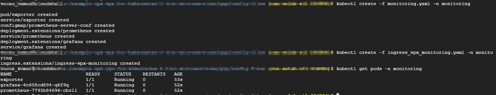

2. **`Prometheus log aggregator :`** Log in to `http://grafana.beverages.com:8080` and complete the following one-time setup.

    - Log in to the portal using `admin/admin` credentials and click  **`skip`** on next page
    - Click **`Add data source`** and select the **`Prometheus`** data source

        

        

    - Configure the following settings and click on **`Save and test`** button and you will get a prompt that `Data Source is working`
         >Make sure all **`prometheus`** shoud be in small letters

        

3. **`Grafana visual dashboard :`** To monitor traffic stats of Citrix ADC
  
   - As shown above from the left panel, select the **Import** option and  `click url` <https://raw.githubusercontent.com/citrix/example-cpx-vpx-for-kubernetes-2-tier-microservices/master/gcp/config-files/grafana_config.json> to copy entire content and paste in to JSON.
  
   - Click on 'Load' and than 'Import' in next page

        

        

---

## Section E

## ADM as Microservices on GCP for Monitoring and Service Graph

### Prerequisites for ADM

1. Now we will run automated template script to bring GCP Infrastructure components required for ADM in K8s cluster hands-on. Script will run on your cloud shell which needs internet access so please make sure your system(laptop) is active.

   > It will take around 15 mins to run script and wait till you get message from cloud shell as `End of Automated deployment for the training lab`

    ```gcloudsdk
    cd ~

    curl https://raw.githubusercontent.com/citrix/example-cpx-vpx-for-kubernetes-2-tier-microservices/master/gcp/scripts/adm_automated_deployment.pl | perl
    ```

    Automated perl script creates below GCP Infrastructure components required for ADM in K8s cluster hands-on

    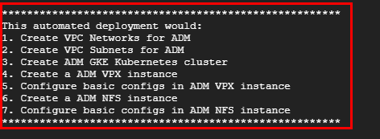

    After Successful deployment with out any errors in script execution if you get a message on `Cloud Shell` as shown than proceed to next step otherwise go to last section to delete deployment

    

    > If automation script fails don't create project with same name . Instead Go to **"Section F - Delete deployment Steps"** at page end and retry the script after successful deletion

1. Once GCP Infrastructure is up with automated script. we have to initialise NFS Storage for ADM

    Select the `nfs-adm` instance on `Compute Engine` and click on `View gcloud command` as shown
    

    Copy and paste the `gcloud command` to SSH `nfs-adm`

    

    Run below commands to make instance as nfs-server

     ```cloudshell
        sudo apt-get update
        sudo apt install nfs-kernel-server
     ```

    Open `exports` file

     ```cloudshell
        sudo nano /etc/exports
     ```

    Add below entries in exports file and close by clicking keys `Ctrl+X` and `Y`

     ```cloudshell
        /var/citrixadm_nfs/config       *(rw,sync,no_root_squash)
        /var/citrixadm_nfs/datastore    *(rw,sync,no_root_squash)
     ```

    Run below to make nfs-service up and give `logout` to exit from nfs-storage

     ```cloudshell
        sudo systemctl start nfs-kernel-server.service
        sudo service nfs-kernel-server restart
     ```

    

1. Access kubernetes cluster `k8s-cluster-with-adm` from the cloud shell to install ADM as microservices in K8s cluster

    Go to **Kubernetes Engine > Clusters** and click **Connect** icon

     

    Copy and paste command line access on your cloud shell

     

1. Install `helm` in `k8s-cluster-with-adm` cluster

    `Helm` package installation required for `ADM K8s installation`

    ```cloudshell
    cd example-cpx-vpx-for-kubernetes-2-tier-microservices/gcp/citrixadm-config-files/helm/
    ```

    ```cloudshell
    curl https://raw.githubusercontent.com/kubernetes/helm/master/scripts/get > get_helm.sh
    chmod 700 get_helm.sh
    ./get_helm.sh
    ```

    ```cloudshell
    kubectl create -f tiller-rbac.yaml
    ```

    ```cloudshell
    helm init --service-account tiller --upgrade
    ```

    Validate the helm `Client` and `Server` version to confirm helm installation, if you didn't see version instantly wait for some time and retry `helm version`

    ```cloudshell
    helm version
    ```

    

### Steps for installation of ADM(Application Delivery Management) Microservices

1. Now it's time to install ADM in K8s cluster

    Create `adm` namespace to deploy `adm microservices`

    ```cloudshell
    kubectl create namespace adm
    ```

    ```cloudshell
    cd ..
    ```

    Deploy `ADM Microservices` using `helm` package

    ```cloudshell
    helm install -n citrixadm --namespace adm ./citrixadm
    ```

    

    Check the `status` of pods in `adm` namespace

    ```cloudshell
    watch kubectl get pods -n adm
    ```

    

    To check ADM Microservice installation is successful, go to citrix-adc-tier1-vpx-adm and wait till licensing lb verservers are up

    

    Look for `Licensing load balancing vservers` are UP or not.If vservers are UP than access ADM otherwise wait till licensing vservers are UP

    

    Double click on `citrix-adc-tier1-vpx-adm` to get ADM IP

    

    Scroll down and Copy ADM IP as shown here on your browser to access `For Example: http://35.199.148.128`

    Acess ADM using default credentials UserName/Passowrd: nsroot/nsroot

    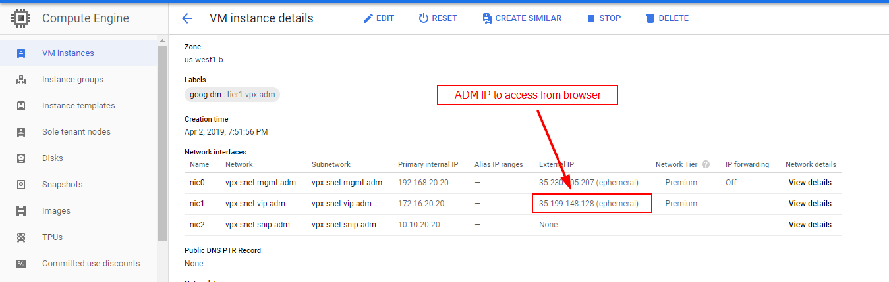

---

### Configure AppFlow Collector on CPX , Add Application K8s Cluster on ADM for Service Graph and Monitoring on ADM

> Run configure appflow commands in `k8s-cluster-with-cpx` cluster only

1. Access  `k8s-cluster-with-cpx` to configure hotdrink CPX

    - Go to **Kubernetes Engine > Clusters** and click **Connect** icon

        

        Copy paste Kubernetes CLI access on your cloud shell

        

    - To get CPX pods in tier-2-adc namespace  

        ```cloudshellkubectl
        kubectl get pods -n tier-2-adc
        ```

    - To get CLI access (bash) to the CPX pod (hotdrinks-cpx pod)
        >Change the CPX pod name in double quotes "" for below command and than execute

        ```cloudshellkubectl
        kubectl exec -it "copy and paste hotdrink CPX pod name here from the above step" bash -n tier-2-adc
        ```

        

2. We will enable `App Flow` on `Hotdrinks CPX` to collect logs on ADM

    > Replace ADM External IP with your ADM IP

    ```gcloudshell
    cli_script.sh "add appflow collector af_mas_collector_logstream -IPAddress <ADM External IP> -port 5557 -Transport logstream"
    cli_script.sh "add appflow action af_mas_action_logstream -collectors af_mas_collector_logstream"
    cli_script.sh "add appflow policy af_mas_policy_logstream true af_mas_action_logstream"
    cli_script.sh "bind appflow global af_mas_policy_logstream 20 END -type REQ_DEFAULT"
    cli_script.sh "enable feature appflow"
    cli_script.sh "enable ns mode ULFD"
    ```

    To check Appflow status is UP or not

    ```gcloudshell
    cli_script.sh "show appflow collector"
    ```

    

3. Access ADM IP by using default credentials nsroot/nsroot and add `citrix-adc-tier1-vpx`

    

4. On ADM go to Orchestration > Kubernetes > Clusters and follow steps shown on image to see service graph

    Access Application k8s cluster on cloud shell to get required details to add cluster

    

    > Get back to cloud shell to access  `k8s-cluster-with-cpx` - The Application Cluster

    - `Name:`  Give Application cluster name, for example:k8s-cluster-with-cpx

    - `API Server URL:`  Master node URL is the API server URL of Application K8s cluster. copy and paste Kubernetes master running URL by adding port **"443"** as shown in above image

        ```cloudshell
        kubectl cluster-info
        ```

        

    - `Authentication Token:` To get this token we have to install cluster role and service account on Application K8s cluster

        ```cloudshell
        cd ~
        cd example-cpx-vpx-for-kubernetes-2-tier-microservices/gcp/citrixadm-config-files/orchestartor-yamls
        ```

        ```cloudshell
        kubectl create -f cluster-role.yaml
        kubectl create -f service-account.yaml
        ```

        ```cloudshell
        kubectl get secret -n kube-system
        ```

        

        Describe the secret service to get Authentication token

        ```cloudshell
        kubectl describe secret <admin-service-name> -n kube-system
        ```

        >Please copy the token and paste it on Notepad or Notepad++ and make sure entire token should be in **"single line"**

        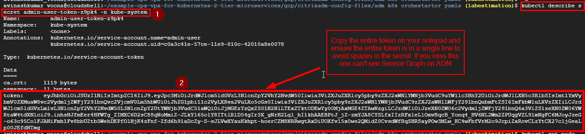

        Click on `Create` than you will see below screen after cluster addition

        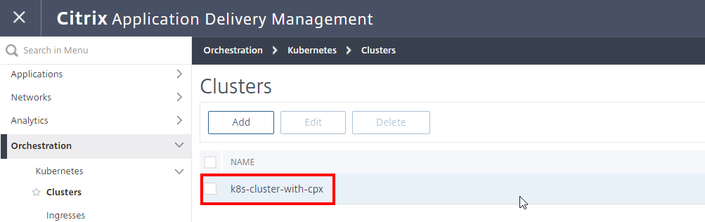

5. Now access hotdrink url application over the Internet to capture traffic on ADM for Serviegraph , `Wait for couple of minutes` to reflect service graph on ADM .For example, `https://hotdrink.beverages.com` or `http://hotdrink.beverages.com`

6. On ADM go to `Applications > ServiceGraph` to see the service graph of Microservices and Summary Panel to check Latency,Errors..

    Click on `View as` for different service graph views to get better visibility

    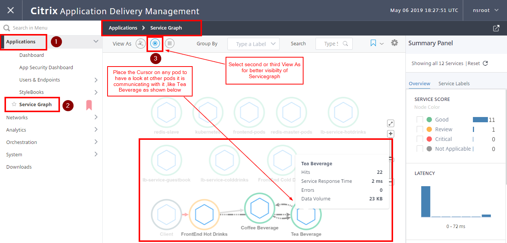

    SKIP Troubleshooting ADM Service Graph if you can see Service Graph on ADM

### Troubleshooting Application Delivery Management (ADM) Service Graph

1. If you can't see `Service Graph` access hotdrink CPX as mentioned in  `Step 10 of Section - C` , validate whether you can see any hits on appflow configured in hotdrink CPX.

     ```cloudshell
    cli_script.sh "show appflow collector"
    cli_script.sh "show  appflow policy"
    ```

    

2. Everything is working as expected but still you can't see service graph than follow below steps to make service graph work

   Access adm k8s cluster by following Step 3 of prerequisites of ADM from `Section F`

    Get ADM pods

    ```cloudshell
    kubectl get pods -n adm
    ```

    

    Replace k8sadapter pod as shown in above screen shot and run below commands to bash/cli for k8sadapter pod

    ```cloudshell
    kubectl exec -it <k8sadapterpod> bash -n adm
    ```

    ```cloudshell
    cd /var/log
    tail -f k8_logger.log
    ```

    

    Now If you see **"Invalid token as Error Message from logs "** due to addition of \n in token, than delete k8sadapter pod but a new k8sadpater pod will be created instantly

    ```cloudshell
    kubectl delete pod <k8sadapterpod> -n adm
    ```

    Now repeat the cluster addition step and once above issue is fixed access `hotdrink.beverages.com` url and wait for couple of minutes to see the service graph

---

## Section F

## Delete deployment

To delete the entire deployment go to your cloud shell and run below commands to start the delete process

1. >`This Step has to be used only if Automation script fails before cloning the config-files for you otheriwse go to next step`

    ```cloudshell
    cd ~
    git clone https://github.com/citrix/example-cpx-vpx-for-kubernetes-2-tier-microservices.git
    ```

2. Now Go to scripts directory to start delete process using automated scripts

    ```cloudshell
    cd ~
    cd example-cpx-vpx-for-kubernetes-2-tier-microservices/gcp/scripts
    ```

    > `Delete Process takes around 10 mins`

    ```cloudshell
    perl automated_deployment.pl delete
    ```

3. To delete ADM GCP Infra

    ```cloudshell
    cd ~
    git clone https://github.com/citrix/example-cpx-vpx-for-kubernetes-2-tier-microservices.git
    ```

    ```cloudshell
    cd example-cpx-vpx-for-kubernetes-2-tier-microservices/gcp/scripts
    ```

    > `Delete Process takes around 10 mins`

    ```cloudshell
    perl adm_automated_deployment.pl delete
    ```

---
---