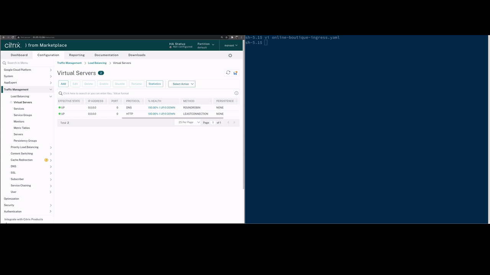
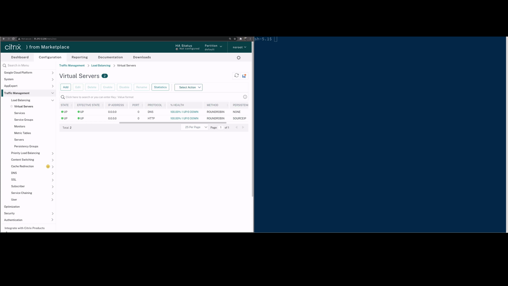

# Network Persona

## The Setup  


The diagram above illustrates the environment at a high-level. There is an Anthos GKE cluster in which the application is deployed via Anthos Config Management, with an external Citrix VPX to control ingress traffic into the cluster. This Citrix VPX appliance is managed and configured by me as a member of the Network team.  

As a network admin, I am responsible for providing adequate networking support for application teams, while ensuring traffic flows follow corporate security standards. Network ingress to applications needs to scale with the application requirements, and this now includes workloads running in Anthos GKE.

## The Why  

Applications deployed into a Citrix Integrated Google Anthos Platform allows developers to manage their application's network configuration requirements via annotations within Kubernetes manifests. The Citrix controller deployed within the GKE cluster configures the upstream VPX that I manage, as the underlying application infrastructure within Kubernetes changes. This level of automation allows the application teams to scale and change their applications as needed, without requiring resources from the network team in every case. The VPX and network infrastructure remain in the domain of the network team, while allowing the application configurations to remain in the domain of the developer and application teams.

## The How  

---
**NOTE**
In this demonstration, the kubectl binary and local files are used to deploy the application. In production scenarios, other deployment methods would likely be in place, such as a GitOps approach as provided from Google Anthos Configuration Management. From the network team's perspective the application would already be deployed and managed by the developer/application teams, but for demonstration purposes of the Network persona we will do the application deployment.  

---

First I will deploy the online boutique sample application with a simple ingress object. Following the deployment, I will modify the ingress object to perform tasks such as forcing users to only leverage SSL. Finally we will change the load balancing type and the persistence type. These steps help to outline the control application teams have over the load balancing of traffic into the application, without needing to engage with my team to make the necessary changes to the VPX.

- Deploy the application and a simple ingress object ... first clone the git repository that the automation created, then deploy the application **Note that you will need to replace the <github-org> and <repo> tags according to your deployment of this lab** 
  ```shell
  sh-5.1$ git clone git@github.com:<github-org>/<repo>.git
  Cloning into '<repo>'...
  remote: Enumerating objects: 301, done.
  remote: Counting objects: 100% (301/301), done.
  remote: Compressing objects: 100% (283/283), done.
  remote: Total 301 (delta 102), reused 0 (delta 0), pack-reused 0
  Receiving objects: 100% (301/301), 33.28 KiB | 2.38 MiB/s, done.
  Resolving deltas: 100% (102/102), done.
  sh-5.1$ cd <repo>/online-boutique/
  sh-5.1$ kubectl create namespace demoapp
  sh-5.1$ kubectl apply -f online-boutique.yaml -n demoapp
  sh-5.1$ kubectl get pods -n demoapp 
  NAME                                     READY   STATUS    RESTARTS   AGE
  adservice-5844cffbd4-c8b66               1/1     Running   0          52s
  cartservice-fdc659ddc-bgzzv              1/1     Running   0          54s
  checkoutservice-64db75877d-8qfp5         1/1     Running   0          56s
  currencyservice-9b7cdb45b-xhs5q          1/1     Running   0          53s
  emailservice-64d98b6f9d-xxr4v            1/1     Running   0          56s
  frontend-76ff9556-kzjkh                  1/1     Running   0          55s
  paymentservice-65bdf6757d-m6jn4          1/1     Running   0          54s
  productcatalogservice-5cd47f8cc8-2v9bh   1/1     Running   0          54s
  recommendationservice-b75687c5b-z7lk7    1/1     Running   0          55s
  redis-cart-74594bd569-hkk8x              1/1     Running   0          52s
  shippingservice-778554994-fsnsp          1/1     Running   0          53s
  sh-5.1$ cat ingress.yaml 
  # #Specify the ingress resource
  apiVersion: networking.k8s.io/v1
  kind: Ingress
  metadata:
    name: online-boutique-ingress
    annotations:
    kubernetes.io/ingress.class: "tier-1-vpx"
    ingress.citrix.com/insecure-termination: "allow"
  spec:
    rules:
    - host: <ip-address>.nip.io
      http:
        paths:
        - path: /
          pathType: Prefix
          backend:
            service:
              name: frontend
              port: 
                number: 80
  sh-5.1$ kubectl apply -f ingress.yaml -n demoapp
  ingress.networking.k8s.io/online-boutique-ingress created
  ```

  

- Reconfigure the ingress object to only allow for SSL traffic using the default certificate (configured by the platform team) and ssl redirect
  ```shell
    sh-5.1$ cat ingress.yaml 
    # #Specify the ingress resource
    apiVersion: networking.k8s.io/v1
    kind: Ingress
    metadata:
      name: online-boutique-ingress
      annotations:
      kubernetes.io/ingress.class: "tier-1-vpx"
      ingress.citrix.com/insecure-termination: "redirect"
      ingress.citrix.com/secure-port: "443"
    spec:
      tls:
      - secretName:
      rules:
      - host: <ip-address>.nip.io
        http:
          paths:
          - path: /
            pathType: Prefix
            backend:
              service:
                name: frontend
                port: 
                  number: 80
    sh-5.1$ kubectl apply -f ingress.yaml -n demoapp
    ingress.networking.k8s.io/online-boutique-ingress configured
  ```
    

  - Reconfigure the Ingress object to change the load balancing type and persistence type
  ```shell
  sh-5.1$ cat ingress.yaml 
  # #Specify the ingress resource
  apiVersion: networking.k8s.io/v1
  kind: Ingress
  metadata:
    name: online-boutique-ingress
    annotations:
    kubernetes.io/ingress.class: "tier-1-vpx"
    ingress.citrix.com/insecure-termination: "redirect"
    ingress.citrix.com/secure-port: "443"
    ingress.citrix.com/lbvserver: '{"frontend":{"lbmethod":"ROUNDROBIN", "persistenceType":"SOURCEIP"}}'
  spec:
    tls:
    - secretName:
    rules:
    - host: <ip-address>.nip.io
      http:
        paths:
        - path: /
          pathType: Prefix
          backend:
            service:
              name: frontend
              port: 
                number: 80
    sh-5.1$ kubectl apply -f ingress.yaml -n demoapp
    ingress.networking.k8s.io/online-boutique-ingress configured
  ```
    

Next, to demonstrate the added visibility that the network team has into application deployments, I will scale up my application. 
  ```shell
  sh-5.1$ kubectl scale deployment frontend --replicas=3 -n demoapp
  deployment.apps/frontend scaled
  sh-5.1$ kubectl get pods -l app=frontend
  NAME                      READY   STATUS    RESTARTS   AGE
  frontend-76ff9556-9rvjq   1/1     Running   0          36s
  frontend-76ff9556-gdm48   1/1     Running   0          36s
  frontend-76ff9556-kzjkh   1/1     Running   0          17m
  ```
  


To see more configuration options, review the [supported annotations](https://github.com/citrix/citrix-k8s-ingress-controller/blob/master/docs/configure/annotations.md) documentation. 


## Summary  

As a network admin, my primary focus here is to provide ingress networking support for deployed applications in a manner that is inline with corporate standards. In this case the team leverages Citrix VPX for all ingress traffic. This architecture with the Citrix Ingress Controller allows application teams to deploy and manage applications in a cloud-native way on Google Anthos, while orchestrating the necessary changes automatically with the ingress load balancer.
- Ingress control by the application teams, while allowing the network team to have ingress load balancers configured with sensible defaults accordingly
- Load balancing infrastructure maintained by my team while allowing control from the app teams
- Visibility of automatic network changes while the underlying app infrastructure changes in Kubernetes
- All teams are on the same page while troubleshooting connectivity issues
