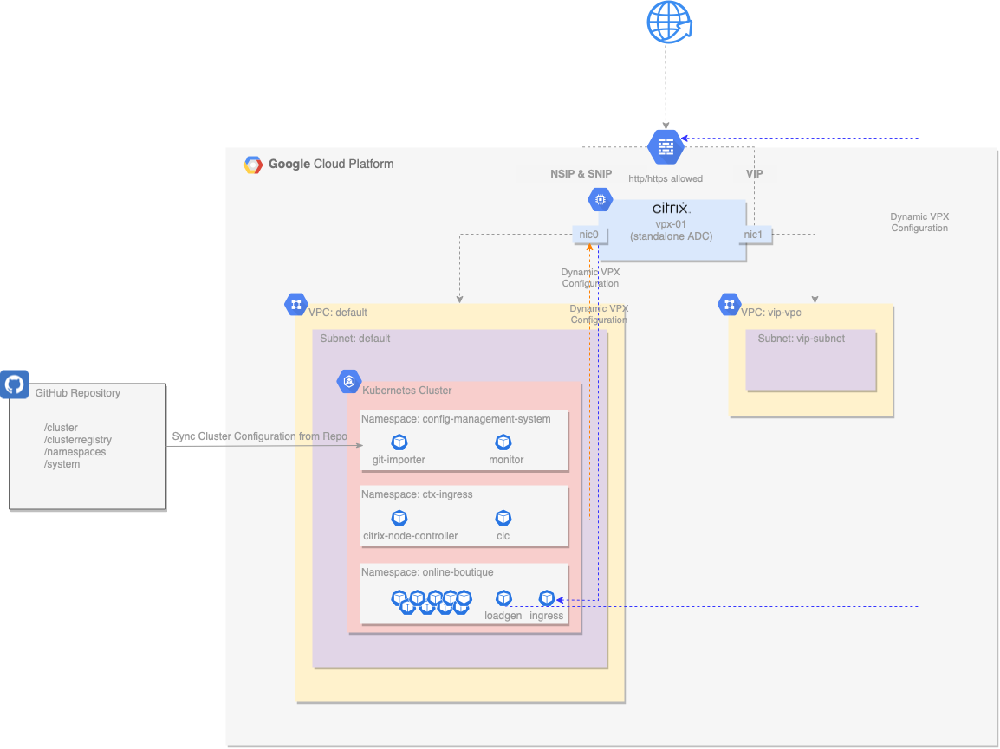
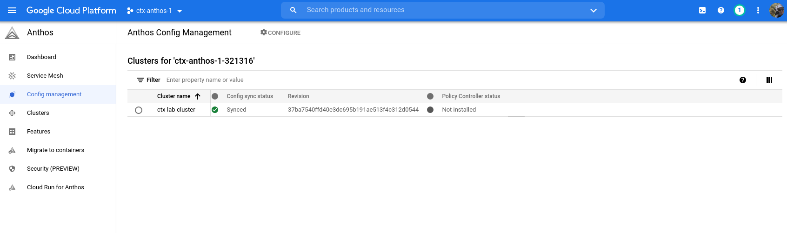

# Platform Engineer

## The Setup



The diagram above illustrates the environment at a high-level. There is an Anthos GKE cluster managed from Anthos Configuration Management, with an external Citrix VPX to control ingress traffic into the cluster. This Citrix VPX appliance is managed by the network team and adheres to corporate application delivery standards.  

As a platform engineer, I am responsible for building and managing the life cycle of Anthos and ensuring that the platform is available and complies to my corporate standards. As part of ensuring platform availability, having a secure and scalable networking solution that can scale with the application, regardless of where the application is running is critical. I continuously implement the capabilities of the Anthos platform so it is ready for use by the application owners.

## The Why
Deploying Citrix on Google Anthos Platform allows me, the platform engineer, to get secure and detailed insight into my platform's application network and related performance. It also allows me to enable developers to take control of the deployments to set specific network configurations using simple annotations within their kubernetes manifests. It allows me to achieve greater agility with operational and features consistency across microservices-based applications, while gaining actionable insight and accelerating troubleshooting abilities across the environment through a single pane of glass.

## The How

As a platform engineer, I own the Git repository that maintains the configuration for the Anthos GKE clusters with Google Anthos Configuration Management. As a result of using this solution, I am responsible for ensuring that the necessary Citrix manifests are present in the git repository and are configured in accordance with my Security and Network teams requirements. 

In this demonstration, there are two primary Citrix components that I am responsible for ensuring operate correctly: 
- Citrix Ingress Controller (CIC) which automatically configures Citrix ADC based on the Ingress resource configuration
- Citrix Node Controller (CNC) which creates network between the Kubernetes cluster and Citrix ADC controller

The two above components will ensure that my Anthos GKE cluster is integrated with the appropriate upstream Citrix VPX. These components are comprised of a few Kubernetes manifests that must reside in the Git repo in order for Anthos Configuration Management to deploy them.

In this demonstration environment, a dedicated GitHub repo is created for ACM, and the following content is automatically placed into that repository within an `acm` folder. A dedicated namespace called `ctx-ingress` is created to hold the core Citrix deployments, while other system level manifests are located in the `cluster` directory of the ACM repository. 
- Deployments
  - https://github.com/<github_owner>/<github_reponame>/acm/namespaces/ctx-ingress/cic-deployment.yaml
  - https://github.com/<github_owner>/<github_reponame>/acm/namespaces/ctx-ingress/cnc-deployment.yaml
- Config Maps
  - https://github.com/<github_owner>/<github_reponame>/acm/namespaces/ctx-ingress/cnc-configmap.yaml
- Service Accounts
  - https://github.com/<github_owner>/<github_reponame>/acm/namespaces/ctx-ingress/cnc-service-account.yaml
  - https://github.com/<github_owner>/<github_reponame>/acm/namespaces/ctx-ingress/cpx-ingress-serviceaccount.yaml
- Roles
  - https://github.com/<github_owner>/<github_reponame>/acm/cluster/cnc-clusterrole.yaml
  - https://github.com/<github_owner>/<github_reponame>/acm/cluster/cpx-clusterrole.yaml
- Rolebindings
  - https://github.com/<github_owner>/<github_reponame>/acm/cluster/cnc-clusterrolebinding.yaml
  - https://github.com/<github_owner>/<github_reponame>/acm/cluster/cpx-clusterrolebinding.yaml


### Deployment Validation
With the above manifests being synced to the Anthos GKE cluster; 

- Validate that Anthos Configuration Management pods are running
  ```shell
  $ kubectl get pods -n config-management-system
  NAME                                          READY   STATUS    RESTARTS   AGE
  config-management-operator-75bcc8dcc9-6wtbq   1/1     Running   6          15m
  reconciler-manager-6f64d4f564-7b8wk           2/2     Running   0          7m59s
  root-reconciler-74bfb5576-64c7m               4/4     Running   0          6m49s
  ```
  You can also validate the Anthos Configuration Management status from the Google Cloud Console.   

- Validate that the Citrix Ingress and Node Controller pods are running
  ```shell
  $ kubectl get pods -n ctx-ingress
  NAME                                                              READY   STATUS    RESTARTS   AGE
  cic-k8s-ingress-controller-866f7f6955-62ljr                       1/1     Running   0          14m
  citrix-node-controller-54cb6854bf-mlwlj                           1/1     Running   0          14m
  kube-cnc-router-gke-ctx-lab-cluster-ctx-lab-nodes-0a05c807-7vsj   1/1     Running   0          13m
  kube-cnc-router-gke-ctx-lab-cluster-ctx-lab-nodes-0a05c807-fvms   1/1     Running   0          13m
  ```


## Summary

As a platform engineer my primary purpose is to apply software engineering principles to accelerate software delivery.  My goals are: 

* Ensure application development teams are productive in all aspects of the software delivery life cycle without depending on external teams
* Network teams have access to network resources insight into metrics and usage 
* Security teams have insight into all aspects of the platform and specifically network traffic passing in and out of the platform 

A key aspect of my job function is to ensure a secure, reliable and scalable network solution that allows other teams to effectively execute their tasks. Using Citrix ADC and Citrix Ingress Controller in a Google Anthos platform allows my team to achieve this goal.
