## Prerequisites 
Please review the [PREREQUISITES.md](PREREQUISITES.md) section prior to deploying the environment. It will assist in the creation of a dedicated GCP project to support this Terraform plan.  

## Environment Deployment and Destruction

### Updating Variables
Review and update [terraform.tfvars](terraform.tfvars) to suit your environment. 

| Variable               | Description                                                                                                                                          |
| ---------------------- | ---------------------------------------------------------------------------------------------------------------------------------------------------- |
| GCP Variables          | \-----                                                                                                                                               |
| project                | The Google Project ID to deploy into.                                                                                                                |
| basename               | The base cluster name as a prefix to the GKE cluster creation.                                                                                       |
| zone                   | Specify a specific zone to deploy into to keep costs low. Specifying a region instead will create a regional cluster.                                |
| node\_type             | The node type for each GKE worker node                                                                                                               |
| max\_node\_count       | The maximum number of nodes to autoscale the GKE cluster to. The pool size has a default minimum of 1 node to keep costs low.                        |
| VPX Configuration      | \-----                                                                                                                                               |
| vpx\_image\_path       | The https url to a publicly available VPX image. You may need to create this in your project if this has not already been done.                      |
| vpx\_cidr\_range       | A dedicated private IP range for the VPX 2nd nic to connect to which contains the VIPs.                                                              |
| vpx\_new\_password     | Set a password for the VPX. The GKE cluster will also obtain these values so that it can automatically configure the VPX.                            |
| ACM Repository Details | \-----                                                                                                                                               |
| github\_owner          | The GitHub Owner name in which to create the repository.                                                                                             |
| github\_reponame       | The name of the GitHub repository to upload content to and sync the cluster from.                                                                    |
| github\_email          | The email address of the github account associated with the GITHUB\_TOKEN.                                                                           |
| gke\_hub\_sa\_name     | The service account name for GKE Connect / GKE Hub connectivity.                                                                                     |
| Demo App Details       | \-----                                                                                                                                               |
| demo\_app\_url         | A host name to be used for the demo app. This must either exist in DNS or be configured in your local hosts file for accessing the demo application. For ease of demonstration this value is ignored and app can be accessed directly through {vpx_vip_address}.nip.io. Please change demo_app_url value on [github.tf](github.tf) to use this if required.                                                                                                                                                                      |


### Deployment Timing
While timing varies on a number of factors, with the [PREREQUISITES.md](PREREQUISITES.md) already completed, the following approximate timing applies: 
- Infrastructure Creation - 10-15 minutes
- Infrastructure Destruction - 10-15 minutes

### Deployment Steps

```shell
terraform init
terraform plan 
terraform apply
```
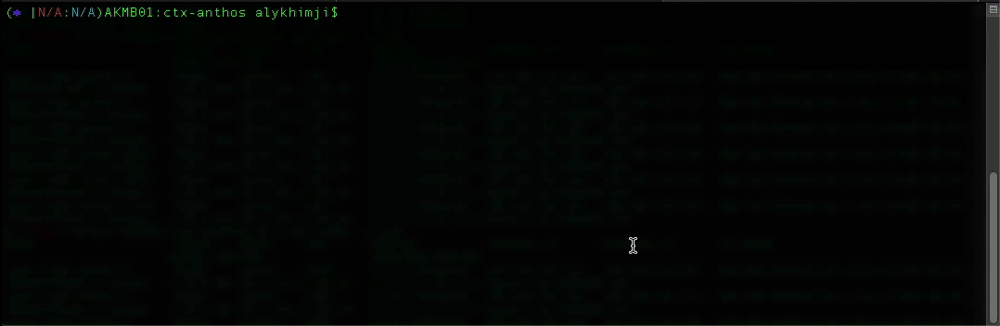


### Destroying the environment

```shell
terraform destroy
```

## Environment Validation
Verify the cluster configuration and VPX configuration once the environment has been deployed. 
- Cluster Login
  ```shell
  $ gcloud container clusters get-credentials ctx-lab-cluster --zone northamerica-northeast1-a --project $GCP_PROJECT
  Fetching cluster endpoint and auth data.
  kubeconfig entry generated for ctx-lab-cluster.
  ```

- Google Anthos Config Management Validation
  ```shell
  $ kubectl get pods -n config-management-system
  NAME                                          READY   STATUS    RESTARTS   AGE
  config-management-operator-75bcc8dcc9-6wtbq   1/1     Running   6          15m
  reconciler-manager-6f64d4f564-7b8wk           2/2     Running   0          7m59s
  root-reconciler-74bfb5576-64c7m               4/4     Running   0          6m49s
  ```

- Citrix Ingress Controller and Node Controller Validation
  ```shell
  $ kubectl get pods -n ctx-ingress
  NAME                                                              READY   STATUS    RESTARTS   AGE
  cic-k8s-ingress-controller-866f7f6955-62ljr                       1/1     Running   0          14m
  citrix-node-controller-54cb6854bf-mlwlj                           1/1     Running   0          14m
  kube-cnc-router-gke-ctx-lab-cluster-ctx-lab-nodes-0a05c807-7vsj   1/1     Running   0          13m
  kube-cnc-router-gke-ctx-lab-cluster-ctx-lab-nodes-0a05c807-fvms   1/1     Running   0          13m
  ```
## Leveraging Anthos Config Management

This automated lab infrastructure creates and manages the Git repo used to sync configurations into the cluster via ACM. In order to add applications or resources, add static manifest files to the [acm_files/](acm_files/) directory and they will be added to the Git repo on a subsequent `terraform apply`. You can also simply add them to the Git repo post deployment in any way you like, but they will be destroyed when the repo and the infrsatructure are removed with `terraform destroy`. 

In order to add templated configuration manifests to the repo, they must be individually added through the terraform `github_repository_file` resource. A decent example of this is the `github_repository_file.cic_deployment` resource in [github.tf](github.tf). 

## Scaleup Application Demo Usage
The online-boutique application is deployed immediately upon cluster creation (although the cluster may need to scale up the node-pool in order to support this application). 
- For ease of demonstration we use nip.io and did the appropriate configuration on [github.tf](github.tf). Our application can be accessed directly from `{vpx_vip_address.nip.io}` without the need of editing our hosts file. The value is provided as output after `terraform apply` takes place. In case you want to use the specified `demo_app_url` value please edit your local hosts file to point the `vpx_vip_address` to the dns name defined in the variable `demo_app_url`. 
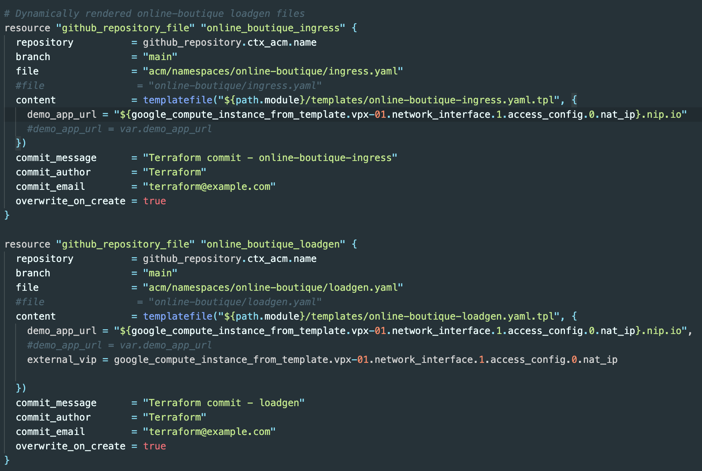

- Validate that the application is functioning correctly. 
    

- In the Citrix NetScaler management interface, identify the online-boutique ingress resource and take notice of the members in the health column (1 member is present at first)  
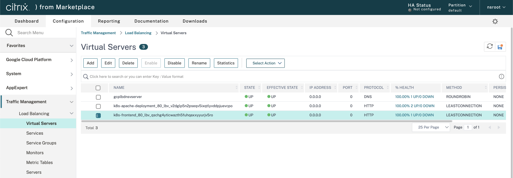  

- In the Citrix NetScaler management interface, also notice that some load is passing through the appliance to the demo app  
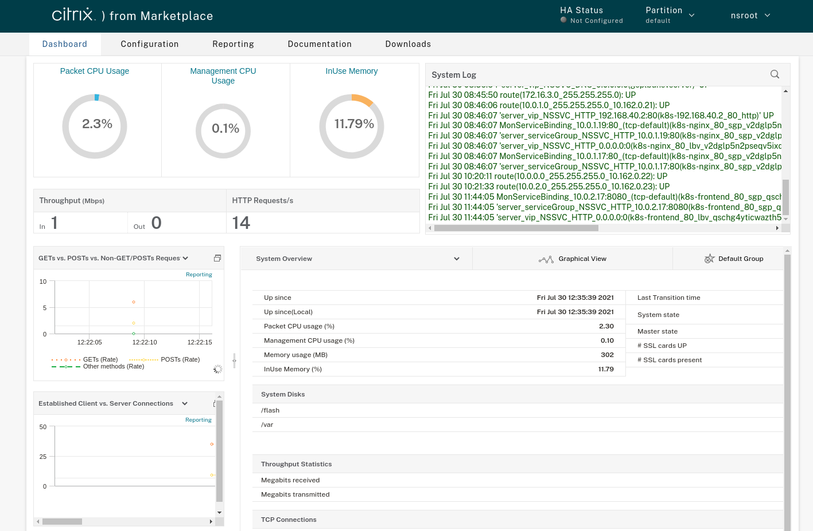 

- The loadgen deployment starts with 10 user sessions by default; Scale this up to 100 by modifying the USERS environment variable value in the Git repo (as this is controlled by ACM)  
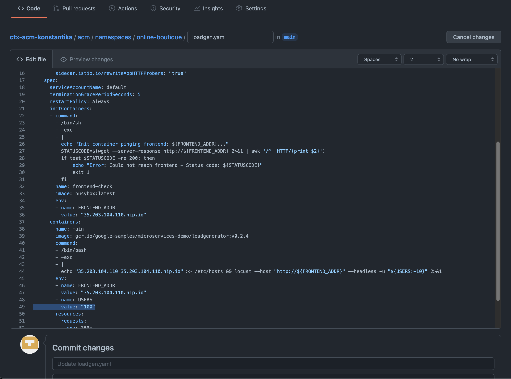  

- Notice that the load will increase inside of the NetScaler dashboard  
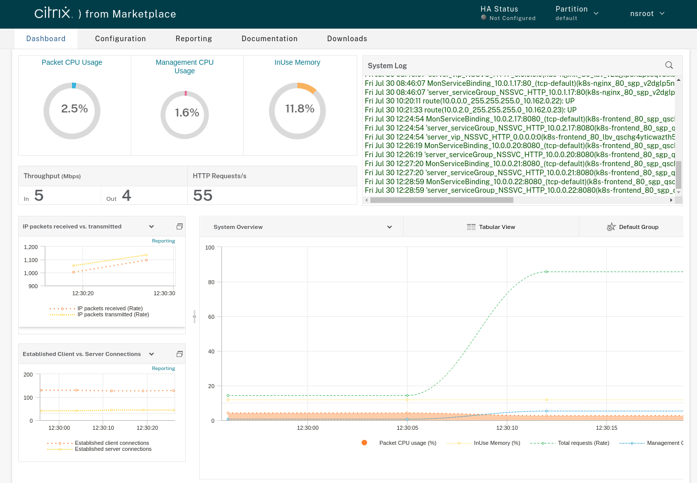  

- Notice that the amount of frontend pods will also increase (after a couple minutes of load being applied)  
```shell
$ kubectl get pods 
NAME                                     READY   STATUS    RESTARTS   AGE
adservice-5844cffbd4-5z9s6               1/1     Running   0          49m
cartservice-fdc659ddc-lk5mz              1/1     Running   0          49m
checkoutservice-64db75877d-k6sk4         1/1     Running   0          49m
currencyservice-9b7cdb45b-8tnns          1/1     Running   0          49m
emailservice-64d98b6f9d-pg6ds            1/1     Running   0          49m
frontend-76ff9556-85tr9                  1/1     Running   0          26s
frontend-76ff9556-f8v55                  1/1     Running   0          49m
frontend-76ff9556-g2kqv                  1/1     Running   0          2m
frontend-76ff9556-kqxkd                  1/1     Running   0          3m1s
loadgenerator-b74f8d7ff-f65l6            1/1     Running   0          4m11s
paymentservice-65bdf6757d-fmjc9          1/1     Running   0          49m
productcatalogservice-5cd47f8cc8-8k75m   1/1     Running   0          49m
recommendationservice-b75687c5b-5cssd    1/1     Running   0          49m
redis-cart-74594bd569-88wh4              1/1     Running   0          49m
shippingservice-778554994-j4799          1/1     Running   0          49m
```  
  
- Notice that the NetScaler has been automatically updated with the amount of members in Service Group tied to the Virtual Server  
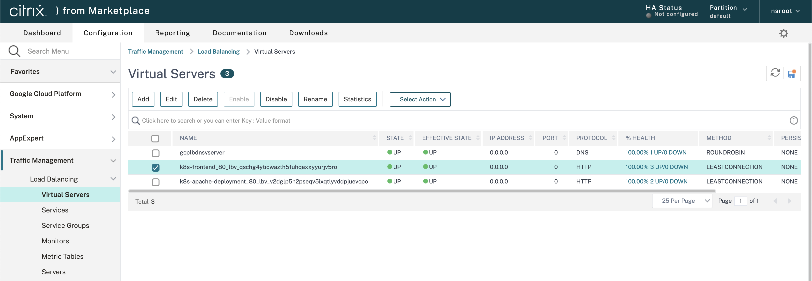
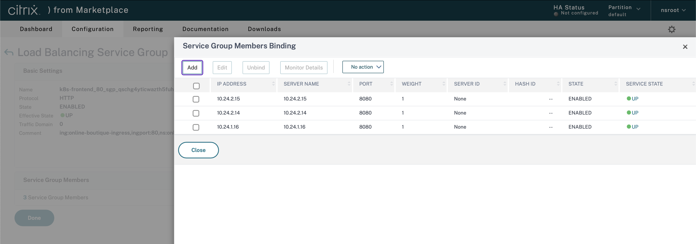  

- Reduce the loadgen user count to 10 again and the system will reduce the amount of frontend pods serving traffic after a few minutes  
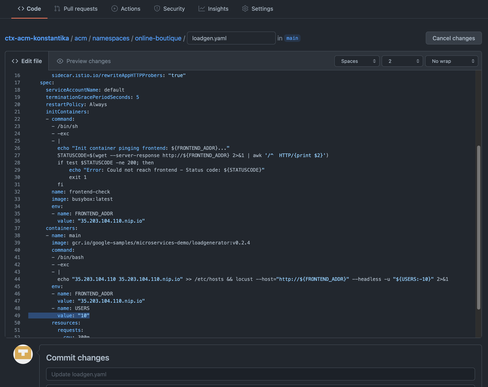  


This concludes the scale-up use case, which included the following scalable components:  
- An autoscaling Google Anthos GKE Cluster  
- A Horizontal Pod Autoscaler  
- A Citrix Ingress Controller  
- A Citrix Node Controller  
- A Citrix Netscaler VPX Application Delivery Controller  


## What's next
In this demo we leveraged Anthos Configuration Management to also have our demo application (online-boutique) deployed automatically for ease of demonstration. You can alter [github.tf](github.tf) to copy all application related yaml files under another folder on GitHub (online-boutique) that won't be tracked from ACM and manually proceed with the deployment and configuration of application using tools like kubectl.
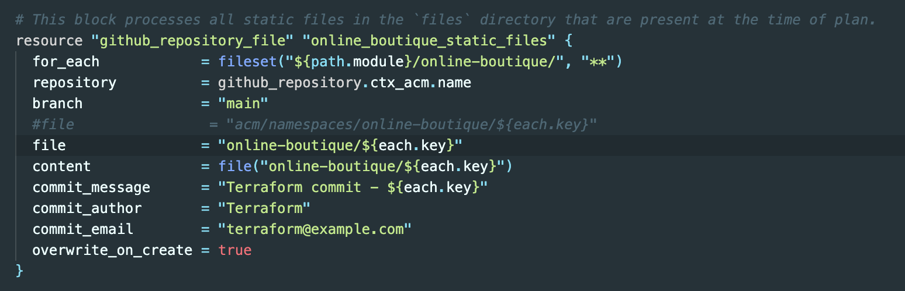
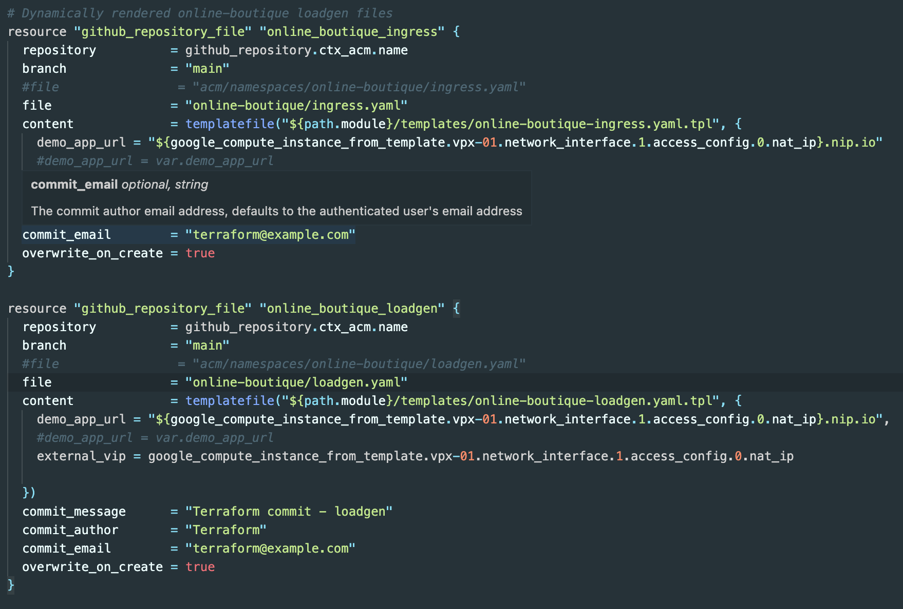


For details on how this use case applies to different personas, please see the following links: 
- [Network Persona](../PERSONA-NETWORK.md)
- [Developer Persona](../PERSONA-DEVELOPER.md)
- [Platform Persona](../PERSONA-PLATFORM.md)
- [Security Persona](../PERSONA-SECURITY.md)