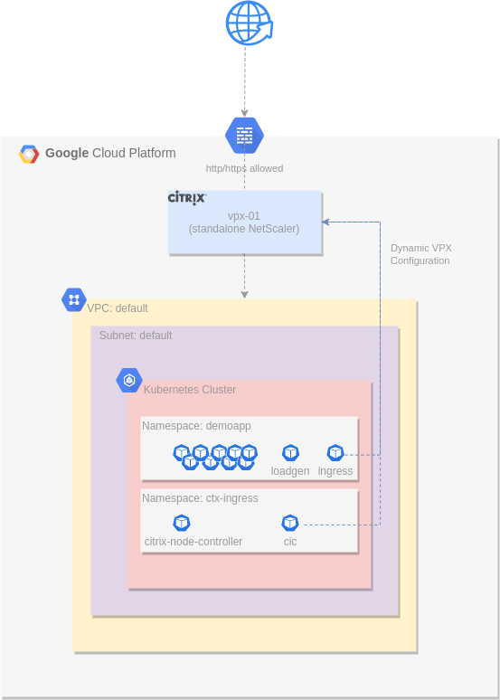
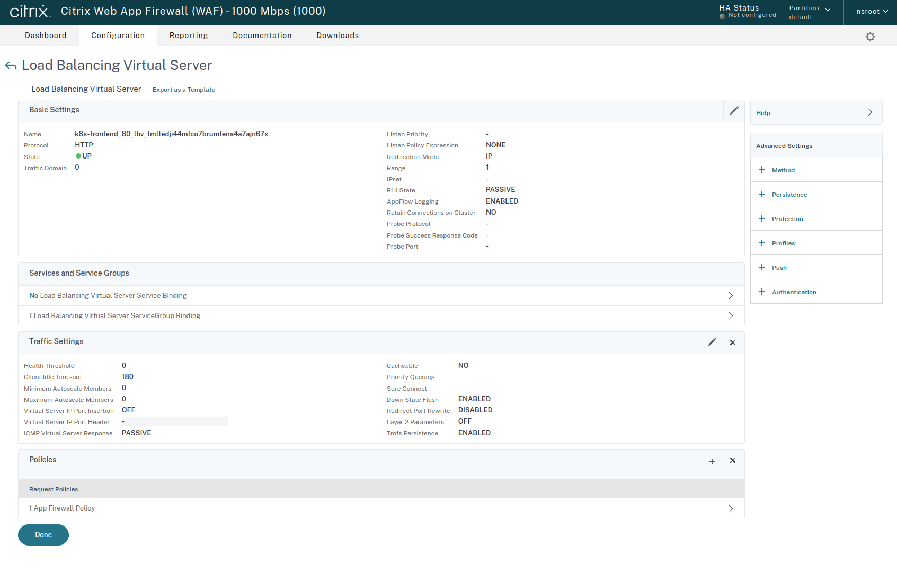
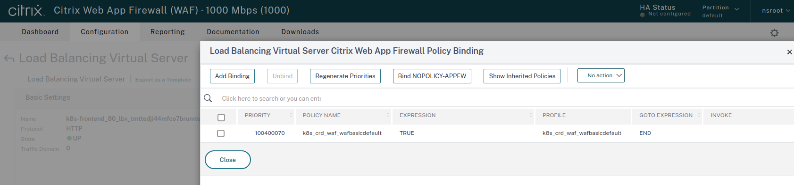

# Developer Persona

## The Setup  


The diagram above illustrates the environment at a high-level. There is an Anthos GKE cluster in which I will deploy my application, with an external Citrix VPX to control ingress traffic into the cluster with support for Web Application Firewall (WAF) protection. This Citrix VPX appliance is managed by external teams and adheres to corporate application delivery standards, but allows me to specify my own WAF configurations.   

As a developer, I am responsible for deploying applications to a Google Anthos platform and ensuring that my application is available and complies to my corporate deployment standards. Network ingress into my application needs to permit and protect access to the application.

## The Why  

Deploying applications into a Citrix Integrated Google Anthos Platform allows me, the developer, to set specific network configurations as simple annotations within my kubernetes manifests. I don't need to learn an additional platform or tool, and this configuration will be applied in accordance with any constraints set out by the platform, network, and security teams. This allows my application to get to market faster with less internal meetings, approvals, or change requests.  

My platform and security teams have required that I protect my application using Citrix WAF capabilities, but as the developer, I am responsible for ensuring that the WAF configuration is appropriate for my application. Luckily Citrix provides a Kubernets Custom Resource that I can use to define the right WAF policy without needing to engage with other teams, and still be compliant with my platform and securty teams requirements. 


## The How  

---
**NOTE**
In this demonstration, the kubectl binary and local files are used to deploy the application. In production scenarios, other deployment methods would likely be in place, such as a GitOps approach as provided from Google Anthos Configuration Management.  

---

First I will deploy the online boutique sample application manifests. I will attempt to deploy a sample ingress object, but the Anthos GKE cluster will inform me that I need a WAF resouce created first. I will then deploy the WAF resource, and then the ingress resource. These steps help to outline the control I have over the ingress WAF protection into my application, without the need to engage with the network or security team to make Application Delivery Controller configuration changes. 

- Deploy the application and a simple ingress object ... first clone the git repository that the automation created, then deploy the application **Note that you will need to replace the <github-org> and <repo> tags according to your deployment of this lab** 
  ```shell
  sh-5.1$ git clone git@github.com:<github-org>/<repo>.git
  Cloning into '<repo>'...
  remote: Enumerating objects: 301, done.
  remote: Counting objects: 100% (301/301), done.
  remote: Compressing objects: 100% (283/283), done.
  remote: Total 301 (delta 102), reused 0 (delta 0), pack-reused 0
  Receiving objects: 100% (301/301), 33.28 KiB | 2.38 MiB/s, done.
  Resolving deltas: 100% (102/102), done.
  sh-5.1$ cd <repo>/online-boutique/
  sh-5.1$ kubectl create namespace demoapp
  sh-5.1$ kubectl apply -f online-boutique.yaml -n demoapp
  sh-5.1$ kubectl get pods -n demoapp 
  NAME                                     READY   STATUS    RESTARTS   AGE
  adservice-5844cffbd4-c8b66               1/1     Running   0          52s
  cartservice-fdc659ddc-bgzzv              1/1     Running   0          54s
  checkoutservice-64db75877d-8qfp5         1/1     Running   0          56s
  currencyservice-9b7cdb45b-xhs5q          1/1     Running   0          53s
  emailservice-64d98b6f9d-xxr4v            1/1     Running   0          56s
  frontend-76ff9556-kzjkh                  1/1     Running   0          55s
  paymentservice-65bdf6757d-m6jn4          1/1     Running   0          54s
  productcatalogservice-5cd47f8cc8-2v9bh   1/1     Running   0          54s
  recommendationservice-b75687c5b-z7lk7    1/1     Running   0          55s
  redis-cart-74594bd569-hkk8x              1/1     Running   0          52s
  shippingservice-778554994-fsnsp          1/1     Running   0          53s
  sh-5.1$ cat online-boutique-ingress.yaml 
  # #Specify the ingress resource
  apiVersion: networking.k8s.io/v1
  kind: Ingress
  metadata:
    name: online-boutique-ingress
    annotations:
    kubernetes.io/ingress.class: "tier-1-vpx"
    ingress.citrix.com/insecure-termination: "allow"
  spec:
    rules:
    - host: <ip-address>.nip.io
      http:
        paths:
        - path: /
          pathType: Prefix
          backend:
            service:
              name: frontend
              port: 
                number: 80
                
  sh-5.1$ kubectl apply -f online-boutique-ingress.yaml 
  Error from server ([ingressmustusewaf-constraint] Ingress in namespace demoapp is missing at least one WAF resource.): error when creating "online-boutique/online-boutique-ingress.yaml": admission webhook "validation.gatekeeper.sh" denied the request: [ingressmustusewaf-constraint]
  Ingress in namespace demoapp is missing at least one WAF resource.

  sh-5.1$ cat waf_basic.yaml
  apiVersion: citrix.com/v1
  kind: waf
  metadata:
      name: wafbasic
  spec:
      servicenames:
          - frontend
      security_checks:
          common:
            allow_url: "on"
            block_url: "on"
            buffer_overflow: "on"
            multiple_headers:
              action: ["block", "log"]
          html:
            cross_site_scripting: "on"
            field_format: "on"
            sql_injection: "on"
            fileupload_type: "on"
          json:
            dos: "on"
            sql_injection: "on"
            cross_site_scripting: "on"
          xml:
            dos: "on"
            wsi: "on"
            attachment: "on"
            format: "on"
      relaxations:
          common:
            allow_url:
              urls:
                  - "^[^?]+[.](html?|shtml|js|gif|jpg|jpeg|png|swf|pif|pdf|css|csv)$"
                  - "^[^?]+[.](cgi|aspx?|jsp|php|pl)([?].*)?$"

  sh-5.1$ kubectl apply -f waf_basic.yaml -n demoapp 
  waf.citrix.com/wafbasic created

  $ kubectl get waf -n demoapp
  NAME           STATUS    MESSAGE
  wafbasic       Success   CRD Activated

  sh-5.1$ kubectl apply -f online-boutique-ingress.yaml
  ingress.networking.k8s.io/online-boutique-ingress created

  ```
  - The network and security team can view my configuration from the Citrix ADC
    
  


To see more configuration options, review the [waf crd examples](https://developer-docs.citrix.com/projects/citrix-k8s-ingress-controller/en/latest/crds/waf/) documentation. 


## Summary  

As a developer, my primary concern is to quickly and securely release my cloud-native application with the pace of my development team and without delays from external teams. Using the Citrix Ingress Controller  and WAF CRDs in a Google Anthos platform allows my team to achieve this goal. 
- Network, Security, and Platform teams can configure sensible defaults and constraints automatically without needing my involvement
- Configurable items specific to my application, **including WAF security**, are delegated to my team in a self-service manner
- Visibility of my workloads are present in the northbound network infrastructure to provide better monitoring and alerting across teams
- I can collaborate in network and security troubleshooting with my network engineers with a shared context and understanding of my workloads

