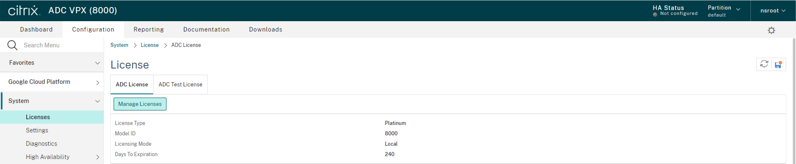
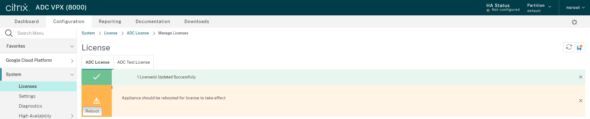

## Using a standalone Citrix ADC VPX license  
When the environment has been deployed, terraform will output two public IP addresses, one for management and one for data services. Log into the NetScaler VPX Management interface to apply a license: 
- Navigate to **System->Licenses** to review existing license 
  

- Select **Manage License->Add New License->Upload license file** and upload your license file. Hit Reboot to warm reboot your VPX for the license to be activated  
  

- After Warm Reboot takes place login and navigate once again to **System->Licenses** to verify that your license has been applied.

- Navigate to **Configuration->Security** to verify that security features are enabled. Verify that **Citrix Web App Firewall** is available.
  

You can now access all features related to security.