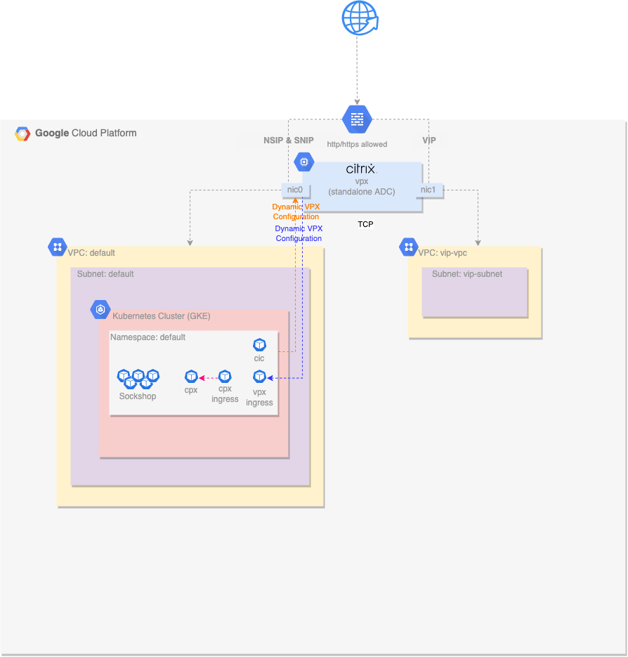
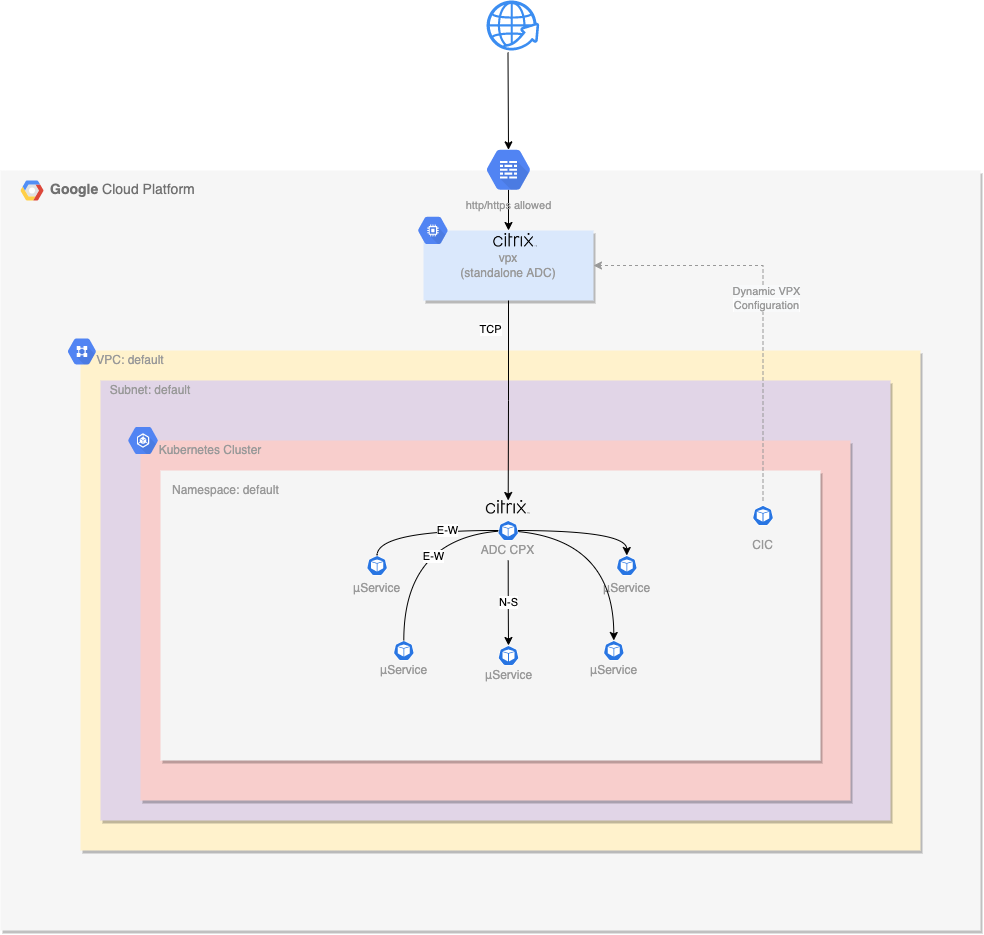
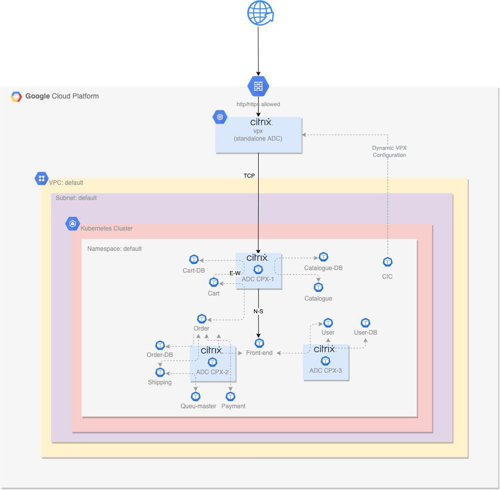
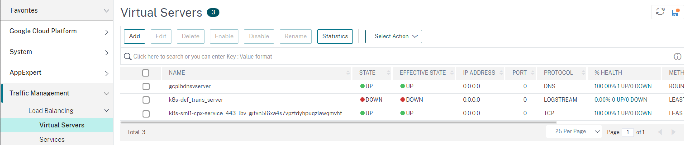

## Citrix ADC with GKE: ADC CPX for Service Mesh Lite
This use case focuses on presenting Citrix ADC CPX advanced policy features. A Tier-1 Citrix ADC (VPX) is deployed in front of a Google GKE cluster within GCP and a Tier-2 Citrix ADC (CPX) within GKE. 

ADC CPX is used in a Service Mesh Lite topology to provides advanced security features both at North-South and East-West traffic. ADC CPX will be used for: 
- for mTLS on North-South traffic
- for protecting North-South traffic by enabling WAF policies
- for rate limiting traffic to specific micro-services 
- for applying rewrite & responder policies

**Note** 
The infrastructure code contained herein is intended to function in a way that suits demonstrations or proof of concepts, but is not hardened or designed for production deployment scenarios. 


## Architecture
The following diagram illustrates the infrastructure that is deployed for this use case.  

  
**Citrix Netscaler VPX**  
A single Citrix Netscaler VPX instance is deployed with 2 network interfaces:  
- nic0 provides access for management (NSIP), and access to back end servers (SNIP)
- nic1 provides access for deployed applications (VIPs)
- each interface is assigned an internal private IP address and an external Public IP address
- the instance is deployed as a preemptible node to reduce lab costs
- the instance automatically configures the password with Terraform

**VPCs and Firewall Rules**  
2 VPC's are utilized in this deployment: 
- the default VPC and subnets are used for instance and GKE cluster deployment
- the `vip-vpc` is used only to host VIP addresses which routes the traffic back to the services in the default VPC
- default firewall rules apply to the default VPC
- ports 80/443 are permitted into the `vip-vpc`

**GKE Cluster**  
A single GKE cluster is deployed as a zonal cluster: 
- autoscaling is enabled with a minimum of 1 node and configurable maximum
- worker nodes are deployed as preemptible nodes to reduce lab costs

**SockShop Demo Application**  
The [Sock Shop](https://github.com/microservices-demo/microservices-demo) demo application provides a μServices based application for our lab. It has been modified for this environment: 
- an ingress resource has been added to receive all traffic through the Citrix VPX 
- 3 ADC CPXs have been introduces to handle both North - Sourth and East - West traffic inside GKE
- Ingress Resources have been created to configure ADCs
- Citrix CRDs are being used to create policies
- WAF, Rate-liming and Rewrite / Responder manifests have been added to apply policies

**The following diagram illustrates our Service Mesh Lite architecture at a higher-level, aiming to present the role of each component for our Lab.**


**The following diagram illustrates a more detailed architecture, aiming for better undestanding of the role of each component for our Lab.**


## Lab Deployment
Please refer to [lab-automation/README.md](lab-automation/README.md) for deployment details. 

## Environment Usage  
When the environment has been deployed, terraform will output two public IP addresses, one for management and one for data services. Log into the NetScaler VPX Management interface and review the configuration: 
- Navigate to **System->Network->IPs** to review the IP addresses that have been dynamically configured on the system  
  

- Navigate to **System->Network->VXLANS** to review the VXLAN IDs that have been dynamically configured on the system - this configuration enables the VPX to tunnel into the cluster and access the POD IP space  
  

With the environment fully deployed, navigate to [What's Next Section](lab-automation/README.md#whats-next) to explore our use case for different personas. During trying these use case:

- Visit **Traffic Management->Load Balancing->Virtual Servers** to explore the dynamically created virtual services that reside in the Google GKE cluster  
  

- **Make use of CLI** to explore the same on CPX. First connect to your CPX container and then execute the following command:
    ```shell
    sh-5.1$ kubectl get pods | grep cpx
    sml1-cpx-759984bd99-hgvh8      2/2     Running   0          106m
    sml2-cpx-54659dcc79-8gsjw      2/2     Running   0          106m
    sml3-cpx-bbc958ddc-v9mt5       2/2     Running   0          106m
    sh-5.1$ kubectl exec -it sml1-cpx-759984bd99-hgvh8 bash
    root@sml1-cpx-759984bd99-hgvh8:/# nscli -U :nsroot:$(cat /var/random_id)
    root@sml1-cpx-759984bd99-hgvh8:/# sh sslvserver
    1) VServer Name: k8s-10.8.0.18_443_ssl
    Profile Name :k8s-10.8.0.18_443_ssl
    ```