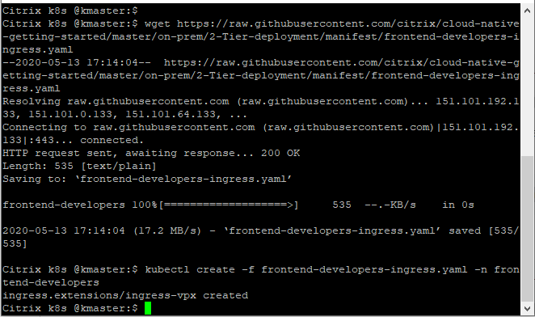

# NetScaler load balancing microservices from on-prem Kubernetes cluster (Tier 1 ADC as VPX, Tier 2 ADC as CPX) using Role base access

In this guide you will learn:
* How to limit the scope of Citrix Ingress controller for namespace using Role based RBAC
* How to deploy a microservice application exposed as Ingress type service.
* How to deploy a Citrix ADC CPX to Load Balancer microservice applications.
* How to isolate two teams workload (microservice apps, CPX, CIC, Ingress) using K8s namespace.
* How to configure same Citrix ADC VPX (Tier 1 ADC) using two different Citrix Ingress Controller to load balance north-South ingress traffic for each team

Citrix ADC supports 2-Tier Ingress architecture to load balance an enterprise grade applications deployed as microservices. Citrix load balancers can be VPX/SDX/MPX/BLX, or CPX (containerized Citrix ADC) to manage high scale north-south traffic. Lets understand the 2-Tier Ingress topology using below diagram.


Example: There are two teams in an Organization team 'Frontend-developers' and team 'Mobile-developers'. Each team does not want to share any resource between them, they want separation of workload. You will deploy both team's workload in two different k8s namespace to accomplish each team requirement.
In each namespace we will deploy back-end applications, Citrix ADC CPX, Citrix Ingress Controller and Ingress rule to load balance N-S Ingress traffic. K8s namespace will provide logical isolation of entities deployed in each namespace.
Team 'Frontend-developers' will not have visibility for Team 'Mobile-developers' and vice-versa.

#### Step by step guide to Load Balance N-S Ingress traffic in 2-Tier Ingress topology

1.  Bring your own nodes (BYON)

    Kubernetes is an open-source system for automating deployment, scaling, and management of containerized applications. Please install and configure Kubernetes cluster with one master node and at least two worker node deployment.
    Visit: https://kubernetes.io/docs/setup/ for Kubernetes cluster deployment guide.

    **Prerequisite**: Supported Kubernetes cluster v1.10 and above(Below example is tested in on-prem K8s cluster v1.17.0).

    Once Kubernetes cluster is up and running, execute the below command on master node to get the node status.
    ``` 
    kubectl get nodes
    ```
    

    (Screen-shot above has Kubernetes cluster with one master and one worker node).

2.	[Optional] Set up a Kubernetes dashboard for deploying containerized applications
    Please visit https://kubernetes.io/docs/tasks/access-application-cluster/web-ui-dashboard/ and follow the steps mentioned to bring the Kubernetes dashboard up as shown below.

    

3. Add K8s CIDR routes to Tier 1 ADC to reach K8s network

    Make sure that route configuration is present in Tier 1 ADC so that Ingress NetScaler should be able to reach Kubernetes pod network for seamless connectivity. Please refer to https://github.com/citrix/citrix-k8s-ingress-controller/blob/master/docs/network/staticrouting.md#manually-configure-route-on-the-citrix-adc-instance for Network configuration.
    If you have K8s cluster and Tier 1 Citrix ADC in same subnet then you do not have to do anything, below example will take care of route info.
    You need Citrix Node Controller configuration only when K8s cluster and Tier 1 ADC are in different subnet. Please refer to https://github.com/citrix/citrix-k8s-node-controller for Network configuration.


###### Lets deploy 2-Tier ingress microservices
1. Create two namespaces for each team
    ```
    kubectl create -f https://raw.githubusercontent.com/citrix/cloud-native-getting-started/master/on-prem/2-Tier-deployment/manifest/namespace.yaml
    ```
    

2. Deploy microservice application for each team
    
    Deploy k8s secret for frontend developer and mobile developer team to configure TLS certificate in Tier 1 ADC - VPX and Tier 2 ADC - CPX. Ingress kind for VPX and CPX configuration of each team specifies these secret names for TLS communication.
    
    **Note:** Please upload your TLS certificate and TLS key into frontend-developers-secret.yaml & mobile-developers-secret.yaml. We have updated our security policies and removed SSL certificate from guides.
    
    ```
    kubectl create -f https://raw.githubusercontent.com/citrix/cloud-native-getting-started/master/on-prem/2-Tier-deployment/manifest/frontend-developers-secret.yaml -n frontend-developers
    kubectl create -f https://raw.githubusercontent.com/citrix/cloud-native-getting-started/master/on-prem/2-Tier-deployment/manifest/mobile-developers-secret.yaml -n mobile-developers
    ```
    

    Deploy app for Frontend-developers team
    ```
    kubectl create -f https://raw.githubusercontent.com/citrix/cloud-native-getting-started/master/on-prem/2-Tier-deployment/manifest/frontend-developers-app.yaml -n frontend-developers
    ```
    

    Deploy app for Mobile-developers team
    ```
    kubectl create -f https://raw.githubusercontent.com/citrix/cloud-native-getting-started/master/on-prem/2-Tier-deployment/manifest/mobile-developers-app.yaml -n mobile-developers
    ```
    

3. Deploy RBAC for each team to restrict k8s resource permissions within namespaces 
    ```
    kubectl create -f https://raw.githubusercontent.com/citrix/cloud-native-getting-started/master/on-prem/2-Tier-deployment/manifest/frontend-developers-rbac.yaml -n frontend-developers
    kubectl create -f https://raw.githubusercontent.com/citrix/cloud-native-getting-started/master/on-prem/2-Tier-deployment/manifest/mobile-developers-rbac.yaml -n mobile-developers
    ```
    

4. Deploy Citrix ADC CPX to Load Balance N-S traffic for individual teams
    
    
    Deploy Citrix ADC CPX for Frontend-developers team
    ```
    kubectl create -f https://raw.githubusercontent.com/citrix/cloud-native-getting-started/master/on-prem/2-Tier-deployment/manifest/frontend-developers-cpx.yaml -n frontend-developers
    ```
    

    Deploy Citrix ADC CPX for Mobile-developers team
    ```
    kubectl create -f https://raw.githubusercontent.com/citrix/cloud-native-getting-started/master/on-prem/2-Tier-deployment/manifest/mobile-developers-cpx.yaml -n mobile-developers
    ```
    

5. Deploy Citrix Ingress Controller for each team to configure Tier 1 ADC
    
    Deploy Citrix Ingress Controller for Frontend-developers team
    ```
    wget https://raw.githubusercontent.com/citrix/cloud-native-getting-started/master/on-prem/2-Tier-deployment/manifest/frontend-developers-cic.yaml
    ```
    Edit 'NS_IP' variable from 'frontend-developers-cic.yaml' file with Tier 1 ADC NSIP.
    
    Change username 'NS_USER' and password 'NS_PASSWORD' as per user credentials used for Tier 1 ADC .
    ```
    kubectl create -f frontend-developers-cic.yaml -n frontend-developers
    ```
    

    Deploy Citrix Ingress Controller for Mobile-developers team
    ```
    wget https://raw.githubusercontent.com/citrix/cloud-native-getting-started/master/on-prem/2-Tier-deployment/manifest/mobile-developers-cic.yaml
    ```
    Edit 'NS_IP' variable from 'mobile-developers-cic.yaml' file with Tier 1 ADC NSIP. Also Provide Tier 1 NSIP login credentials correctly in 'NS_USER' and 'NS_PASSWORD'.

    ```
    kubectl create -f mobile-developers-cic.yaml -n mobile-developers
    ```
    

6. Deploy K8s Ingress rule to send N-S traffic from Tier 1 ADC to Tier 2 ADC

    Deploy Ingress for Frontend-developers team
    ```
    wget https://raw.githubusercontent.com/citrix/cloud-native-getting-started/master/on-prem/2-Tier-deployment/manifest/frontend-developers-ingress.yaml
    ```
    Update 'ingress.citrix.com/frontend-ip' annotation with free IP (VIP) that will take N-S traffic for team frontend-developers microservices.
    e.g. ingress.citrix.com/frontend-ip: "10.105.158.196"
    ```
    kubectl create -f frontend-developers-ingress.yaml -n frontend-developers
    ```
    

    Deploy Citrix Ingress Controller for Mobile-developers team
    ```
    wget https://raw.githubusercontent.com/citrix/cloud-native-getting-started/master/on-prem/2-Tier-deployment/manifest/mobile-developers-ingress.yaml
    ```
    Update 'ingress.citrix.com/frontend-ip' annotation with free IP (VIP) that will take N-S traffic for team mobile-developers microservices.
    ```
    kubectl create -f mobile-developers-ingress.yaml -n mobile-developers
    ```
    


7. Validate microservice deployment status for both teams

    Ensure that all pods are running for Frontend developers team
    

    Ensure that all pods are running for Mobiles developers team
    

    Also, you can verify from the k8s logs that CIC and CPX are listening to k8s event within deployed namespace. It verifies that one team deployment has no visibility into other team deployment.
    ```
    kubectl logs -f cic-vpx -n frontend-developers
    ```
    OR
    ```
    kubectl logs -f <cpx pod name> -c cic -n frontend-developers
    ```

8. Yeah!!! Your application is successfully deployed and ready to access from Internet
    
    Add the DNS entries in your local machine host files for accessing microservices though Internet
    Path for host file:[Windows] ``C:\Windows\System32\drivers\etc\hosts`` [Macbook] ``/etc/hosts``
    
    Add below entries in hosts file and save the file
    ```
    <frontend-ip from frontend-developers-ingress.yaml> frontend.agiledevelopers.com
    <frontend-ip from mobile-developers-ingress.yaml> mobile.agiledevelopers.com
    ```
    Lets access microservice app from local machine browser

    ```
    https://frontend.agiledevelopers.com
    https://mobile.agiledevelopers.com
    ```
## Clean up the deployment
    ```
    kubectl delete -f https://raw.githubusercontent.com/citrix/cloud-native-getting-started/master/on-prem/2-Tier-deployment/manifest/frontend-developers-app.yaml -n frontend-developers
    kubectl delete -f https://raw.githubusercontent.com/citrix/cloud-native-getting-started/master/on-prem/2-Tier-deployment/manifest/mobile-developers-app.yaml -n mobile-developers
    kubectl delete -f https://raw.githubusercontent.com/citrix/cloud-native-getting-started/master/on-prem/2-Tier-deployment/manifest/frontend-developers-rbac.yaml -n frontend-developers
    kubectl delete -f https://raw.githubusercontent.com/citrix/cloud-native-getting-started/master/on-prem/2-Tier-deployment/manifest/mobile-developers-rbac.yaml -n mobile-developers
    kubectl delete -f https://raw.githubusercontent.com/citrix/cloud-native-getting-started/master/on-prem/2-Tier-deployment/manifest/frontend-developers-cpx.yaml -n frontend-developers
    kubectl delete -f https://raw.githubusercontent.com/citrix/cloud-native-getting-started/master/on-prem/2-Tier-deployment/manifest/mobile-developers-cpx.yaml -n mobile-developers
    kubectl delete -f frontend-developers-ingress.yaml -n frontend-developers
    kubectl delete  -f mobile-developers-ingress.yaml -n mobile-developers
    kubectl delete -f frontend-developers-cic.yaml -n frontend-developers
    kubectl delete -f mobile-developers-cic.yaml -n mobile-developers
    kubectl delete -f https://raw.githubusercontent.com/citrix/cloud-native-getting-started/master/on-prem/2-Tier-deployment/manifest/namespace.yaml
    ```

Please refer to Citrix ingress controller for more information, present at- https://github.com/citrix/citrix-k8s-ingress-controller

           
