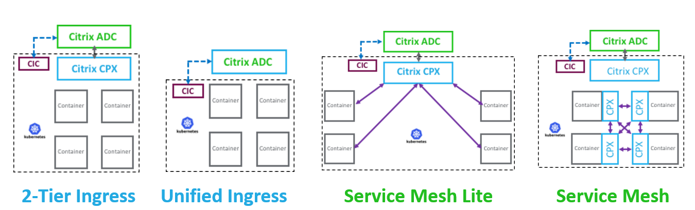

# Choices of Architectures for building Cloud Native Apps

Citrix Cloud Native stack can be deployed in different topologies, some common topologies are shown below:-

Choose your choice of architecture and select example from below list to complete hands-on,

* [Unified Ingress topology](https://github.com/citrix/cloud-native-getting-started/tree/master/on-prem/Unified-Ingress)
* [2-Tier Ingress topology](https://github.com/citrix/cloud-native-getting-started/tree/master/on-prem/2-Tier-deployment)
* [Service Mesh Lite topology](https://github.com/citrix/cloud-native-getting-started/tree/master/on-prem/ServiceMeshLite)

