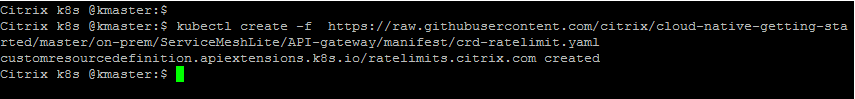
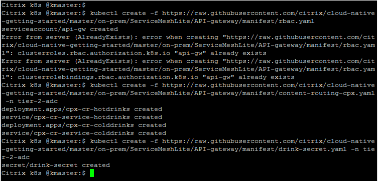
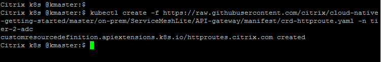

# Learn how to secure K8s API traffic using Citrix ADCs (North-South API protection using Tier 1 ADC as Citrix ADC VPX, East-West API protection using Tier 2 ADC as Citrix ADC CPX)

In this guide you will learn:
* What is service mesh lite deployment?
* What is Citrix API Gateway for K8s?
* How to deploy Citrix ADC, Applications in Service mesh lite deployment? 
* How to secure North-South API traffic using Tier 1 ADC
* How to secure East-West API traffic using Tier 2 ADC - CPX and how to expose CPX as Ingress, LoadBalancer type service

Citrix Cloud native solution ensures that SecOps requirements are taken into consideration.
Citrix Cloud Native solution portfolio provides ``API Gateway for Kubernetes`` to secures applications with Citrix ADC policies exposed as Kubernetes APIs.
Refer [API gateway for Kubernetes](https://docs.citrix.com/en-us/citrix-adc/13/cloud-native-solution/citrix-api-gateway.html) to understand our deployment and key benefits of it. 

## Pre-requisite: Before you start API gateway deployment

1.	Bring your own nodes (BYON)

    Kubernetes is an open-source system for automating deployment, scaling, and management of containerized applications. Please install and configure Kubernetes cluster with one master node and at least two worker node deployment.
    Recommended OS: Ubuntu 16.04 desktop/server OS. 
    Visit: https://kubernetes.io/docs/setup/ for Kubernetes cluster deployment guide.
    Once Kubernetes cluster is up and running, execute the below command on master node to get the node status.
    ``` 
    kubectl get nodes
    ```
    
 
    (The following example is validated on open source on-prem Kubernetes cluster version 1.17.0).

2.	<u>[Optional]</u> Set up a Kubernetes dashboard for deploying containerized applications.
    
    Please visit https://kubernetes.io/docs/tasks/access-application-cluster/web-ui-dashboard/ and follow the steps mentioned to bring the Kubernetes dashboard up as shown below.

    

3. Add K8s CIDR routes to Tier 1 ADC to reach K8s network

    Make sure that route configuration is present in Tier 1 ADC so that Ingress NetScaler should be able to reach Kubernetes pod network for seamless connectivity. Please refer to https://github.com/citrix/citrix-k8s-ingress-controller/blob/master/docs/network/staticrouting.md#manually-configure-route-on-the-citrix-adc-instance for Network configuration.
    If you have K8s cluster and Tier 1 Citrix ADC in same subnet then you do not have to do anything, below example will take care of route info.
    
    You need Citrix Node Controller configuration only when K8s cluster and Tier 1 ADC are in different subnet. Please refer to https://github.com/citrix/citrix-k8s-node-controller for Network configuration.

**Note:** Section A is common for Section B & C; you can choose either section B or C or both to learn Citrix API Gateway use cases. Section D can be tested with/without other sections.

| Section | Description |
| ------- | ----------- |
| [Section A](https://github.com/citrix/cloud-native-getting-started/tree/master/on-prem/ServiceMeshLite/API-gateway#section-a-deploy-service-mesh-lite-topology) | Deploy Service mesh lite topology |
| [Section B](https://github.com/citrix/cloud-native-getting-started/tree/master/on-prem/ServiceMeshLite/API-gateway#section-b-citrix-api-gateway-use-cases-for-north-south-api-traffic) | Citrix API gateway use cases for North-South API traffic |
| [Section C](https://github.com/citrix/cloud-native-getting-started/tree/master/on-prem/ServiceMeshLite/API-gateway#section-c-citrix-api-gateway-use-cases-for-east-west-api-traffic) | Citrix API gateway use cases for East-West API traffic |
| [Section D](https://github.com/citrix/cloud-native-getting-started/tree/master/on-prem/ServiceMeshLite/API-gateway#section-d-advance-content-routing-citrix-api-gateway-use-cases-for-api-traffic) | Advance Content routing Citrix API gateway use cases for API traffic |
| [Section E](https://github.com/citrix/cloud-native-getting-started/tree/master/on-prem/ServiceMeshLite/API-gateway#section-d-clean-up) | Clean Up |

## Section A (Deploy Service mesh lite topology)

Lets understand the Service Mesh lite topology from below architecture


There are two types of beverage microservice applications (hotdrink and colddrink beverages) deployed in K8s cluster. Each application is exposed on different protocol. In this demo you will learn how Citrix ADC secure and routes the different protocol level traffic.
Each applications are deployed in different namespaces to isolate their workload from other k8s deployments.
Citrix ADC outside K8s cluster manages North-South traffic and Citrix ADC - CPX deployed in K8s cluster can manage both North-South and East-West traffic. CPX managing hotdrink beverage workload is exposed as Ingress type service and CPX managing colddrink beverage workload is exposed as LoadBalancer type service.
Know more about supported deployments from [Citrix Cloud native deployments](https://docs.citrix.com/en-us/citrix-adc/13/cloud-native-solution/ingress-solution.html).

1. Create K8s namespaces to manage team beverages workload independently
    ```
    kubectl create -f https://raw.githubusercontent.com/citrix/cloud-native-getting-started/master/on-prem/ServiceMeshLite/API-gateway/manifest/namespace.yaml
    ```

    

2.	Deploy Two Citrix ADC CPXs for hotdrink and colddrink beverages microservice apps

    You can directly pass the user name and password as environment variables to the Citrix ingress controller or use K8s secrets (recommended). If you want to use K8s secrets, create a secret for the user name and password using the following command:
    ```
    kubectl create secret generic nslogin --from-literal=username='nsroot' --from-literal=password='nsroot' -n tier-2-adc
    ```
    Lets deploy two CPXs now; one CPX exposed as Ingress service load balancing hotdrink beverage app and another CPX exposed as LoadBalancer service load balancing colddrink beverage app.

    **Note:** Please upload your TLS certificate and TLS key into vpx-secret.yaml. We have updated our security policies and removed SSL certificate from guides.

    ```
    kubectl create -f https://raw.githubusercontent.com/citrix/cloud-native-getting-started/master/on-prem/ServiceMeshLite/API-gateway/manifest/rbac.yaml
    kubectl create -f https://raw.githubusercontent.com/citrix/cloud-native-getting-started/master/on-prem/ServiceMeshLite/API-gateway/manifest/cpx.yaml -n tier-2-adc
    kubectl create -f https://raw.githubusercontent.com/citrix/cloud-native-getting-started/master/on-prem/ServiceMeshLite/API-gateway/manifest/vpx-secret.yaml -n tier-2-adc
    ```

    

3.	Deploy Hotdrink beverage microservices application in team-hotdrink namespace

    **Note:** Please upload your TLS certificate and TLS key into vpx-secret.yaml. We have updated our security policies and removed SSL certificate from guides.
    ```
    kubectl create -f https://raw.githubusercontent.com/citrix/cloud-native-getting-started/master/on-prem/ServiceMeshLite/API-gateway/manifest/hotdrink-beverage.yaml -n team-hotdrink
    kubectl create -f https://raw.githubusercontent.com/citrix/cloud-native-getting-started/master/on-prem/ServiceMeshLite/API-gateway/manifest/vpx-secret.yaml -n team-hotdrink
    ```
    Coffee beverage microservice is listening on port 443 (SSL app), here vpx-secret acts as SSL server certificate for hotdrink app on CPX.

    

4.	Deploy the colddrink beverage microservice application in team-colddrink namespace

    **Note:** Please upload your TLS certificate and TLS key into colddrink-secret.yaml. We have updated our security policies and removed SSL certificate from guides.

    ```
    kubectl create -f https://raw.githubusercontent.com/citrix/cloud-native-getting-started/master/on-prem/ServiceMeshLite/API-gateway/manifest/colddrink-beverage.yaml -n team-colddrink
    kubectl create -f https://raw.githubusercontent.com/citrix/cloud-native-getting-started/master/on-prem/ServiceMeshLite/API-gateway/manifest/colddrink-secret.yaml -n team-colddrink
    ```
    Colddrink beverage app has end to end TLS enabled hence colddrink secret deployed on CPX to enable SSL communication.

    

5.	Deploy the IPAM CRD and IPAM controller for auto assigning the IP addresses to Kubernetes services
    ```
    kubectl create -f https://raw.githubusercontent.com/citrix/cloud-native-getting-started/master/on-prem/ServiceMeshLite/API-gateway/manifest/crd-ipam.yaml
    wget https://raw.githubusercontent.com/citrix/cloud-native-getting-started/master/on-prem/ServiceMeshLite/API-gateway/manifest/ipam-controller.yaml
    ```

    Update ``ipam-controller.yaml`` file, Change the IP range to your free VIP IP range for allocating IP from pool to access colddrink microservice
    
    e.g.        name: "VIP_RANGE"
                value: '["10.221.36.189", "10.221.36.189-192", "10.221.36.180/32"]'
    ```
    kubectl create -f ipam-controller.yaml
    ```

    

6.	Deploy the VPX ingress and Citrix ingress controller to configure tier 1 ADC VPX automatically
    ```
    wget https://raw.githubusercontent.com/citrix/cloud-native-getting-started/master/on-prem/ServiceMeshLite/API-gateway/manifest/ingress-vpx.yaml
    wget https://raw.githubusercontent.com/citrix/cloud-native-getting-started/master/on-prem/ServiceMeshLite/API-gateway/manifest/cic-vpx.yaml
    ```
    Update  ingress-vpx.yaml and cic-vpx.yaml with following configuration

    Go to ``ingress-vpx.yaml`` and change the IP address of ``ingress.citrix.com/frontend-ip: "x.x.x.x"`` annotation to one of the free IP which will act as content switching vserver for accessing microservices.
    e.g. ``ingress.citrix.com/frontend-ip: "10.105.158.160"``

    Go to ``cic-vpx.yaml`` and change the NS_IP value to your VPX NS_IP.         
    ``- name: "NS_IP"
      value: "x.x.x.x"``
    Now execute the following commands after completing above change.
    ```
    kubectl create -f ingress-vpx.yaml -n tier-2-adc
    kubectl create -f cic-vpx.yaml -n tier-2-adc
    ```

    

7.	Yeah!!! Beverage microservice application is successfully deployed and ready to access from Internet

    Add the DNS entries in your local machine host files for accessing microservices though Internet
    Path for host file:[Windows] ``C:\Windows\System32\drivers\etc\hosts`` [Macbook] ``/etc/hosts``
    Add below entries in hosts file and save the file

    ```
    <frontend-ip from ingress_vpx.yaml> hotdrink.beverages.com
    <frontend-ip from ingress_vpx.yaml> colddrink.beverages.com
    ```

    Lets access beverage application from local machine browser
    ```
    https://hotdrink.beverages.com
    https://colddrink.beverages.com
    ```
    

## Section B (Citrix API gateway use cases for North-South API traffic)

The API gateway is built on top of the Citrix ingress gateway and leverages Kubernetes API extensions such as custom resource definitions (CRDs). Using CRDs, you can automatically configure the Citrix ADC and API gateway in the same instance.

Lets deploy following API Gateway use cases on Tier 1 ADC - VPX for managing N-S API traffic.

* Limit the North-South ingress traffic using Citrix ADC rate limiting policy
* Enforce access restrictions using Citrix Authentication policies
* Ability to route ingress traffic using Citrix Content routing policies
* Allow secured access using IP filtering policies


#### Use Case 1: Limit the North-South ingress traffic using Citrix ADC rate limiting policy

In a Kubernetes deployment, you can rate limit the requests to the resources on the back end server or services using rate limiting feature provided by the API gateway Citrix ADC.
Citrix provides a Kubernetes CustomResourceDefinitions (CRDs) called the Rate limit CRD that you can use with the Citrix ingress controller to configure the rate limiting configurations on the Citrix ADCs used as API gateway devices.

1. Lets apply the rate limiting CRD

    ```
    kubectl create -f  https://raw.githubusercontent.com/citrix/cloud-native-getting-started/master/on-prem/ServiceMeshLite/API-gateway/manifest/crd-ratelimit.yaml
    ```
    

    In this use case, we will apply rate limiting policy at Tier 1 ADC - VPX to limit the number of request landing on ``https://hotdrink.beverages.com `` and "https://colddrink.beverages.com" web page. We are controlling the number of request sent to both hotdrink and colddrink beverage CPXs.
    ```
    kubectl create -f  https://raw.githubusercontent.com/citrix/cloud-native-getting-started/master/on-prem/ServiceMeshLite/API-gateway/manifest/rate-limit-vpx.yaml -n tier-2-adc
    ```
    
    
    Check the status of rate limiting policy in VPX.You will notice that *rate limiting policy is applied to both hotdrink and colddrink CPXs exposed as Ingress and Loadbalancer type service* respectively.
    
    
 
    You can also check the status from VPX GUI, Goto Traffic Management -> Load Balancing -> Virtual Servers -> hotdrink and colddrink beverage vservers will have responder policy bound to limit client request.

    Now try to access ``https://hotdrink.beverages.com`` ``https://colddrink.beverages.com`` from browser frequently and you will find that traffic sent to CPX services is throttled.
    


#### Use Case 2: Allow secured API access to white-listed IPs using IP filtering policies

Whitelisting IP addresses allows you to create a list of trusted IP addresses or IP address ranges from which users can access your domains. It is a security feature that is often used to limit and control access only to trusted users.
Using a Citrix ADC responder policy, you can whitelist IP addresses and silently drop the requests from the clients using IP addresses different from the whitelisted IP addresses.

1. Deploy the Rewrite and Responder CRD in the Kubernetes cluster

    ```
    kubectl create -f https://raw.githubusercontent.com/citrix/cloud-native-getting-started/master/on-prem/ServiceMeshLite/API-gateway/manifest/crd-rewriteresponder.yaml
    ```
    

2. Lets apply the responder policy at Tier 1 ADC -VPX  to allow limited access for colddrink application
    ```
    kubectl create -f  https://raw.githubusercontent.com/citrix/cloud-native-getting-started/master/on-prem/ServiceMeshLite/API-gateway/manifest/whitelistIP-on-vpx.yaml -n tier-2-adc
    ```

    

    You can verify the configuration from Tier 1 ADC -VPX. You will notice that *responder policy is applied to both hotdrink and colddrink CPXs exposed as Ingress and Loadbalancer type service* respectively.

    

    Now, try to access ``https://hotdrink.beverages.com`` and ``https://colddrink.beverages.com`` from local browser you will see than your access is blocked by Citrix ADC policy.

        

    **Note:** You can change the IP address list from ``allowlistip patset`` of ``whitelistIP-on-vpx.yaml``, as per your whitelisted IPs.

#### Use Case 3: Enforce access restrictions using Citrix Authentication policies

Citrix provides a Kubernetes CustomResourceDefinitions (CRDs) called the Auth CRD that you can use with the Citrix ingress controller to define authentication policies on the ingress Citrix ADC.

1. Deploy Auth CRD
    ```
    kubectl create -f https://raw.githubusercontent.com/citrix/cloud-native-getting-started/master/on-prem/ServiceMeshLite/API-gateway/manifest/crd-auth.yaml
    ```

2. Lets do Basic Authentication for hotdrink beverage application on Tier 1 ADC - VPX
    ```
    kubectl create -f https://raw.githubusercontent.com/citrix/cloud-native-getting-started/master/on-prem/ServiceMeshLite/API-gateway/manifest/basic-auth-policy.yaml -n tier-2-adc
    ```
    

3. Lets create user account on Tier 1 ADC
    
    Lets add AAA user in Citrix ADC VPX so that Basic authentication is validated. Login to VPX and add below commands;
    ```
    add aaa user test -password test
    set tmsessionparameter -defaultAuthorizationAction Allow
    ```
    You can also verify Auth policy applied on VPX. Goto : System -> Authentication -> Advanced Policies -> Authentication Policies	
    
    Now  access ``https://hotdrink.beverages.com`` from incognito mode (to avoid caches) and you will be prompeted for username and password. Provide credentials added as AAA user in VPX to access hotdrink beverage application. 
    

## Section C (Citrix API gateway use cases for East-West API traffic)

Lets deploy following API Gateway use cases on Tier 2 ADC - CPX for managing E-W API traffic 
* Limit the East-West ingress traffic using Citrix ADC rate limiting policy
* Enforce access restrictions using Citrix Authentication policies
* Ability to route ingress traffic using Citrix Content routing policies
* Allow secured access using IP filtering policies. 


#### Use Case 1: Limit the East-West ingress traffic using Citrix ADC rate limiting policy

In a Kubernetes deployment, you can rate limit the requests to the resources on the back end server or services using rate limiting feature provided by the API gateway Citrix ADC.
Citrix provides a Kubernetes CustomResourceDefinitions (CRDs) called the Rate limit CRD that you can use with the Citrix ingress controller to configure the rate limiting configurations on the Citrix ADCs used as API gateway devices.

1. Lets apply the rate limiting CRD

    ```
    kubectl create -f  https://raw.githubusercontent.com/citrix/cloud-native-getting-started/master/on-prem/ServiceMeshLite/API-gateway/manifest/crd-ratelimit.yaml
    ```
    In this use case, we will apply rate limiting policy at Tier 2 ADC - CPX to limit the number of request landing on ``https://hotdrink.beverages.com/coffee.php `` from other beverage microservices.
    ```
    kubectl create -f  https://raw.githubusercontent.com/citrix/cloud-native-getting-started/master/on-prem/ServiceMeshLite/API-gateway/manifest/rate-limit-cpx.yaml -n team-hotdrink
    ```

    
    Check the status of rate limiting policy in CPX. You will notice that *rate limiting policy is applied to for coffee beverage and frontend hotdrink beverage applications* in CPX.
    
 
    Now try to access ``https://hotdrink.beverages.com/ ``  from browser frequently and you will find that traffic sent to front-end hotdrink beverage app is throttled.
    

#### Use Case 2: Allow secured API access to white-listed IPs using IP filtering policies

Whitelisting IP addresses allows you to create a list of trusted IP addresses or IP address ranges from which users can access your domains. It is a security feature that is often used to limit and control access only to trusted users.
Using a Citrix ADC responder policy, you can whitelist IP addresses and silently drop the requests from the clients using IP addresses different from the whitelisted IP addresses.

1. Deploy the Rewrite and Responder CRD in the Kubernetes cluster

    ```
    kubectl create -f https://raw.githubusercontent.com/citrix/cloud-native-getting-started/master/on-prem/ServiceMeshLite/API-gateway/manifest/crd-rewriteresponder.yaml
    ```

2. Lets apply the responder policy at Tier 2 ADC -CPX  to allow limited access for tea beverage application
    ```
    kubectl create -f  https://raw.githubusercontent.com/citrix/cloud-native-getting-started/master/on-prem/ServiceMeshLite/API-gateway/manifest/whitelistIP-on-cpx.yaml -n team-hotdrink
    ```

    You can verify the configuration from Tier 2 ADC - CPX. You will notice that *responder policy is applied to CPX managing Tea beverage and frontend hotdrink beverage* microservice.

    Now, try to access ``https://hotdrink.beverages.com/ `` from local browser you will see than your access is blocked by Citrix ADC policy.

    **Note:** You can change the IP address list from ``allowlistip patset`` of ``whitelistIP-on-cpx.yaml``, as per your whitelisted IPs.


## Section D (Advance Content routing Citrix API gateway use cases for API traffic)

You can expose the advanced content routing abilities provided by Citrix ADC as a custom resource definition (CRD) API for Kubernetes
Citrix Content routing feature is an alternative option to K8s ingress with added benefits like routing based on header values, query strings, HTTP cookies, HTTP method, CItrix ADC policy expressions.
You can learn more about it from [Content routing documentation](https://developer-docs.citrix.com/projects/citrix-k8s-ingress-controller/en/latest/crds/content-routing/?_ga=2.254302528.935011741.1598869161-279651349.1592642962)

In this how to example, we will demonstrate how does Tier 1 Citrix ADC - VPX routes the drink beverage application traffic to hotdrink and colddrink beverage applications using query string param HTTP route.

**Note:** This section will repeat few steps from Section A (for folks focusing on only this use case). In case you have completed Section A and B/C and continuing with Section D, then also you can follow below instructions. Few yamls will give you an error saying it already exists. Please ignore and follow rest of guide.


1. Create K8s namespaces to manage team beverages workload independently
    ```
    kubectl create -f https://raw.githubusercontent.com/citrix/cloud-native-getting-started/master/on-prem/ServiceMeshLite/API-gateway/manifest/namespace.yaml
    ```
    

2.	Deploy Two Citrix ADC CPXs for drink beverages content routing use case

    You can directly pass the user name and password as environment variables to the Citrix ingress controller or use K8s secrets (recommended). If you want to use K8s secrets, create a secret for the user name and password using the following command:
    ```
    kubectl create secret generic nslogin --from-literal=username='nsroot' --from-literal=password='nsroot' -n tier-2-adc
    ```
    Lets deploy two CPXs now; one CPX exposed as Ingress service load balancing hotdrink beverage app and another CPX exposed as LoadBalancer service load balancing colddrink beverage app.

    **Note:** Please upload your TLS certificate and TLS key into drink-secret.yaml. We have updated our security policies and removed SSL certificate from guides.

    ```
    kubectl create -f https://raw.githubusercontent.com/citrix/cloud-native-getting-started/master/on-prem/ServiceMeshLite/API-gateway/manifest/rbac.yaml
    kubectl create -f https://raw.githubusercontent.com/citrix/cloud-native-getting-started/master/on-prem/ServiceMeshLite/API-gateway/manifest/content-routing-cpx.yaml -n tier-2-adc
    kubectl create -f https://raw.githubusercontent.com/citrix/cloud-native-getting-started/master/on-prem/ServiceMeshLite/API-gateway/manifest/drink-secret.yaml -n tier-2-adc
    ```
    

3.	Deploy Hotdrink beverage microservices application in team-hotdrink namespace

    **Note:** Please upload your TLS certificate and TLS key into drink-secret.yaml. We have updated our security policies and removed SSL certificate from guides.

    ```
    kubectl create -f https://raw.githubusercontent.com/citrix/cloud-native-getting-started/master/on-prem/ServiceMeshLite/API-gateway/manifest/hotdrink-beverage.yaml -n team-hotdrink
    kubectl create -f https://raw.githubusercontent.com/citrix/cloud-native-getting-started/master/on-prem/ServiceMeshLite/API-gateway/manifest/drink-secret.yaml -n team-hotdrink
    ```
    

    Hotdrink beverage microservice is listening on port 443 (SSL app), here drink-secret acts as SSL server certificate for hotdrink app on CPX.

4.	Deploy the colddrink beverage microservice application in team-colddrink namespace
    ```
    kubectl create -f https://raw.githubusercontent.com/citrix/cloud-native-getting-started/master/on-prem/ServiceMeshLite/API-gateway/manifest/colddrink-beverage.yaml -n team-colddrink
    ```
    

5. Deploy sample backend application for default content routing action
    ```
    kubectl create -f https://raw.githubusercontent.com/citrix/cloud-native-getting-started/master/on-prem/ServiceMeshLite/API-gateway/manifest/docker-ui.yaml -n tier-2-adc
    ```
    

5. Deploy Listener CRD 
    ```
    kubectl create -f https://raw.githubusercontent.com/citrix/cloud-native-getting-started/master/on-prem/ServiceMeshLite/API-gateway/manifest/crd-listener.yaml -n tier-2-adc
    ```
    

6. Deploy HTTP Route CRD
    ```
    kubectl create -f https://raw.githubusercontent.com/citrix/cloud-native-getting-started/master/on-prem/ServiceMeshLite/API-gateway/manifest/crd-httproute.yaml -n tier-2-adc
    ```
    


7. Lets deploy HTTP route for drinks beverage application where content routing will happen for hotdrink, colddrink beverage application using query param option.
    ```
    wget https://raw.githubusercontent.com/citrix/cloud-native-getting-started/master/on-prem/ServiceMeshLite/API-gateway/manifest/content-routing.yaml
    wget https://raw.githubusercontent.com/citrix/cloud-native-getting-started/master/on-prem/ServiceMeshLite/API-gateway/manifest/listener-drinks.yaml
    ```
    

    Update vip information in listener-drinks.yaml file with free IP that will be used as frontend IP in Tier 1 ADC - VPX
    ```
    kubectl create -f content-routing.yaml -n tier-2-adc
    kubectl create -f listener-drinks.yaml -n tier-2-adc
    ```
    

9. Deploy Citrix Ingress Controller to Configure Tier 1 ADC

    ```
    wget https://raw.githubusercontent.com/citrix/cloud-native-getting-started/master/on-prem/ServiceMeshLite/API-gateway/manifest/cic-vpx.yaml
    ```
    Go to ``cic-vpx.yaml`` and change the NS_IP value to your VPX NS_IP and update VPX credentials.         
    ``- name: "NS_IP"
      value: "x.x.x.x"``
    Now execute the following commands after completing above change.
    ```
    kubectl create -f cic-vpx.yaml -n tier-2-adc
    ```

9. Yeah!!! Your drink beverage application is ready to use

    Add the DNS entries in your local machine host files for accessing microservices though Internet
    Path for host file:[Windows] ``C:\Windows\System32\drivers\etc\hosts`` [Macbook] ``/etc/hosts``
    Add below entries in hosts file and save the file

    ```
    <vip from listener-drinks.yaml> drink.beverages.com
    ```

    Lets access beverage application from local machine browser
    ```
    https://drink.beverages.com
    https://drink.beverages.com?drink=hot
    https://drink.beverages.com?drink=cold
    ```

## Section E (Clean Up)

```
kubectl delete -f https://raw.githubusercontent.com/citrix/cloud-native-getting-started/master/on-prem/ServiceMeshLite/API-gateway/manifest/namespace.yaml
kubectl delete -f https://raw.githubusercontent.com/citrix/cloud-native-getting-started/master/on-prem/ServiceMeshLite/API-gateway/manifest/rbac.yaml
kubectl delete -f https://raw.githubusercontent.com/citrix/cloud-native-getting-started/master/on-prem/ServiceMeshLite/API-gateway/manifest/cpx.yaml -n tier-2-adc
kubectl delete -f https://raw.githubusercontent.com/citrix/cloud-native-getting-started/master/on-prem/ServiceMeshLite/API-gateway/manifest/vpx-secret.yaml -n tier-2-adc
kubectl delete -f https://raw.githubusercontent.com/citrix/cloud-native-getting-started/master/on-prem/ServiceMeshLite/API-gateway/manifest/hotdrink-beverage.yaml -n team-hotdrink
kubectl delete -f https://raw.githubusercontent.com/citrix/cloud-native-getting-started/master/on-prem/ServiceMeshLite/API-gateway/manifest/vpx-secret.yaml -n team-hotdrink
kubectl delete -f https://raw.githubusercontent.com/citrix/cloud-native-getting-started/master/on-prem/ServiceMeshLite/API-gateway/manifest/colddrink-beverage.yaml -n team-colddrink
kubectl delete -f https://raw.githubusercontent.com/citrix/cloud-native-getting-started/master/on-prem/ServiceMeshLite/API-gateway/manifest/colddrink-secret.yaml -n team-colddrink
kubectl delete -f https://raw.githubusercontent.com/citrix/cloud-native-getting-started/master/on-prem/ServiceMeshLite/API-gateway/manifest/crd-ipam.yaml
kubectl delete -f ipam-controller.yaml
kubectl delete -f ingress-vpx.yaml -n tier-2-adc
kubectl delete -f cic-vpx.yaml -n tier-2-adc
kubectl delete -f  https://raw.githubusercontent.com/citrix/cloud-native-getting-started/master/on-prem/ServiceMeshLite/API-gateway/manifest/crd-ratelimit.yaml
kubectl delete -f  https://raw.githubusercontent.com/citrix/cloud-native-getting-started/master/on-prem/ServiceMeshLite/API-gateway/manifest/rate-limit-vpx.yaml
kubectl delete -f https://raw.githubusercontent.com/citrix/cloud-native-getting-started/master/on-prem/ServiceMeshLite/API-gateway/manifest/crd-rewriteresponder.yaml
kubectl delete -f  https://raw.githubusercontent.com/citrix/cloud-native-getting-started/master/on-prem/ServiceMeshLite/API-gateway/manifest/whitelistIP-on-vpx.yaml
kubectl delete -f  https://raw.githubusercontent.com/citrix/cloud-native-getting-started/master/on-prem/ServiceMeshLite/API-gateway/manifest/rate-limit-cpx.yaml
kubectl delete -f  https://raw.githubusercontent.com/citrix/cloud-native-getting-started/master/on-prem/ServiceMeshLite/API-gateway/manifest/whitelistIP-on-cpx.yaml
kubectl delete -f namespace.yaml
```
