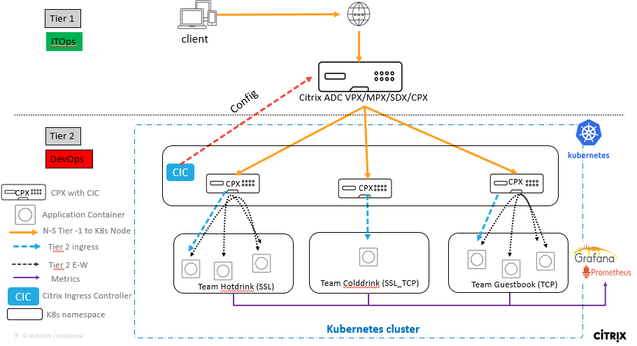
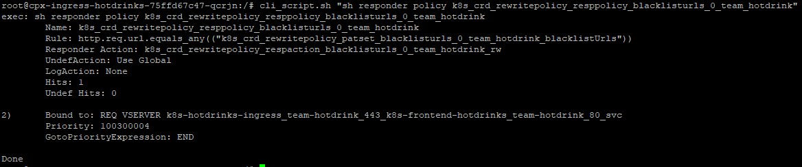

# Learn how to deploy Citrix ADC & microservices on Kubernetes on-prem cluster (Tier 1 ADC as Citrix ADC VPX, Tier 2 ADC as Citrix ADC CPX)

In this guide you will learn:
* What is service mesh lite deployment?
* How to deploy microservice applications listening on different protocols
* How to deploy a CPX in K8s cluster exposed as LoadBalancer, NodePort and Ingress type services.
* How does a Citrix ADC CPX Load Balancer microservice applications.
  * How does CPX Load balance North-South traffic received from Tier 1 ADC
  * How does CPX Load balance East-West traffic without sidecar proxy deployment. 
* How to isolate microservice application workload (microservice apps, CPX, CIC) using K8s namespace.
* How to configure Citrix ADC VPX (Tier 1 ADC) using Citrix Ingress Controller to load balance north-South ingress traffic for each team


Citrix ADC works in the two-tier architecture deployment solution to load balance the enterprise grade applications deployed in microservices and access those through internet. Tier 1 can have traditional load balancers such as VPX/SDX/MPX, or CPX (containerized Citrix ADC) to manage high scale north-south traffic. Tier 2 has CPX deployment for managing microservices and load balances the north-south & east-west traffic.

In the Kubernetes cluster, pod gets deployed across worker nodes. Below screenshot demonstrates the microservice deployment which contains 3 services marked in blue, red and green colour and 12 pods running across two worker nodes. These deployments are logically categorized by Kubenetes namespace (e.g. team-hotdrink namespace)


## Pre-requisite before you start microservice deployment

1.	Bring your own nodes (BYON)

    Kubernetes is an open-source system for automating deployment, scaling, and management of containerized applications. Please install and configure Kubernetes cluster with one master node and at least two worker node deployment.
    Recommended OS: Ubuntu 16.04 desktop/server OS. 
    Visit: https://kubernetes.io/docs/setup/ for Kubernetes cluster deployment guide.
    Once Kubernetes cluster is up and running, execute the below command on master node to get the node status.
    ``` 
    kubectl get nodes
    ```
    
 
    (Screenshot above has Kubernetes cluster with one master and one worker node).

2.	<u>[Optional]</u> Set up a Kubernetes dashboard for deploying containerized applications.
    
    Please visit https://kubernetes.io/docs/tasks/access-application-cluster/web-ui-dashboard/ and follow the steps mentioned to bring the Kubernetes dashboard up as shown below.

    

3. Add K8s CIDR routes to Tier 1 ADC to reach K8s network

    Make sure that route configuration is present in Tier 1 ADC so that Ingress NetScaler should be able to reach Kubernetes pod network for seamless connectivity. Please refer to https://github.com/citrix/citrix-k8s-ingress-controller/blob/master/docs/network/staticrouting.md#manually-configure-route-on-the-citrix-adc-instance for Network configuration.
    If you have K8s cluster and Tier 1 Citrix ADC in same subnet then you do not have to do anything, below example will take care of route info.
    You need Citrix Node Controller configuration only when K8s cluster and Tier 1 ADC are in different subnet. Please refer to https://github.com/citrix/citrix-k8s-node-controller for Network configuration.


Please select type of deployment (NodePort, Ingress solution or LoadBalancer Type service) you want to explore and continue with below section.

| Section | Description |
| ------- | ----------- |
| [Section A](#section-a-expose-cpx-as-nodeport-type-service) | Expose CPX as NodePort type service |
| [Section B](#section-b-expose-cpx-as-ingress-type-service) | Expose CPX as Ingress type service |
| [Section C](#section-c-expose-cpx-as-loadbalancer-type-service) | Expose CPX as LoadBalancer type service |


## Section A (Expose CPX as NodePort type service)

Lets understand the Service Mesh lite topology where CPX is exposed as NodePort type service.

We have three types of microservice applications (hotdrink, colddrink and guestbook beverages) deployed in K8s cluster. Each application is exposed on different protocol. In this demo you will learn how CPX load balances SSL, SSL-TCP and TCP type microservices.
Each applications are deployed in different namespaces to isolate their workload from other k8s deployments.
We deployed three CPXs to manage each application workload independently. Also we configured Tier 1 ADC - VPX to send ingress traffic to all microservices from individual CPXs.

1. Create K8s namespaces to manage team beverages workload independently
    ```
    kubectl create -f https://raw.githubusercontent.com/citrix/cloud-native-getting-started/master/on-prem/ServiceMeshLite/manifest/nodeport/namespace.yaml
    ```
    

2.	Deploy the CPXs for hotdrink, colddrink and guestbook beverages microservice apps

    Lets deploy CPX now,
    **Note:** Please upload your TLS certificate and TLS key into hotdrink-secret.yaml. We have updated our security policies and removed SSL certificate from guides.

    ```
    kubectl create -f https://raw.githubusercontent.com/citrix/cloud-native-getting-started/master/on-prem/ServiceMeshLite/manifest/nodeport/rbac.yaml
    kubectl create -f https://raw.githubusercontent.com/citrix/cloud-native-getting-started/master/on-prem/ServiceMeshLite/manifest/nodeport/cpx.yaml -n tier-2-adc
    kubectl create -f https://raw.githubusercontent.com/citrix/cloud-native-getting-started/master/on-prem/ServiceMeshLite/manifest/nodeport/hotdrink-secret.yaml -n tier-2-adc
    ```
    

3.	Deploy Hotdrink beverage microservices application in team-hotdrink namespace

    **Note:** Please upload your TLS certificate and TLS key into hotdrink-secret.yaml. We have updated our security policies and removed SSL certificate from guides.

    ```
    kubectl create -f https://raw.githubusercontent.com/citrix/cloud-native-getting-started/master/on-prem/ServiceMeshLite/manifest/nodeport/team_hotdrink.yaml -n team-hotdrink
    kubectl create -f https://raw.githubusercontent.com/citrix/cloud-native-getting-started/master/on-prem/ServiceMeshLite/manifest/nodeport/hotdrink-secret.yaml -n team-hotdrink
    ```
    

4.	Deploy the colddrink beverage microservice application in team-colddrink namespace

    **Note:** Please upload your TLS certificate and TLS key into colddrink-secret.yaml. We have updated our security policies and removed SSL certificate from guides.

    ```
    kubectl create -f https://raw.githubusercontent.com/citrix/cloud-native-getting-started/master/on-prem/ServiceMeshLite/manifest/nodeport/team_colddrink.yaml -n team-colddrink
    kubectl create -f https://raw.githubusercontent.com/citrix/cloud-native-getting-started/master/on-prem/ServiceMeshLite/manifest/nodeport/colddrink-secret.yaml -n team-colddrink
    ```
    

5.	Deploy the guestbook no SQL type microservice application in team-guestbook namespace
    ```
    kubectl create -f https://raw.githubusercontent.com/citrix/cloud-native-getting-started/master/on-prem/ServiceMeshLite/manifest/nodeport/team_guestbook.yaml -n team-guestbook
    ```
    

6.	(Optional) Login to Tier 1 ADC (VPX/SDX/MPX appliance) to verify no configuration present for K8s related workloads before automating the Tier 1 ADC configuration through Citrix Ingress Controller
    
    Note: If you do not have Tier 1 ADC already present in your setup then you can refer to [Citrix ADC VPX installation on XenCenter](https://github.com/citrix/cloud-native-getting-started/tree/master/VPX) for deploying Citrix ADC VPX as Tier 1 ADC.
    

7.	Deploy the VPX ingress and Citrix ingress controller to configure tier 1 ADC VPX automatically
    
    Create K8s secret for VPX login credentials used in CIC yaml file.
    ```
    kubectl create secret generic nsvpxlogin --from-literal=username='username' --from-literal=password='password' -n tier-2-adc
    ```
    Download ingress_vpx and cic_vpx yaml files to update Tier 1 ADC configurations
    ```
    wget https://raw.githubusercontent.com/citrix/cloud-native-getting-started/master/on-prem/ServiceMeshLite/manifest/nodeport/ingress_vpx.yaml
    wget https://raw.githubusercontent.com/citrix/cloud-native-getting-started/master/on-prem/ServiceMeshLite/manifest/nodeport/cic_vpx.yaml
    ```
    
    Update  ingress_vpx.yaml and cic_vpx.yaml with following configuration

    Go to ``ingress_vpx.yaml`` and change the IP address of ``ingress.citrix.com/frontend-ip: "x.x.x.x"`` annotation to one of the free IP which will act as content switching vserver for accessing microservices.
    e.g. ``ingress.citrix.com/frontend-ip: "10.105.158.160"``

    Go to ``cic_vpx.yaml`` and change the NS_IP value to your VPX NS_IP.         
    1.  ``- name: "NS_IP"
        value: "x.x.x.x"``
    2.  Update VPX crednetails in cic_vpx.yaml file 
    Now execute the following commands after the above change.
    ```
    kubectl create -f ingress_vpx.yaml -n tier-2-adc
    kubectl create -f cic_vpx.yaml -n tier-2-adc
    ```
    

8.	Yeah!!! Your application is successfully deployed and ready to access from Internet

    Add the DNS entries in your local machine host files for accessing microservices though Internet
    Path for host file:[Windows] ``C:\Windows\System32\drivers\etc\hosts`` [Macbook] ``/etc/hosts``
    Add below entries in hosts file and save the file

    ```
    <frontend-ip from ingress_vpx.yaml> hotdrink.beverages.com
    <frontend-ip from ingress_vpx.yaml> colddrink.beverages.com
    <frontend-ip from ingress_vpx.yaml> guestbook.beverages.com
    ```

    Lets access microservice app from local machine browser
    ```
    https://hotdrink.beverages.com
    https://colddrink.beverages.com
    https://guestbook.beverages.com
    ```
    


## Section B (Expose CPX as Ingress type service)
Lets understand the Service Mesh lite topology where CPX is exposed as Ingress type service.



We have three types of microservice applications (hotdrink, colddrink and guestbook beverages) deployed in K8s cluster. Each application is exposed on different protocol. In this demo you will learn how CPX load balances SSL, SSL-TCP and TCP type microservices.
Each applications are deployed in different namespaces to isolate their workload from other k8s deployments.
We deployed three CPXs to manage each application workload independently. Also we configured Tier 1 ADC - VPX to send ingress traffic to all microservices from individual CPXs.

In this deployment, hotdrink application has three apps - frontend hotdrink, tea and coffee load balanced via single Citrix ADC CPX. Tea and coffee microservices apps do E-W communication via CPX. We have used ``headless service architecture`` to enable E-W communication b/w tea and coffee.

1. Create K8s namespaces to manage team beverages workload independently
    ```
    kubectl create -f https://raw.githubusercontent.com/citrix/cloud-native-getting-started/master/on-prem/ServiceMeshLite/manifest/ingress/namespace.yaml
    ```
    

2.	Deploy the CPXs for hotdrink, colddrink and guestbook beverages microservice apps

    **Note:** Please upload your TLS certificate and TLS key into hotdrink-secret.yaml. We have updated our security policies and removed SSL certificate from guides.

    ```
    kubectl create -f https://raw.githubusercontent.com/citrix/cloud-native-getting-started/master/on-prem/ServiceMeshLite/manifest/ingress/cpx_rbac.yaml
    kubectl create -f https://raw.githubusercontent.com/citrix/cloud-native-getting-started/master/on-prem/ServiceMeshLite/manifest/ingress/cpx_hotdrink.yaml -n team-hotdrink
    ```
    

3.	Deploy Hotdrink beverage microservices application in team-hotdrink namespace
    Hotdrink beverage application has tea and coffee microserives having E-W communication enabled. Tea and Coffee beverage apps uses Citrix ADC CPX for E-W communication in ServiceMesh lite deployment. We create two service kinds for each tea and coffee services. One service will point to CPX where the FQDN of the microservice (for example, coffee) should point to the Citrix ADC CPX IP address instead of the Cluster IP of the target microservice (coffee). And another service as ``headless service`` to represent tea or coffee service. Detailed Service Mesh lite deployment using headless service is explained [here](https://github.com/citrix/citrix-k8s-ingress-controller/blob/master/docs/deploy/service-mesh-lite.md)

    **Note:** Please upload your TLS certificate and TLS key into hotdrink-secret.yaml. We have updated our security policies and removed SSL certificate from guides.

    ```
    kubectl create -f https://raw.githubusercontent.com/citrix/cloud-native-getting-started/master/on-prem/ServiceMeshLite/manifest/ingress/team_hotdrink.yaml -n team-hotdrink
    kubectl create -f https://raw.githubusercontent.com/citrix/cloud-native-getting-started/master/on-prem/ServiceMeshLite/manifest/ingress/hotdrink-secret.yaml -n team-hotdrink
    ```
    

4.	Deploy the colddrink beverage microservice application in team-colddrink namespace

    **Note:** Please upload your TLS certificate and TLS key into colddrink-secret.yaml. We have updated our security policies and removed SSL certificate from guides.
    ```
    kubectl create -f https://raw.githubusercontent.com/citrix/cloud-native-getting-started/master/on-prem/ServiceMeshLite/manifest/ingress/team_colddrink.yaml -n team-colddrink
    kubectl create -f https://raw.githubusercontent.com/citrix/cloud-native-getting-started/master/on-prem/ServiceMeshLite/manifest/ingress/colddrink-secret.yaml -n team-colddrink
    ```
    

5.	Deploy the guestbook no SQL type microservice application in team-guestbook namespace
    ```
    kubectl create -f https://raw.githubusercontent.com/citrix/cloud-native-getting-started/master/on-prem/ServiceMeshLite/manifest/ingress/team_guestbook.yaml -n team-guestbook
    ```
    

6.	(Optional) Login to Tier 1 ADC (VPX/SDX/MPX appliance) to verify no configuration present for K8s related workloads before automating the Tier 1 ADC configuration through Citrix Ingress Controller
    
    Note: If you do not have Tier 1 ADC already present in your setup then you can refer to [Citrix ADC VPX installation on XenCenter](https://github.com/citrix/cloud-native-getting-started/tree/master/VPX) for deploying Citrix ADC VPX as Tier 1 ADC.

7.	Deploy the VPX ingress and Citrix ingress controller to configure tier 1 ADC VPX automatically
    
    Create K8s secret for VPX login credentials used in CIC yaml file.
    ```
    kubectl create secret generic nsvpxlogin --from-literal=username='username' --from-literal=password='password' -n tier-2-adc
    ```
    Download ingress_vpx and cic_vpx yaml files to update Tier 1 ADC configurations
    ```
    wget https://raw.githubusercontent.com/citrix/cloud-native-getting-started/master/on-prem/ServiceMeshLite/manifest/ingress/ingress_vpx.yaml
    wget https://raw.githubusercontent.com/citrix/cloud-native-getting-started/master/on-prem/ServiceMeshLite/manifest/ingress/cic_vpx.yaml
    ```
    

    Update  ingress_vpx.yaml and cic_vpx.yaml with following configuration

    Go to ``ingress_vpx.yaml`` and change the IP address of ``ingress.citrix.com/frontend-ip: "x.x.x.x"`` annotation to one of the free IP which will act as content switching vserver for accessing microservices.
    e.g. ``ingress.citrix.com/frontend-ip: "10.105.158.160"``

    Go to ``cic_vpx.yaml`` and change the NS_IP value to your VPX NS_IP.         
    1.  ``- name: "NS_IP"
        value: "x.x.x.x"``
    2.  Update VPX crednetails in cic_vpx.yaml file 
    Now execute the following commands after the above change.
    ```
    kubectl create -f https://raw.githubusercontent.com/citrix/cloud-native-getting-started/master/on-prem/ServiceMeshLite/manifest/ingress/cic_rbac.yaml
    kubectl create -f https://raw.githubusercontent.com/citrix/cloud-native-getting-started/master/on-prem/ServiceMeshLite/manifest/ingress/hotdrink-secret.yaml -n tier-2-adc
    kubectl create -f ingress_vpx.yaml -n tier-2-adc
    kubectl create -f cic_vpx.yaml -n tier-2-adc
    ```
    

8.	Yeah!!! Your application is successfully deployed and ready to access from Internet

    Add the DNS entries in your local machine host files for accessing microservices though Internet
    Path for host file:[Windows] ``C:\Windows\System32\drivers\etc\hosts`` [Macbook] ``/etc/hosts``
    Add below entries in hosts file and save the file

    ```
    <frontend-ip from ingress_vpx.yaml> hotdrink.beverages.com
    <frontend-ip from ingress_vpx.yaml> colddrink.beverages.com
    <frontend-ip from ingress_vpx.yaml> guestbook.beverages.com
    ```

    Lets access microservice app from local machine browser
    ```
    https://hotdrink.beverages.com
    https://colddrink.beverages.com
    https://guestbook.beverages.com
    ```
    


## Section C (Expose CPX as LoadBalancer type service)

Lets understand the Service Mesh lite topology where CPX is exposed as LoadBalancer type service.


We have three types of microservice applications (hotdrink, colddrink and guestbook beverages) deployed in K8s cluster. Each application is exposed on different protocol. In this demo you will learn how CPX load balances SSL, SSL-TCP and TCP type microservices.
Each applications are deployed in different namespaces to isolate their workload from other k8s deployments.
We deployed three CPXs to manage each application workload independently. Also we configured Tier 1 ADC - VPX to send ingress traffic to all microservices from individual CPXs.


1. Create K8s namespaces to manage team beverages workload independently
    ```
    kubectl create -f https://raw.githubusercontent.com/citrix/cloud-native-getting-started/master/on-prem/ServiceMeshLite/manifest/LB/namespace.yaml
    ```
    

2.	Deploy the CPXs for hotdrink, colddrink and guestbook beverages microservice apps

    You can directly pass the user name and password as environment variables to the Citrix ingress controller or use K8s secrets (recommended). If you want to use K8s secrets, create a secret for the user name and password using the following command:
    ```
    kubectl create secret generic nslogin --from-literal=username='nsroot' --from-literal=password='nsroot' -n tier-2-adc
    ```
    Lets deploy CPX now,
    **Note:** Please upload your TLS certificate and TLS key into hotdrink-secret.yaml. We have updated our security policies and removed SSL certificate from guides.

    ```
    kubectl create -f https://raw.githubusercontent.com/citrix/cloud-native-getting-started/master/on-prem/ServiceMeshLite/manifest/LB/rbac.yaml
    kubectl create -f https://raw.githubusercontent.com/citrix/cloud-native-getting-started/master/on-prem/ServiceMeshLite/manifest/LB/cpx.yaml -n tier-2-adc
    kubectl create -f https://raw.githubusercontent.com/citrix/cloud-native-getting-started/master/on-prem/ServiceMeshLite/manifest/LB/hotdrink-secret.yaml -n tier-2-adc
    ```
    

3.	Deploy the IPAM CRD and IPAM controller for auto assigning the IP addresses to Kubernetes services
    ```
    kubectl create -f https://raw.githubusercontent.com/citrix/cloud-native-getting-started/master/on-prem/ServiceMeshLite/manifest/LB/vip.yaml
    wget https://raw.githubusercontent.com/citrix/cloud-native-getting-started/master/on-prem/ServiceMeshLite/manifest/LB/ipam_deploy.yaml
    ```
    
    Update ``ipam_deploy.yaml`` file, Change the IP range to your free VIP IP range for allocating IP from pool to access colddrink microservice
    
    e.g.        name: "VIP_RANGE"
                value: '["10.221.36.189", "10.221.36.189-192", "10.221.36.180/32"]'
    ```
    kubectl create -f ipam_deploy.yaml
    ```
    

4.	Deploy Hotdrink beverage microservices application in team-hotdrink namespace

    **Note:** Please upload your TLS certificate and TLS key into hotdrink-secret.yaml. We have updated our security policies and removed SSL certificate from guides.

    ```
    kubectl create -f https://raw.githubusercontent.com/citrix/cloud-native-getting-started/master/on-prem/ServiceMeshLite/manifest/LB/team_hotdrink.yaml -n team-hotdrink
    kubectl create -f https://raw.githubusercontent.com/citrix/cloud-native-getting-started/master/on-prem/ServiceMeshLite/manifest/LB/hotdrink-secret.yaml -n team-hotdrink
    ```
    

5.	Deploy the colddrink beverage microservice application in team-colddrink namespace

    **Note:** Please upload your TLS certificate and TLS key into colddrink-secret.yaml. We have updated our security policies and removed SSL certificate from guides.

    ```
    kubectl create -f https://raw.githubusercontent.com/citrix/cloud-native-getting-started/master/on-prem/ServiceMeshLite/manifest/LB/team_colddrink.yaml -n team-colddrink
    kubectl create -f https://raw.githubusercontent.com/citrix/cloud-native-getting-started/master/on-prem/ServiceMeshLite/manifest/LB/colddrink-secret.yaml -n team-colddrink
    ```
    

6.	Deploy the guestbook no SQL type microservice application in team-guestbook namespace
    ```
    kubectl create -f https://raw.githubusercontent.com/citrix/cloud-native-getting-started/master/on-prem/ServiceMeshLite/manifest/LB/team_guestbook.yaml -n team-guestbook
    ```
    

7.	(Optional) Login to Tier 1 ADC (VPX/SDX/MPX appliance) to verify no configuration present for K8s related workloads before automating the Tier 1 ADC configuration through Citrix Ingress Controller

    Note: If you do not have Tier 1 ADC already present in your setup then you can refer to [Citrix ADC VPX installation on XenCenter](https://github.com/citrix/cloud-native-getting-started/tree/master/VPX) for deploying Citrix ADC VPX as Tier 1 ADC.


8.	Deploy the VPX ingress and Citrix ingress controller to configure tier 1 ADC VPX automatically
    
    Create K8s secret for VPX login credentials used in CIC yaml file.
    ```
    kubectl create secret generic nsvpxlogin --from-literal=username='username' --from-literal=password='password' -n tier-2-adc
    ```
    Download cic_vpx yaml files to update Tier 1 ADC configurations
    ```
    wget https://raw.githubusercontent.com/citrix/cloud-native-getting-started/master/on-prem/ServiceMeshLite/manifest/LB/cic_vpx.yaml
    ```
    Update ``cic_vpx.yaml`` with  NS_IP value to your VPX NS_IP.         
    1.  ``- name: "NS_IP"
        value: "x.x.x.x"``
    2.  Update VPX crednetails in cic_vpx.yaml file 
    Now execute the following commands after the above change.
    ```
    kubectl create -f cic_vpx.yaml -n tier-2-adc
    ```
    

9.	Yeah!!! Your application is successfully deployed and ready to access from Internet

    Add the DNS entries in your local machine host files for accessing microservices though Internet
    Path for host file:[Windows] ``C:\Windows\System32\drivers\etc\hosts`` [Macbook] ``/etc/hosts``
    Add below entries in hosts file and save the file

    ```
    <frontend-ip from ingress_vpx.yaml> hotdrink.beverages.com
    <frontend-ip from ingress_vpx.yaml> colddrink.beverages.com
    <frontend-ip from ingress_vpx.yaml> guestbook.beverages.com
    ```

    Lets access microservice app from local machine browser
    ```
    https://hotdrink.beverages.com
    https://colddrink.beverages.com
    https://guestbook.beverages.com
    ```
    

## Integrate with Prometheus and Grafana for visualizing CPX time series metrics data

1.	Deploy the CNCF monitoring tools such as Prometheus and Grafana to collect ADC proxies� stats. Monitoring ingress yaml will push the configuration automatically to Tier 1 ADC.
    ```
    wget https://raw.githubusercontent.com/citrix/cloud-native-getting-started/master/on-prem/ServiceMeshLite/manifest/ingress/monitoring.yaml
    ```

    Update exporter container pod arguments:

    e.g. 
    - "--target-nsip=< CPX hotdrink POD IP >:9080"
    - "--target-nsip=< CPX colddrink POD IP >:9080"
    - "--target-nsip=< CPX guestbook POD IP >:9080"
    
    You can get the CPX pod IP using ``kubectl get pods -n tier-2-adc -o wide``

    ```
    wget https://raw.githubusercontent.com/citrix/cloud-native-getting-started/master/on-prem/ServiceMeshLite/manifest/LB/ingress_vpx_monitoring.yaml
    ```
    Update ``ingress_vpx_monitoring.yaml``file with ingress.citrix.com/frontend-ip: <Free IP used for exposing grafana dashboard through VPX>" 

    ```
    kubectl create -f monitoring.yaml -n monitoring
    kubectl create -f ingress_vpx_monitoring.yaml -n monitoring
    ```

2.	Add the DNS entries in your local machine host files for accessing monitoring portals though Internet.
    Path for host file: ``C:\Windows\System32\drivers\etc\hosts``
    Add below entries in hosts file and save the file
    ```
    <frontend-ip from ingress_vpx_monitoring.yaml> grafana.beverages.com
    <frontend-ip from ingress_vpx_monitoring.yaml> prometheus.beverages.com
    ```
3.	Login to ``http://grafana.beverages.com:8080`` and do the following one-time setup
    Login to portal using admin/admin credentials.
    Click on Add data source and select the Prometheus data source. Do the settings as shown below and click on save & test button.
 
    
 
    From the left panel, select import option and upload the json file provided in folder yamlFiles ``/example-cpx-vpx-for-kubernetes-2-tier-microservices/config/grafana_config.json``
    Now you can see the Grafana dashboard with basic ADC stats listed.
 
    
  

## Configure Rewrite and Responder policies in Citrix ADC using Kubernetes CRD deployment

Now it's time to push the Rewrite and Responder policies on Tier1 ADC (VPX) using the custom resource definition (CRD).

###### Deploy Rewrite and Responder policies in Tier 1 ADC

1. Deploy the CRD to push the Rewrite and Responder policies in to tier-1-adc in default namespace.

   ```
   https://raw.githubusercontent.com/citrix/cloud-native-getting-started/master/on-prem/config/crds/rewrite-responder-crd.yaml
   ```

2. **Blacklist URLs** Configure the Responder policy on `hotdrink.beverages.com` to block access to the coffee beverage microservice.

   ```
   kubectl create -f https://raw.githubusercontent.com/citrix/cloud-native-getting-started/master/on-prem/ServiceMeshLite/manifest/ingress/responderpolicy_hotdrink.yaml -n tier-2-adc
   ```

   After you deploy the Responder policy, access the coffee page on `https://hotdrink.beverages.com/coffee.php`. Then you receive the following message.
   
   

3. **Header insertion** Configure the Rewrite policy on `https://colddrink.beverages.com` to insert the session ID in the header.

   ```
   kubectl create -f https://raw.githubusercontent.com/citrix/cloud-native-getting-started/master/on-prem/ServiceMeshLite/manifest/ingress/rewritepolicy_colddrink.yaml -n tier-2-adc
   ```

   After you deploy the Rewrite policy, access `colddrink.beverages.com` with developer mode enabled on the browser. In Chrome, press F12 and preserve the log in network category to see the session ID, which is inserted by the Rewrite policy on tier-1-adc (VPX).

   

###### Deploy Rewrite and Responder policies in Tier 2 ADC - CPX

1. Deploy the CRD to push the Rewrite and Responder policies in to tier-1-adc in default namespace.

   ```
   https://raw.githubusercontent.com/citrix/cloud-native-getting-started/master/on-prem/config/crds/rewrite-responder-crd.yaml
   ```

2. **Blacklist URLs** Configure the Responder policy on `hotdrink.beverages.com` to block access to the coffee beverage microservice.

   ```
   kubectl create -f https://raw.githubusercontent.com/citrix/cloud-native-getting-started/master/on-prem/ServiceMeshLite/manifest/LB/responderpolicy_hotdrink.yaml -n team-hotdrink
   ```

    

## Clean up the deployment

```
wget https://raw.githubusercontent.com/citrix/cloud-native-getting-started/master/on-prem/ServiceMeshLite/manifest/ingress/clean-up.sh
chmod +x clean-up.sh
./clean-up.sh
```


### Packet Flow Diagrams

Citrix ADC solution supports the load balancing of various protocol layer traffic such as SSL,  SSL_TCP, HTTP, TCP. Below screenshot has listed different flavours of traffic supported by this demo.


# How user traffic reaches hotdrink-beverage microservices?

Client sends the traffic to Tier 1 ADC through Content Switching virtual server and reaches to pods where hotdrink beverage microservices are running. Detailed traffic flow is allocated in following gif picture (please wait for a moment on gif picture to see the packet flow).

 
# How user traffic reaches guestbook-beverage microservices?
Client sends the traffic to Tier 1 ADC through Content Switching virtual server and reaches to pods where guestbook beverage microservices are running. Detailed traffic flow is allocated in following gif picture (please wait for a moment on gif picture to see the packet flow).


Please refer to Citrix ingress controller for more information, present at- https://github.com/citrix/citrix-k8s-ingress-controller
