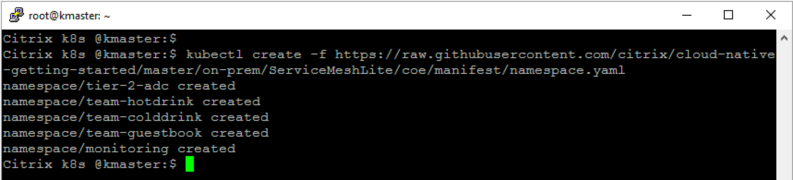
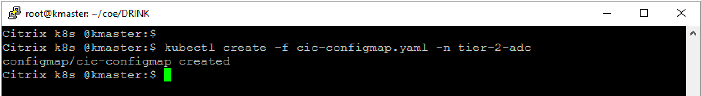

# Learn how to deploy Citrix Observability Exporter (COE) to monitor ADCs and microservices in cloud-native environment

In this guide you will learn:
* What is service mesh lite deployment?
* How to deploy microservices applications in service mesh lite deployment exposed using different protocols
* How to deploy a CPX in K8s cluster exposed as Ingress type services.
* How does a Citrix ADC CPX Load Balancer microservice applications.
  * How does CPX Load balance North-South traffic received from Tier 1 ADC
  * How does CPX Load balance East-West traffic without sidecar proxy deployment
* How to isolate microservice application workload (microservice apps, CPX, CIC) using K8s namespace.
* How to troubleshooting microservice time series and transactional metrics using Citrix Observability Exporter (COE)
  * How to send time series metrics from Citrix ADC Tier 1 and Tier 2 both to monitoring tool like Prometheus/Grafana
  * How to send transactional data from Citrix ADC Tier 1 and Tier 2 both to tracing tool like elasticsearch/Kibana


Citrix ADC works in the two-tier architecture deployment solution to load balance the enterprise grade applications deployed in microservices and access those through internet. Tier 1 can have traditional load balancers such as VPX/SDX/MPX, or CPX (containerised Citrix ADC) to manage high scale north-south traffic. Tier 2 has CPX deployment for managing microservices and load balances the north-south & east-west traffic.


Citrix Observability Exporter is a container which collects metrics and transactions from Citrix ADCs and export them to various end points like prometheus, elastic search etc. Know more about supported end points, deployment from [Citrix Observability Exporter](https://github.com/citrix/citrix-observability-exporter).


## Pre-requisite: Before you start COE integration

1.	Bring your own nodes (BYON)

    Kubernetes is an open-source system for automating deployment, scaling, and management of containerised applications. Please install and configure Kubernetes cluster with one master node and at least two worker node deployment.
    Recommended OS: Ubuntu 18.04 desktop/server OS. 
    Visit: https://kubernetes.io/docs/setup/ for Kubernetes cluster deployment guide.
    Once Kubernetes cluster is up and running, execute the below command on master node to get the node status.
    ``` 
    kubectl get nodes
    ```
    
 
    (The following example is validated on open source on-prem Kubernetes cluster version 1.22.1).

2.	<u>[Optional]</u> Set up a Kubernetes dashboard for deploying containerised applications.
    
    Please visit https://kubernetes.io/docs/tasks/access-application-cluster/web-ui-dashboard/ and follow the steps mentioned to bring the Kubernetes dashboard up as shown below.

    

3. Add K8s CIDR routes to Tier 1 ADC to reach K8s network

    Make sure that route configuration is present in Tier 1 ADC so that Ingress NetScaler should be able to reach Kubernetes pod network for seamless connectivity. Please refer to https://github.com/citrix/citrix-k8s-ingress-controller/blob/master/docs/network/staticrouting.md#manually-configure-route-on-the-citrix-adc-instance for Network configuration.
    If you have K8s cluster and Tier 1 Citrix ADC in same subnet then you do not have to do anything, below example will take care of route info.
    
    You need Citrix Node Controller configuration only when K8s cluster and Tier 1 ADC are in different subnet. Please refer to https://github.com/citrix/citrix-k8s-node-controller for Network configuration.


| Section | Description |
| ------- | ----------- |
| [Section A](https://github.com/citrix/cloud-native-getting-started/tree/master/on-prem/ServiceMeshLite/coe#section-a-deploy-service-mesh-lite-topology) | Deploy Service mesh lite topology |
| [Section B](https://github.com/citrix/cloud-native-getting-started/tree/master/on-prem/ServiceMeshLite/coe#section-b-deploy-coe-to-visualize-metrics-transactional-information) | Deploy COE to visualize metrics, transactional information |
| [Section C](https://github.com/citrix/cloud-native-getting-started/tree/master/on-prem/ServiceMeshLite/coe#section-c-clean-up) | Clean Up |
| [Section D](https://github.com/citrix/cloud-native-getting-started/tree/master/on-prem/ServiceMeshLite/coe#section-d-how-to-deploy-coe-video) | How to deploy COE video |

## Section A (Deploy Service mesh lite topology)

Lets understand the Service Mesh lite topology where CPX is exposed as Ingress type service.


We have three types of microservice applications (hotdrink, colddrink and guestbook beverages) deployed in K8s cluster. Each application is exposed on different protocol. In this demo you will learn how CPX load balances SSL, SSL-TCP and TCP type microservices.
Each applications are deployed in different namespaces to isolate their workload from other k8s deployments.
We deployed three CPXs to manage each application workload independently. Also we configured Tier 1 ADC - VPX to send ingress traffic to all microservices from individual CPXs.

1. Create K8s namespaces to manage team beverages workload independently
    ```
    kubectl create -f https://raw.githubusercontent.com/citrix/cloud-native-getting-started/master/on-prem/ServiceMeshLite/coe/manifest/namespace.yaml
    ```
    

2.	Deploy the CPXs for hotdrink, colddrink and guestbook beverages microservice apps

    Lets deploy CPX now,
    **Note:** Please upload your TLS certificate and TLS key into hotdrink-secret.yaml. We have updated our security policies and removed SSL certificate from guides.

    ```
    kubectl create -f https://raw.githubusercontent.com/citrix/cloud-native-getting-started/master/on-prem/ServiceMeshLite/coe/manifest/rbac.yaml
    kubectl create -f https://raw.githubusercontent.com/citrix/cloud-native-getting-started/master/on-prem/ServiceMeshLite/coe/manifest/cpx.yaml -n tier-2-adc
    kubectl create -f https://raw.githubusercontent.com/citrix/cloud-native-getting-started/master/on-prem/ServiceMeshLite/coe/manifest/hotdrink-secret.yaml -n tier-2-adc
    ```
    

3.	Deploy Hotdrink beverage microservices application in team-hotdrink namespace

    **Note:** Please upload your TLS certificate and TLS key into hotdrink-secret.yaml. We have updated our security policies and removed SSL certificate from guides.

    ```
    kubectl create -f https://raw.githubusercontent.com/citrix/cloud-native-getting-started/master/on-prem/ServiceMeshLite/coe/manifest/team-hotdrink.yaml -n team-hotdrink
    kubectl create -f https://raw.githubusercontent.com/citrix/cloud-native-getting-started/master/on-prem/ServiceMeshLite/coe/manifest/hotdrink-secret.yaml -n team-hotdrink
    ```
    

4.	Deploy the colddrink beverage microservice application in team-colddrink namespace

    **Note:** Please upload your TLS certificate and TLS key into colddrink-secret.yaml. We have updated our security policies and removed SSL certificate from guides.

    ```
    kubectl create -f https://raw.githubusercontent.com/citrix/cloud-native-getting-started/master/on-prem/ServiceMeshLite/coe/manifest/team-colddrink.yaml -n team-colddrink
    kubectl create -f https://raw.githubusercontent.com/citrix/cloud-native-getting-started/master/on-prem/ServiceMeshLite/coe/manifest/colddrink-secret.yaml -n team-colddrink
    ```
    

5.	Deploy the guestbook no SQL type microservice application in team-guestbook namespace
    ```
    kubectl create -f https://raw.githubusercontent.com/citrix/cloud-native-getting-started/master/on-prem/ServiceMeshLite/coe/manifest/team-guestbook.yaml -n team-guestbook
    ```
    

6.	Login to Tier 1 ADC (VPX/SDX/MPX appliance) to verify no configuration is pushed from Citrix Ingress Controller before automating the Tier 1 ADC
    
    Note: If you do not have Tier 1 ADC already present in your setup then you can refer to [Citrix ADC VPX installation on XenCenter](https://github.com/citrix/cloud-native-getting-started/tree/master/VPX) for deploying Citrix ADC VPX as Tier 1 ADC.

7.	Deploy the VPX ingress and Citrix ingress controller to configure tier 1 ADC VPX automatically
    ```
    wget https://raw.githubusercontent.com/citrix/cloud-native-getting-started/master/on-prem/ServiceMeshLite/coe/manifest/ingress-vpx.yaml
    wget https://raw.githubusercontent.com/citrix/cloud-native-getting-started/master/on-prem/ServiceMeshLite/coe/manifest/cic-vpx.yaml
    ```
    

    Update  ingress-vpx.yaml and cic-vpx.yaml with following configuration

    Go to ``ingress-vpx.yaml`` and change the IP address of ``ingress.citrix.com/frontend-ip: "x.x.x.x"`` annotation to one of the free IP which will act as content switching vserver for accessing microservices.
    e.g. ``ingress.citrix.com/frontend-ip: "10.105.158.160"``

    Go to ``cic-vpx.yaml`` and change the NS_IP value to your VPX NS_IP.         
    ``- name: "NS_IP"
      value: "x.x.x.x"``

    Create a secret for the login into Tier 1 ADC, Update username and password for your Tier 1 ADC and execute below command

    ```
    kubectl create secret generic nsloginvpx --from-literal=username='userA' --from-literal=password='password' -n tier-2-adc
    ```
    Now deploy CIC to configure Tier 1 ADC.
    ```
    kubectl create -f ingress-vpx.yaml -n tier-2-adc
    kubectl create -f cic-vpx.yaml -n tier-2-adc
    ```
    

8.	Yeah!!! Your application is successfully deployed and ready to access from Internet

    Add the DNS entries in your local machine host files for accessing microservices though Internet
    Path for host file:[Windows] ``C:\Windows\System32\drivers\etc\hosts`` [Macbook] ``/etc/hosts``
    Add below entries in hosts file and save the file

    ```
    <frontend-ip from ingress-vpx.yaml> hotdrink.beverages.com
    <frontend-ip from ingress-vpx.yaml> colddrink.beverages.com
    <frontend-ip from ingress-vpx.yaml> guestbook.beverages.com
    ```

    Lets access microservice app from local machine browser
    ```
    https://hotdrink.beverages.com
    https://colddrink.beverages.com
    https://guestbook.beverages.com
    ```
    


## Section B (Deploy COE to visualize metrics, transactional information)

In this demo, we will deploy COE to visualize time series data in Prometheus and Grafana dashboard and transactional data in elastic-search and Kibana dashboard.

Lets begin observability stack deployment using yamls

1. Deploy Citrix Observability Exporter to receive log stream information from Citrix ADCs.
    Lets create your own K8s secret used for secure traffic
    **Note:** Please upload your TLS certificate and TLS key into secret.yaml. We have updated our security policies and removed SSL certificate from guides.

    ```
    wget https://raw.githubusercontent.com/citrix/cloud-native-getting-started/master/on-prem/ServiceMeshLite/coe/manifest/ingress.crt
    wget https://raw.githubusercontent.com/citrix/cloud-native-getting-started/master/on-prem/ServiceMeshLite/coe/manifest/ingress.key
    kubectl create secret tls ing --cert=ingress.crt --key=ingress.key -n monitoring
    ```
    

    Lets deploy COE in K8s exposed as NodePort
    ```
    kubectl create -f https://raw.githubusercontent.com/citrix/cloud-native-getting-started/master/on-prem/ServiceMeshLite/coe/manifest/coe.yaml -n monitoring
    ```
    

    **Note** COE is exposed on pre-defined NodePort '30026' & '30071' for transactional & time series config respectively, this is optional step. You may go for auto selected NodePort by K8s.

    

    Lets deploy a config-map to provide end point details.
    ```
    wget https://raw.githubusercontent.com/citrix/cloud-native-getting-started/master/on-prem/ServiceMeshLite/coe/manifest/cic-configmap.yaml
    ```

    Update cic-configmap with following details;
    * Update server end point to your one-of the k8s worker node IP. You can find k8s worker node IP using ``kubectl get nodes -o wide``
    * In case you are not using pre-defined NodePorts in coe deployment then update time-series, transactional port details to respective nodeport.
    * cic-configmap is deployed in same namespace where CIC for Tier 1 and CPXs are deployed.

    ```
    kubectl create -f cic-configmap.yaml -n tier-2-adc
    ```
    

2. Deploy Observability/monitoring tools communicating with COE

    Lets deploy Prometheus and Grafana microservices used for visualize time-series metrics of Citrix ADCs
    ```
    kubectl create -f https://raw.githubusercontent.com/citrix/cloud-native-getting-started/master/on-prem/ServiceMeshLite/coe/manifest/prometheus-grafana.yaml -n monitoring
    ```
    Lets deploy elastic-search and Kibana to visualize transactional data of Citrix ADCs
    ```
    kubectl create -f https://raw.githubusercontent.com/citrix/cloud-native-getting-started/master/on-prem/ServiceMeshLite/coe/manifest/elasticsearch.yaml -n monitoring
    kubectl create -f https://raw.githubusercontent.com/citrix/cloud-native-getting-started/master/on-prem/ServiceMeshLite/coe/manifest/kibana.yaml -n monitoring
    ```
    

3. Deploy ingress route for monitoring tools to start receiving metrics, logs
    Download ingress template for monitoring tools.
    ```
    wget https://raw.githubusercontent.com/citrix/cloud-native-getting-started/master/on-prem/ServiceMeshLite/coe/manifest/ingress-vpx-monitoring.yaml 
    ```

    Update ``ingress.citrix.com/frontend-ip: `` to either same ingress IP as mentioned in ``ingress-vpx.yaml`` or assign new free IP.
    ```
    kubectl create -f ingress-vpx-monitoring.yaml -n monitoring
    ```
    
     
4.	Yeah!!! Your monitoring dashboards are deployed successfully and ready to access from Internet

     Add the DNS entries in your local machine host files for accessing microservices though Internet
     Path for host file:[Windows] ``C:\Windows\System32\drivers\etc\hosts`` [Macbook] ``/etc/hosts``
     Add below entries in hosts file and save the file
     ```
     <frontend-ip from ingress-vpx-monitoring.yaml> grafana.beverages.com
     <frontend-ip from ingress-vpx-monitoring.yaml> kibana.beverages.com
     <frontend-ip from ingress-vpx-monitoring.yaml> elasticsearch.beverages.com
     ```

### Setup Grafana Dashboard
* Login to ``http://grafana.beverages.com:8080`` and setup ADC health dashboard. 
* Select Create>Import option to upload JSON file.
* You can import ADC health JSON from ``https://raw.githubusercontent.com/citrix/cloud-native-getting-started/master/on-prem/ServiceMeshLite/coe/manifest/Grafana-ADC-HealthDashboard.json`` 
* Load the Prometheus dashboard to visualize ADC health metrics.


### Setup Kibana Dashboard
* Login to ``http://kibana.beverages.com:8080`` and setup App transaction dashboard. 
* Select Connect to your Elasticsearch index from Use Elasticsearch data to create index pattern. 
* Goto Saved Objects from left panel to import app trasanctional ndjson
* Click on Import option (from top right corner) to upload ``https://raw.githubusercontent.com/citrix/cloud-native-getting-started/master/on-prem/ServiceMeshLite/coe/manifest/KibanaAppTrans.ndjson``
* Select ``App Trasanction Dashboard`` from panel to start monitoring logs information.


## Section C (Clean Up)

```
kubectl delete -f https://raw.githubusercontent.com/citrix/cloud-native-getting-started/master/on-prem/ServiceMeshLite/coe/manifest/namespace.yaml
```

## Section D (How to deploy COE Video)

[](https://youtu.be/nRcyxwqRNlA)
