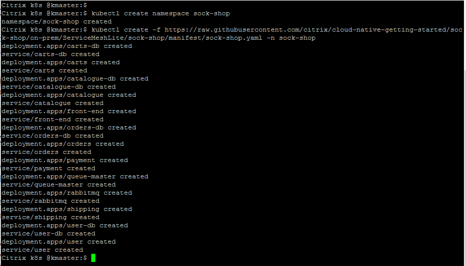
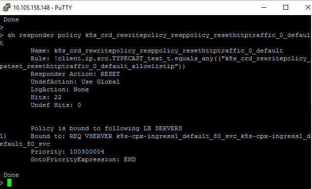

# Deploy Citrix Cloud Native Stack for a sample microservices app (sock-shop) 

The aim of this example is to show Citrix's Cloud Native stack for a sample microservices app. Citrix's Cloud Native stack consists of Citrix ADCs (CPX/VPX/MPX/SDX/BLX), Citrix Ingress Controller, Citrix ADM, Citrix Observability Exporter. 

In this example you will learn:

* How to deploy sock shop microservice applications without Citrix ADC
* How to insert Citrix ADC (VPX) in sock shop microservice applications for North South Load balancing
* How to insert Citrix ADC (CPX) in sock shop microservice applications for East-West Load balancing
* What is service mesh lite deployment?
* Expose CPXs using LoadBalancer service for simplified solution 
* Troubleshoot microservices using ADM service Graph
* Send time-series metrics for better Observability to Prometheus 


## Pre-requisite before you start microservice deployment

1.	Bring your own nodes (BYON)

    Kubernetes is an open-source system for automating deployment, scaling, and management of containerized applications. Please install and configure Kubernetes cluster with one master node and at least two worker node deployment.
    Recommended OS: Ubuntu 16.04 desktop/server OS. 
    Visit: https://kubernetes.io/docs/setup/ for Kubernetes cluster deployment guide.
    Once Kubernetes cluster is up and running, execute the below command on master node to get the node status.
    ``` 
    kubectl get nodes
    ```
    
 
    (The following example is validated on open source on-prem Kubernetes cluster version 1.17.0).

2.	<u> [Optional] </u> Set up a Kubernetes dashboard for deploying containerized applications.
    
    Please visit https://kubernetes.io/docs/tasks/access-application-cluster/web-ui-dashboard/ and follow the steps mentioned to bring the Kubernetes dashboard up as shown below.

    

3. Add K8s CIDR routes to Tier 1 ADC to reach K8s network

    Make sure that route configuration is present in Tier 1 ADC so that Ingress NetScaler should be able to reach Kubernetes pod network for seamless connectivity. Please refer to https://github.com/citrix/citrix-k8s-ingress-controller/blob/master/docs/network/staticrouting.md#manually-configure-route-on-the-citrix-adc-instance for Network configuration.
    If you have K8s cluster and Tier 1 Citrix ADC in same subnet then you do not have to do anything, below example will take care of route info.
    You need Citrix Node Controller configuration only when K8s cluster and Tier 1 ADC are in different subnet. Please refer to https://github.com/citrix/citrix-k8s-node-controller for Network configuration.


| Section | Description |
| ------- | ----------- |
| [Section A](https://github.com/citrix/cloud-native-getting-started/tree/master/on-prem/ServiceMeshLite/sock-shop#section-a-deploy-sock-shop-microservice-application-without-citrix-adc) | Deploy Sock-shop microservice application without Citrix ADC |
| [Section B](https://github.com/citrix/cloud-native-getting-started/tree/master/on-prem/ServiceMeshLite/sock-shop#section-b-deploy-sock-shop-microservice-application-using-citrix-cloud-native-stack) | Secure, Optimize North South Sock-shop microservice application Traffic using Citrix ADC  |
| [Section C](https://github.com/citrix/cloud-native-getting-started/tree/master/on-prem/ServiceMeshLite/sock-shop#section-c-secure-optimize-east-west-sock-shop-microservice-application-traffic-using-citrix-adc) | Secure, Optimize East West Sock-shop microservice application Traffic using Citrix ADC |
| [Section D](https://github.com/citrix/cloud-native-getting-started/tree/master/on-prem/ServiceMeshLite/sock-shop#section-d-troubleshoot-sock-shop-microservices-using-observability-tools---adm-service-graph-grafana) | Troubleshoot Sock-shop microservices using Observability tools - ADM Service graph, Grafana |
| [Section E](https://github.com/citrix/cloud-native-getting-started/tree/master/on-prem/ServiceMeshLite/sock-shop#section-e-clean-up) | Clean Up |


## Section A (Deploy Sock-shop microservice application without Citrix ADC)

Sock Shop is open source, (Apache License, Version 2.0) and is free to use for deployments. For more information refer to [Sock Shop-A Microservices Demo Application](https://microservices-demo.github.io/)
1. Lets deploy sock-shop application in K8s cluster
    ```
    kubectl create namespace sock-shop
    kubectl create -f https://raw.githubusercontent.com/citrix/cloud-native-getting-started/master/on-prem/ServiceMeshLite/sock-shop/manifest/sock-shop.yaml -n sock-shop
    ```
    

2. Lets see the status of sock-shop application deployment
    ```
    kubectl get pods -n sock-shop
    ```
    
    ```
    kubectl get svc -n sock-shop
    ```
    

3. Access Sock-Shop application exposed on NodePort (default deployment).
    ```
    http:// <K8s-Master-Node-Ip> : 30001
    ```
    


## Section B (Deploy Sock-shop microservice application using Citrix Cloud Native stack)

Let's understand the sock-shop application topology having Citrix ADC to deliver best user experience in North-South and East-West Load balancing.


In this topology, we have deployed 2 types of Citrix ADCs. One is VPX/MPX (non container proxy) for routing the North-South traffic for microservices. In this deployment, we have deployed VPX as Tier 1 ADC
Second is CPX (container proxy) for routing North-South Tier 1 traffic and East-West microservice traffic.
We are using 3 CPXs in this deployment where one CPX acts as North-South and East-West proxy and other two CPXs are dedicated East-West proxies.
This deployment has its own advantages over service mesh deployment such as;
* Citrix ADC Service Mesh lite topology eliminates need of CPX as sidecar proxy for each microservices
* One Citrix ADC CPX proxy can frontend more than one microservice application as shown in above topology diagram.

We have created automation script to generate deployment yamls for sock shop application supporting given topology.
You can refer to [SML generator tool](https://github.com/citrix/citrix-k8s-ingress-controller/blob/master/docs/deploy/service-mesh-lite.md#create-service-mesh-lite-yamls) for generating yamls file where CPX insertion is automated.

**Note:** SML yaml generator script insert CPX exposed as Ingress type service. However in this example I will modify yamls generated from tool to expose CPX using LoadBalancer type service.

Lets deploy the sock shop application in Service mesh lite deployment where
* Tier 1 ADC - VPX to ingress Secure North-South traffic. You can have MPX/BLX as TIer 1 ADC also.
* Tier 2 ADC - CPX to route North-South traffic from Tier 1 ADC to frontend sock-shop microservice application
* Tier 2 ADC - Two CPXs to route East-West traffic from sock-shop microservices


#### Use Case 1: Secure the sock-shop application traffic using Citrix ADC (Access application over SSL)

1. Lets deploy the sock-shop application with Citrix ADC to secure microservices from Internet.

    ```
    wget  https://raw.githubusercontent.com/citrix/cloud-native-getting-started/master/on-prem/ServiceMeshLite/sock-shop/manifest/sock-shop-with-cpx.yaml
    wget  https://raw.githubusercontent.com/citrix/cloud-native-getting-started/master/on-prem/ServiceMeshLite/sock-shop/manifest/sock-shop-tier1-cic.yaml
    wget  https://raw.githubusercontent.com/citrix/cloud-native-getting-started/master/on-prem/ServiceMeshLite/sock-shop/manifest/vip.yaml
    wget  https://raw.githubusercontent.com/citrix/cloud-native-getting-started/master/on-prem/ServiceMeshLite/sock-shop/manifest/ipam_deploy.yaml
    wget  https://raw.githubusercontent.com/citrix/cloud-native-getting-started/master/on-prem/ServiceMeshLite/sock-shop/manifest/sockshop-secret.yaml
    ```

    Update ``sock-shop-with-cpx.yaml`` yaml file with following values:

    To view Service Graph update following parameter in <u>cpx-ingress1, cpx-ingress2, cpx-ingress3 deployment kind</u>

    **Note:** You can comment or delete below Environment variables from yaml file if do not want explore ADM service graph
    
    i. NS_MGMT_SERVER -> With ADM agent IP or ADM onprem IP
    
    ii. "NS_MGMT_FINGER_PRINT" -> ADM agent fingerprint or ADM onprem fingerprint
    
    iii. "LOGSTREAM_COLLECTOR_IP" -> With ADM agent IP or ADM onprem IP
    
    iv. "NS_LOGPROXY" -> With ADM agent IP or ADM onprem IP

    Refer to [How to setup ADM Service Graph on ADM service](https://docs.citrix.com/en-us/citrix-application-delivery-management-service/application-analytics-and-management/service-graph-begin.html)

    Refer to [How to setup ADM Service Graph on ADM onprem](https://docs.citrix.com/en-us/citrix-application-delivery-management-software/13/application-analytics-and-management/service-graph-begin.html)

    You can directly pass the user name and password as environment variables to the Citrix ingress controller or use K8s secrets (recommended). If you want to use K8s secrets, create a secret for the user name and password using the following command:
    ```
    kubectl create secret generic nslogin --from-literal=username='nsroot' --from-literal=password='nsroot'
    ```
    **Note:** ``nslogin`` secret is used in Citrix Ingress Controller CPX sidecar container to login into CPX where you do not have to change any password. 

    ```
    kubectl create secret generic vpxlogin --from-literal=username='VPXUserName' --from-literal=password='VPXPassword'
    ```
    **Note:** ``vpxlogin`` secret is used for login into VPX (Tier 1 ADC), you have to update Tier 1 ADC login credentials.

    Lets deploy sock-shop application with Citrix ADC in place
    ```
    kubectl create -f sock-shop-with-cpx.yaml
    ```

2. Lets deploy SSL certificate to secure North-South traffic

    ```
    kubectl create -f sockshop-secret.yaml
    ```

3. Expose sock-shop application to Internet using External-IP

    Citrix Cloud Native stack has internal IP management logic to assign external-IP address for services exposed via LoadBalancer type service called as IPAM solution.
    We have created IPAM deployment using k8s native CRD infrastructure. Lets deploy CRD and provide IP range to external-IP selection.

    Update ``ipam_deploy.yaml`` yaml file with free IP list:
    ```        
    - name: "VIP_RANGE"
      value: '["10.105.158.196-10.105.158.199"]'
    ```
    Update VIP_RANGE values with free IP that will be used as front end IP (VIP) in Tier 1 ADC

    ```
    kubectl create -f vip.yaml
    kubectl create -f ipam_deploy.yaml
    ```

4. Deploy Citrix Ingress Controller to configure Tier 1 ADC automatically.

    Update ``sock-shop-tier1-cic.yaml`` yaml file with below values:
    ```
    - name: "NS_IP"
      value: "10.105.158.148"
    ```
    Change the NS_IP value to Tier 1 ADC of your deployment.

    ```
    kubectl create -f sock-shop-tier1-cic.yaml
    ```

    Check the status of your application deployment,
    ```
    kubectl get pods
    ```


    
    
    You will see that pod name starting with CPX are CPX container proxies.

    <u>**Optional**</u> If you are interested to check the CPX config, then follow below instructions:
    ```
    kubectl exec -it <cpx pod name> bash
    ```
    Once you are into CPX, execute ``cli_script.sh "sh cs vserver"`` to explore more.

    Check for below screenshot where I have logged into my CPX 1.
    
    

5. Your sock-shop application is ready to securely accessed via Citrix ADC

    Login to Tier 1 ADC and verify that sock-shop application configuration correctly.

    You can check External-IP for your cpx-ingress1 using below command:
    ```
    kubectl get svc
    ```
    

    Add the DNS entries in your local machine host files for accessing microservices though Internet

    Path for host file:[Windows] ``C:\Windows\System32\drivers\etc\hosts`` [Macbook] ``/etc/hosts``
    Add below entries in hosts file and save the file
    ```
    < External-IP from CPX service> citrix.weavesocks
    ```
    In my deployment External-IP is ``10.105.158.196`` which is exposed as frontend-IP in Tier 1 ADC

    Access `` https://citrix.weavesocks/ `` from browser and you will see sock-shop application running.

    

#### Use Case 2: Block non-secure the sock-shop application traffic using Citrix ADC (Reset sockshop HTTP traffic)

Citrix provides Kubernetes CustomResourceDefinitions (CRDs) that you can use with the Citrix ingress controller to automate the configurations and deployment of these policies on the Citrix ADCs used as Ingress devices.
The Rewrite and Responder CRD provided by Citrix is designed to expose a set of tools used in front-line Citrix ADCs. Using these functionalities you can rewrite the header and payload of ingress and egress HTTP traffic as well as respond to HTTP traffic on behalf of a microservice.

1. Deploy the Rewrite and Responder CRD in the Kubernetes cluster

    ```
    kubectl create -f https://raw.githubusercontent.com/citrix/cloud-native-getting-started/master/on-prem/ServiceMeshLite/sock-shop/manifest/rewrite-responder-policies-deployment.yaml
    ```

2. Reset the HTTP sock-shop application traffic using Citrix ADC responder policy

    We will deploy responder policy yaml file in K8s cluster for Tier 1 ADC - VPX and Citrix Ingress controller will configure this policy into VPX to block the HTTP traffic for sock-shop application.
    ```
    kubectl create -f  https://raw.githubusercontent.com/citrix/cloud-native-getting-started/master/on-prem/ServiceMeshLite/sock-shop/manifest/reset-http-ingress-traffic.yaml
    ```
    

    
    This is responder policy configuration applied to Tier 1 ADC.
    You can verify configuration from VPX responder policy. Path in VPX to check responder policy details : VPX -> AppExpert -> Responder -> Policies -> Policy starting with ``k8s-`` prefix

       

3. We have secured sock shop application from non-secure traffic.

    Access ``http://citrix.weavesocks/ `` from browser and Citrix ADC will RESET the connection. 
    You will find that responder policy hits will go up in Tier 1 ADC - VPX.
    
    
    Path in VPX to check responder policy hit count : VPX -> AppExpert -> Responder -> Policies -> Responder Policy starting with ``k8s`` prefix Hits column
    

#### Use Case 3: Allow controlled access only to trusted users using Citrix ADC (Allow white-listed IP addresses to access sock shop application)

Whitelisting IP addresses allows you to create a list of trusted IP addresses or IP address ranges from which users can access your domains. It is a security feature that is often used to limit and control access only to trusted users.
Using a Citrix ADC responder policy, you can whitelist IP addresses and silently drop the requests from the clients using IP addresses different from the whitelisted IP addresses.

1. Lets apply the responder policy at north-south CPX proxy to allow limited access for sock shop application
    ```
    kubectl create -f  https://raw.githubusercontent.com/citrix/cloud-native-getting-started/master/on-prem/ServiceMeshLite/sock-shop/manifest/whitelist-responder-policy.yaml
    ```
    

    You can verify the configuration from CPX-ingress 1

    

    Now, try to access ``https://citrix.weavesocks/ `` from browser you will see than your access is blocked by Citrix ADC policy.

    **Note:** You can change the IP address list from ``allowlistip patset`` of ``whitelist-responder-policy.yaml``, as per your whitelisted IPs.

    


## Section C (Secure, Optimize East West Sock-shop microservice application Traffic using Citrix ADC)
Citrix ADC can protect, optimize your microservice to microservice (East West traffic) deployment.

#### Use Case 1: Block access to internal service for user in East-West traffic using Citrix ADC (Block access to one microservice getting accessed by other microservices)

Your deployment may contain one secured application such as payment gateway/ user db etc which should be be accessible to any user than Admin.
In such scenarios, you can apply Citrix ADC policy for E-W traffic flow to block access for particular microservice.

In this use case, we will apply Citrix ADC policy to CPX for restricting the access for ``order microservice`` from all other microservices

1. Lets apply the responder policy at CPX for E-W service

    ```
    kubectl create -f  https://raw.githubusercontent.com/citrix/cloud-native-getting-started/master/on-prem/ServiceMeshLite/sock-shop/manifest/block-service-responder-policy.yaml
    ```
    

    Check the status of responder policy in CPX-2
    
    
    
    Now try to access ``order microservice`` from Shopping Cart by clicking on proceed to Checkout and you will not be allowed to place an order.

    

    Citrix ADC has blocked me to access an order microservice.
    
    

#### Use Case 2: Protect East-West microservices from DDos attack using Citrix ADC (Limit number of request sent to microservices)
In a Kubernetes deployment, you can rate limit the requests to the resources on the back end server or services using rate limiting feature provided by the ingress Citrix ADC.
Citrix provides a Kubernetes CustomResourceDefinitions (CRDs) called the Rate limit CRD that you can use with the Citrix ingress controller to configure the rate limiting configurations on the Citrix ADCs used as Ingress devices.

1. Lets apply the rate limiting CRD

    ```
    kubectl create -f  https://raw.githubusercontent.com/citrix/cloud-native-getting-started/master/on-prem/ServiceMeshLite/sock-shop/manifest/ratelimit-crd.yaml
    ```
    In this use case, we will apply rate limiting policy at CPX -1 to limit the number of request landing on ``https://citrix.weavesocks/category.html`` web page. We are controlling the number of request sent to ``catalogue microservice`` to optimize service performance.
    ```
    kubectl create -f  https://raw.githubusercontent.com/citrix/cloud-native-getting-started/master/on-prem/ServiceMeshLite/sock-shop/manifest/rate-limit-cart-api.yaml
    ```
    
    
    Check the status of rate limiting policy in CPX-1
    
    
    
    Now try to access ``https://citrix.weavesocks/category.html`` from browser frequently and you will find that traffic sent to catalogue service in under control.
    
    


## Section D (Troubleshoot Sock-shop microservices using Observability tools - ADM Service graph, Grafana)

Troubleshooting of microservices involves multiple challenges such as:
* Complexity adds up due to microservice to  microservice communication (East-West traffic)​
* Visibility into each microservice to microservice communication is painful
* SREs/Admins expect all microservices should be healthy and functional

Centralized observability tool like ADM service Graph addresses these issues,
* End to end North-South and East-West microservice traffic visibility​
* Detailed summary of  microservices using SRE golden metrics like Traffic, Errors, Latency etc 
* Detailed transactional data for each end user/service-service request​
* Distributed tracing support for debugging and understanding the application behavior.

You can view the ADM service graph either in ADM service or in ADM onprem appliance.

Refer to [How to setup ADM Service Graph on ADM service](https://docs.citrix.com/en-us/citrix-application-delivery-management-service/application-analytics-and-management/service-graph-begin.html)

Refer to [How to setup ADM Service Graph on ADM onprem](https://docs.citrix.com/en-us/citrix-application-delivery-management-software/13/application-analytics-and-management/service-graph-begin.html)

After successfully setting up ADM service graph, view the Service Graph from:
* ADM Service - > Applications - > Kubernetes Service graph
* ADM On prem - > Applications - > Kubernetes Service graph


#### Use Case 1: Microservice Details insights using ADM service Graph

Goto Kubernetes Service graph - > Hover on microservice to know more its details.

Example: In my Service Graph, I want to know the state of front-end headless microservice to know why is that microservice Orange (Orange , Red color code means specific service need attention of Admin)


It is visible that ``front-end headless `` microservice having *high ssl client errors* which need attention to be addressed.

#### Use Case 2: Debugging microservice Transactional records using ADM service Graph

Goto Kubernetes Service graph - > Click on microservice - > Select transaction logs to debug microservice transactional data.


You can select the transaction based on filters provided on right panel. e.g. transactional records for 500 HTTP response error code etc

This view provides you an insights on complete microservice deployment

#### Use Case 3:  Troubleshoot latency problems using Distributed Tracing using ADM service Graph

Distributed tracing support helps you to understand the behavior of an application and troubleshoot problems.
 
Goto Kubernetes Service graph - > Click on microservice - > Select Trace info - > Select particular trace to debug latency issues


This view provides you an insights on each and every trace information and also summarizes number of microservices involved in E-W communication with detailed latency information.

#### Use Case 4:  Visualize microservice time-series data using Prometheus, Grafana dashboards

1.	Deploy the CNCF monitoring tools such as Prometheus and Grafana to collect ADC proxies’ stats. Monitoring ingress yaml will push the configuration automatically to Tier 1 ADC.
    ```
    wget https://raw.githubusercontent.com/citrix/cloud-native-getting-started/master/on-prem/ServiceMeshLite/sock-shop/manifest/monitoring.yaml
    ```

    Update exporter container pod arguments:

    e.g. 
    - "--target-nsip=< CPX hotdrink POD IP >:9080"
    - "--target-nsip=< CPX colddrink POD IP >:9080"
    - "--target-nsip=< CPX guestbook POD IP >:9080"
    
    You can get the CPX pod IP using ``kubectl get pods -n tier-2-adc -o wide``

    ```
    wget https://raw.githubusercontent.com/citrix/cloud-native-getting-started/master/on-prem/ServiceMeshLite/sock-shop/manifest/prometheus-ingress.yaml
    ```
    Update ``ingress_vpx_monitoring.yaml``file with ingress.citrix.com/frontend-ip: <Free IP used for exposing grafana dashboard through VPX>" 

    ```
    kubectl create -f monitoring.yaml -n monitoring
    kubectl create -f ingress_vpx_monitoring.yaml -n monitoring
    ```

2.	Add the DNS entries in your local machine host files for accessing monitoring portals though Internet.
    Path for host file: ``C:\Windows\System32\drivers\etc\hosts``
    Add below entries in hosts file and save the file
    ```
    <frontend-ip from ingress_vpx_monitoring.yaml> grafana.beverages.com
    <frontend-ip from ingress_vpx_monitoring.yaml> prometheus.beverages.com
    ```
3.	Login to ``http://grafana.beverages.com:8080`` and do the following one-time setup
    Login to portal using admin/admin credentials.
    Click on Add data source and select the Prometheus data source. Do the settings as shown below and click on save & test button.
 
    
 
    From the left panel, select import option and upload the json file provided in folder yamlFiles ``/example-cpx-vpx-for-kubernetes-2-tier-microservices/config/grafana_config.json``
    Now you can see the Grafana dashboard with basic ADC stats listed.
 
    


## Section E (Clean UP)

```
kubectl delete -f sock-shop-with-cpx.yaml
kubectl delete -f sockshop-secret.yaml
kubectl delete -f vip.yaml
kubectl delete -f ipam_deploy.yaml
kubectl delete -f sock-shop-tier1-cic.yaml
kubectl delete namespace sock-shop
```
