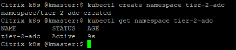

# Learn how to deploy Citrix ADC & microservices in Unified Ingress Topology on Kubernetes on-prem cluster (Tier 1 ADC as Citrix ADC VPX, Tier 2 as microservice apps)

In this guide you will learn:
* How to deploy a microservice application exposed as Ingress type service.
* How to deploy a microservice application exposed as Load Balancer type service.
* How to deploy a microservice application exposed as NodePort type service.
* Configure Citrix ADC VPX (Tier 1 ADC) using Citrix Ingress Controller to load balance all above three services.

Citrix ADC supports Unified Ingress architecture to load balance the enterprise grade applications deployed in microservices as Tier 2 layer. Tier 1 can have traditional load balancers such as VPX/SDX/MPX/BLX, or CPX (containerized Citrix ADC) to manage high scale north-south traffic. Lets understand the Unified Ingress topology from below diagram.


###### Step by step guide to deploy microservice in Unified Ingress Deployment

1.	Bring your own nodes (BYON)
Kubernetes is an open-source system for automating deployment, scaling, and management of containerized applications. Please install and configure Kubernetes cluster with one master node and at least two worker node deployment.
Visit: https://kubernetes.io/docs/setup/ for Kubernetes cluster deployment guide.

**Prerequisite**: Supported Kubernetes cluster v1.10 and above(Below example is tested in on-prem K8s cluster v1.17.0).

Once Kubernetes cluster is up and running, execute the below command on master node to get the node status.
``` 
kubectl get nodes
```

 (Screen-shot above has Kubernetes cluster with one master and one worker node).

2.	[Optional] Set up a Kubernetes dashboard for deploying containerized applications.
Please visit https://kubernetes.io/docs/tasks/access-application-cluster/web-ui-dashboard/ and follow the steps mentioned to bring the Kubernetes dashboard up as shown below.


3. Make sure that K8s cluster route information is present in Tier 1 ADC so that Ingress Citrix ADC should be able to reach Kubernetes pod network for seamless connectivity.

If you have K8s cluster and Tier 1 Citrix ADC in same subnet then you do not have to do anything, below example will take care of route info.
You need Citrix Node Controller configuration only when K8s cluster and Tier 1 ADC are in different subnet. Please refer to https://github.com/citrix/citrix-k8s-node-controller for Network configuration.


**Note: You can have choice to deploy microservices of you choice**

| Section | Description |
| ------- | ----------- |
| [Section A]() | Deploy hotdrink beverage microservice application exposed as Ingress Type service |
| [Section B]() | Deploy colddrink beverage microservice application exposed as Load Balancer Type service |
| [Section C]() | Deploy Guestbook microservice application exposed as NodePort Type service |


## Section A (Deploy hotdrink beverage microservice application exposed as Ingress Type service)


1. Create a namespaces using Kubernetes master CLI console.
```
kubectl create namespace tier-2-adc
```
Check the status of newly created namespace using below command:
```
kubectl get namespace tier-2-adc
```


2.	Lets authorize access to K8s resources and user by applying RBAC yaml.
```
kubectl create -f https://raw.githubusercontent.com/citrix/cloud-native-getting-started/master/on-prem/Unified-Ingress/manifest/rbac.yaml 
```

3.	Deploy the hotdrink beverage microservice application (Ingress type service)
Deploy hotdrink microservice
```
kubectl create -f https://raw.githubusercontent.com/citrix/cloud-native-getting-started/master/on-prem/Unified-Ingress/manifest/hotdrink.yaml -n tier-2-adc
kubectl create -f https://raw.githubusercontent.com/citrix/cloud-native-getting-started/master/on-prem/Unified-Ingress/manifest/hotdrink-secret.yaml -n tier-2-adc
```
Deploy Citrix Ingress Controller to configure Tier 1 ADC (I have used VPX as my Tier 1 ADC)
```
wget https://raw.githubusercontent.com/citrix/cloud-native-getting-started/master/on-prem/Unified-Ingress/manifest/tier-1-cic.yaml
```
Change "NS_IP" = <Tier 1 ADC NSIP> used in your deployment
Change username and password as per user credentials used for Tier 1 ADC.
```
kubectl create -f https://raw.githubusercontent.com/citrix/cloud-native-getting-started/master/on-prem/Unified-Ingress/manifest/tier-1-cic.yaml -n tier-2-adc
```
Deploy Ingress rule to send traffic to hotdrink beverages microservices
```
wget https://raw.githubusercontent.com/citrix/cloud-native-getting-started/master/on-prem/Unified-Ingress/manifest/tier-1-ingress.yaml -n tier-2-adc
```
Change "ingress.citrix.com/frontend-ip:" to free IP that you want to use as VIP.
```
kubectl create -f https://raw.githubusercontent.com/citrix/cloud-native-getting-started/master/on-prem/Unified-Ingress/manifest/tier-1-ingress.yaml -n tier-2-adc
```

4.	Login to Tier 1 ADC (VPX/SDX/MPX appliance) to verify no configuration is pushed from Citrix Ingress Controller before automating the Tier 1 ADC.
``
Note: If you do not have Tier 1 ADC already present in your setup then you can refer to [Citrix ADC VPX installation on XenCenter](https://github.com/citrix/cloud-native-getting-started/tree/master/VPX) for deploying Citrix ADC as Tier 1 ADC.
``
  
5.	Add the DNS entries in your local machine host files for accessing microservices though Internet.
Path for host file:[Windows] ``C:\Windows\System32\drivers\etc\hosts`` [Macbook] ``/etc/hosts``
Add below entries in hosts file and save the file

```
<frontend-ip from ingress_vpx.yaml> hotdrink.beverages.com
```
  
6.	Lets access hotdrink beverage microservice app from local machine browser.
e.g. ``https://hotdrink.beverages.com``


## Section B (Deploy colddrink beverage microservice application exposed as Load Balancer Type service)

1.  Deploy the colddrink beverage microservice application (LoadBalancer type service)
```
kubectl create -f https://raw.githubusercontent.com/citrix/cloud-native-getting-started/master/on-prem/Unified-Ingress/manifest/colddrink.yaml -n tier-2-adc
```

2. Deploy IPAM CRD and IPAM to allocate IP address to access colddrink beverage microservice
```
kubectl create -f https://raw.githubusercontent.com/citrix/cloud-native-getting-started/master/on-prem/Unified-Ingress/manifest/ipam-crd.yaml
wget https://raw.githubusercontent.com/citrix/cloud-native-getting-started/master/on-prem/Unified-Ingress/manifest/ipam.yaml
```
Change the IP range tp your free VIP IP range for allocating IP to access colddrink microservice
e.g.        - name: "VIP_RANGE"
            value: '["10.221.36.189", "10.221.36.189-192", "10.221.36.180/32"]'

```
kubectl create -f https://raw.githubusercontent.com/citrix/cloud-native-getting-started/master/on-prem/Unified-Ingress/manifest/ipam.yaml
```
 

## Section C (Deploy Guestbook microservice application exposed as NodePort Type service)

1.  Deploy the guestbook microservice application (NodePort type service)
```
kubectl create -f https://raw.githubusercontent.com/citrix/cloud-native-getting-started/master/on-prem/Unified-Ingress/manifest/guestbook.yaml -n tier-2-adc
```
 
2.	Add the DNS entries in your local machine host files for accessing microservices though Internet.
Path for host file:[Windows] ``C:\Windows\System32\drivers\etc\hosts`` [Macbook] ``/etc/hosts``
Add below entries in hosts file and save the file

```
<frontend-ip from ingress_vpx.yaml> guestbook.beverages.com
```
  
6.	Lets access hotdrink beverage microservice app from local machine browser.
e.g. ``https://guestbook.beverages.com``


## Configure Rewrite and Responder policies in Tier 1 ADC using Kubernetes CRD deployment

Now it's time to push the Rewrite and Responder policies on Tier1 ADC (VPX) using the custom resource definition (CRD).

1. Deploy the CRD to push the Rewrite and Responder policies in to tier-1-adc in default namespace.
```
kubectl create -f https://raw.githubusercontent.com/citrix/cloud-native-getting-started/master/on-prem/Unified-Ingress/manifest/rewrite-responder-crd.yaml
```
2. **Blacklist URLs** Configure the Responder policy on `hotdrink.beverages.com` to block access to the hotdrink beverage microservice.
```
kubectl create -f https://raw.githubusercontent.com/citrix/cloud-native-getting-started/master/on-prem/Unified-Ingress/manifest/responder-hotdrink.yaml
```

Now try to access `https://hotdrink.beverages.com ` and you will see that responder policy has blocked the access to hotdrink beverage microservice application.
   


### Packet Flow Diagrams
--------------------

Citrix ADC solution supports the load balancing of various protocol layer traffic such as SSL,  SSL_TCP, HTTP, TCP. Below screen-shot has listed different flavours of traffic supported by this demo.


# How user traffic reaches hotdrink-beverage microservices?

Client sends the traffic to Tier 1 ADC through Content Switching virtual server and reaches to pods where hotdrink beverage microservices are running. Detailed traffic flow is allocated in following gif picture (please wait for a moment on gif picture to see the packet flow).

 
# How user traffic reaches guestbook-beverage microservices?
Client sends the traffic to Tier 1 ADC through Content Switching virtual server and reaches to pods where guestbook beverage microservices are running. Detailed traffic flow is allocated in following gif picture (please wait for a moment on gif picture to see the packet flow).


Please refer to Citrix ingress controller for more information, present at- https://github.com/citrix/citrix-k8s-ingress-controller
