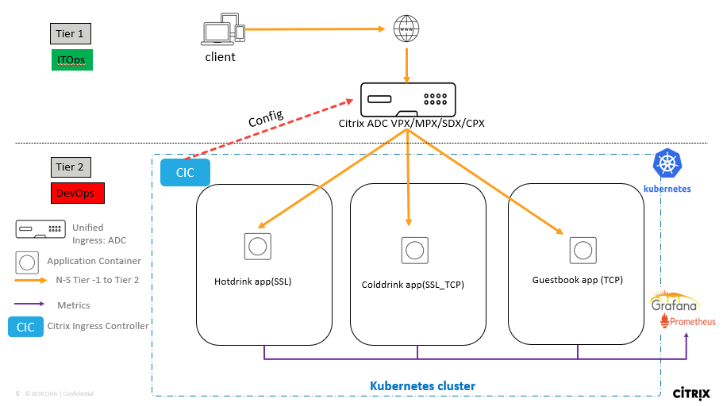
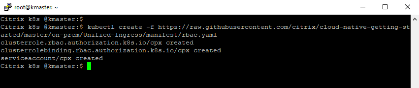
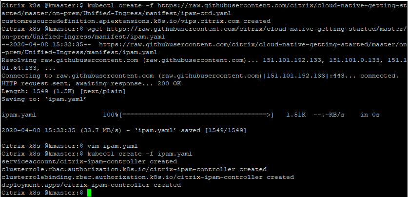
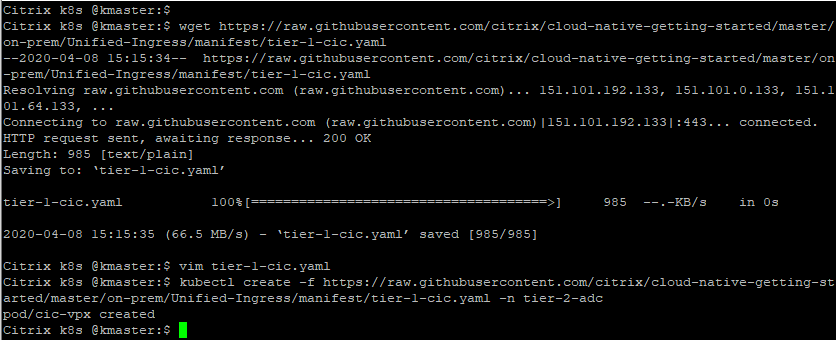
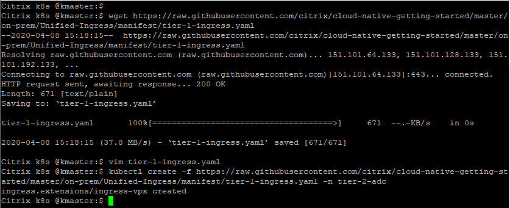
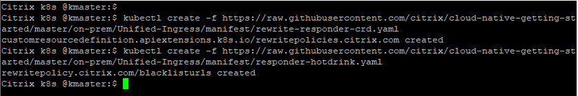

# Deploy Citrix Cloud native solution for Unified Ingress Topology in on-prem Kubernetes cluster (Tier 1 ADC as Citrix ADC VPX, Tier 2 as microservice applications)

In this guide you will learn:
* How to deploy a microservice application exposed as Ingress type service.
* How to deploy a microservice application exposed as Load Balancer type service.
* How to deploy a microservice application exposed as NodePort type service.
* How to configure Citrix ADC VPX (Tier 1 ADC) using Citrix Ingress Controller to load balance all above three services.

Citrix ADC supports Unified Ingress architecture to load balance an enterprise grade applications deployed as microservices. Citrix load balancers can be VPX/SDX/MPX/BLX, or CPX (containerized Citrix ADC) to manage high scale north-south traffic. Lets understand the Unified Ingress topology using below diagram.




###### Step by step guide to deploy microservices in Unified Ingress topology

1.	Bring your own nodes (BYON)

    Kubernetes is an open-source system for automating deployment, scaling, and management of containerized applications. Please install and configure Kubernetes cluster with one master node and at least two worker node deployment.
    Visit: https://kubernetes.io/docs/setup/ for Kubernetes cluster deployment guide.

    **Prerequisite**: Supported Kubernetes cluster v1.10 and above(Below example is tested in on-prem K8s cluster v1.17.0).

    Once Kubernetes cluster is up and running, execute the below command on master node to get the node status.
    ``` 
    kubectl get nodes
    ```
    

    (Screen-shot above has Kubernetes cluster with one master and one worker node).

2.	[Optional] Set up a Kubernetes dashboard for deploying containerized applications
    Please visit https://kubernetes.io/docs/tasks/access-application-cluster/web-ui-dashboard/ and follow the steps mentioned to bring the Kubernetes dashboard up as shown below.

    

3. Add K8s CIDR routes to Tier 1 ADC to reach K8s network

    Make sure that route configuration is present in Tier 1 ADC so that Ingress NetScaler should be able to reach Kubernetes pod network for seamless connectivity. Please refer to https://github.com/citrix/citrix-k8s-ingress-controller/blob/master/docs/network/staticrouting.md#manually-configure-route-on-the-citrix-adc-instance for Network configuration.
    If you have K8s cluster and Tier 1 Citrix ADC in same subnet then you do not have to do anything, below example will take care of route info.
    You need Citrix Node Controller configuration only when K8s cluster and Tier 1 ADC are in different subnet. Please refer to https://github.com/citrix/citrix-k8s-node-controller for Network configuration.

Lets start deploying each microservices one by one (you can opt for deploying one or more sections from below as per your choice),

| Section | Description |
| ------- | ----------- |
| [Section A](https://github.com/citrix/cloud-native-getting-started/tree/master/on-prem/Unified-Ingress#section-b-deploy-colddrink-beverage-microservice-application-exposed-as-load-balancer-type-service) | Deploy colddrink beverage microservice application exposed as Load Balancer Type service |
| [Section B](https://github.com/citrix/cloud-native-getting-started/tree/master/on-prem/Unified-Ingress#section-a-deploy-hotdrink-beverage-microservice-application-exposed-as-ingress-type-service) | Deploy hotdrink beverage microservice application exposed as Ingress Type service |
| [Section C](https://github.com/citrix/cloud-native-getting-started/tree/master/on-prem/Unified-Ingress#section-c-deploy-guestbook-microservice-application-exposed-as-nodeport-type-service) | Deploy Guestbook microservice application exposed as NodePort Type service |

### Section A (Deploy colddrink beverage microservice application exposed as Load Balancer type service)

1.	Lets authorize access to K8s resources and user by applying RBAC yaml
    ```
    kubectl create -f https://raw.githubusercontent.com/citrix/cloud-native-getting-started/master/on-prem/Unified-Ingress/manifest/rbac.yaml 
    ```
    

2.  Deploy the colddrink beverage microservice application (LoadBalancer type service)
    ```
    kubectl create namespace tier-2-adc
    kubectl create -f https://raw.githubusercontent.com/citrix/cloud-native-getting-started/master/on-prem/Unified-Ingress/manifest/colddrink.yaml -n tier-2-adc
    ```
    

3. Deploy IPAM CRD and IPAM to allocate IP address to access colddrink beverage microservice
    ```
    kubectl create -f https://raw.githubusercontent.com/citrix/cloud-native-getting-started/master/on-prem/Unified-Ingress/manifest/ipam-crd.yaml
    wget https://raw.githubusercontent.com/citrix/cloud-native-getting-started/master/on-prem/Unified-Ingress/manifest/ipam.yaml
    ```
    Change the IP range to your free VIP IP range for allocating IP from pool to access colddrink microservice
    
    e.g.        name: "VIP_RANGE"
                value: '["10.221.36.189", "10.221.36.189-192", "10.221.36.180/32"]'

    ```
    kubectl create -f ipam.yaml
    ```
     

4. Deploy Citrix Ingress Controller to configure Tier 1 ADC

    To configure Tier 1 ADC (I have used VPX as my Tier 1 ADC, you can refer to https://github.com/citrix/cloud-native-getting-started/tree/master/VPX for setting up VPX in XenServer)
    ```
    wget https://raw.githubusercontent.com/citrix/cloud-native-getting-started/master/on-prem/Unified-Ingress/manifest/tier-1-cic.yaml
    ```
    Change "NS_IP" = <Tier 1 ADC NSIP> used in your deployment
    Change username and password as per user credentials used for Tier 1 ADC.
    ```
    kubectl create -f tier-1-cic.yaml -n tier-2-adc
    ```
    

4. Access colddrink beverage microservice
    ```
    kubectl get svc -n tier-2-adc -o wide
    ```
    
    
    You can even access colddrink application from local browser using URL - ``http://< External-IP for colddrink app >`` (e.g. http://10.105.158.196)

### Section B (Deploy hotdrink beverage microservice application exposed as Ingress Type service)

1.	Deploy hotdrink beverage microservice application (Ingress type service)

    Deploy hotdrink microservice
    **Note:** Please upload your TLS certificate and TLS key into hotdrink-secret.yaml. We have updated our security policies and removed SSL certificate from guides.
    
    ```
    kubectl create -f https://raw.githubusercontent.com/citrix/cloud-native-getting-started/master/on-prem/Unified-Ingress/manifest/hotdrink.yaml -n tier-2-adc
    kubectl create -f https://raw.githubusercontent.com/citrix/cloud-native-getting-started/master/on-prem/Unified-Ingress/manifest/hotdrink-secret.yaml -n tier-2-adc
    ```
    
    
2.  Deploy Ingress rule to send traffic to hotdrink beverages microservices
    ```
    wget https://raw.githubusercontent.com/citrix/cloud-native-getting-started/master/on-prem/Unified-Ingress/manifest/tier-1-ingress.yaml
    ```
    Change "ingress.citrix.com/frontend-ip:" to free IP that you want to use as Ingress IP.
    ```
    kubectl create -f tier-1-ingress.yaml -n tier-2-adc
    ```
    
    
    Note: tier-1-ingress.yaml contains the ingress rule for guestbook microservice deployment (Section C)

3.	Login to Tier 1 ADC (VPX/SDX/MPX appliance) to verify that hotdrink microservice application configuration has been pushed through Citrix Ingress Controller
    
4.	Add the DNS entries in your local machine host files for accessing microservices though Internet
    Path for host file:[Windows] ``C:\Windows\System32\drivers\etc\hosts`` [Macbook] ``/etc/hosts``
    Add below entries in hosts file and save the file

    ```
    <frontend-ip from ingress_vpx.yaml> hotdrink.beverages.com
    ```
  
5.	Lets access hotdrink beverage microservice app from local machine browser
    e.g. ``https://hotdrink.beverages.com``


### Section C (Deploy Guestbook microservice application exposed as NodePort Type service)

1.  Deploy the guestbook microservice application (NodePort type service)
    ```
    kubectl create -f https://raw.githubusercontent.com/citrix/cloud-native-getting-started/master/on-prem/Unified-Ingress/manifest/guestbook.yaml -n tier-2-adc
    ```
     
 
2.	Add the DNS entries in your local machine host files for accessing microservices though Internet
    Path for host file:[Windows] ``C:\Windows\System32\drivers\etc\hosts`` [Macbook] ``/etc/hosts``
    Add below entries in hosts file and save the file

    ```
    <frontend-ip from ingress_vpx.yaml> guestbook.beverages.com
    ```
  
3.	Lets access hotdrink beverage microservice app from local machine browser
    e.g. ``https://guestbook.beverages.com``


### Configure Rewrite and Responder policies in Tier 1 ADC using Kubernetes CRD deployment

Now it's time to push the Rewrite and Responder policies on Tier1 ADC (VPX) using the custom resource definition (CRD).

1. Deploy the CRD to push the Rewrite and Responder policies in to tier-2-adc in default namespace
    ```
    kubectl create -f https://raw.githubusercontent.com/citrix/cloud-native-getting-started/master/on-prem/Unified-Ingress/manifest/rewrite-responder-crd.yaml
    ```
2. **Blacklist URLs** Configure the Responder policy on `hotdrink.beverages.com` to block access to the hotdrink beverage microservice
    ```
    kubectl create -f https://raw.githubusercontent.com/citrix/cloud-native-getting-started/master/on-prem/Unified-Ingress/manifest/responder-hotdrink.yaml
    ```
     

    Now try to access `https://hotdrink.beverages.com ` and you will see that responder policy has blocked the access to hotdrink beverage microservice application.
   
### Clean UP deployment
    ```
    kubectl delete -f https://raw.githubusercontent.com/citrix/cloud-native-getting-started/master/on-prem/Unified-Ingress/manifest/colddrink.yaml -n tier-2-adc
    kubectl delete -f https://raw.githubusercontent.com/citrix/cloud-native-getting-started/master/on-prem/Unified-Ingress/manifest/ipam-crd.yaml
    kubectl delete -f ipam.yaml
    kubectl delete -f https://raw.githubusercontent.com/citrix/cloud-native-getting-started/master/on-prem/Unified-Ingress/manifest/rbac.yaml 
    kubectl delete -f https://raw.githubusercontent.com/citrix/cloud-native-getting-started/master/on-prem/Unified-Ingress/manifest/hotdrink.yaml -n tier-2-adc
    kubectl delete -f https://raw.githubusercontent.com/citrix/cloud-native-getting-started/master/on-prem/Unified-Ingress/manifest/hotdrink-secret.yaml -n tier-2-adc
    kubectl delete -f tier-1-ingress.yaml -n tier-2-adc
    kubectl delete -f tier-1-cic.yaml -n tier-2-adc
    kubectl delete -f https://raw.githubusercontent.com/citrix/cloud-native-getting-started/master/on-prem/Unified-Ingress/manifest/guestbook.yaml -n tier-2-adc
    kubectl delete -f https://raw.githubusercontent.com/citrix/cloud-native-getting-started/master/on-prem/Unified-Ingress/manifest/rewrite-responder-crd.yaml
    kubectl delete namespace tier-2-adc  
    ```


### Packet Flow Diagrams
--------------------

Citrix ADC solution supports the load balancing of various protocol layer traffic such as SSL,  SSL_TCP, HTTP, TCP. Below screen-shot has listed different flavours of traffic supported by this demo.


#### How does ingress traffic reache hotdrink-beverage microservices?

Client sends the traffic to Tier 1 ADC through Content Switching virtual server and reaches to pods where hotdrink beverage microservices are running. Detailed traffic flow is allocated in following gif picture (please wait for a moment on gif picture to see the packet flow).

 
#### How does ingress traffic reach guestbook-beverage microservices?
Client sends the traffic to Tier 1 ADC through Content Switching virtual server and reaches to pods where guestbook beverage microservices are running. Detailed traffic flow is allocated in following gif picture (please wait for a moment on gif picture to see the packet flow).


Please refer to Citrix ingress controller for more information, present at- https://github.com/citrix/citrix-k8s-ingress-controller
For next tutorial, visit [cloud-native-getting-started](https://github.com/citrix/cloud-native-getting-started)
