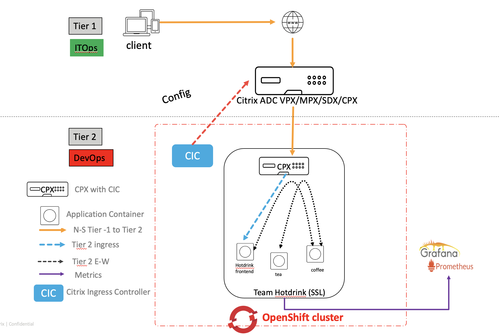
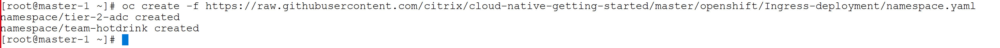
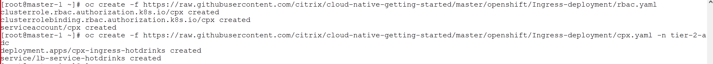
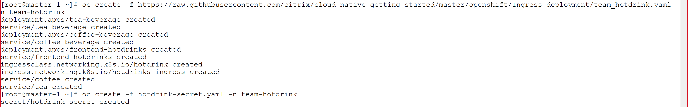
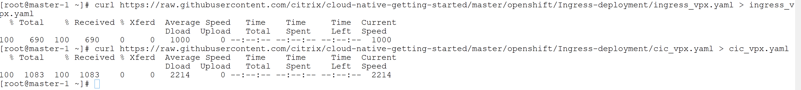
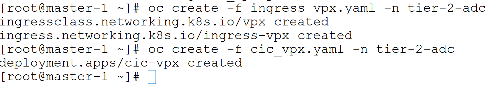

# Learn how to deploy Citrix ADC & microservices on OpenShift on-prem cluster (Tier 1 ADC as Citrix ADC VPX, Tier 2 ADC as Citrix ADC CPX)

In this guide you will learn:
* What is service mesh lite deployment?
* How to deploy microservice applications listening on different protocols
* How to deploy a CPX in OpenShift cluster exposed as Ingress type service.
* How does a Citrix ADC CPX Load Balance microservice applications.
  * How does CPX Load balance North-South traffic received from Tier 1 ADC
  * How does CPX Load balance East-West traffic without sidecar proxy deployment. 
* How to isolate microservice application workload (microservice apps, CPX, CIC) using K8s namespace.
* How to configure Citrix ADC VPX (Tier 1 ADC) using Citrix Ingress Controller to load balance north-south ingress traffic for each team


Lets understand the Service Mesh lite topology where CPX is exposed as Ingress type service



We have a microservice based application called hotdrink beverages deployed in OpenShift cluster. This application is exposed on SSL protocol. In this demo you will learn how CPX load balances SSL type microservices.
This  applications is deployed in different namespace than proxy namespace to showcase namespace based deployment.
We will deploy one CPX to manage hotdrink beverage application workload. Also we configured Tier 1 ADC - VPX to send ingress traffic to CPX microservice for hotdrink app.

In this deployment, hotdrink application has three apps - frontend hotdrink, tea and coffee load balanced via single Citrix ADC CPX. Tea and coffee microservices apps do E-W communication via CPX. We have used ``headless service architecture`` to enable E-W communication b/w tea and coffee.


1.	Bring your own nodes (BYON)

Red Hat OpenShift is an container application platform based on the Kubernetes container orchestrator for enterprise application development and deployment. Please install and configure OpenShift cluster with one master node and at least one worker node deployment.

Recommended OS: Red Hat Enterprise Linux 7.6 and above

Visit: https://docs.openshift.com/container-platform/3.11/install/running_install.html for OpenShift cluster deployment guide.
Once OpenShift cluster is up and running, execute the below command on master node to get the node status.
``` 
oc get nodes
```

 
(Screenshot above has OpenShift cluster with one master and two worker node).


**Pre-Requisites:**

Make sure that route configuration  is present in Tier 1 ADC so that Ingress NetScaler should be able to reach Kubernetes  pod network for seamless connectivity. 
Please refer to Section `Configure static routes on Citrix ADC VPX or MPX to reach the pods inside the OpenShift cluster` from https://github.com/citrix/citrix-k8s-ingress-controller/tree/master/deployment/openshift#deploy-the-citrix-ingress-controller-as-a-pod-in-an-openshift-cluster  for Network configuration.

Note: Route configuration on the Citrix ADC (Tier 1) instance is manual for OpenShift cluster.


1. Create K8s namespaces to manage team beverages workload independently
    ```
    oc create -f https://raw.githubusercontent.com/citrix/cloud-native-getting-started/master/openshift/Ingress-deployment/namespace.yaml
    ```
    

2. Deploy the CPXs for hotdrink, colddrink and guestbook beverages microservice apps

    **Note:** Please upload your TLS certificate and TLS key into hotdrink-secret.yaml. We have updated our security policies and removed SSL certificate from guides.

    ```
    oc create -f https://raw.githubusercontent.com/citrix/cloud-native-getting-started/master/openshift/Ingress-deployment/rbac.yaml
    oc create -f https://raw.githubusercontent.com/citrix/cloud-native-getting-started/master/openshift/Ingress-deployment/cpx.yaml -n tier-2-adc
    oc create -f https://raw.githubusercontent.com/citrix/cloud-native-getting-started/master/openshift/Ingress-deployment/hotdrink-secret.yaml -n tier-2-adc
    ```
    

3. Deploy Hotdrink beverage microservices application in team-hotdrink namespace
    Hotdrink beverage application has tea and coffee microserives having E-W communication enabled. Tea and Coffee beverage apps uses Citrix ADC CPX for E-W communication in ServiceMesh lite deployment. We create two service kinds for each tea and coffee services. One service will point to CPX where the FQDN of the microservice (for example, coffee) should point to the Citrix ADC CPX IP address instead of the Cluster IP of the target microservice (coffee). And another service as ``headless service`` to represent tea or coffee service. Detailed Service Mesh lite deployment using headless service is explained [here](https://github.com/citrix/citrix-k8s-ingress-controller/blob/master/docs/deploy/service-mesh-lite.md)

    **Note:** Please upload your TLS certificate and TLS key into hotdrink-secret.yaml. We have updated our security policies and removed SSL certificate from guides.

    ```
    oc create -f https://raw.githubusercontent.com/citrix/cloud-native-getting-started/master/openshift/Ingress-deployment/team_hotdrink.yaml -n team-hotdrink
    oc create -f https://raw.githubusercontent.com/citrix/cloud-native-getting-started/master/openshift/Ingress-deployment/hotdrink-secret.yaml -n team-hotdrink
    ```
    


4. (Optional) Login to Tier 1 ADC (VPX/SDX/MPX appliance) to verify no configuration present for K8s related workloads before automating the Tier 1 ADC configuration through Citrix Ingress Controller
    
    Note: If you do not have Tier 1 ADC already present in your setup then you can refer to [Citrix ADC VPX installation on XenCenter](https://github.com/citrix/cloud-native-getting-started/tree/master/VPX) for deploying Citrix ADC VPX as Tier 1 ADC.

5. Deploy the VPX ingress and Citrix ingress controller to configure tier 1 ADC VPX automatically
    
    Create K8s secret for VPX login credentials used in CIC yaml file.
    ```
    kubectl create secret generic nsvpxlogin --from-literal=username='username' --from-literal=password='password' -n tier-2-adc
    ```
    Download ingress_vpx and cic_vpx yaml files to update Tier 1 ADC configurations
    ```
    wget https://raw.githubusercontent.com/citrix/cloud-native-getting-started/master/openshift/Ingress-deployment/ingress_vpx.yaml
    wget https://raw.githubusercontent.com/citrix/cloud-native-getting-started/master/openshift/Ingress-deployment/cic_vpx.yaml
    ```
    

    Update  ingress_vpx.yaml and cic_vpx.yaml with following configuration

    Go to ``ingress_vpx.yaml`` and change the IP address of ``ingress.citrix.com/frontend-ip: "x.x.x.x"`` annotation to one of the free IP which will act as content switching vserver for accessing microservices.
    e.g. ``ingress.citrix.com/frontend-ip: "10.105.158.160"``

    Go to ``cic_vpx.yaml`` and change the NS_IP value to your VPX NS_IP.         
    1.  ``- name: "NS_IP"
        value: "x.x.x.x"``
    2.  Update VPX crednetails in cic_vpx.yaml file 
    Now execute the following commands after the above change.
    ```
    oc create -f ingress_vpx.yaml -n tier-2-adc
    oc create -f cic_vpx.yaml -n tier-2-adc
    ```
    

8. Yeah!!! Your application is successfully deployed and ready to access from Internet

    Add the DNS entries in your local machine host files for accessing microservices though Internet
    Path for host file:[Windows] ``C:\Windows\System32\drivers\etc\hosts`` [Macbook] ``/etc/hosts``
    Add below entries in hosts file and save the file

    ```
    <frontend-ip from ingress_vpx.yaml> hotdrink.beverages.com
    ```

    Lets access microservice app from local machine browser
    ```
    https://hotdrink.beverages.com
    ```
    


## Clean up the deployment
```
oc delete -f https://raw.githubusercontent.com/citrix/cloud-native-getting-started/master/openshift/Ingress-deployment/namespace.yaml
```


### Packet Flow Diagrams
--------------------

Citrix ADC solution supports the load balancing of various protocol layer traffic such as SSL,  SSL_TCP, HTTP, TCP. In above example we have deployed hotdrink application over SSL where you can see from the below screnshot that client will access hotdrink app over end to end SSL protocol.


