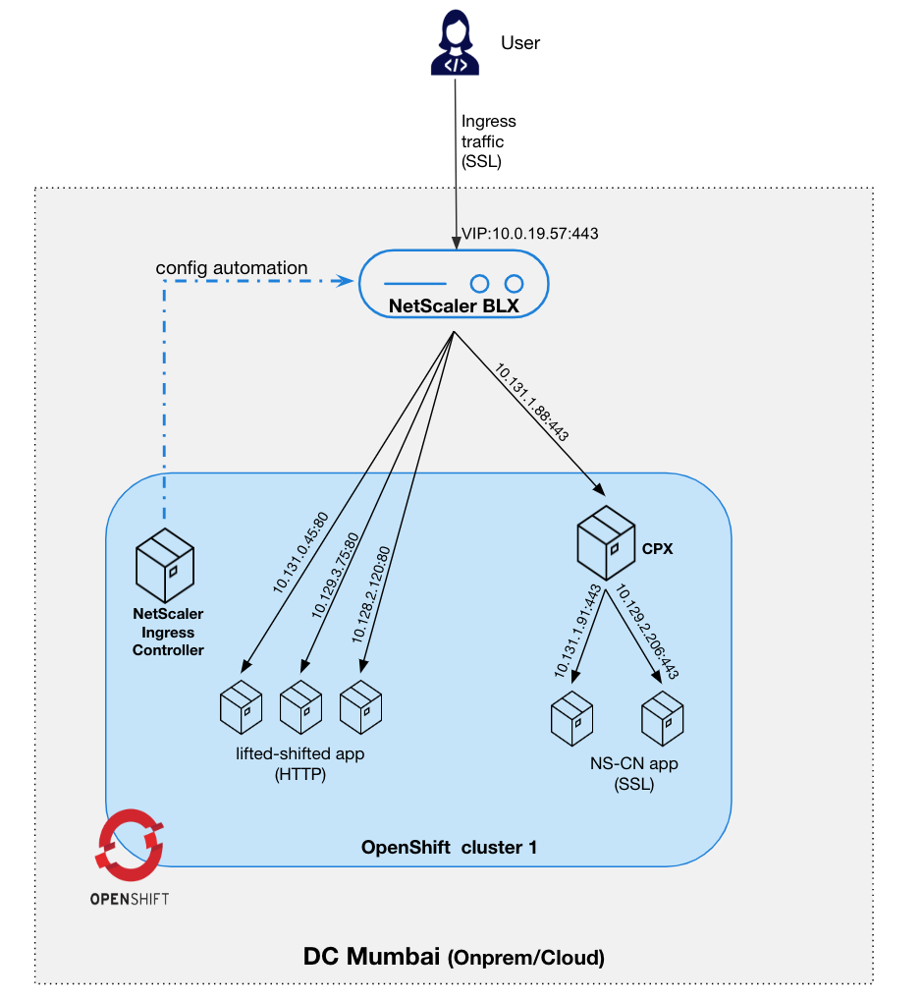
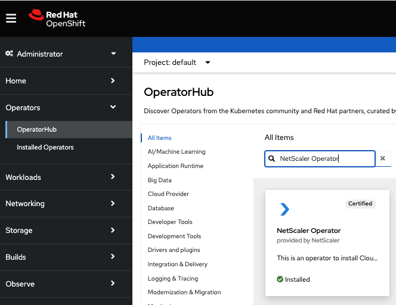
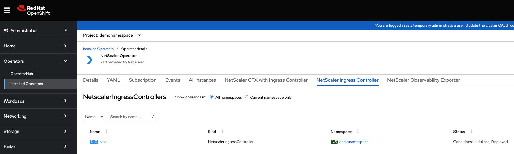
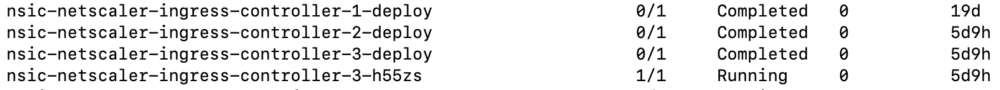
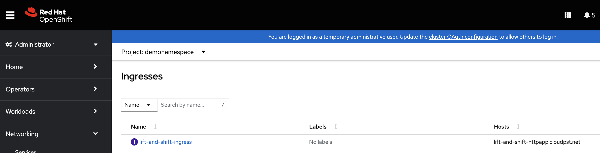
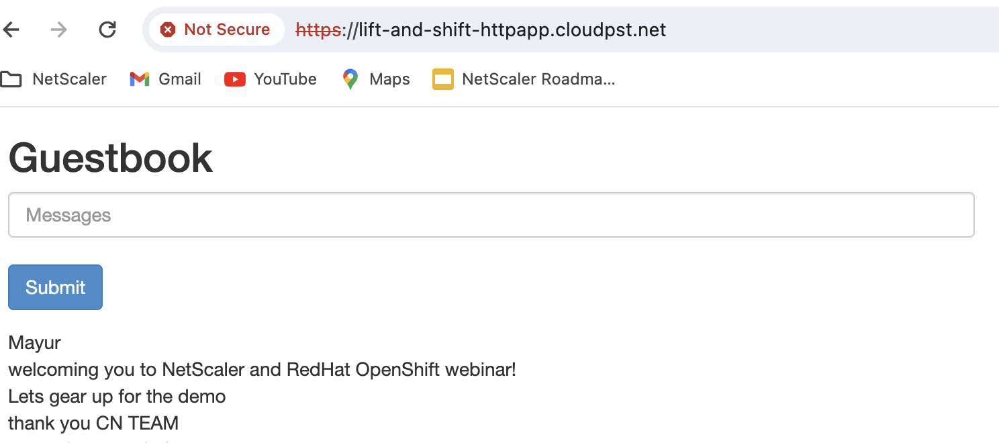
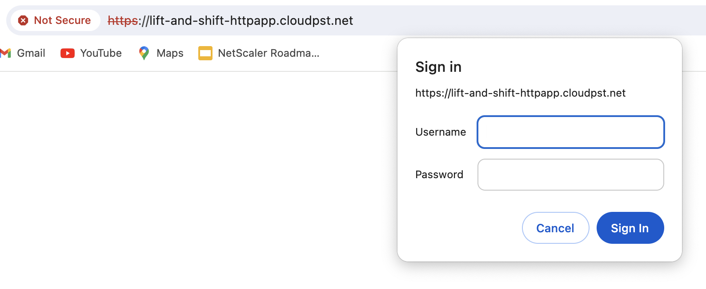
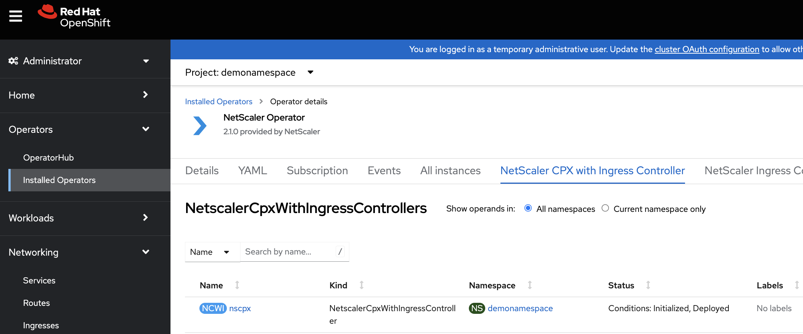
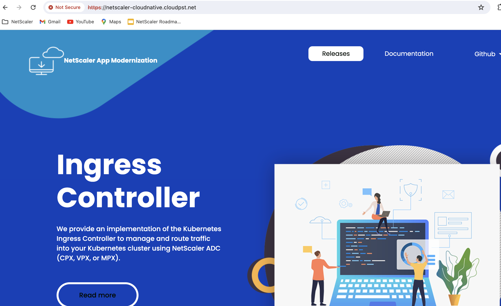

# NetScaler for OpenShift microservice application delivery (NetScaler RedHat certified Ingress BLX, CPX for OpenShift applications)

In this guide you will learn:
* Why NetScaler for RedHat OpenShift deployments?
* What are the NetScaler recommended Cloud Native deployments for OpenShift applications (Unified Ingress, Two tier Ingress topology)
* How do you secure application delivery for HTTP microservice application 
* How do you optimize application delivery for HTTPS microservice application
* How do you protect your OpenShift application from security attacks with NetScaler security use cases


## Why NetScaler for RedHat OpenShift deployments?

OpenShift, a robust and secure hybrid cloud Kubernetes platform backed by Red Hat. Applications hosted within the OpenShift environment require a secure method for external access, facilitated by an enterprise-grade ingress proxy solution. NetScaler, a widely recognized and battle-tested enterprise proxy, works seamlessly with OpenShift for optimizing, securing, and directing ingress traffic to single or multiple OpenShift clusters. Learn more about [NetScaler ISV partnership with and RedHat](https://www.netscaler.com/platform/integrations/red-hat-netscaler).


## What are the NetScaler recommended Cloud Native deployments for OpenShift applications (Unified Ingress, Two tier Ingress topology)

Customers moving to microservices need an Ingress proxy for load balancing OpenShift applications with existing NetScalers. NetScaler form factors MPX, SDX, BLX or VPX can be used with or without CPX for securing OpenShift deployments. NetScaler recommends few topologies for Cloud Native deployments however NetScaler offers flexibility for choosing customer preferred topology. Learn more about [NetScaler deployment topologies](https://docs.netscaler.com/en-us/netscaler-k8s-ingress-controller/deployment-topologies).


## Getting started (How to guide)

In this section you will learn how to secure OpenShift applications with scalable NetScaler ingress proxy. In this section you will deploy below use cases.

* [SSL offload and Basic Authentication for containerized HTTP application with NetScaler RHEL BLX (Topology: Unified Ingress)](https://github.com/netscaler/cloud-native-getting-started/tree/master/openshift/Ingress-deployment#use-case-1-how-do-you-load-balance-microservice-application-with-netscaler-rhel-blx-lifted-and-shifted-from-monolithic-environment-unified-ingress-topology-http-application-with-ssl-offload-secured-client-access-using-basic-authentication)
* [End to end TLS and  secure client access for HTTPS application with NetScaler RHEL BLX and NetScaler CPX (Topology: Two tier Ingress)](https://github.com/netscaler/cloud-native-getting-started/tree/master/openshift/Ingress-deployment#use-case-2-how-do-you-secure-your-microservice-application-end-to-end-with-netscaler-rhel-blx-and-redhat-operator-certified-cpx-two-tier-ingress-topology-ssl-application-secured-with-blx-cpx-end-to-end-tls-protect-blacklisted-clients-access-using-netscaler-responder-policy)

Let's understand the demo use cases from the below deployment topology.



NetScaler BLX is RHEL certified Ingress proxy deployed infront of OpenShift clusters. There are two types of application deployed in the same OpenShift cluster. The HTTP application (containerized monolithic application) is not secure (HTTP) but depends on BLX for SSL offload functionalities.
The SSL application managed by different DevOps team which needs a proxy close to application and deployed inside OpenShift (NetScaler CPX) for better control and Platform Admin need a External proxy for single ingress access i.e. NetScaler BLX  infront of NetScaler CPX for unified internet access.


### Prerequisite
* OpenShift cluster running on AWS (e.g. Mumbai ap-south-1 region).
* NetScaler RHEL BLX running on AWS (e.g. BLX on EC2 instance m5.2large hosted in Mumbai ap-south-1 region). 
* Create Kubernetes secret inside OpenShift clusters for BLX login. e.g. ``kubectl create secret generic nslogin --from-literal=username=<username> --from-literal=password=<password>``
* Ensure connectivity/routing is enabled between BLX and OpenShift nodes. You need VPX peering if BLX and OpenShift are deployed in different VPC. In this demo BLX and OpenShift clusters are running in same the VPC.
* AWS CLI, OpenShift CLI in case you prefer ssh access.

### Use case 1: SSL offload and Basic Authentication for containerized HTTP application with NetScaler RHEL BLX (Topology: Unified Ingress)

1.  Create a new project 'demonamespace' from OpenShift console

    Refer to [OpenShift document](https://docs.openshift.com/container-platform/4.8/applications/projects/working-with-projects.html) for creating a new project - ``demonamespace``.   
    ```
    oc project demonamespace
    ```

2.  Deploy HTTP application in OpenShift cluster

    <u>Steps for OpenShift Console:</u>

    Navitage to Workloads -> Deployments and click on Create Deployment. Copy the Deployment object from [containerized-monolithic-app.yaml](https://raw.githubusercontent.com/netscaler/cloud-native-getting-started/master/openshift/Ingress-deployment/manifest/containerized-monolithic-app.yaml) and click on Create.

    Navitage to Networking -> Services and click on Create Service. Copy the Service object from [containerized-monolithic-app.yaml](https://raw.githubusercontent.com/netscaler/cloud-native-getting-started/master/openshift/Ingress-deployment/manifest/containerized-monolithic-app.yaml) and click on Create.

    <u>Steps for SSH/ OC CLI:</u>>
    ```
    oc create -f https://raw.githubusercontent.com/netscaler/cloud-native-getting-started/master/openshift/Ingress-deployment/manifest/containerized-monolithic-app.yaml
    ```

3.  Deploy NetScaler Ingress controller using OpenShift Operator

    Follow the below steps from the OpenShift console to deploy NetScaler Ingress controller (NSIC).
    * Login to OpenShift console - https://console-openshift-console.apps.x.x.x/dashboards
    * Navigate to Operators -> OperatorHub, Select ``demonamespace`` project from left top corner and search for ``NetScaler Operator`` in the search menu and click on NetScaler certified Operator

    
    * Follow the steps from the screen and NetScaler Operator will be installed.
    * Navigate to Operators -> Installed Operators to locate NetScaler Operator. Click on NetScaler Operator and goto NetScaler Ingress controller tab and click on Create NetScalerIngressController. Update YAML file with BLX ``nsIP`` (BLX private IP assigned to elasticIP of NSIP), ``license.accept`` to Yes and ``adcCredentialSecret`` -> nslogin (mentioned in Pre-requisite) and click on Create. Refer [How to deploy NSIC using NetScaler Operator](https://github.com/netscaler/netscaler-k8s-ingress-controller/blob/master/docs/deploy/deploy-ns-operator.md#installing-netscaler-operator) guide.

    

    Check the status of NSIC
    ```
    oc get pods 
    ```
    

4.  Configure SSL certificate on BLX

    For this demo we will create a new SSL certificate using Kubernetes secret in OpenShift cluster and refer it in Ingress object. Know more about [TLS certificate management](https://docs.netscaler.com/en-us/netscaler-k8s-ingress-controller/certificate-management/tls-certificates) for OpenShift applications. 

    **Note:** You can also use existing NetScaler SSL certificate using [Ingress annotation](https://docs.netscaler.com/en-us/netscaler-k8s-ingress-controller/configure/annotations.html).

    Steps for creating sample SSL certificate

    ```
    openssl genrsa -out cloudnative_key.pem 2048

    openssl req -new -key cloudnative_key.pem -out cloudnative_csr.pem -subj "/CN=*.cloupst.net/O=Citrix Systems Inc/C=IN"

    openssl x509 -req -in cloudnative_csr.pem -sha256 -days 365 -extensions v3_ca -signkey cloudnative_key.pem -CAcreateserial -out cloudnative_cert.pem

    kubectl create secret tls wildcard-vpx-cert --key cloudnative_key.pem --cert cloudnative_cert.pem
    ```

5.  Deploy Ingress object to access the HTTP application from the internet

    <u>Steps for OpenShift Console:</u>>

    Navitage to Networking -> Ingresses and click on Create Ingress. Copy the Ingress object from [containerized-monolithic-app-ingress.yaml](https://raw.githubusercontent.com/netscaler/cloud-native-getting-started/master/openshift/Ingress-deployment/manifest/containerized-monolithic-app-ingress.yaml) and change the ingress.citrix.com/frontend-ip with BLX VIP and click on Create.

    <u>Steps for SSH/ OC CLI:</u>>

    ```
    wget https://raw.githubusercontent.com/netscaler/cloud-native-getting-started/master/openshift/Ingress-deployment/manifest/containerized-monolithic-app-ingress.yaml
    ```

    Update "ingress.citrix.com/frontend-ip:" to BLX VIP IP (private IP associated with EIP of VIP) and deploy ingress object and deploy ingress.

    ```
    oc create -f containerized-monolithic-app-ingress.yaml
    ```
    

6.  Access the HTTP application from internet

    **Note:** Add the DNS entries in your local machine host files for accessing microservices through Internet.

    Path for host file

    [Windows] ``C:\Windows\System32\drivers\etc\hosts`` 

    [Macbook] ``/etc/hosts``
    Add below entries in hosts file and save the file

    ```
    <EIP associated with frontend-IP from containerized-monolithic-app-ingress.yaml> containerized-httpapp.cloudpst.net
    ```


    Access your application from Browser - ``https://containerized-httpapp.cloudpst.net/``
    

7.  NetScaler Auth for securing HTTP application access

    NetScaler configures authentication policies for OpenShift application using [Auth CRDs](https://github.com/netscaler/netscaler-k8s-ingress-controller/blob/master/crd/auth/README.md). We will use NetScaler BLX as a local authentication provider for demonstrating basic auth use cases.

    **Note:** Auth CRD is already installed with the NSIC operator. In case Auth CRD is not installed then deploy [Auth CRD instance](https://raw.githubusercontent.com/citrix/citrix-k8s-ingress-controller/master/crd/auth/auth-crd.yaml) using oc create command.

    Lets deploy Auth policy
    ```
    oc create -f https://raw.githubusercontent.com/netscaler/cloud-native-getting-started/master/openshift/Ingress-deployment/manifest/containerized-monolithic-app-basicauth.yaml
    ```

    Login to BLX and configure below two commands to make BLX as local auth provider.
    ```
    add aaa user blxuser -password blxuser
    set tmsessionparameter -defaultAuthorizationAction Allow
    ```

    Try accessing ``https://containerized-httpapp.cloudpst.net/``, you will be prompted with signin page to authenticate user identity.
    


### Use case 2: End to end TLS and  secure client access for HTTPS application with NetScaler RHEL BLX and NetScaler CPX (Topology: Two tier Ingress)

In case you have skipped the Use Case 1 and directly starting from use case 2 in that case, follow the Step 1, 3 and 4 from [Use Case 1]() first later continue here.

1.  Deploy sample SSL application into OpenShift cluster

    <u>Steps for OpenShift Console:</u>>

    Navitage to Workloads -> Deployments and click on Create Deployment. Copy the Deployment object from [cloudnative-demoapp.yaml](https://raw.githubusercontent.com/netscaler/cloud-native-getting-started/master/openshift/Ingress-deployment/manifest/cloudnative-demoapp.yaml) and click on Create.

    Navitage to Networking -> Services and click on Create Service. Copy the Service object from [cloudnative-demoapp.yaml](https://raw.githubusercontent.com/netscaler/cloud-native-getting-started/master/openshift/Ingress-deployment/manifest/cloudnative-demoapp.yaml) and click on Create.

    <u>Steps for SSH/ OC CLI:</u>>
    ```
     oc create -f https://raw.githubusercontent.com/netscaler/cloud-native-getting-started/master/openshift/Ingress-deployment/manifest/cloudnative-demoapp.yaml
    ```

2.  Deploy NetScaler CPX using OpenShift Operator

    Follow the below steps from the OpenShift console to deploy NetScaler CPX.
    * Login to OpenShift console - https://console-openshift-console.apps.x.x.x/dashboards
    * Navigate to Operators -> OperatorHub, Select ``demonamespace`` project from left top corner and search for ``NetScaler Operator`` in the search menu and click on NetScaler certified Operator

    
    * Follow the steps from the screen and NetScaler Operator will be installed.
    * Navigate to Operators -> Installed Operators to locate NetScaler Operator. Click on NetScaler Operator and goto NetScaler CPX with Ingress Controller tab and click on Create NetScalerCpxWithIngressController. Update YAML file with ``license.accept`` to Yes and click on Create. Refer [How to deploy NetScaler CPX using NetScaler Operator](https://github.com/netscaler/netscaler-k8s-ingress-controller/blob/master/docs/deploy/deploy-ns-operator.md#deploy-netscaler-ingress-controller-as-a-sidecar-with-netscaler-cpx-using-netscaler-operator) guide.
    

    Check the status of NetScaler CPX pod
    ```
    oc get pods
    ```

3.  Configure SSL certificate on CPX

    For this demo we will create a new SSL certificate using Kubernetes secret in OpenShift cluster and refer it in the Ingress object. Know more about [TLS certificate management](https://docs.netscaler.com/en-us/netscaler-k8s-ingress-controller/certificate-management/tls-certificates) for OpenShift applications.

    **Note:** You can also use existing NetScaler SSL certificate using [Ingress annotation](https://docs.netscaler.com/en-us/netscaler-k8s-ingress-controller/configure/annotations.html).

    Steps for creating sample SSL certificate

    ```
    openssl genrsa -out cloudnative_key.pem 2048

    openssl req -new -key cloudnative_key.pem -out cloudnative_csr.pem -subj "/CN=netscaler-cloudnative.cloudpst.net/O=Citrix Systems Inc/C=IN"

    openssl x509 -req -in cloudnative_csr.pem -sha256 -days 365 -extensions v3_ca -signkey cloudnative_key.pem -CAcreateserial -out cloudnative_cert.pem

    kubectl create secret tls cpx-cert --key cloudnative_key.pem --cert cloudnative_cert.pem
    ```


4.  Deploy Ingress Object for NetScaler CPX

    <u>Steps for OpenShift Console:</u>>

    Navigate to Networking -> Ingresses and click on the Create Ingress. Copy the Ingress object from [ssl-app-cpx-ingress.yaml](https://raw.githubusercontent.com/netscaler/cloud-native-getting-started/master/openshift/Ingress-deployment/manifest/ssl-app-cpx-ingress.yaml) and click on Create.

    <u>Steps for SSH/ OC CLI:</u>>

    ```
    oc create -f https://raw.githubusercontent.com/netscaler/cloud-native-getting-started/master/openshift/Ingress-deployment/manifest/ssl-app-cpx-ingress.yaml
    ```

4.  Deploy Ingress Object for NetScaler BLX

    <u>Steps for OpenShift Console:</u>>

    Navigate to Networking -> Ingresses and click on the Create Ingress. Copy the Ingress object from [ssl-app-vpx-ingress.yaml](https://raw.githubusercontent.com/netscaler/cloud-native-getting-started/master/openshift/Ingress-deployment/manifest/ssl-app-vpx-ingress.yaml) and change the ingress.citrix.com/frontend-ip with BLX VIP and click on create to deploy Ingress.

    <u>Steps for SSH/ OC CLI:</u>>

    ```
    wget https://raw.githubusercontent.com/netscaler/cloud-native-getting-started/master/openshift/Ingress-deployment/manifest/ssl-app-vpx-ingress.yaml
    ```

    Update "ingress.citrix.com/frontend-ip:" to BLX VIP IP (private IP associated with EIP of VIP) and deploy ingress object and deploy ingress.

    ```
    oc create -f ssl-app-vpx-ingress.yaml
    ```

5.  Access your SSL application from internet

    **Note:** Add the DNS entries in your local machine host files for accessing microservices through Internet.

    Path for host file:

    [Windows] ``C:\Windows\System32\drivers\etc\hosts`` 

    [Macbook] ``/etc/hosts``
    Add below entries in hosts file and save the file

    ```
    <EIP associated with frontend-IP from vpx-ingress.yaml> netscaler-cloudnative.cloudpst.net
    ```
    Access your application from broswer - ``https://netscaler-cloudnative.cloudpst.net/``
    

6.  Deny untrusted client access for SSL application (NetScaler responder policy to deny denylist clinet access)
    
    NetScaler responder policy provides the ability to secure application access by allowing trusted clients and denying non trusted clients (Allow/Deny client access). NetScaler provides L7 policy enforcement for OpenShift application using [Rewrite Responder CRDs](https://github.com/netscaler/netscaler-k8s-ingress-controller/blob/master/docs/crds/rewrite-responder.md)

    **Note:** Rewrite Responder policies CRD is already installed with NSIC operator. In case Auth CRD is not installed then deploy [Auth CRD instance](https://github.com/netscaler/netscaler-k8s-ingress-controller/blob/master/crd/rewrite-policy/rewrite-responder-policies-deployment.yaml) using kubectl create command. 

    Lets deploy a Responder policy for denylist client IPs. Update your appliance IP in ``denylist-client-IP.yaml`` file under patset values to verify this use case.

    ```
    oc create -f https://raw.githubusercontent.com/netscaler/cloud-native-getting-started/master/openshift/Ingress-deployment/manifest/denylist-client-IP.yaml
    ``` 


## Contact NetScaler team for POC, trails

   For NetScaler team to better understand your Kubernetes / micro-services application deployment architecture. Please fill [product discovery form](https://docs.google.com/forms/d/e/1FAIpQLSd9ueKkfgk-oy8TR1G5cp5HexFwU03kkwx_CvDyOFVFweuXOw/viewform) to enable us serve you better by offering latest NetScaler capabilities.

