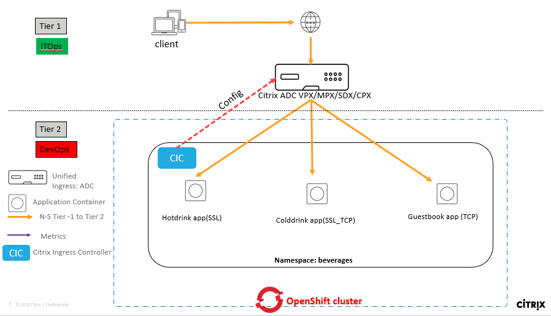
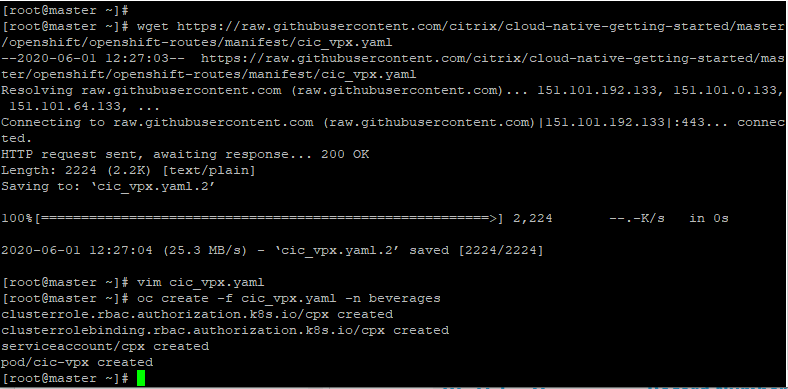

# Deploy Citrix Cloud native solution for Unified Ingress topology in OpenShift using routes plug-ins

OpenShift routes send external requests to services inside the OpenShift cluster according to the rules specified in routes.
The Citrix ingress controller supports  **Unsecured Routes**, **Edge Termination**, **Passthrough Termination**, **Re-encryption Termination** OpenShift routes.

In this guide you will learn:
* How to deploy OpenShift routes in OpenShift clusters to expose microservices in Tier 1 ADC
* How to enable route sharding for selecting specific routes to be exposed in Tier 1 ADC
* How to deploy a Citrix Ingress controller supporting OpenShift routes and configuring Tier 1 ADC

Citrix ADC supports Unified Ingress architecture to load balance an enterprise grade applications deployed as microservices. Tier 1 Citrix ADC load balancers can be VPX/SDX/MPX/BLX to manage high scale north-south traffic. Lets understand the Unified Ingress topology using below diagram.




#### Step by step guide to Load Balance N-S Ingress traffic using OpenShift routes

1.	Bring your own nodes (BYON)

    Red Hat OpenShift is an container application platform based on the Kubernetes container orchestrator for enterprise application development and deployment. Please install and configure OpenShift cluster with one master node and at least one worker node deployment.
 
    **Prerequisite**: Supported OpenShift cluster v3.11 and above (Below example is tested in on-prem OpenShift K8s cluster v3.11).

    Visit: https://docs.openshift.com/container-platform/3.11/install/running_install.html for OpenShift cluster deployment guide.
    Once OpenShift cluster is up and running, execute the below command on master node to get the node status.
    
    

2.  Backup your default routes
    
    When you deploy Citrix ADC CPX as a router, port conflicts can arise with the default router in OpenShift. You should remove the default router in OpenShift before deploying Citrix ADC CPX as a router. To remove the default router in OpenShift, perform the following steps:
    
    i. Back up the default router configuration using the following command.
    ```
    oc get -o yaml dc/router clusterrolebinding/router-router-role serviceaccount/router > default-router-backup.yaml
    ```
    ii. Delete the default router using the following command
    ```    
    oc delete -f default-router-backup.yaml
    ```

3. Configure static routes on Citrix ADC VPX or MPX to reach the pods inside the OpenShift cluster

    i. Use the following command to get the information about host names, host IP addresses, and subnets for static route configuration.
    ```
    oc get hostsubnet
    ```

    ii. Log on to the Citrix ADC instance and Add the route on the Citrix ADC instance using the following command
    ```
    add route <pod_network> <netmask> <gateway>
    ```

    **Example:**
    ```
    oc get hostsubnet
    NAME            HOST           HOST IP        SUBNET
    os.example.com  os.example.com 192.168.122.46 10.1.1.0/24
    ```
        
    From the output of the ``oc get hostsubnet`` command:
    ```
    <pod_network> = 10.1.1.0
    Value for subnet = 10.1.1.0/x where x = 24 that means <netmask>= 255.255.255.0
    <gateway> = 192.168.122.46
    ```

    iii. The required static route to add on Citrix ADC is as follows
    ```
    add route 10.1.1.0 255.255.255.0 192.168.122.46
    ```

###### Lets deploy Citrix Ingress Controller in OpenShift cluster

1. Lets deploy microservice applications in OpenShift cluster

    i. Create a K8s namespace to manage all your deployment at one place and isolated from other workload
    ```
    oc create namespace beverages
    ```

    ii. Deploy hotdrink beverage microservice application
    ```
    oc create -f https://raw.githubusercontent.com/citrix/cloud-native-getting-started/master/openshift/openshift-routes-deployment/manifest/team-hotdrink.yaml -n beverages
    ```
    
    iii. Deploy colddrink beverage microservice application
    ```
    oc create -f https://raw.githubusercontent.com/citrix/cloud-native-getting-started/master/openshift/openshift-routes-deployment/manifest/team-colddrink.yaml -n beverages
    ```

    

2. Lets deploy Citrix Ingress Controller to configure Tier 1 ADC (in this deployment VPX is my Tier 1 ADC)

    i. Download the CIC yaml file
    ```     
    wget https://raw.githubusercontent.com/citrix/cloud-native-getting-started/master/openshift/openshift-routes-deployment/manifest/cic-vpx.yaml
    ```

    ii. Update CIC with below parameters and create K8s secret for Tier 1 NetScaler

    Change NS_IP to Tier 1 ADC Management IP/NSIP

    Change NS_VIP to one free IP which will be an ingress frontend IP in Tier 1 ADC to ingress client traffic.

    Create K8s secret for VPX login credentials used in CIC yaml file.
    ```
    oc create secret generic nsvpxlogin --from-literal=username='username' --from-literal=password='password' -n beverages
    ```

    iii. Deploy CIC in OpenShift cluster

    ```
    oc create -f cic-vpx.yaml -n beverages
    ```
    

    **Note:** Citrix Ingress Controller supports Route sharding to filter the routes based on labels added to route kind and Route selection criteria is configured on the Citrix ingress controller by using environment variables ROUTE_LABELS and NAMESPACE_LABLES. To know more about OpenShift route sharding support visit [Citrix Ingress Controller documentation](https://github.com/citrix/citrix-k8s-ingress-controller/blob/master/docs/deploy/deploy-openshift-sharding.md)

    In this demo, I will configure one route for each microservice application.
    ```      
    name: "ROUTE_LABELS"
    value: "name in (hotdrink,colddrink,guestbook)"
    ```

    This configuration will look for route with label name=hotdrink OR name=colddrink OR name=guestbook in the deployment and will configure Tier 1 ADC accordingly.

3. Lets deploy routes to configure Tier 1 ADC

    **Note:** Please upload your TLS certificate and TLS key into routes.yamls. We have updated our security policies and removed SSL certificate from guides.

    i. Deploy re-encryption termination route for hotdrink beverage application
    ```
    oc create -f https://raw.githubusercontent.com/citrix/cloud-native-getting-started/master/openshift/openshift-routes-deployment/manifest/route-reencrypt-hoddrink.yaml -n beverages
    ```

    ii. Deploy passthrough termination route for colddrink beverage application
    ```
    oc create -f https://raw.githubusercontent.com/citrix/cloud-native-getting-started/master/openshift/openshift-routes-deployment/manifest/route-passthrough-colddrink.yaml -n beverages
    ```

    iii. Deploy Edge termination route for colddrink application
    ```
    oc create -f https://raw.githubusercontent.com/citrix/cloud-native-getting-started/master/openshift/openshift-routes-deployment/manifest/edge-route-colddrink.yaml -n beverages
    ```

    

    

4. Yeah!!!Your applications are ready for browsing

    Login to Tier 1 ADC (NSIP) configured in CIC and check the configuration. You will find that hotdrink, colddrink and guestbook beverages applications are UP after routes being added.

    
    Add the DNS entries in your local machine host files for accessing microservices though Internet
    Path for host file:[Windows] ``C:\Windows\System32\drivers\etc\hosts`` [Macbook] ``/etc/hosts``
    
    Add below entries in hosts file and save the file
    ```
    <frontend-ip from cic_vpx.yaml-> hotdrink.beverages.com 
    <frontend-ip from cic_vpx.yaml> colddrink.beverages.com
    ```
    Lets access microservice app from local machine browser

    ```
    https://hotdrink.beverages.com //enables end to end TLS communication as configured in route-reencrypt-hoddrink.yaml route  
    https://colddrink.beverages.com //enables frontend TLS communication as configured in edge_route_colddrink.yaml route 
    ```

#### Clean up the deployment
```
oc delete namespace beverages
```

For more details on routes support for CPX, please refer to [OpenShift routes support documentation](https://github.com/citrix/citrix-k8s-ingress-controller/tree/master/deployment/openshift)