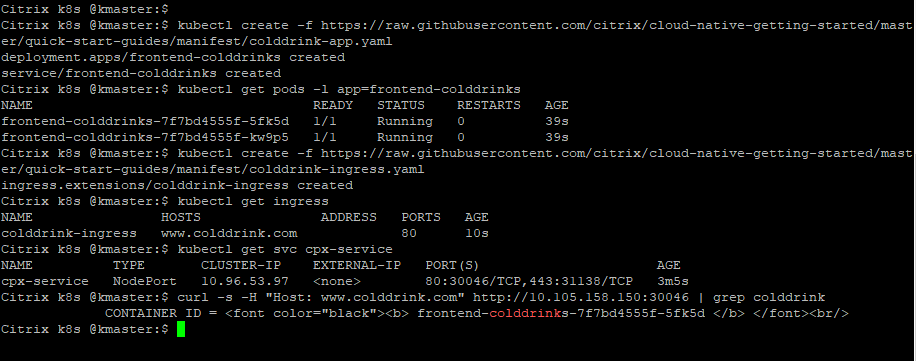

# Load balance North-South Ingress traffic using Citrix ADC CPX proxy

In this example, the Citrix ADC CPX (a containerized form-factor) is used to route the Ingress traffic to colddrink microservice application.
Kubernetes Ingress kind is a way to send Internet traffic to a microservice application deployed in a K8s cluster.

**Prerequisite**: Kubernetes cluster (Below example is tested in on-prem v1.17.0 K8s cluster).

1. Lets deploy Citrix ADC CPX as Ingress proxy in K8s cluster
```
kubectl create -f https://raw.githubusercontent.com/citrix/cloud-native-getting-started/master/quick-start-guides/manifest/cpx.yaml
kubectl get pods -l app=cpx-ingress
```


2. Lets deploy colddrink microservice application in K8s cluster
```
kubectl create -f https://raw.githubusercontent.com/citrix/cloud-native-getting-started/master/quick-start-guides/manifest/colddrink-app.yaml
kubectl get pods -l app=frontend-colddrinks
```

3. Lets deploy an Ingress rule that sends traffic to http://www.colddrink.com
```
kubectl create -f https://raw.githubusercontent.com/citrix/cloud-native-getting-started/master/quick-start-guides/manifest/colddrink-ingress.yaml
kubectl get ingress
kubectl get svc cpx-service
```

4. Lets send the Ingress traffic to colddrink microservice application
```
curl -s -H "Host: www.colddrink.com" http://<MasterNode IP:<NodePort> | grep colddrink
```



To know more about Citrix ingress controller,[refer here](https://github.com/citrix/citrix-k8s-ingress-controller)

For next tutorial, visit [quick-start-guides](https://github.com/citrix/cloud-native-getting-started/tree/master/quick-start-guides)
