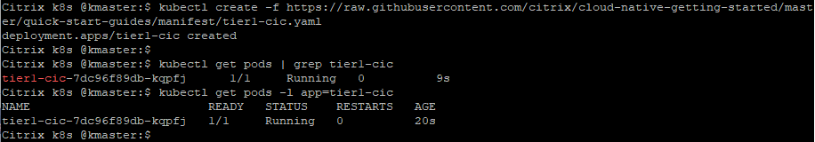
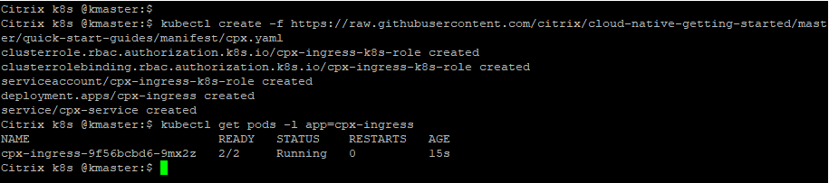
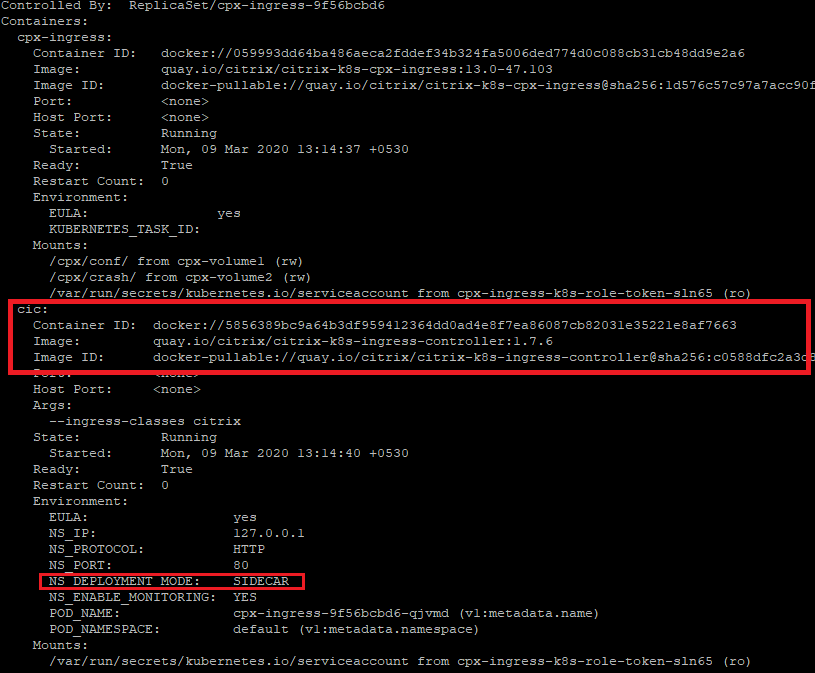

# Deploy a Citrix Ingress Controller (CIC) in K8s cluster
An Ingress Controller is a controller monitors the Kubernetes API server for updates to the Ingress resource and configures the Ingress load balancer accordingly.

Citrix ingress controller <u>(**CIC**)</u> can configure any form factor of Citrix ADC (MPX/SDX/VPX/BLX/CPX).
CIC can be deployed in two modes, 
  1. Independent k8s deployment kind for configuring Tier 1 Ingress proxy (MPX/SDX/BLX/VPX).
  2. A sidecar container for configuring Tier 2 proxy (Citrix ADC CPX proxy).

###### Note: This tutorial is for learning different CIC deployment modes and not to be considered as end user example. Real world examples will use either one/both CIC modes with other use cases. 
**Prerequisite**: Kubernetes cluster (Below example is tested in on-prem v1.17.0 K8s cluster).

1. Lets deploy CIC for configuring Tier 1 Citrix ADC
```
kubectl create -f https://raw.githubusercontent.com/citrix/cloud-native-getting-started/master/quick-start-guides/manifest/tier1-cic.yaml
kubectl get pods -l app=tier1-cic
```


How do I check the CIC logs
```
kubectl logs -f tier1-cic-7dc96f89db-shj7c
```


2. Lets deploy CIC as a sidecar with Citrix ADC CPX proxy
```
kubectl create -f https://raw.githubusercontent.com/citrix/cloud-native-getting-started/master/quick-start-guides/manifest/cpx.yaml
kubectl get pods -l app=cpx-ingress
```



There are 2 contains running in same pod highlighted by 2/2 under READY column. One container is for Citrix ADC CPX proxy and another container is for CIC.
Lets see the details of both containers,
```
kubectl describe pod cpx-ingress-9f56bcbd6-qjvmd
```


 To know more about Citrix ingress controller,[refer here](https://github.com/citrix/citrix-k8s-ingress-controller)

For next tutorial, visit [quick-start-guides](https://github.com/citrix/cloud-native-getting-started/tree/master/quick-start-guides)
