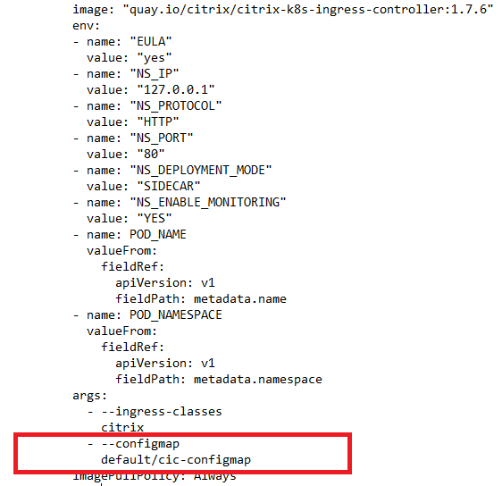
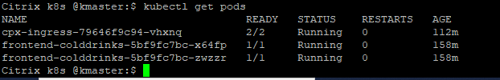
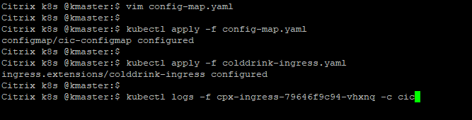

# Change Citrix Ingress Controller loglevels using ConfigMap support
ConfigMaps allow you to separate your configurations from your pods and make your workloads portable.

###### Why ConfigMap
The Citrix ingress controller supports configuration command line arguments, and environment variables mentioned in [deploying the Citrix ingress controller](https://github.com/citrix/citrix-k8s-ingress-controller/blob/master/deployment/baremetal/README.md). But,
 you cannot update these configurations at runtime without rebooting the Citrix ingress controller pod. With ConfigMap support,
 you can update the configuration automatically while keeping the Citrix ingress controller pod running. You do not need to restart the pod after the update.

CIC support various loglevel (debug, info, critical, warning etc). You can specifies the log levels to control the logs generated by Citrix ingress controller.
Lets see how does ConfigMap helps in changing CIC loglevel.

**Prerequisite**: Kubernetes cluster (Below examples are tested in on-prem v1.17.0 K8s cluster)

1. Deploy ConfigMap in k8s cluster
```
kubectl create -f https://raw.githubusercontent.com/citrix/cloud-native-getting-started/master/quick-start-guides/manifest/configmap.yaml
kubectl get configmap cic-configmap
```
2. Deploy Citrix ADC CPX proxy in k8s cluster

```
wget https://raw.githubusercontent.com/citrix/cloud-native-getting-started/master/quick-start-guides/manifest/cpx.yaml
```
Edit cpx.yaml file and add ConfigMap argument in CIC container args section.
```
            - --configmap
              default/cic-configmap
```
See the below screenshot for identifying right placeholder,


Deploy edited cpx yaml file in k8s cluster,
```
kubectl create -f cpx.yaml
```

3. Deploy colddrink microservice app

```
kubectl create -f https://raw.githubusercontent.com/citrix/cloud-native-getting-started/master/quick-start-guides/manifest/colddrink-app.yaml
kubectl get pods -l app=frontend-colddrinks
```


4. Lets check the current CIC loglevel
```
kubectl logs -f cpx-ingress-79646f9c94-vhxnq -c cic
```

5. Change the loglevel and redeploy ConfigMap in k8s cluster
```
vim configmap.yaml
```
change the loglevel to "debug" and redeploy ConfigMap
```
kubectl apply -f configmap.yaml
```
Now loglevel has been changed to debug, to validate it check CIC logs again,
```
kubectl logs -f cpx-ingress-79646f9c94-vhxnq -c cic
```



To know more about Citrix ingress controller,[refer here](https://github.com/citrix/citrix-k8s-ingress-controller)

Learn more about [ConfigMap support for the Citrix ingress controller](https://developer-docs.citrix.com/projects/citrix-k8s-ingress-controller/en/latest/configure/config-map/)

For next tutorial, visit [quick-start-guides](https://github.com/citrix/cloud-native-getting-started/tree/master/quick-start-guides)


