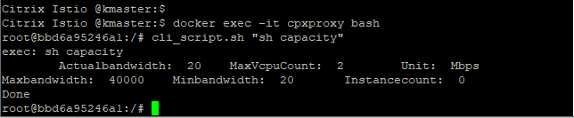

# Deploy a Citrix ADC CPX proxy in docker

Citrix ADC CPX is a container based proxy and can be deployed as a process in docker. 
* **Note**: This tutorial is for learning Citrix ADC CPX deployment in docker container and not to be considered as end to end guide. Real world examples will use Citrix ADC CPX in different deployment modes showcased in other quick-getting-started guides.
**Prerequisite**: Docker engine (Below example is tested in docker engine v18.06)

 Install a Citrix ADC CPX on the docker container
Change LS_IP=<Citrix ADC MPX/VPX/BLX NSIP> as per your deployment
```
docker run -dt --name cpxproxy --privileged=true -e EULA=yes -e LS_IP=10.105.158.195 quay.io/citrix/citrix-k8s-cpx-ingress:13.0-47.103
```
Yeah! Citrix ADC CPX proxy is UP and running. Lets verify it
```
ps aux | grep cpxproxy
docker exec -it cpxproxy bash
```
Lets check the Citrix ADC CPX Express license details
```
cli_script.sh "sh capacity"
```


To know more about Citrix ADC CPX instance in docker,[ refer here](https://docs.citrix.com/en-us/citrix-adc-cpx/12/deploy-using-docker-image-file.html)

Click on [quick-start-guides](https://github.com/citrix/cloud-native-getting-started/tree/master/quick-start-guides) for next tutorial.