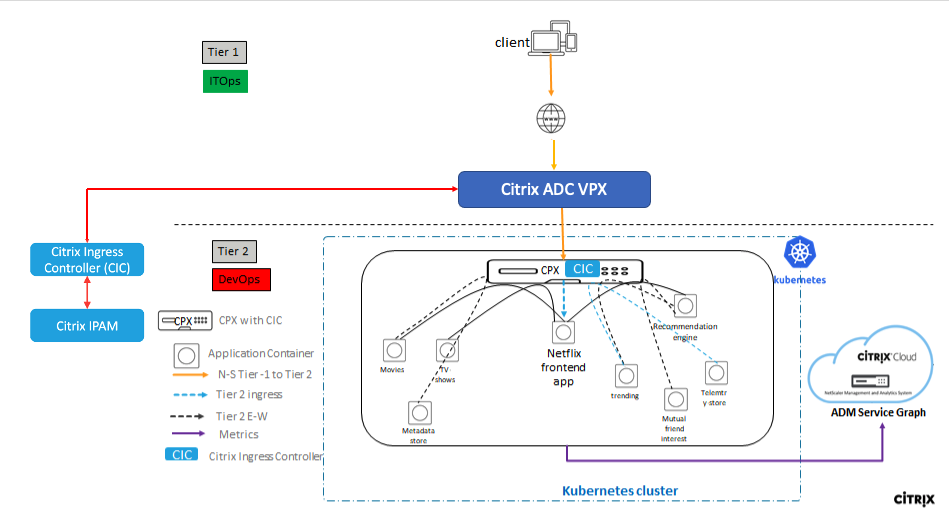

# Citrix ADM Service Graph Distributed Tracing

The aim of this example is to help visualising the request flow between different microservices using Citrix ADM.

## Table of Contents

   [Prerequisites](#prerequisite)

  A. [Deploy and register Citrix ADM Agent](#deploy-register-citrix-adm-agent)

  B. [Add Cluster in Citrix ADM](#register-adm-agent)

  C. [Configuration for service graph in ADM](#config-adm)

  D. [Deploy Netflix application on Kubernetes Cluster ](#deploy-application)

  E. [Citrix Cloud Native Dual Tier Topology ](#deploy-citrix-cloud-native-stack)

  F. [Send Traffic](#send-traffic)

  G. [Visualize Servicegraph in Citrix ADM](#servicegraph)

  H. [Tracing](#trace)

  I. [Clean Up the deployment](#clean-up)

  J. [Debugging](#debugging)

## <a name="prerequisite">Prerequisites</a>
 - Citrix ADM. To start using Citrix ADM, you must first create a Citrix Cloud company account or join an existing one that someone else in your company has created. For detailed processes and instructions on how to proceed, see [Signing Up for Citrix Cloud](https://docs.citrix.com/en-us/citrix-cloud/overview/signing-up-for-citrix-cloud/signing-up-for-citrix-cloud). 

    To manage Citrix ADM with an Express account, follow [this](https://docs.citrix.com/en-us/citrix-application-delivery-management-service/getting-started.html#install-an-agent-as-a-microservice).

 - The [Kubernetes](https://kubernetes.io/) version 1.16 or later.
 - The Citrix ADC VPX with Version 13.0-76.31 or later.
 - The Citrix ADC VPX and the Kubernetes Cluster should be in same network.

## <a name="deploy-register-citrix-adm-agent">A) Deploy and register Citrix ADM Agent</a>
You can deploy a Citrix ADM agent as a microservice in the Kubernetes cluster to view service graph in Citrix ADM. 

Follow below steps:

 1. Log on to Citrix ADM and navigate to `Networks > Agents`. The Agent page is displayed.

    

 2. Click `Setup up agent`.

 3. Click on `Get Started`.

    

 4. Click on `Custom Deployment`

    

 5. Choose `On-Premises` and click `Next`.

    

 6. Choose `As a microservice` and click `Next`

    

 7. Specify the following parameters:

    a. **Application ID** : A string id to define the service for the agent in the Kubernetes cluster and distinguish 		this agent from other agents in the same cluster. Use lowercase alphanumeric characters only. Uppercase characters are not supported.

	b. **Agent Password** – Specify a password for ADM agent. This passoword will be used on onboarding CPX to ADM service through the agent.

	c. **Confirm Password** – Specify the same password for confirmation.
	
    d. **Submit**

    **NOTE** You can save Application ID and Agent Password, this will be used while creating secret and updating variables in the YAML file.

      

 8. After you click **Submit**, you can download the YAML or Helm Chart.

    

 9. Click **Close**.

    On the Kubernetes cluster:

        kubectl create -f <yaml file>

    For example, `kubectl create -f myagent.yaml`

    The agent is successfully created.

    In Citrix ADM, navigate to Networks > Agents to see the agent status.

    

## <a name="register-adm-agent"> B) Add Cluster in Citrix ADM</a>

To add cluster using Agent, follow the below steps:

 1. Navigate to `Orchestration > Kubernetes > Cluster` in Citrix ADM. The Clusters page is displayed.
 2. Click `Add`.
 3. In the Add Cluster page, specify the following parameters:

      a. **Name** - Specify a name of your choice.

      b. **API Server URL** - You can get the Kubernetes service IP in `default` namespace.

        kubectl get svc kubernetes -o wide

      

      Copy the cluster IP from the above output and provide in API Server URL as `https://<Cluster IP>:443`
		
      c. **Authentication Token** - Specify the authentication token. The authentication token is required to validate access for communication between Kubernetes cluster and Citrix ADM.

      To generate an authentication token; 
      On the Kubernetes master node:

      i. Use the following YAML to create a service account:
				
        apiVersion: v1
        kind: ServiceAccount
        metadata:
	        name: citrixadm-sa

      ii. Run `kubectl create -f <yaml file>`. The service account is created.

      iii. Run `kubectl create clusterrolebinding clusterBinding --clusterrole=cluster-admin --serviceaccount=default:citrixadm-sa` to bind the cluster role to service account.

      The service account now has the cluster-wide access. A token is automatically generated while creating the service account.

      iv. Run `kubectl describe sa citrixadm-sa` to view the token.

      

      v. To get the secret string, run `kubectl describe secret <token-name>`.

      

    d. Select the **agent** from the list.
    
    **To get the agent IP**

    Use `Application ID` mentioned in `Step A.7.a` to list the service IP for Citrix Agent.
  
        kubectl get svc <application-id> -o wide
    
    The IP mentioned under `Cluster-IP` is the service IP for the agent. Alternatively, you can navigate to `Networks > Agents` in Citrix ADM to view the agent IP.

    e. Click **Create**.

     

### Create Kubernetes Secret using Citrix ADM credentials

  To auto register Citrix ADC CPX in ADM for obtaining [servicegraph](https://docs.citrix.com/en-us/citrix-application-delivery-management-service/application-analytics-and-management/service-graph.html), you will have to create a Kubernetes secret using ADM Agent credentials. Create a Kubernetes secret with password you have provided during `Step A.7.b` using the following command:

    kubectl create secret generic admlogin --from-literal=username=nsroot --from-literal=password=<adm-password>

## <a name="config-adm"> C) Configuration for service graph in ADM </a>

After you add Kubernetes cluster in Citrix ADM, you must ensure to auto-select virtual servers for licensing. CPX virtual servers must be licensed to display data in service graph. To auto-select virtual servers:

 1. Navigate to Accounts > Subscriptions in Citrix ADM.

 2. Under Virtual Server License Summary, enable Auto-select Virtual Servers.

    

   After enable the auto-select virtual servers, change the Web Transaction Settings and TCP Transactions Settings to All.

  1. Navigate to `Analytics > Settings`.  

  2. The Settings page is displayed.

  3. Click **Enable Features for Analytics**.

  4. Under **Web Transaction Settings**, select **All**.
 
  5. Under **TCP Transactions Settings**, select **All**.

      

## <a name="deploy-application"> D) Deploy Netflix application on Kubernetes Cluster </a>

Run following to deploy Netflix application on your Kubernetes Cluster

    kubectl create -f https://raw.githubusercontent.com/citrix/cloud-native-getting-started/master/servicegraph/manifest/netflix.yaml

## <a name="deploy-citrix-cloud-native-stack"> E) Citrix Cloud Native Dual Tier Topology </a>

  Let's understand the Netflix application topology having Citrix ADC to deliver best user experience in North-South and East-West Load balancing.

   

In this topology, we have deployed 2 types of Citrix ADCs. One is VPX (non container proxy) for routing the North-South traffic for microservices. In this deployment, we have deployed VPX as Tier 1 ADC

Second is Citrix ADC CPX (container proxy) for routing North-South Tier 1 traffic and East-West microservice traffic.

This deployment has its own advantages over service mesh deployment such as;

 - Citrix ADC Service Mesh lite topology eliminates need of CPX as sidecar proxy for each microservices

 - One Citrix ADC CPX proxy can frontend more than one microservice application as shown in above topology diagram.

Lets deploy the Netflix application in Service mesh lite deployment where

 - Tier 1 ADC - VPX to ingress Secure North-South traffic. You can have MPX/BLX as TIer 1 ADC also.

 - Tier 2 ADC - CPX to route North-South traffic from Tier 1 ADC to frontend Netflix microservice application

 - Tier 2 ADC - CPX to route East-West traffic from Netflix application.

### Add Tier 1 ADC in Citrix ADM

Citrix ADC VPX is used to ingress North-South traffic. To add Citrix ADC VPX in ADM follow below steps:

 1. Navigate to `Networks > Instances > Citrix ADC` in Citrix ADM. Select the type as VPX and click Add.

    
  
 2. Enter Device IP address - For Citrix ADC instances, the IP address of Citrix ADC VPX.

 3. Click `Add` under `Profile Name`.

    

    a. **Profile Name**: Specify a profile name for the Citrix ADC instance.

    b. **User Name**: Specify the user name to log on to the Citrix ADC instance.

    c. **Password:** Specify the password to log on to the Citrix ADC instance.

    d. **SSH Port**: Specify the port for SSH communication between Citrix ADM and the Citrix ADC instance.

    e. **HTTP Port**: Specify the port for HTTP communication between Citrix ADM and the Citrix ADC instance.

    f. **HTTPS Port**: Specify the port for HTTPS communication between Citrix ADM and the Citrix ADC instance.

    g. **Use global settings for Citrix ADC communication**: Select this option if you want to use the system settings for communication between Citrix ADM and Citrix ADC instance, otherwise select either HTTP or https.

    h. **SNMP Version:** Select either SNMPv2 or SNMPv3 and do the following:

    i. If you select SNMPv2, specify the **Community name** for authentication.

    ii. If you select SNMPv3, specify the **Security Name** and **Security Level**. Based on the **security level**, select the **Authentication Type** and **Privacy Type**.

      

#### To configure the Tier 1 ADC VPX using Citrix Ingress Controller (CIC):

The Citrix ADC appliance needs to have system user account (non-default) with certain privileges so that Citrix ingress controller (CIC) can configure the Citrix ADC VPX. For instructions to create the system user account on Citrix ADC, see [Create System User Account for CIC in Citrix ADC](#create-system-user-account-for-cic-in-citrix-adc).

Create a Kubernetes secret for the user name and password using the following command:

    kubectl create secret generic nslogin --from-literal=username='cic' --from-literal=password='mypassword'

Download the consolidated YAML file which will deploy CIC to configure Tier-1 ADC and Tier 2 CPX.

    wget https://raw.githubusercontent.com/citrix/cloud-native-getting-started/master/servicegraph/manifest/citrix-cloud-native.yaml

Update `NS_IP` under the deployment name `adc-netflix-cic`  `citrix-cloud-native.yaml` yaml file with Citrix ADC Device/Management IP.

    - name: "NS_IP"
      value: "A.B.C.D"

**Note** Citrix ADC VPX and Kubernetes Cluster must be deployed in same network.

### Deploying Tier-2 ADC CPX -

Citrix ADC CPX is used to route North-South traffic from Tier 1 ADC to frontend Netflix microservice application and route East-West traffic from Netflix microservices  

Few `Environment variables` in `citrix-cloud-native.yaml` file needs to be updated for service graph generation with Citrix ADM Agent Service IP.

Use `Application ID` mentioned in `Step A.7.a` to list the service IP for Citrix Agent.

    kubectl get svc <application-id> -o wide

The IP mentioned under `Cluster-IP` is the service IP for the agent and use this IP to update below environment variables in `citrix-cloud-native.yaml`.

  i. "NS_MGMT_SERVER"

  ii. "LOGSTREAM_COLLECTOR_IP"

  iii. "LS_IP"

Update Fingerprint in below environment variable in `citrix-cloud-native.yaml` 
 
  i. "NS_MGMT_FINGER_PRINT"

#### To get the `Citrix ADM agent Fingerprint`

Navigate to `Networks > Agents` in Citrix ADM. Select the Agent from the list and click the `View Fingerprint`.

   

**Update**  `server` in `endpoint` under `NS_ANALYTICS_CONFIG` with the Citrix ADM Agent POD IP in config map `adc-netflix-cic-configmap` in `citrix-cloud-native.yaml` file .

To get the Citrix ADM Agent Pod IP use below command.

    kubectl get endpoints <Application-id> -o wide

After updating above environment variables, deploy CIC for Tier-1 VPX and tier-2 CPX using

    kubectl apply -f citrix-cloud-native.yaml

**Create Ingress and Services for Netflix Application**

    wget https://raw.githubusercontent.com/citrix/cloud-native-getting-started/master/servicegraph/manifest/vpx_ingress.yaml

  **Update**  `ingress.citrix.com/frontend-ip` in `vpx_ingress.yaml` with Virtual IP with which you want to expose Netflix Application.

    kubectl apply -f vpx_ingress.yaml
    kubectl create -f https://raw.githubusercontent.com/citrix/cloud-native-getting-started/master/servicegraph/manifest/cpx_ingress.yaml
    kubectl create -f https://raw.githubusercontent.com/citrix/cloud-native-getting-started/master/servicegraph/manifest/smlite_services.yaml

## <a name="send-traffic"> F) Send Traffic </a>
  Send traffic using helper script

    wget https://raw.githubusercontent.com/citrix/cloud-native-getting-started/master/servicegraph/manifest/traffic.sh

Provide VIP which was used to expose the Netflix app in `traffic.sh` and start traffic.

    nohup sh traffic.sh <VIP> > log &

## <a name="servicegraph"> G) Visualize Service Graph in Citrix ADM</a>
Before visualizing the Service Graph, you can check if the vservers configured in ADC are properly discovered and licensed. For this check the section [debugging](#debugging)

In ADM navigate  `Application > Service Graph > MicroServices` .

  

  

We can view **transation logs** as well in the servicegraph.

  

## <a name="trace">H) Tracing </a>

A user can select **See Trace Details** to visualize the entire trace in the form of a chart of all transactions which are part of the trace.

  

## <a name="clean-up">I) Clean Up the deployment </a>

    kubectl delete -f https://raw.githubusercontent.com/citrix/cloud-native-getting-started/master/servicegraph/manifest/cpx_ingress.yaml
    kubectl delete -f https://raw.githubusercontent.com/citrix/cloud-native-getting-started/master/servicegraph/manifest/smlite_services.yaml
    kubectl delete -f https://raw.githubusercontent.com/citrix/cloud-native-getting-started/master/servicegraph/manifest/netflix.yaml
    kubectl delete -f vpx_ingress.yaml
    kubectl delete -f citrix-cloud-native.yaml
    kubectl delete secret nslogin
    kubectl delete secret admlogin

## <a name="debugging">J) Debugging </a>

Service Graph will not be populated if vserver configuration of Tier 2 ADC are not populated in ADM. Also, the vserver in Tier-1 ADC need to be licensed. Following sections will guide on licensing vserver in Tier-1 Citrix ADC VPX and discovering the vserver configuration on Tier 2 Citrix ADC CPX.

#### Licensing vserver of Tier-1 Citrix ADC VPX

1. Navigate to `Networks > Instances > Citrix ADC` and choose `VPX` in Citrix ADM.

2. Select the `VPX IP` of your Tier-1 ADC and choose `Configure Analytics` under `Select Action`.

   

3. Vserver configured on the VPX will be listed.

4. License the vserver with name `netflix-<VIP IP>_80_http`, if it is not licensed. To license, select the `vserver` and Click `License`.

   

   

#### Disovering Vserver Configuration of Tier-2 Citrix ADC CPX

1. Navigate to `Networks > Instances > Citrix ADC` and choose `CPX` instance with name prefix with `adc-netflix-cpx` in Citrix ADM.

2. Select the `CPX` fromt the list and choose `Configure Analytics` under `Select Action`.

   

3. Citrix ADM polls the CPX in the interval of 10mins. If the page does not list vserver then you can manually poll the CPX.

   

4. For manual Polling CPX:

    a. Navigate to `Networks > Networking Functions` and click `Poll Now`.
   
    

    b. Click `Select Instances`. You will get list of Instances. 
   
    

    c. Choose the `CPX` instance from the list.

    

    d. Click `Start Polling`
    
    

    e. Polling takes couple of minutes to complete.

    

     Once polling is completed, navigate to `Networks > Instances > Citrix ADC` and choose `CPX` instance with name prefix with `adc-netflix-cpx` in Citrix ADM. 
     
     Select the `CPX` from the list and choose `Configure Analytics` under `Select Action`. 
     
     Now you will get the list of Vservers configured on CPX.

    

    You can now view the servicegraph by navigating to `Applications > Service Graph > Microservices ` in Citrix ADM.

### <a name="create-system-user-account-for-cic-in-citrix-adc"> Create system User account for Citrix ingress controller in Citrix ADC</a>

Citrix ingress controller configures the Citrix ADC using a system user account of the Citrix ADC. The system user account should have certain privileges so that the CIC has permission configure the following on the Citrix ADC:

 - Add, Delete, or View Content Switching (CS) virtual server
 - Configure CS policies and actions
 - Configure Load Balancing (LB) virtual server
 - Configure Service groups
 - Cofigure SSL certkeys
 - Configure routes
 - Configure user monitors
 - Add system file (for uploading SSL certkeys from Kubernetes)
 - Configure Virtual IP address (VIP)
 - Check the status of the Citrix ADC appliance
 
**Note:**
> The system user account would have privileges based on the command policy that you define.

To create the system user account, do the following:
 1. Log on to the Citrix ADC appliance. Perform the following:
 2. Use an SSH client, such as PuTTy, to open an SSH connection to the Citrix ADC appliance.
 3. Log on to the appliance by using the administrator credentials.
 4. Create the system user account using the following command:

        add system user <username> <password>

 For example:

    add system user cic mypassword

 5. Create a policy to provide required permissions to the system user account. Use the following command:

        add cmdpolicy cic-policy ALLOW "(^\S+\s+cs\s+\S+)|(^\S+\s+lb\s+\S+)|(^\S+\s+service\s+\S+)|(^\S+\s+servicegroup\s+\S+)|(^stat\s+system)|(^show\s+ha)|(^\S+\s+ssl\s+certKey)|(^\S+\s+ssl)|(^\S+\s+route)|(^\S+\s+monitor)|(^show\s+ns\s+ip)|(^\S+\s+system\s+file)"

 6. Bind the policy to the system user account using the following command:

        bind system user cic cic-policy 0
